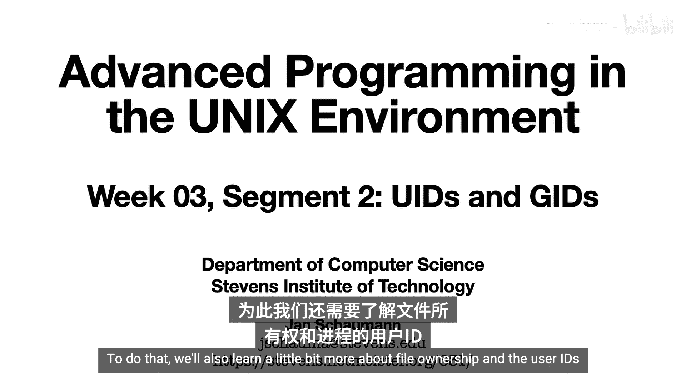
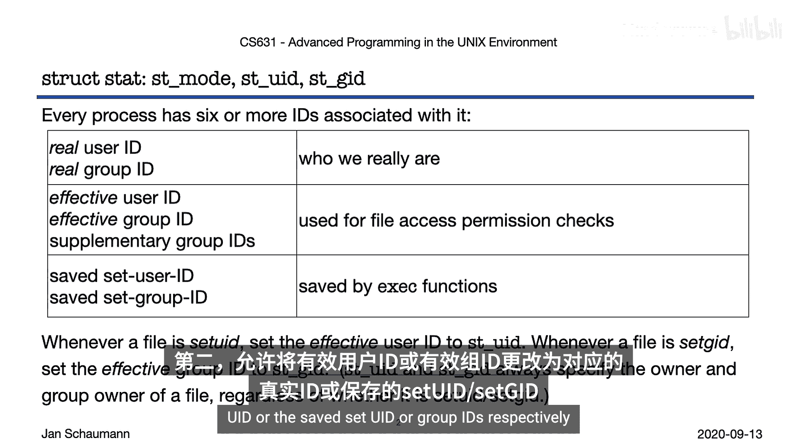
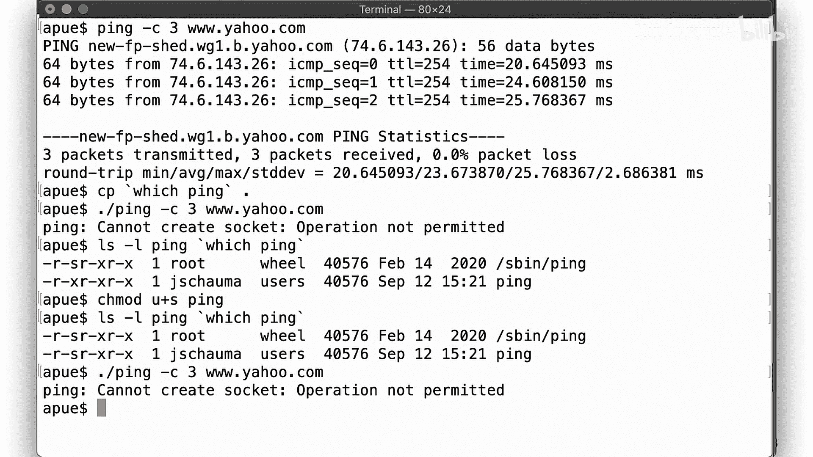
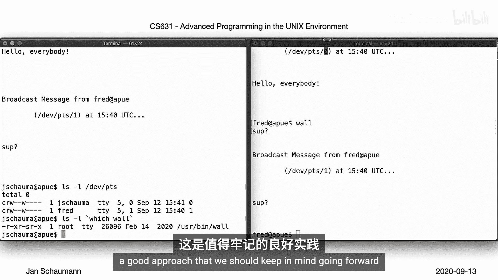
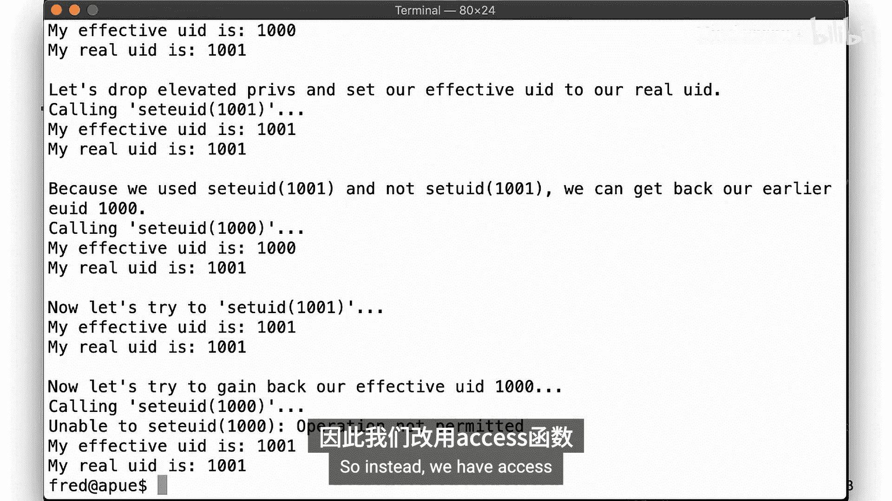
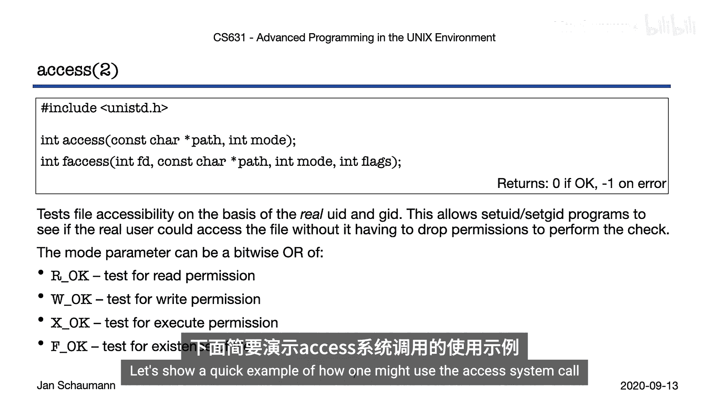
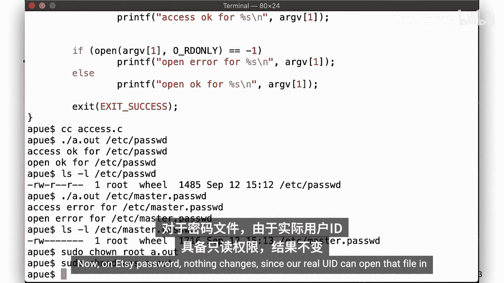
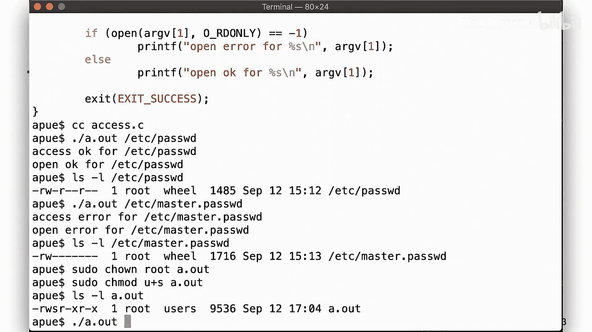
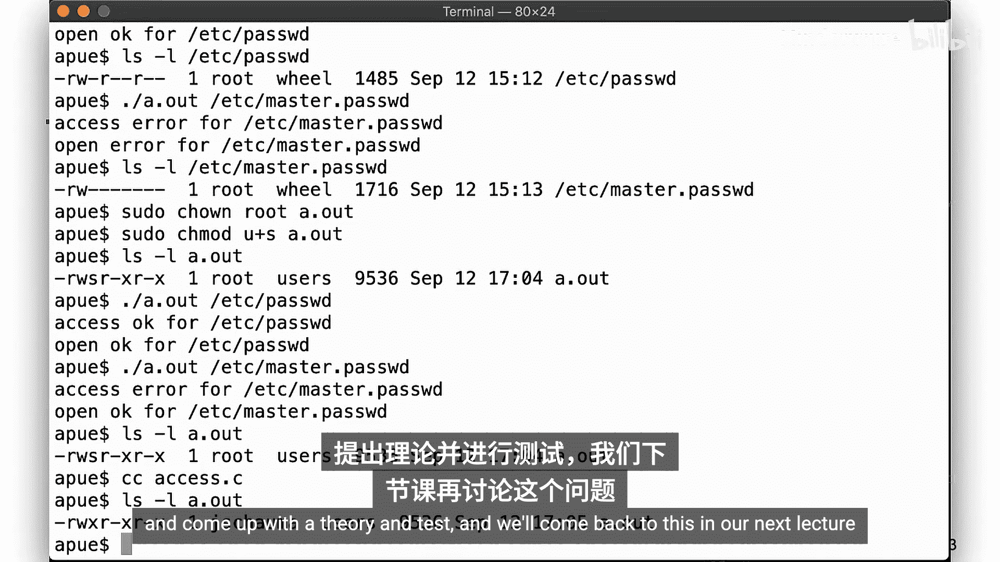
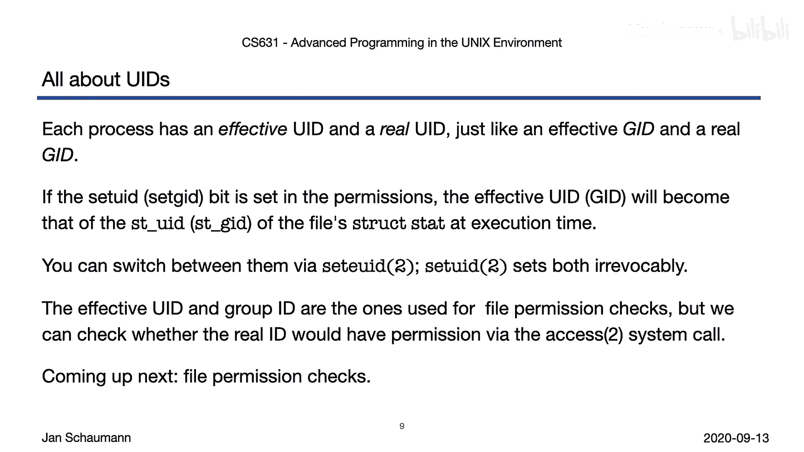

# 011：Week-03-Segment-2 - UID与GID 🔑



在本节课中，我们将深入学习进程的用户ID（UID）和组ID（GID），这是理解UNIX文件权限的基础。我们将探讨进程如何通过改变其有效ID来获取不同的权限，以及系统如何利用这些ID进行权限检查。

## 进程的UID与GID

上一节我们介绍了`stat`结构体，本节中我们来看看进程的身份标识。每个在UNIX系统上运行的进程都关联着六个或更多的UID和GID。



以下是主要的ID类型：
*   **真实用户ID（Real User ID）** 和 **真实组ID（Real Group ID）**：代表进程的真实所有者，即启动进程的用户。
*   **有效用户ID（Effective User ID）** 和 **有效组ID（Effective Group ID）**：系统在检查权限时实际使用的ID。通常与真实ID相同，但可以改变。
*   **保存的设置用户ID（Saved Set User ID）**：由`exec()`系统调用设置，用于记录程序启动时的有效用户ID，使得进程后续可以在特权ID和真实ID之间切换。
*   **附属组ID（Supplementary Group IDs）**：进程所属的额外组列表。

在大多数情况下，有效ID与真实ID是相同的。然而，系统允许通过一种特殊机制来改变有效ID。

## Set-UID 与 Set-GID 机制



为了允许可执行文件以改变（通常是提升）的权限运行，包括`root`权限，UNIX提供了Set-UID和Set-GID位。

以下是其工作原理：
*   当在一个可执行文件的`st_mode`中设置了 **Set-UID位**，任何用户执行该文件时，进程的**有效用户ID（EUID）** 会被设置为该文件的所有者ID，而真实用户ID保持不变。
*   同理，设置 **Set-GID位** 会将进程的**有效组ID（EGID）** 设置为文件的组所有者ID。

这个机制的核心目的是允许普通用户执行需要特权的操作。`setuid()`和`seteuid()`系统调用用于在程序中动态改变这些ID。

```c
uid_t getuid(void);    // 获取真实用户ID
uid_t geteuid(void);   // 获取有效用户ID
int setuid(uid_t uid); // 设置真实、有效及保存的设置用户ID
int seteuid(uid_t euid); // 设置有效用户ID
```



**重要规则**：调用`seteuid()`仅改变有效用户ID，且仅当目标ID是当前真实用户ID或保存的设置用户ID时才被允许。而调用`setuid()`会同时设置真实、有效及保存的设置用户ID，且一旦将ID设置为非特权值，就无法再恢复提升的权限。

## 实例分析：`ping`与`wall`命令

让我们通过两个经典命令来理解Set-UID和Set-GID的应用。

**`ping`命令（Set-UID示例）**
`ping`命令需要创建原始网络套接字，这需要超级用户权限。因此，系统的`ping`二进制文件通常被设置为Set-UID `root`。当普通用户执行`ping`时，其有效用户ID临时变为`root`，从而获得所需权限。执行完毕后，权限恢复。

**`wall`命令（Set-GID示例）**
`wall`命令用于向所有登录用户广播消息。它需要写入每个用户的终端设备（如`/dev/pts/*`）。这些设备文件通常的权限是`crw--w----`，所有者是`root`，组是`tty`，且组具有写权限。
`wall`命令被设置为Set-GID `tty`，而不是Set-UID `root`。这样，任何用户执行`wall`时，其有效组ID变为`tty`，从而获得了向终端设备写入的权限，同时又避免了拥有完整的`root`权限。这体现了 **最小权限原则**：只赋予进程完成任务所必需的最低权限。

## 权限检查：`access()`系统调用

当进程以提升的有效用户ID运行时，有时需要判断其真实用户ID是否具有访问某个资源的权限。直接的方法是先降低权限尝试访问，再恢复权限，但这很繁琐且非原子操作。



为此，系统提供了`access()`系统调用。



```c
int access(const char *pathname, int mode);
int faccessat(int dirfd, const char *pathname, int mode, int flags);
```





`access()`根据传入的路径和模式（如`R_OK`, `W_OK`, `X_OK`, `F_OK`），检查**真实用户ID和真实组ID**是否具有相应权限，而不是检查有效ID。这使特权程序能够安全地代表真实用户进行前置权限验证。

## 课程总结



本节课中我们一起学习了UNIX进程身份标识的核心概念：
1.  进程拥有**真实**和**有效**的用户ID与组ID。
2.  通过设置可执行文件的 **Set-UID** 或 **Set-GID** 位，可以使其在运行时改变有效ID，从而获得文件所有者或所属组的权限。
3.  程序可以使用`seteuid()`在特权ID和真实ID之间切换，而`setuid()`会永久放弃提升的权限。
4.  系统进行文件权限检查时，使用的是进程的**有效用户ID和有效组ID**。
5.  使用`access()`系统调用，可以检查进程的**真实用户ID**是否具有访问某个文件的权限。



理解这些ID及其转换机制，是掌握UNIX安全模型和编写安全系统程序的关键。在下一节中，我们将深入探讨文件权限位的具体含义和检查算法。