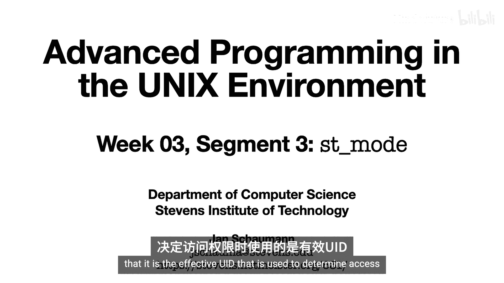
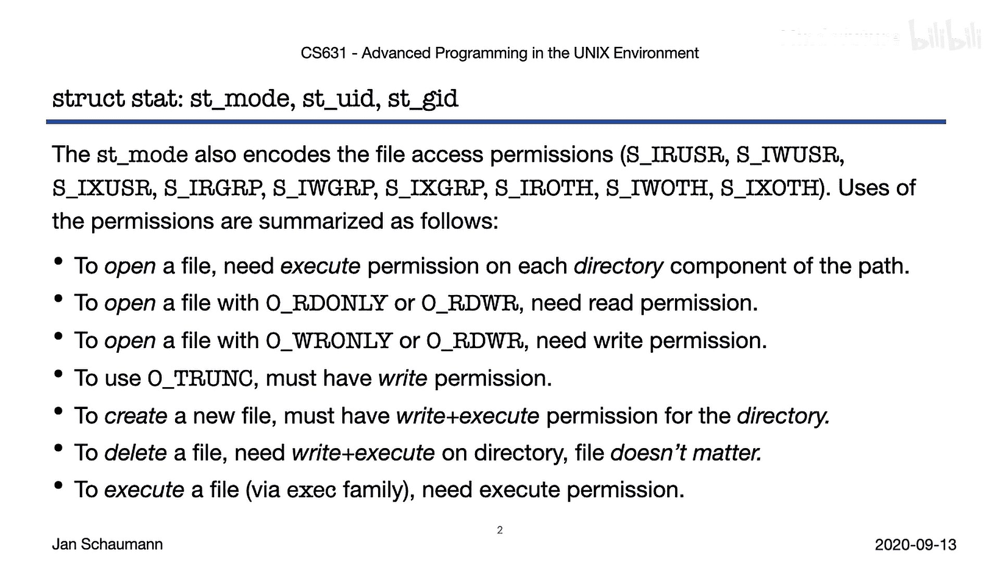
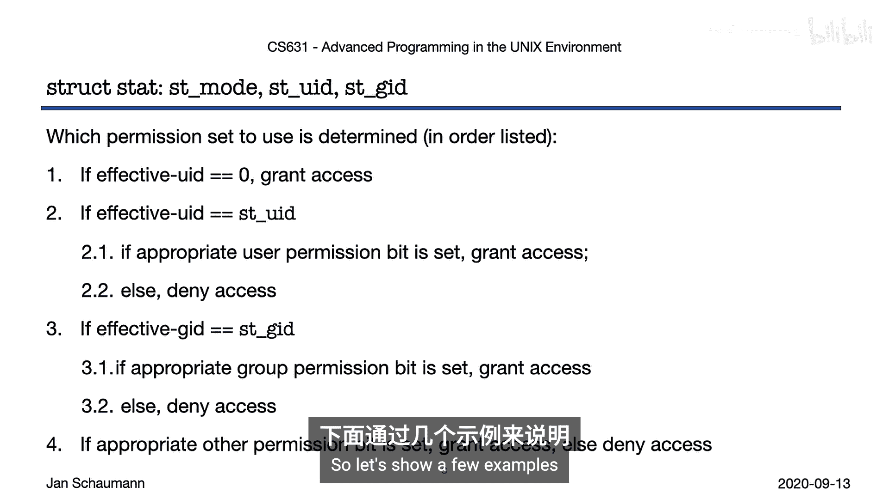
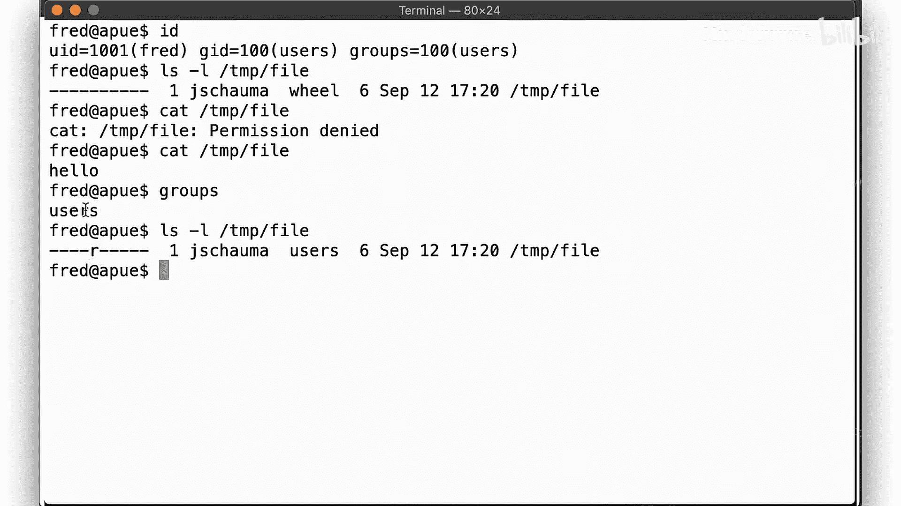
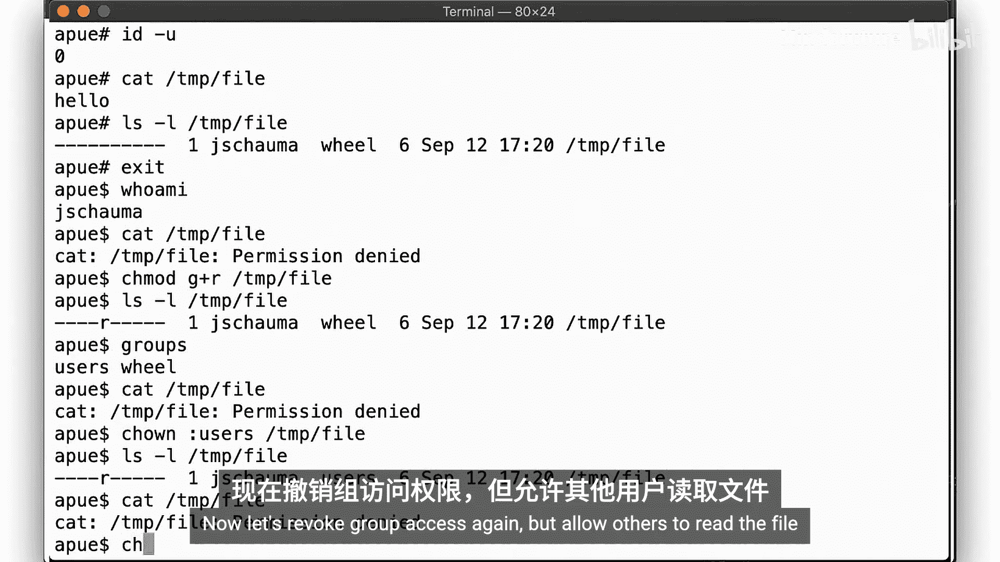
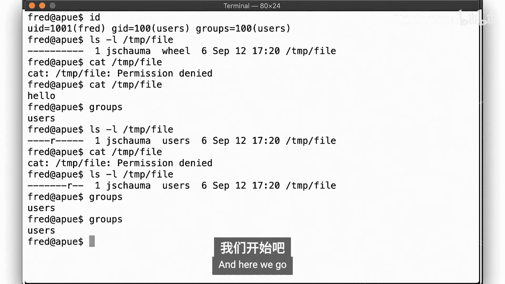
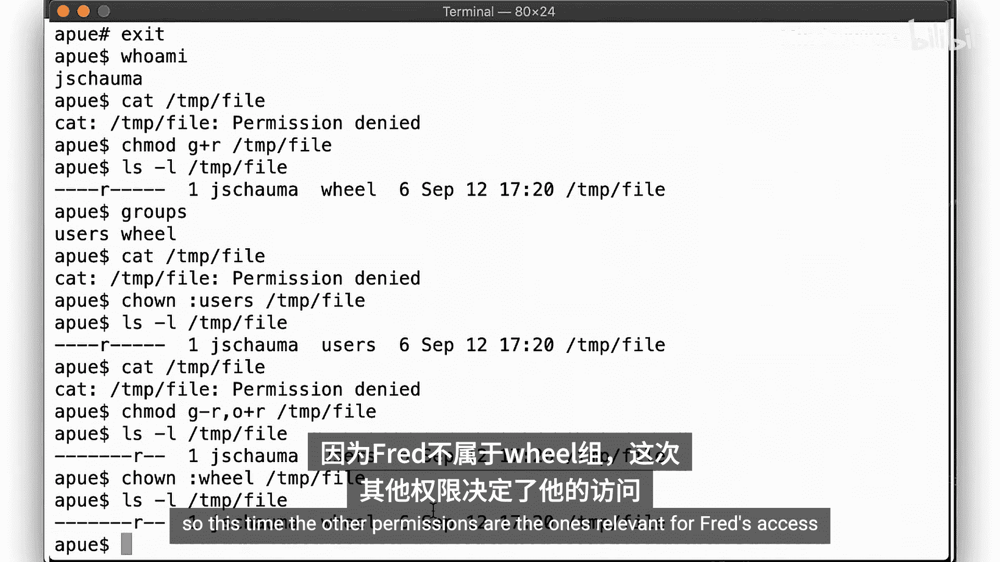
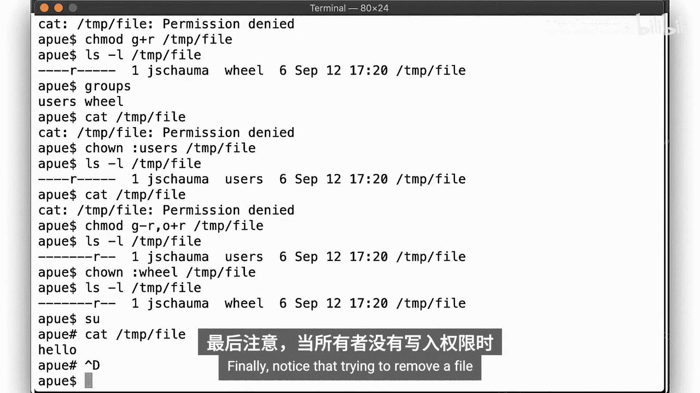
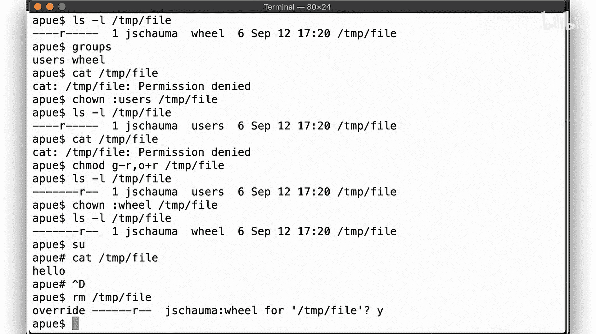
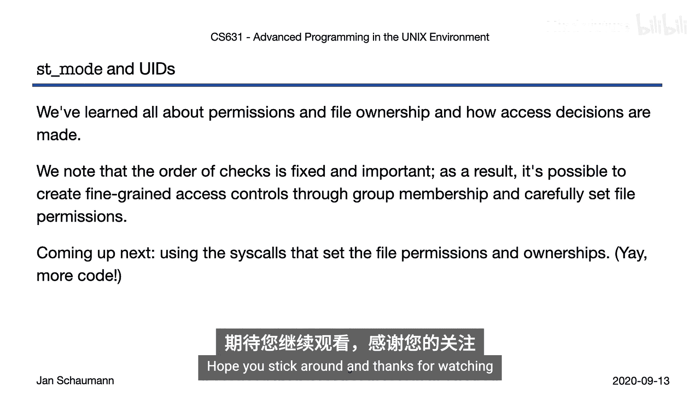

# 012：Week-03-Segment-3 - st_mode与权限详解 🔐



在本节课中，我们将要学习UNIX系统中文件权限是如何通过`struct stat`中的`st_mode`字段定义的，以及系统如何根据进程的有效用户ID（EUID）和有效组ID（EGID）来应用这些权限规则。

上一节我们介绍了进程的UID和GID，本节中我们来看看系统在检查文件访问权限时的具体决策顺序。

## 权限检查的顺序

文件的权限存储在`struct stat`的`st_mode`字段中，分为三组：**所有者（user）**、**组（group）**和**其他用户（other）**。

为了打开一个文件，需要满足以下条件：

1.  **对文件所在目录拥有执行（x）权限**。这是因为需要通过目录文件查找文件名到Inode的映射。读取目录内容（如`ls`命令）需要读（r）权限，而查找特定条目则需要执行（x）权限。
2.  **对路径中所有父目录拥有执行（x）权限**。例如，打开路径`/var/tmp/foo`，需要对`/`、`/var`和`/var/tmp`都拥有执行权限。
3.  以**读（r）或读写（rw）模式**打开文件，需要对该文件拥有读权限。
4.  以**写（w）或读写（rw）模式**打开文件，需要对该文件拥有写权限。
5.  使用`O_TRUNC`标志打开文件（会清空文件），需要写权限。
6.  **创建新文件**，需要对目标目录拥有**写（w）和执行（x）**权限，因为这需要在目录中添加一个新条目。
7.  **删除文件**，同样只**需要对文件所在目录拥有写（w）和执行（x）权限**，文件自身的权限无关紧要。删除操作实质是修改目录内容，移除一个链接。
8.  **执行一个文件**，需要对该文件拥有执行（x）权限，但**不一定需要读（r）权限**。对于编译型程序（如C程序二进制文件）确实如此。但对于解释型脚本（如Shell、Python），则需要读权限，因为解释器需要读取脚本内容。

以下是验证上述规则的一些实践建议：
*   创建一个包含多级子目录的目录，进入深层目录创建一个文件，然后移除父目录的执行权限，尝试用相对路径和绝对路径打开该文件。
*   将编译器生成的可执行文件的读权限移除，然后尝试运行它。
*   创建一个权限为`777`的目录，体验不同用户如何不受文件本身权限限制而删除和重建文件。

## 权限决策树 🌳

了解所需权限后，我们来看系统如何根据进程的EUID和EGID来决定应用哪一组权限（用户、组或其他）。这是一个有序的决策过程：



1.  **超级用户（root）**：如果进程的EUID是`0`（root），则**立即授予访问权限**，完全不检查文件权限。
    *   代码表示：`if (euid == 0) access_granted();`
2.  **文件所有者**：如果进程的EUID与文件的`st_uid`（所有者UID）匹配，则**仅检查用户（user）权限位**。若允许则访问成功；若拒绝则访问失败。**此时不再检查组或其他权限**。
    *   代码表示：`if (euid == st_uid) check_user_bits();`
3.  **文件所属组**：如果上述条件不满足，但进程的EGID与文件的`st_gid`（所属组GID）匹配，则**检查组（group）权限位**。根据结果决定访问。
    *   代码表示：`else if (egid == st_gid) check_group_bits();`
4.  **其他用户**：如果以上条件均不满足，则**最后检查其他用户（other）权限位**。
    *   代码表示：`else check_other_bits();`

这种“首次匹配即生效”的机制可能导致一些意想不到的结果。

## 示例演示 💻

让我们通过一些例子来理解这个决策过程。



首先，查看当前用户ID和组信息：
```bash
id
```

**示例1：root的至高权限**
1.  创建一个文件并移除所有权限：`chmod 000 file.txt`
2.  切换到root用户：`sudo su`
3.  即使文件没有任何权限，root用户依然可以读取它：`cat file.txt`
4.  文件的所有者（非root）则无法读取。

**示例2：所有者权限优先于组权限**
1.  创建一个文件，所有者是用户A，组是`wheel`。
2.  设置权限为：所有者无权限，组有读权限（`-r-----` 或 模式`040`）。
3.  用户A（作为所有者）将**无法**读取文件，因为系统匹配了“所有者”条件，而所有者权限位是拒绝的，因此不再检查组权限。
4.  另一个在`wheel`组内的用户B则可以读取该文件。



**示例3：组权限与其他权限**
1.  将文件组改为`users`，权限设为组可读，其他用户无权限（`-r--r----` 或 模式`440`）。
2.  在`users`组内的用户C可以读取。
3.  不在`users`组内的用户D无法读取。
4.  将权限改为组无权限，其他用户可读（`-r-----r--` 或 模式`404`）。
5.  此时，用户C（在组内）无法读取（因为匹配了组条件且被拒），而用户D（不在组内）可以读取（因为最终匹配了“其他用户”条件）。





**示例4：删除文件的权限**
尝试删除一个文件，即使所有者对该文件没有写权限，只要对**所在目录**有写和执行权限，删除操作仍会成功。`rm`命令的确认提示只是命令本身提供的便利，底层的`unlink()`系统调用无需确认。



## 总结





本节课中我们一起学习了UNIX文件权限的核心机制。我们明确了访问文件所需的各类权限，并深入剖析了系统检查权限时遵循的“所有者 -> 组 -> 其他用户”的决策树。关键点在于：**root用户拥有无条件访问权；文件所有者的权限检查优先级最高；删除操作只依赖目录权限**。

理解这些规则对于系统安全和程序开发至关重要。请务必亲自动手复现和修改文中的示例，这比单纯观看更能加深理解。



在下一节中，我们将学习用于修改文件权限和所有者的相关系统调用（如`chmod`, `chown`），学完后你将能够自己实现大部分权限管理命令的核心功能。