# 013：Week-03-Segment-4 - chmod(2)与chown(2) 🛠️

在本节课中，我们将学习用于修改文件权限和所有权的两个核心系统调用：`chmod` 和 `chown`。我们将通过代码示例来理解它们的工作原理和使用限制。

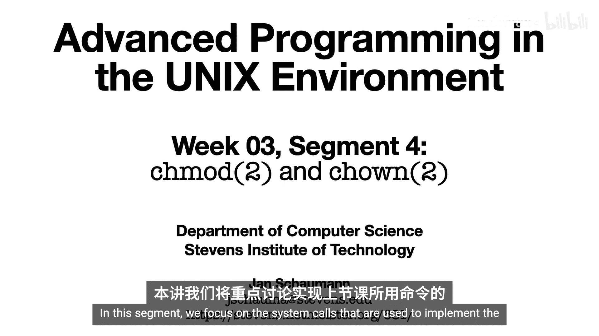

## 概述

在上一节中，我们通过命令行工具（如 `chmod` 和 `chown`）操作了文件的权限和所有权。本节我们将聚焦于实现这些命令的底层系统调用。我们将详细介绍 `chmod` 和 `chown` 系统调用的不同变体、使用规则以及它们对系统安全的影响。

## chmod 系统调用

`chmod` 命令用于改变文件的访问权限，其底层实现是一系列 `chmod` 家族的系统调用。这些调用遵循我们熟悉的模式，提供了操作文件路径、文件描述符和相对路径的能力。

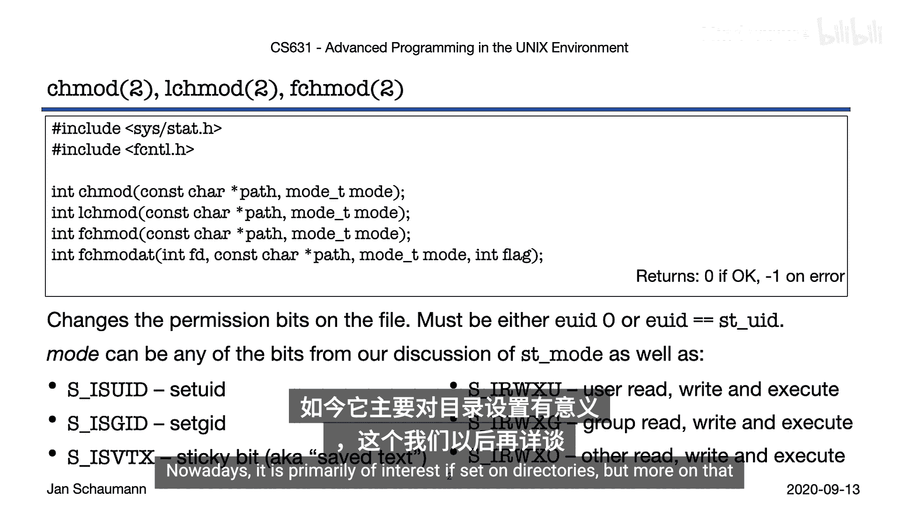

以下是 `chmod` 系统调用的主要函数：
*   `int chmod(const char *path, mode_t mode);` - 通过路径操作文件。
*   `int lchmod(const char *path, mode_t mode);` - 操作符号链接本身（如果支持）。
*   `int fchmod(int fd, mode_t mode);` - 通过文件描述符操作文件。
*   `int fchmodat(int fd, const char *path, mode_t mode, int flag);` - 在指定目录描述符下操作相对路径。

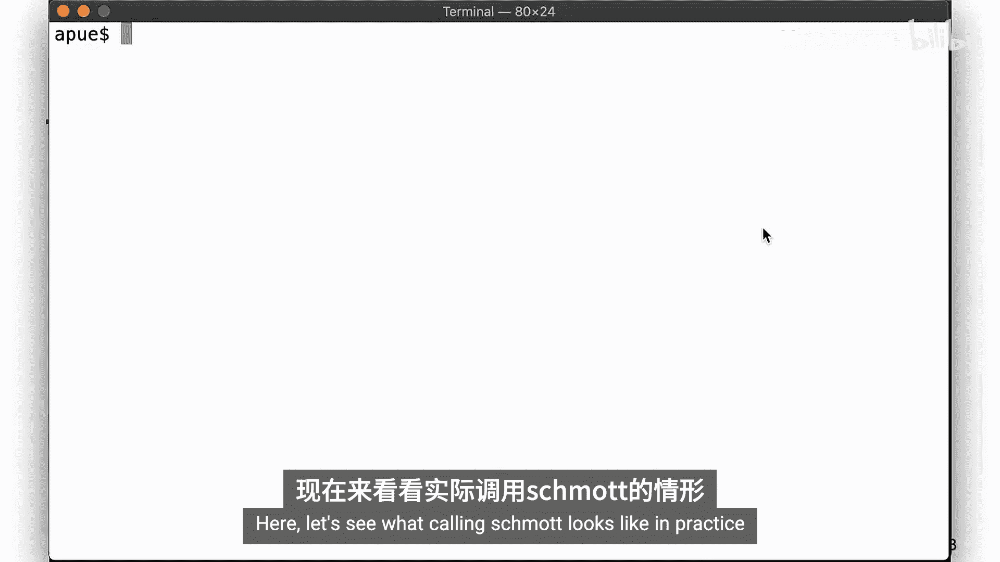

只有文件的所有者或超级用户（root）才能成功调用 `chmod` 来修改文件权限。可设置的权限位包括我们之前学过的读（`r`）、写（`w`）、执行（`x`），以及一个特殊的“粘着位”（sticky bit，又称保存文本位）。目前，粘着位主要对目录有意义，我们将在后续课程中详细讨论。

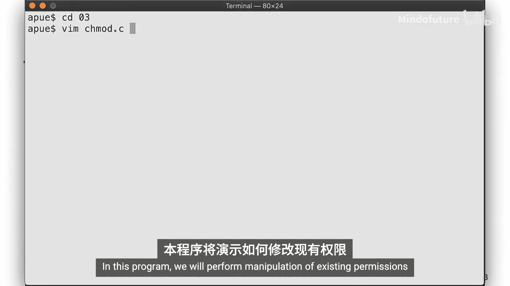

### 代码示例：修改文件权限

让我们通过一个程序来实践如何操作现有权限以及如何设置绝对权限值。

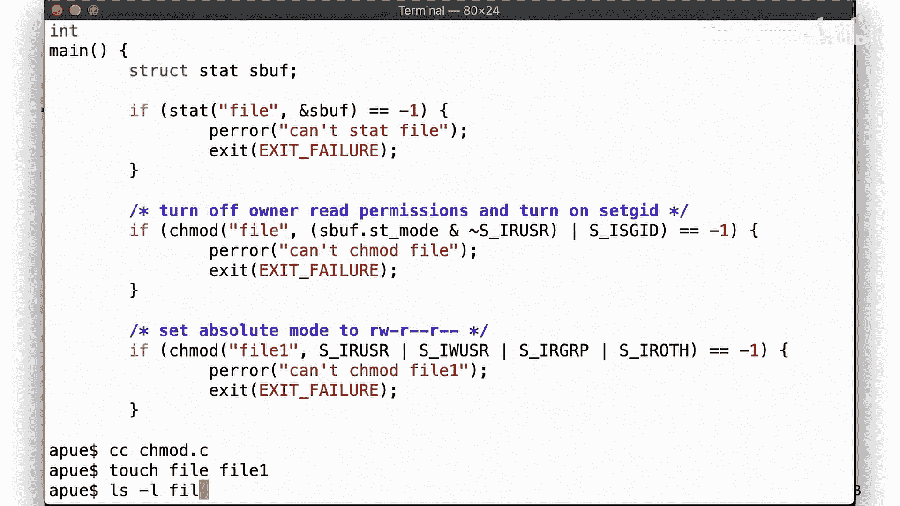

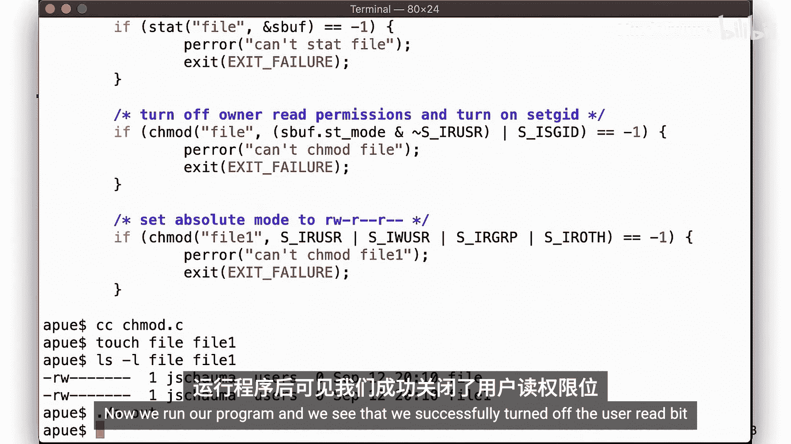

```c
#include <sys/stat.h>
#include <stdio.h>

int main() {
    struct stat statbuf;

    // 1. 修改现有权限：关闭用户读位，开启设置组ID位
    if (stat("file", &statbuf) < 0) {
        perror("stat error for file");
    } else {
        // 获取当前模式，关闭用户读位，开启设置组ID位
        mode_t new_mode = statbuf.st_mode & ~S_IRUSR; // 关闭用户读
        new_mode |= S_ISGID; // 开启设置组ID位
        if (chmod("file", new_mode) < 0) {
            perror("chmod error for file");
        }
    }

    // 2. 设置绝对权限值：直接设置为八进制0644
    if (chmod("file1", S_IRUSR | S_IWUSR | S_IRGRP | S_IROTH) < 0) {
        perror("chmod error for file1");
    }

    return 0;
}
```

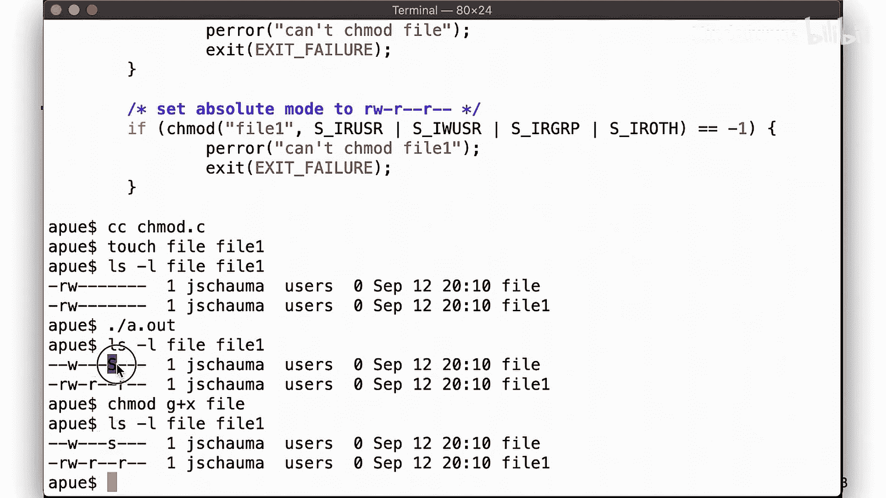

程序首先调用 `stat` 获取文件“file”的当前权限状态。然后，它通过位操作关闭了用户读权限（`S_IRUSR`），并开启了设置组ID位（`S_ISGID`）。接着，程序直接为文件“file1”设置了绝对的权限模式 `0644`（即用户可读可写，组和其他用户只读）。

运行程序后，使用 `ls -l` 查看结果。可以看到“file”文件的用户读权限被移除，并且组权限位置显示为大写 `S`，这表示设置了 `setgid` 位但文件本身没有组执行权限。为“file”添加组执行权限后，`S` 会变为小写 `s`。

## chown 系统调用

`chown` 系统调用用于改变文件的所有者和所属组。其函数家族与 `chmod` 保持一致。

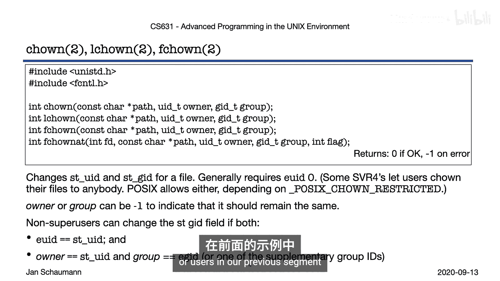

以下是 `chown` 系统调用的主要函数：
*   `int chown(const char *path, uid_t owner, gid_t group);`
*   `int lchown(const char *path, uid_t owner, gid_t group);`
*   `int fchown(int fd, uid_t owner, gid_t group);`
*   `int fchownat(int fd, const char *path, uid_t owner, gid_t group, int flag);`

改变文件所有者通常需要超级用户（root）权限，因为这直接影响系统安全。虽然某些遵循早期System V规范的系统允许文件所有者将文件转让给其他用户，但在实践中，绝大多数现代系统都要求root权限（通过定义 `_POSIX_CHOWN_RESTRICTED` 常量来限制）。

然而，改变文件的所属组则相对宽松。如果用户是文件的所有者，并且目标组是该用户的主组或附加组之一，那么该用户就可以成功修改文件的组所有权。

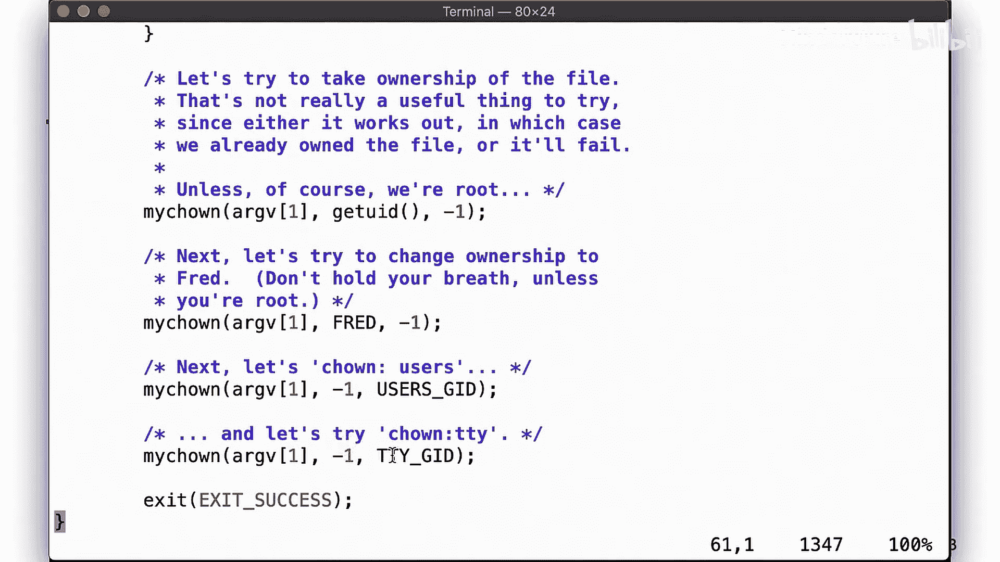

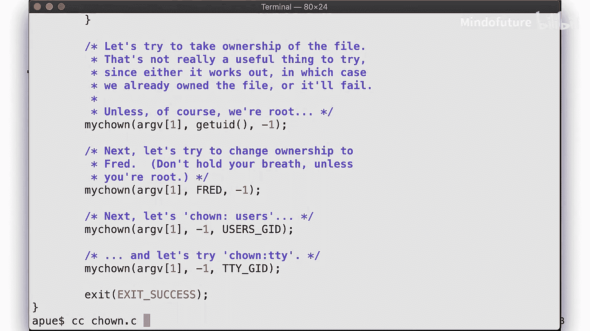

### 代码示例：修改文件所有权

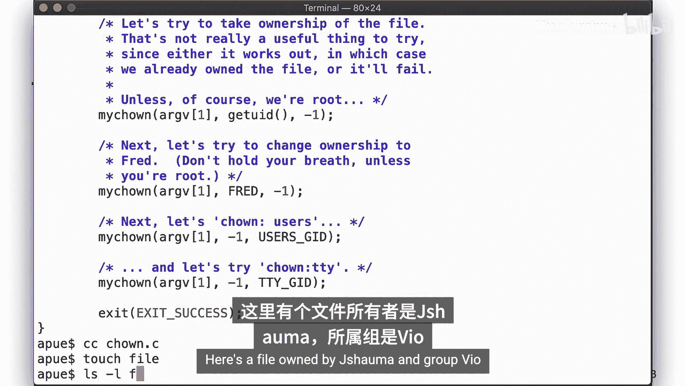

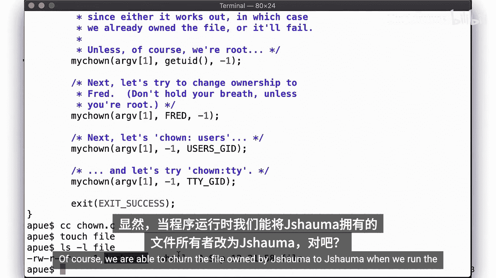

以下程序演示了 `chown` 的不同使用场景。

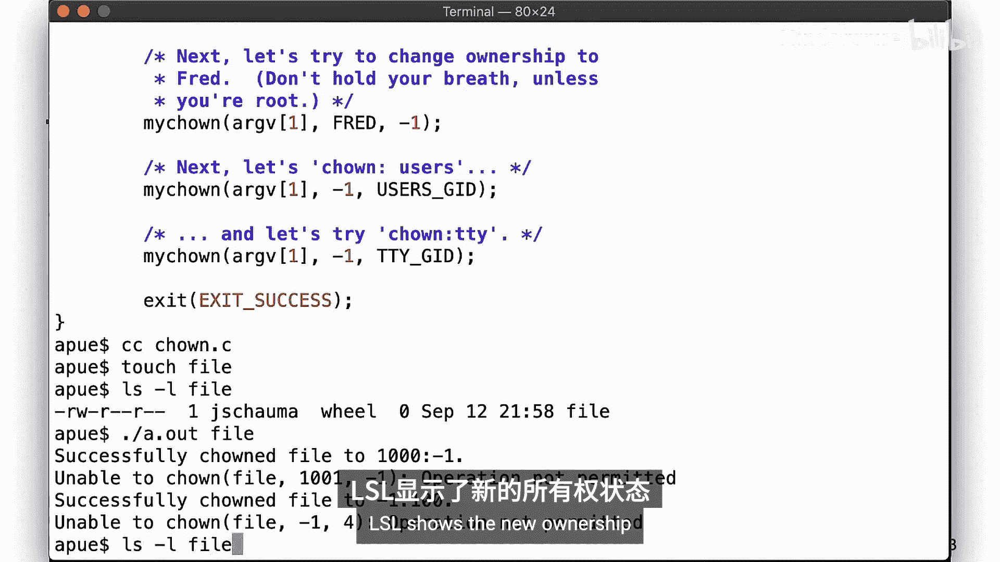

```c
#include <unistd.h>
#include <stdio.h>

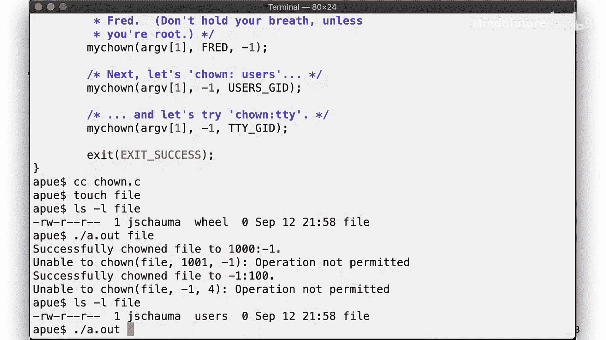

int main() {
    // 尝试将文件所有者改为自己（通常无意义，除非是root）
    if (chown("testfile", getuid(), (gid_t)-1) < 0) {
        perror("chown to self error");
    }

    // 尝试将所有者改为用户fred (UID 1001)，保留原组
    if (chown("testfile", 1001, (gid_t)-1) < 0) {
        perror("chown to fred error");
    }

    // 尝试将组改为“users”（假设用户在users组中）
    if (chown("testfile", (uid_t)-1, 100) < 0) { // 假设组“users”的GID是100
        perror("chown group to users error");
    }

    // 尝试将组改为“tty”（假设用户不在tty组中）
    if (chown("testfile", (uid_t)-1, 4) < 0) { // 假设组“tty”的GID是4
        perror("chown group to tty error");
    }

    return 0;
}
```

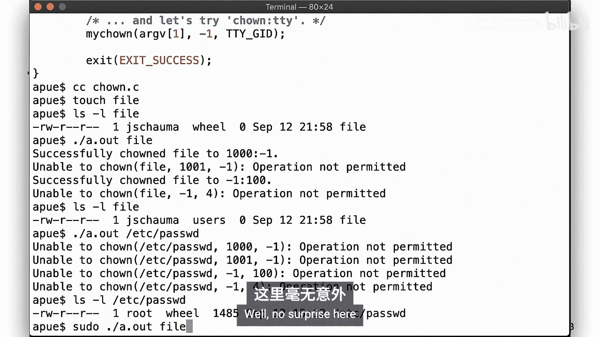

程序首先尝试将文件所有者改为当前用户自己（这通常总会成功，因为用户就是所有者）。接着，它尝试将所有者改为用户“fred”，这通常需要root权限，因此会失败。然后，程序尝试将文件组改为“users”，如果当前用户是“users”组的成员，这个操作会成功。最后，尝试将组改为“tty”，由于用户不在该组中，操作会失败。

当以root身份运行程序时，所有操作都会成功，因为root可以执行任何所有权更改。

## 总结

本节课我们一起学习了 `chmod` 和 `chown` 系统调用。

*   `chmod` 和 `chown` 系统调用家族提供了操作文件路径、文件描述符和相对路径的一致性接口。
*   只有文件的所有者或root用户才能修改文件权限。
*   通常只有root用户才能更改文件的所有者。文件所有者可以更改文件的所属组，但目标组必须是其主组或附加组之一。
*   修改文件权限和所有权具有重要的安全影响，因此必须谨慎授予访问权限。

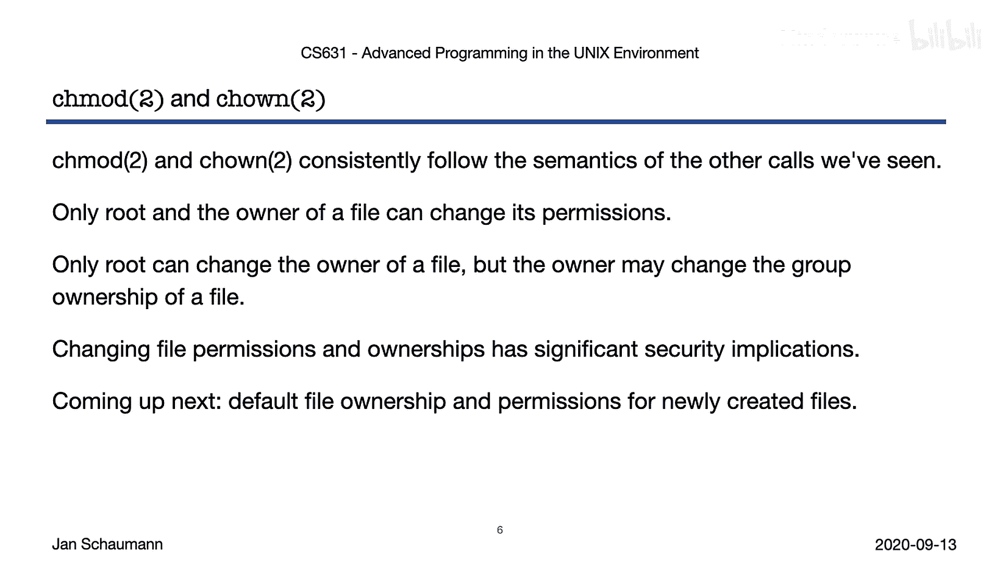

在下一个视频片段中，我们将探讨新创建文件的默认所有权和权限是如何确定的。