# 014：Week-03-Segment-5 - umask(2) 📁

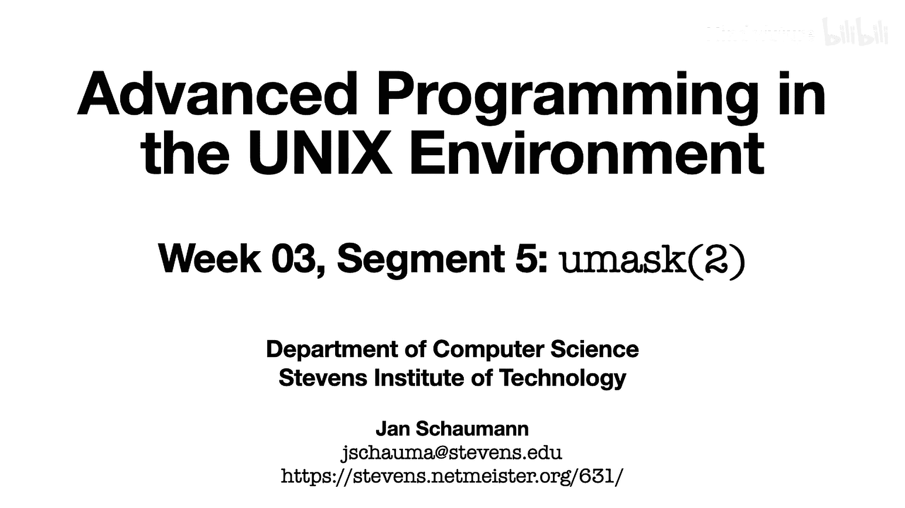

在本节课中，我们将要学习当创建新文件时，系统如何决定其所有权和权限。我们将了解进程的UMask概念，并探究UMask Shell内置命令是如何实现的。

---

在上一节中，我们介绍了如何更改文件权限和所有权。本节中，我们来看看系统如何为新创建的文件分配默认的所有权和权限。

## 默认文件所有权

当新文件被创建时，其所有者通常是创建该文件的进程的有效用户ID（EUID）。这很合理。

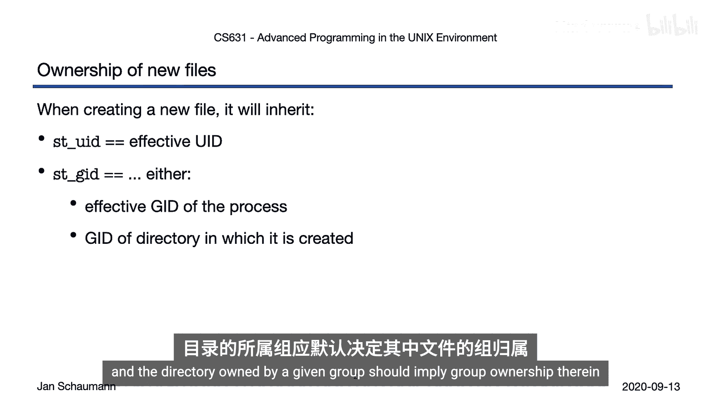

然而，文件的组所有权可能取决于Unix版本或系统配置。以下是两种常见情况：

*   在大多数Linux系统上，默认设置是从进程的有效组ID（EGID）继承组所有权。
*   在BSD衍生系统上，默认是从文件所在目录继承组所有权。

这种设计的原因是，在多用户系统中，人们希望在由某个组拥有的目录中进行协作，该目录中的文件也应继承该组所有权。

让我们在实践中观察一下。我们在`/tmp`下创建一个新目录。这个新目录的组所有权是`wheel`，这与`/tmp`的组所有权一致。在`deer`目录下创建的新文件也应获得`wheel`的组所有权。看起来一切正常。

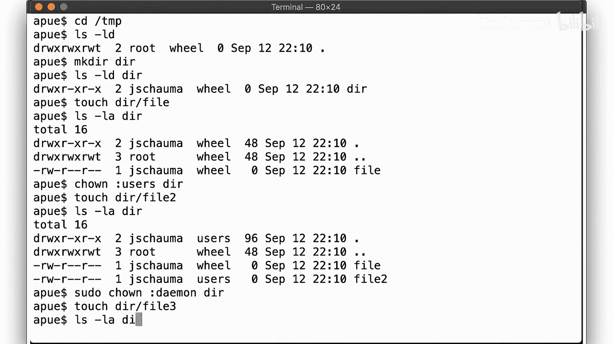

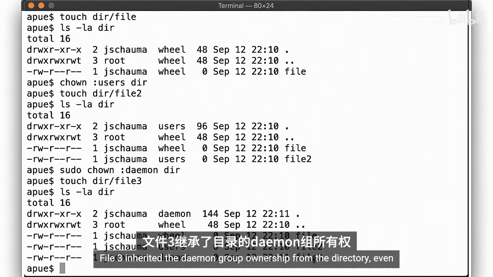

如果我们把目录的组所有权改为`users`呢？现在，新文件也由`users`组所有，因为它是在这个目录中创建的。当然，之前的文件保留了其原有的组所有权。

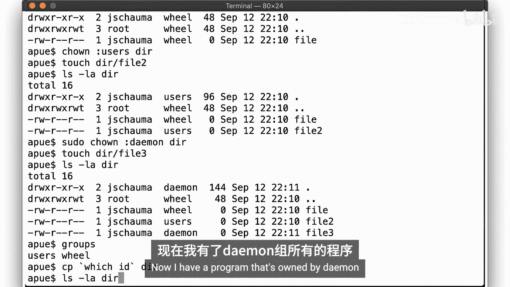

但是，如果目录被一个用户不属于的组所拥有呢？让我们试试看。文件`file3`从目录继承了`daemon`组所有权，即使创建它的用户并非`daemon`组的成员。

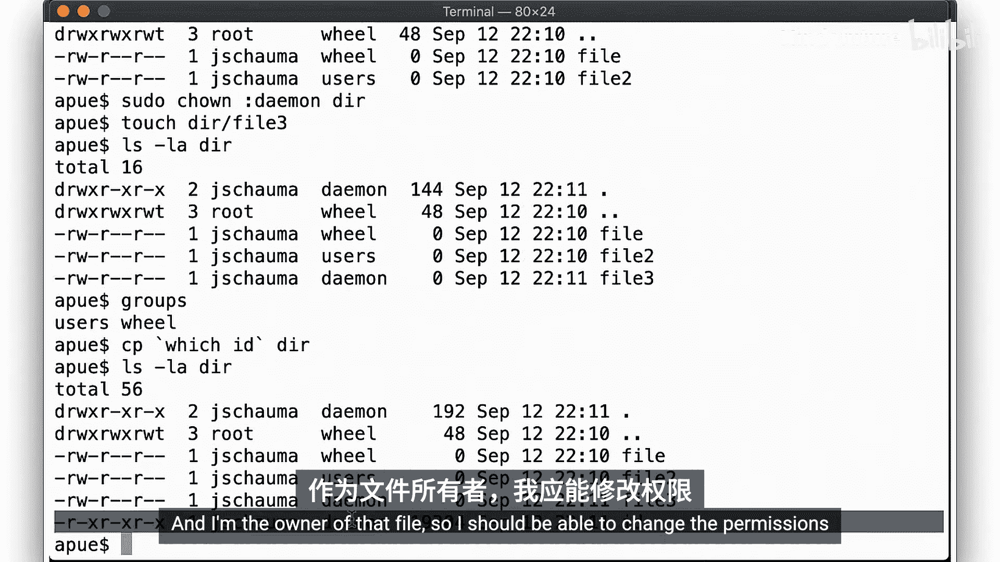

这是否意味着我可以创建由我不属于的组所拥有的文件呢？现在，我有了一个由`daemon`组拥有的程序。我是该文件的所有者，所以我应该能够更改其权限。这是否意味着我可以将我的权限提升到`daemon`组的权限呢？

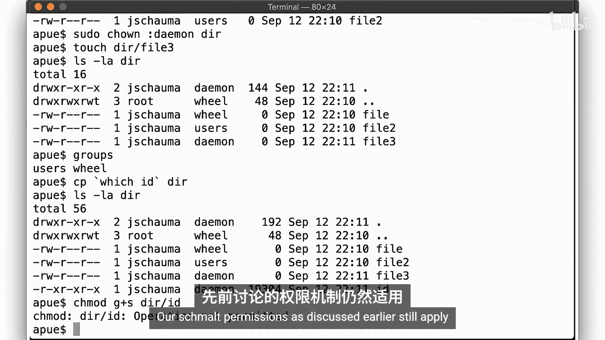

幸运的是，这行不通。我们之前讨论过的权限规则仍然适用。

现在，让我们看看在Linux系统上是什么情况。在我的主目录下，新目录与当前目录具有相同的组所有权，这恰好也是我的主组。如果我们创建一个新文件，它会获得相同的组所有者。那么，这个系统也会从目录继承组所有权吗？

让我们将目录的组所有权改为`root`。新文件并没有继承目录的组所有权，而是始终从进程的主组ID获取组所有权。

正如我提到的，不同的系统行为不同，在管理它们时了解这些差异很重要。好了，这涵盖了默认所有权。

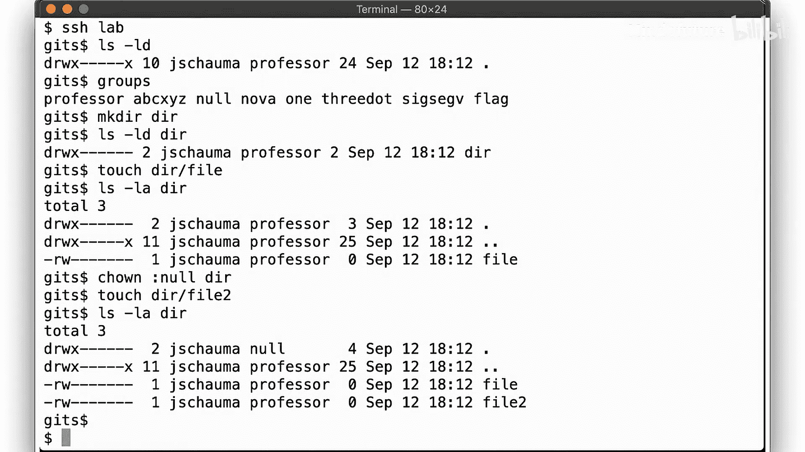

## 文件创建模式掩码（UMask）🔧

上一节我们介绍了默认所有权，本节中我们来看看默认权限。为此，我们需要了解UMask。

UMask是文件创建模式掩码，其中任何被置位的位在创建文件时都会被关闭。你可以在进程中设置UMask，以确保之后创建的任何文件都具有特定的默认权限。为此，你需要调用`umask()`系统调用。

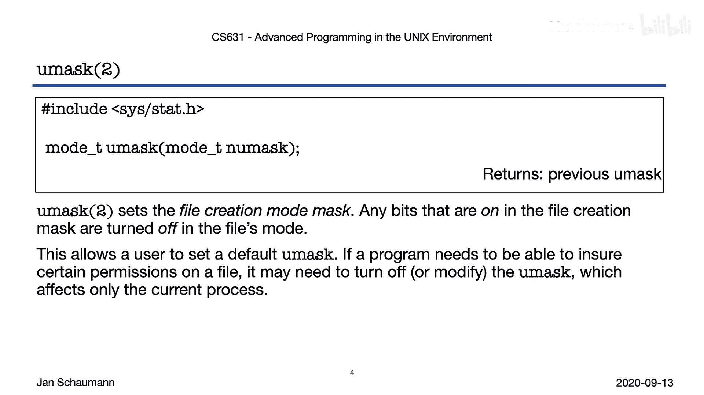

请注意，UMask只适用于当前进程。系统可能为新进程设置了与你不同的默认UMask。

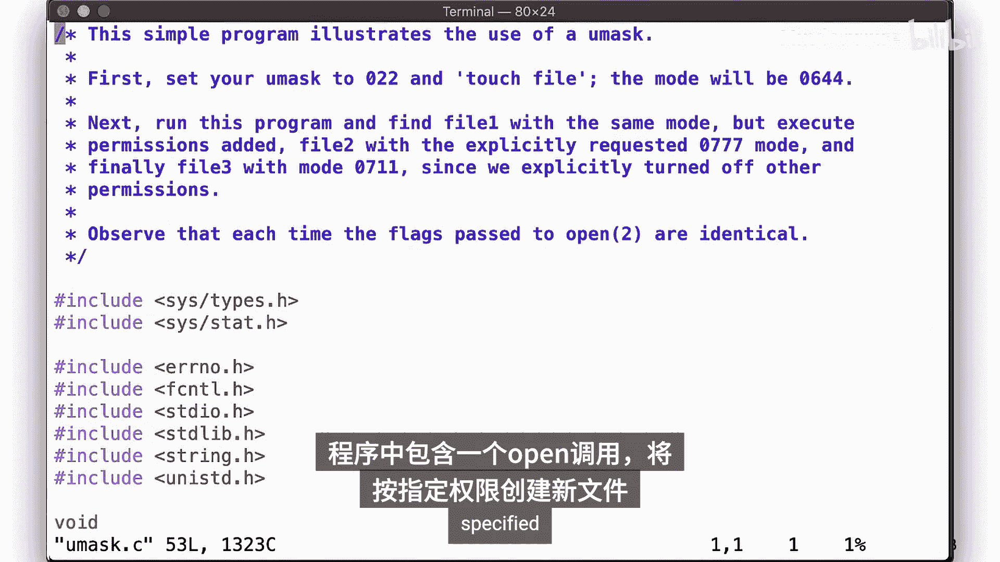

虽然你们中的许多人可能使用过`umask`这个Shell内置命令，但让我们通过本视频段中的最后一个命令示例来说明它是如何工作的。

以下是我们的程序`umask.c`。在其中，我们有一个`open()`调用，它将创建一个具有指定权限的新文件。

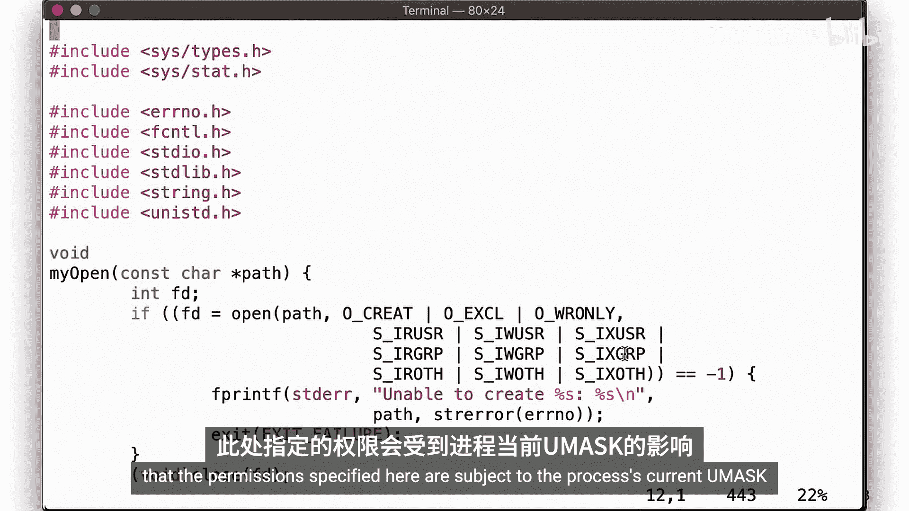

```c
open("newfile", O_CREAT | O_WRONLY, 0777);
```

这里的权限指定为用户、组和其他用户都拥有读、写、执行权限。根据我们之前的课程，这里指定的权限会受到进程当前UMask的影响，这意味着在文件创建时，UMask中置位的权限位会被关闭，即使`open()`调用指定了它们。

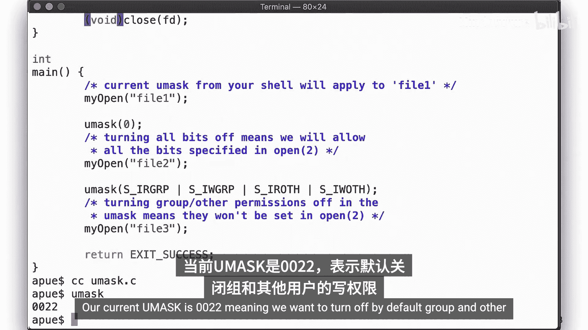

所以，第一次调用此函数时，我们将拥有从Shell继承的任何UMask值。然后，我们显式地将UMask中的所有位关闭，这意味着我们将允许`open()`调用所指定的所有权限。在第三次调用之前，我们设置了一个UMask来关闭组和其他用户的写权限。让我们运行它。

我们当前的UMask是`0022`。这意味着，默认情况下，我们希望关闭组和其他用户的写权限。当我们创建一个新文件时，它将以模式`644`创建，允许用户读写，但只允许组和其他用户读。

现在，我们运行我们的程序。生成的文件如下所示。回想一下，我们的`open()`调用每次都请求为所有用户、组和其他用户设置读、写、执行权限。

*   第一个文件`file1`：UMask关闭了组和其他用户的写权限。
*   第二个文件`file2`：我们显式地关闭了UMask，因此它获得了`open()`请求的所有权限。
*   第三个文件`file3`：我们关闭了组和其他用户的读写权限，但保留了执行权限。

让我们将UMask更改为不同的值`0077`再试一次。`0077`意味着默认情况下，禁用组和其他用户的读、写、执行权限。因此，我们新创建的文件只获得模式`600`。我们的程序创建的文件，在程序设置UMask的情况下，结果与第一次几乎相同；但在继承Shell的UMask的情况下，结果则不同。

如果还不清楚，请尝试在Shell中设置新的UMask为特定值，并观察对新创建文件的影响，以确保你理解其效果。

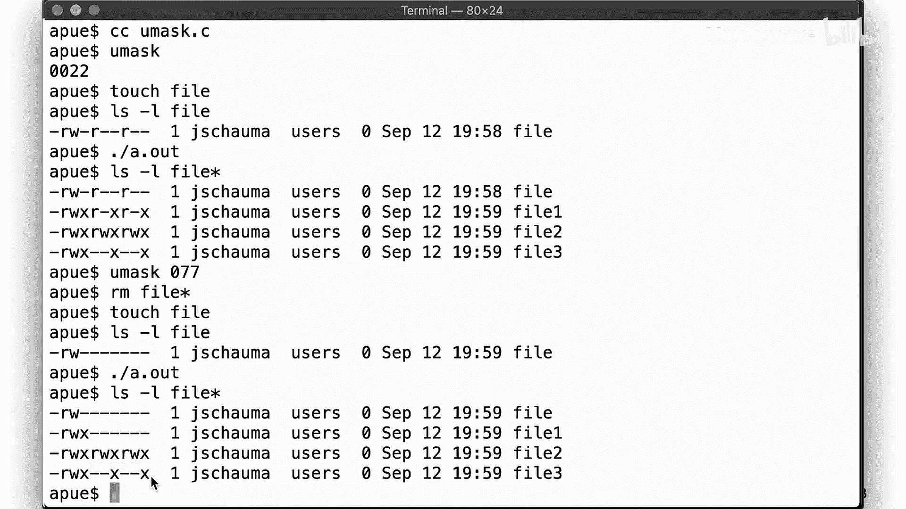

---

## 总结与预告 🎯

本节课中我们一起学习了文件权限和所有权、有效用户ID和组ID、如何更改它们，以及系统如何强制执行权限。在这个简短的视频中，我们讨论了UMask，以及它如何允许用户影响新文件创建时的默认权限。

掌握了所有这些知识，你应该能够实现大部分`chmod`命令的功能，以及`stat`命令。事实上，仔细想想，根据我们目前所学，你实际上应该能够编写一个接近系统`ls`命令的版本。你知道吗？让我们就这么做吧。这将是一个期中编码作业，我保证会很有趣。

请仔细阅读此URL处的作业说明，我们将在下一节课中讨论它。

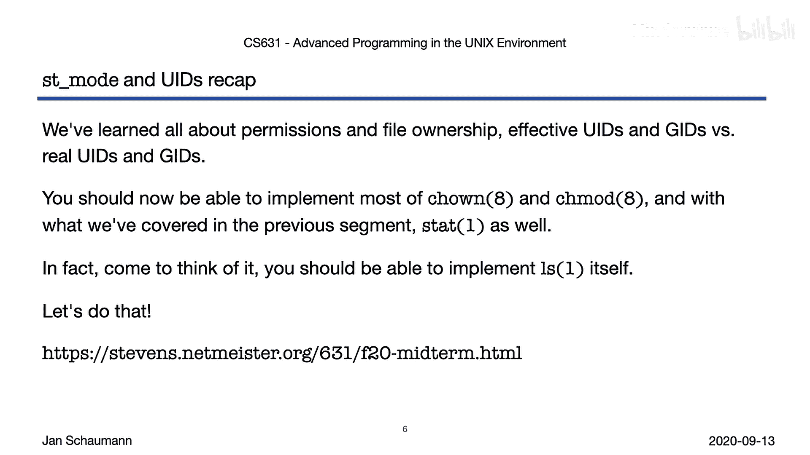

在下一个视频片段中，我们将讨论一些关于目录的内容，为我们第四周关于文件系统和大量系统调用的材料做准备。感谢观看，下次再见。