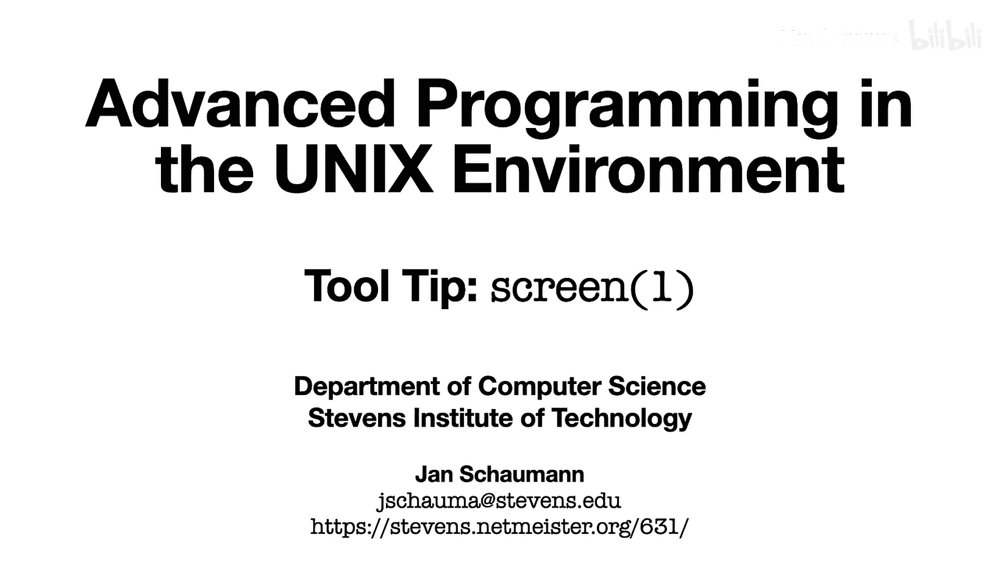
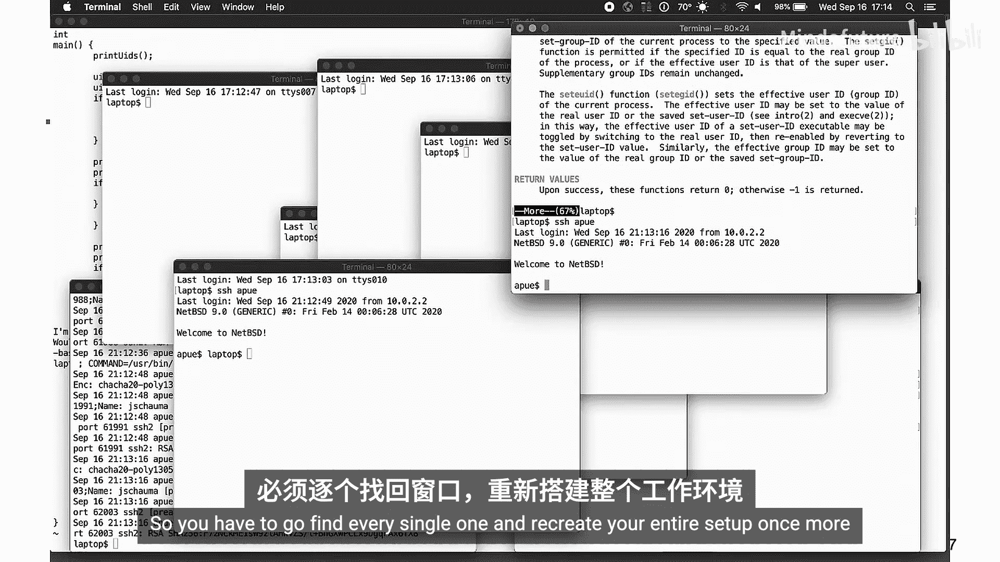
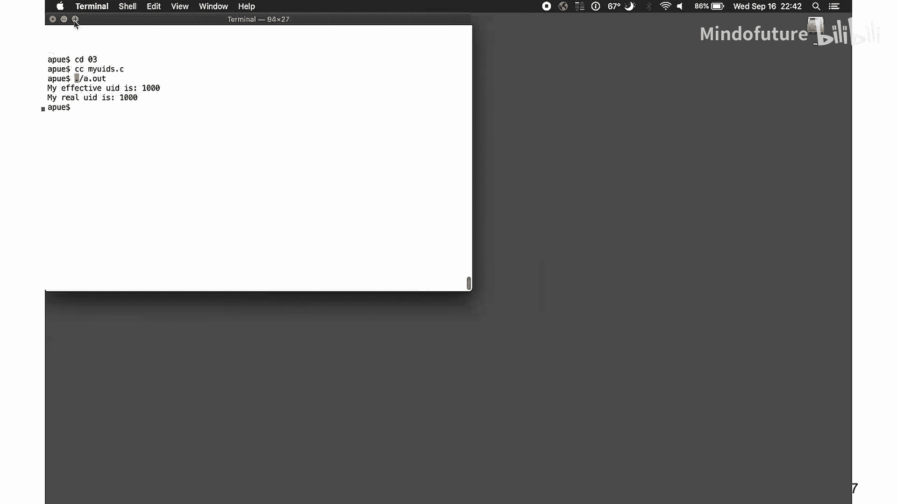
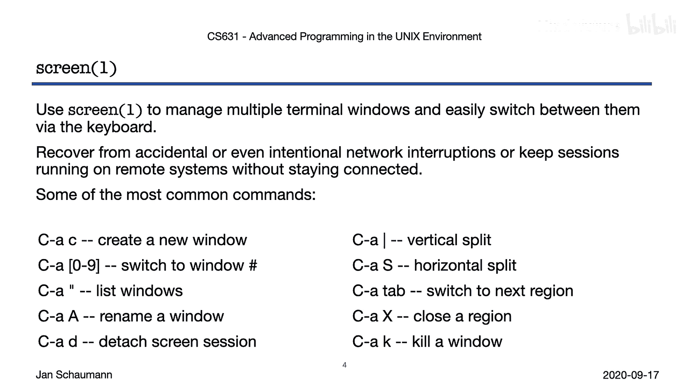

# 015：工具提示 - screen(1)

在本节课中，我们将学习一个强大的工具：**GNU Screen**。它是一个终端复用器，可以帮助你更好地通过键盘管理多个终端窗口，防止网络中断的影响，并允许你在断开连接后重新连接到远程会话。掌握它，你的工作效率将得到显著提升。

## 概述：远程开发中的常见问题

上一节我们介绍了Screen工具的基本概念。在深入其功能之前，让我们先看看在远程开发平台上可能遇到的典型问题。

假设我们使用虚拟机作为开发平台，所有工作都需要通过SSH连接到虚拟机。我们通常从一个窗口开始，通过SSH连接。

*   我们开始编码。
*   假设我们需要查阅`cuid`的手册页，但又不想离开代码编辑器，于是我们打开一个新终端窗口，再次SSH连接，并打开手册页。
*   接着，我们可能还需要查看日志。于是，又得打开一个新终端，SSH连接，运行命令。
*   然后，我们可能想一边运行程序，一边观察其他窗口。于是再打开一个终端，SSH连接，编译并运行程序。

很快，你会在多个窗口之间来回切换，屏幕变得杂乱无章。更糟糕的是，如果网络连接意外中断，或者你不小心关闭了终端窗口，所有未保存的工作和会话状态都会丢失，你必须从头开始重新建立所有连接和窗口布局。

## 解决方案：使用GNU Screen

那么，如何改善这种情况呢？让我们安装并使用**GNU Screen**程序。

Screen是一个全屏窗口管理器，可以复用多个虚拟终端。启动Screen后，你会获得一个Shell，然后可以通过键盘快捷键创建额外的窗口并在它们之间切换。

以下是Screen的核心操作：

*   **启动Screen**：在终端中输入 `screen` 命令。
*   **创建新窗口**：按下 `Ctrl + A`，然后按 `c`。
*   **在窗口间切换**：
    *   按编号切换：`Ctrl + A` 后按 `0`、`1`、`2`...
    *   列出所有窗口：`Ctrl + A` 后按 `"`（引号），然后使用 `j`、`k` 键选择。
*   **重命名窗口**：`Ctrl + A` 后按 `Shift + A`，然后输入新标题。
*   **分离会话**：`Ctrl + A` 后按 `d`。这会使Screen在后台运行。
*   **重新连接会话**：使用 `screen -r` 命令。

## 核心优势：会话持久化与窗口管理

现在，让我们看看Screen如何解决之前提到的问题。假设你在Screen中进行重要工作时网络突然中断。

因为所有工作都在Screen会话内进行，所以即使断开连接，你的所有窗口和工作状态都会被保存。当你重新SSH登录系统后，只需执行 `screen -r` 命令，就能重新连接到之前的会话，一切都会恢复到中断前的状态，没有任何工作丢失。

此外，Screen还支持分屏功能，让你能更高效地组织工作空间：

*   **垂直分屏**：`Ctrl + A` 后按 `|`。
*   **水平分屏**：`Ctrl + A` 后按 `Shift + S`。
*   **在分屏区域间切换**：`Ctrl + A` 后按 `Tab`。
*   **关闭当前分屏区域**：`Ctrl + A` 后按 `X`（注意：这仅关闭区域视图，对应的窗口依然存在）。

通过这些功能，你可以将终端窗口组织得像一个集成开发环境（IDE）一样，同时管理代码编辑、日志查看和命令执行。

## 更多可能性

当然，Screen的功能远不止于此。本次工具提示仅为你提供了一个快速入门，旨在激发你的兴趣。

除了上述功能，你还可以使用Screen：
*   与多个用户共享一个Screen会话，允许他们观察甚至操作你的终端。
*   在窗口之间复制粘贴终端输出。
*   记录会话日志。

互联网上有大量关于Screen的详细教程。学习并使用它，这些快捷键很快就会成为你的肌肉记忆。不久之后，你可能会感叹：“没有它的时候我是怎么工作的？”

## 总结

本节课我们一起学习了GNU Screen终端复用器。我们了解了它在管理多个远程终端窗口、防止网络中断导致工作丢失方面的巨大优势，并学习了创建窗口、切换、重命名、分屏以及分离和重连会话等基本操作。希望这个工具能成为你提高工作效率的得力助手。