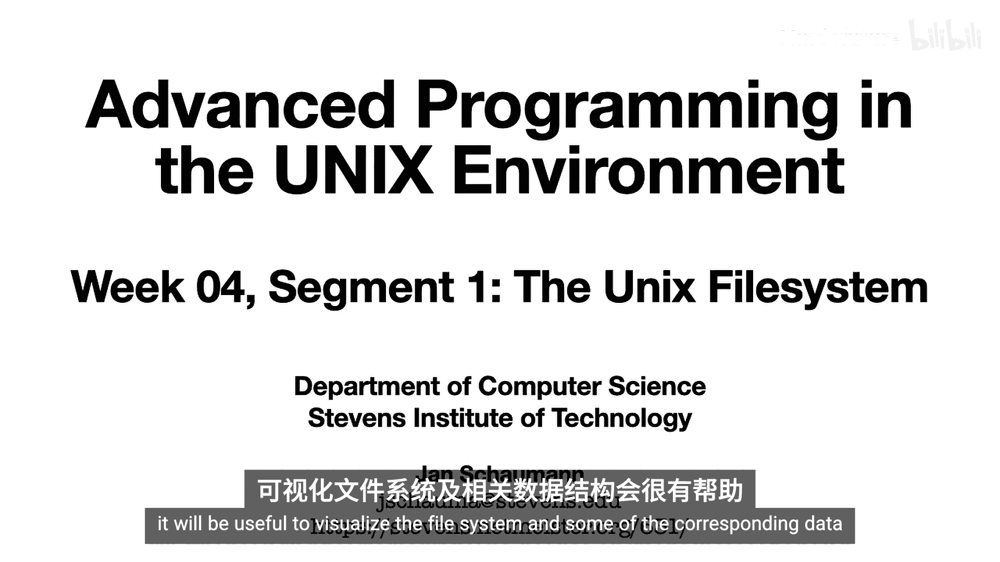
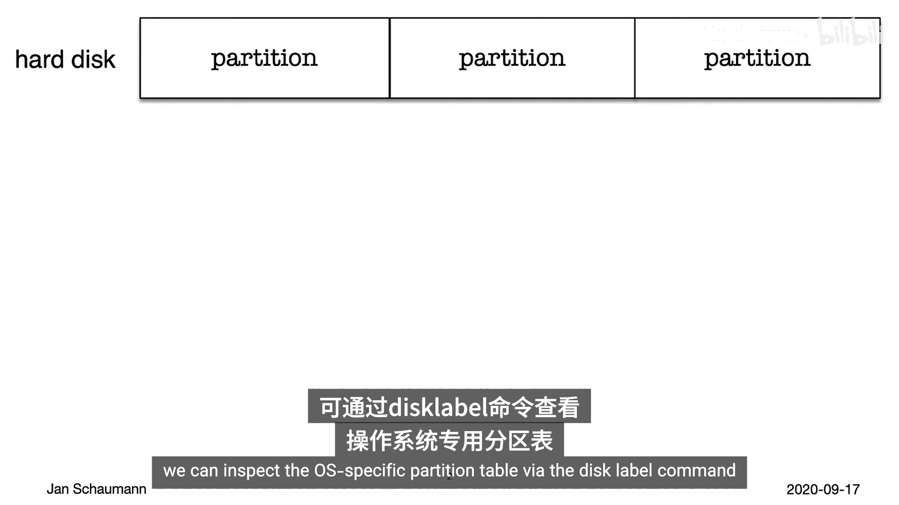
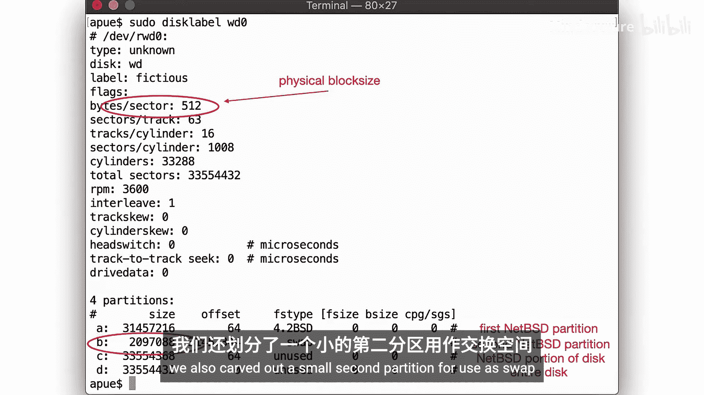
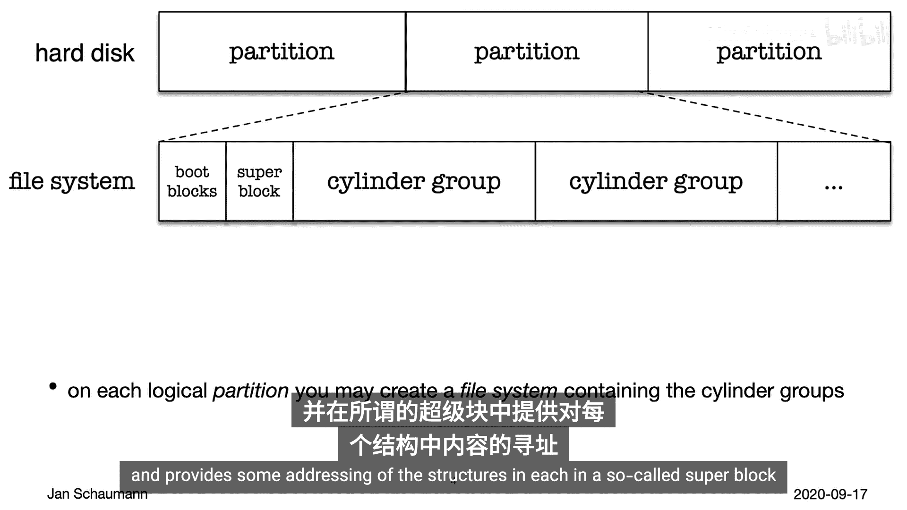
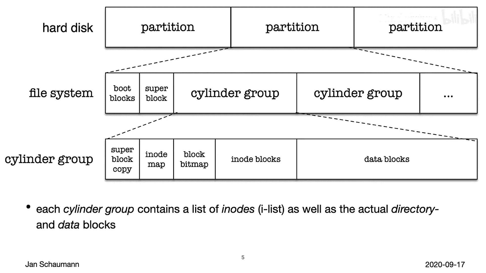
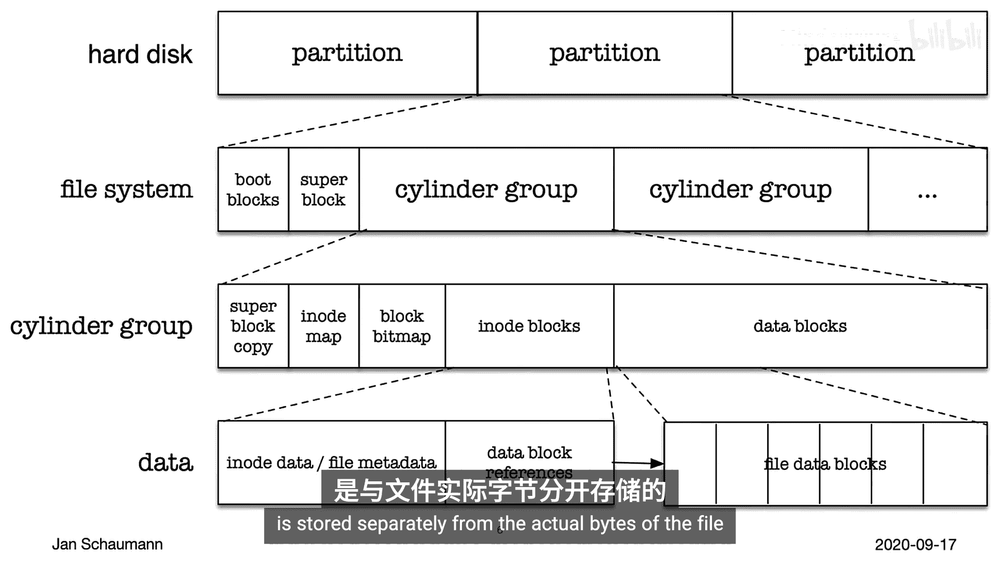
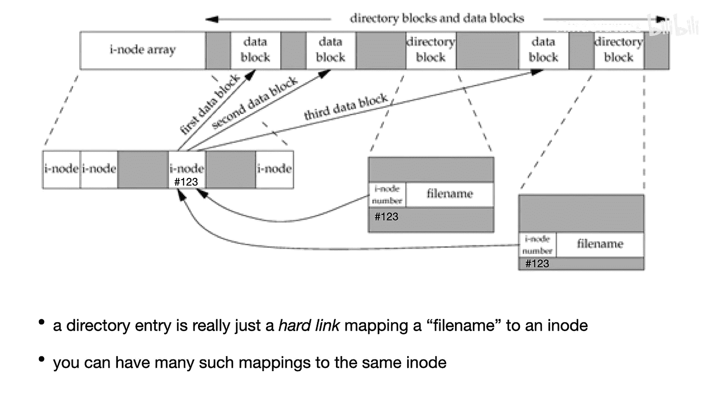
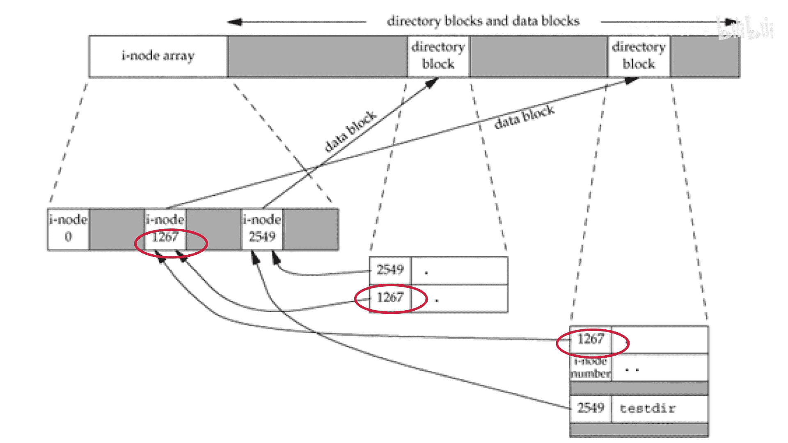
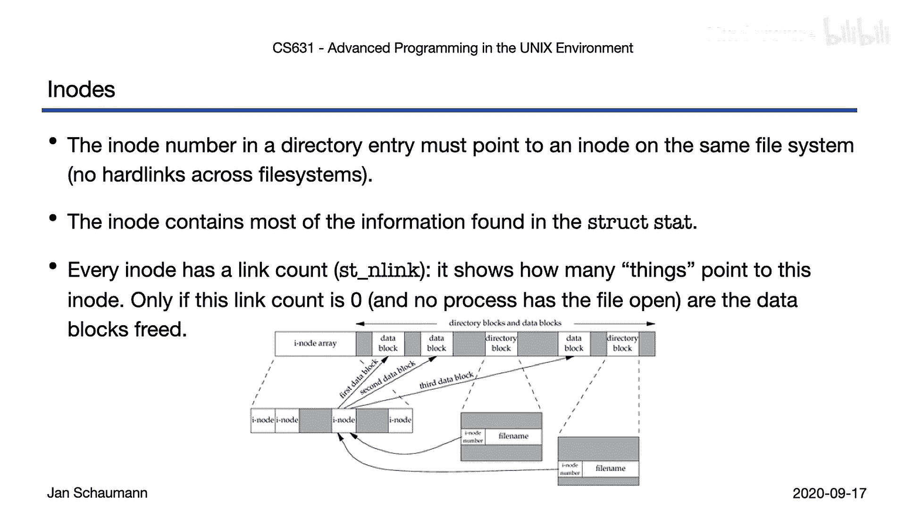
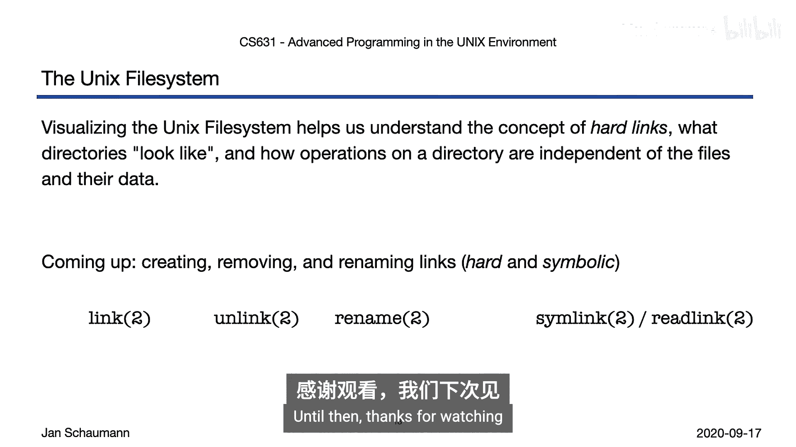

# 016：Week 04, Segment 1 - Unix文件系统 📂

在本节课中，我们将深入学习Unix文件系统和目录的核心概念，这些内容主要基于W. Richard Stevens的《APUE》教材第4章和第6章。我们将通过可视化数据结构来理解文件系统的组织方式、硬链接、目录结构及其相关操作。



---

## 磁盘与分区 💽



上一节我们回顾了文件系统的基本属性，本节中我们来看看文件系统在物理存储上是如何组织的。

首先，考虑一个硬盘。硬盘可以被划分为多个分区。分区有不同的类型，例如BIOS分区表或操作系统特定的分区。在我们的参考虚拟机（运行NetBSD）上，可以使用`disklabel`命令查看分区表。

```
disklabel sd0
```

命令输出会描述物理（或虚拟）磁盘的信息，包括物理块大小（通常是512字节）以及各个分区的起始和结束扇区。例如，系统可能包含一个根分区（如`a`分区）用于整个文件系统，以及一个较小的交换分区（如`b`分区）。



---



## 文件系统结构 🏗️

创建分区表后，我们可以在每个分区上创建文件系统（交换分区除外，它直接使用原始磁盘空间进行内存交换）。

文件系统将存储空间组织成**柱面组**，并通过一个称为**超级块**的结构来管理这些组。超级块包含了整个文件系统的关键信息。



```
struct superblock {
    // ... 文件系统元数据，如大小、块数、inode数等
};
```

由于超级块至关重要，文件系统会在多个柱面组中复制它，以便在原始超级块损坏时进行恢复。



每个柱面组包含：
*   **数据块**：用于存储文件的实际字节内容。
*   **inode表**：用于存储文件元数据（即`struct stat`中的信息）的结构列表。
*   **用于inode和数据块的位图**：用于跟踪块的使用情况。

文件的实际数据（文件内容）和其元数据（inode信息）是分开存储的。

---

## Inode与硬链接 🔗



让我们回顾一个关键概念：文件名并不存储在文件的inode中。文件名是作为**目录项**存储的。

一个将文件名映射到inode的目录项被称为**硬链接**。我们可以这样理解：文件名本身就是指向inode的一个硬链接。因此，同一个inode可以有多个来自不同目录（或同一目录下的不同文件名）的硬链接。

例如，inode 123可能同时被以下链接指向：
*   目录`/home/user`中的文件`data.txt`
*   目录`/var/backup`中的文件`data_backup.txt`

这两个路径指向磁盘上完全相同的数据块。

---

## 目录详解 📁

目录在文件系统中是一种特殊类型的文件，其内容是一系列目录项，每个项将一个名字映射到一个inode编号。

以下是目录的核心组成部分：



*   **`.` （点）**：指向目录自身的硬链接。
*   **`..` （点点）**：指向父目录的硬链接。
*   **其他条目**：目录中包含的文件和子目录的硬链接。

每个目录至少有两个硬链接：一个是自身的`.`，另一个是其在父目录中的条目名。因此，目录的链接数（`st_nlink`）至少为2。

`st_dev`（设备号）和`st_ino`（inode号）组合在一起，才能在全系统范围内唯一标识一个文件，因为不同文件系统（分区）中可能存在相同的inode编号。

---

## 文件操作与硬链接 ⚙️

理解了上述结构后，我们就能明白一些文件操作的底层原理：

*   **移动（重命名）文件**：在**同一个文件系统内**移动文件是一个非常快速的操作，因为它不涉及复制数据。实际上，它只是：
    1.  在目标目录创建一个新的硬链接（目录项）。
    2.  从源目录删除旧的硬链接。
    整个过程无需触碰文件的实际数据块。
*   **跨文件系统移动文件**：这需要真正复制文件数据到目标文件系统，然后删除源文件，因此速度较慢。
*   **删除文件**：当删除一个文件（即移除其最后一个硬链接）且没有进程打开它时，其inode和数据块才会被标记为可重用。



---

## 实践与思考 💡

本节我们一起学习了Unix文件系统的逻辑结构和硬链接机制。建议你在终端中实践以下命令，观察inode号和链接计数的变化：

```
mkdir test_dir
cd test_dir
touch file1
ls -li
ln file1 file2  # 创建硬链接
ls -li
```

同时思考一些边界情况，例如：文件系统根目录`/`的父目录是什么？它的`.`和`..`条目指向哪里？

在下一节视频中，我们将探讨用于创建、删除、重命名目录和链接（包括符号链接）的系统调用，并通过更多实例加深理解。

本节课中，我们一起学习了：
1.  磁盘分区与文件系统的物理布局。
2.  Inode、数据块和超级块的作用。
3.  **硬链接**的本质及其与目录的关系。
4.  目录中`.`和`..`条目的含义。
5.  基于硬链接机制的文件移动和删除原理。



这些知识是理解更高级文件操作和系统编程的基础。