# 017：硬链接与符号链接

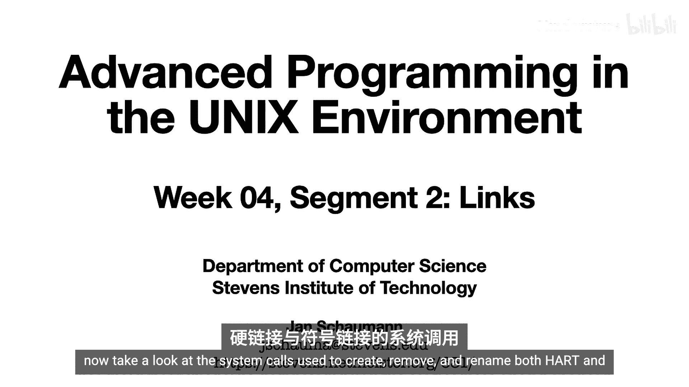

在本节课中，我们将学习用于创建、删除和重命名硬链接与符号链接的系统调用。上一节我们通过图示了解了文件系统如何处理目录和链接，本节我们将具体探讨相关的系统调用。

## 创建硬链接

要创建一个新的硬链接，可以使用 `link` 系统调用。

*   `link` 系统调用接收两个路径名作为参数，而不是文件描述符。这与我们在第二周讨论的其他 I/O 系统调用有所不同。
*   这很合理，因为硬链接是文件名与 inode 号之间的映射。更明确地说，硬链接是一个目录项，因此独立于文件描述符。
*   其次，为了创建硬链接，源文件必须存在。
*   `link` 调用完成后，会增加目标文件的链接计数。

与我们已经见过的其他系统调用类似，我们也有 `linkat` 变体，用于原子地处理当前工作目录之外的相对路径名。

以下是关于硬链接的重要限制：

*   在 UNIX 文件系统上，创建新链接会将文件名映射到 inode 号。inode 号是文件系统特定的，因此**不能创建指向另一个文件系统的硬链接**。POSIX 标准允许这样做，但大多数 UNIX 系统并未实现跨文件系统的硬链接。
*   其次，**不允许创建指向目录的硬链接**，除非有效用户 ID 为 0（即 root 用户）。原因是多个硬链接在遍历文件系统时无法区分，指向目录的硬链接可能导致文件系统层次结构出现循环，从而引发文件系统损坏。

以上两点限制也是发明符号链接的部分原因，符号链接的行为与硬链接有很大不同。

## 删除硬链接

删除硬链接通过 `unlink` 系统调用完成。

*   正如 `link` 会增加链接计数，`unlink` 会减少链接计数。
*   链接计数帮助系统确定何时可以释放文件的数据块。
*   由于文件系统上可以有多个名称指向同一个 inode，在确定数据块不再需要之前，系统不能覆盖它们。
*   这通过检查链接计数是否为 0 来实现。但仅此还不够。一个进程 P 可能已经打开了该文件，之后该目录项被此进程或其他进程删除。此时文件的链接计数为 0，但如果允许覆盖数据块，进程 P 已打开的文件描述符上的 I/O 操作可能会不一致。
*   因此，系统只有在链接计数为 0 **且** 没有进程持有此文件的打开文件句柄时，才会释放数据块。

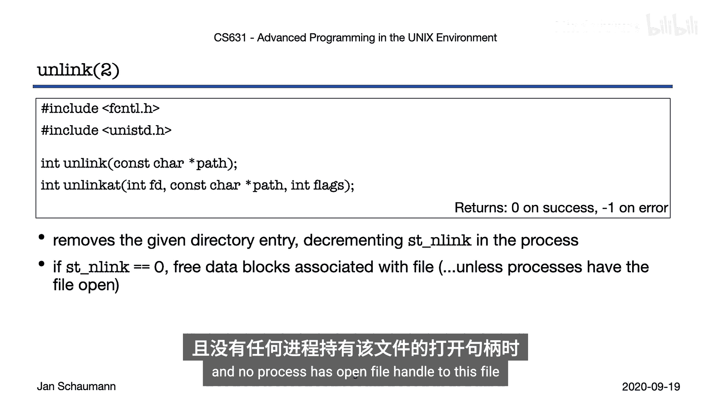

### 实践演示

以下程序演示了在添加和删除硬链接时，可用磁盘空间的变化。

```c
// 示例代码：展示创建文件、硬链接、打开后unlink对磁盘空间的影响
#include <stdio.h>
#include <unistd.h>
#include <fcntl.h>
#include <sys/stat.h>

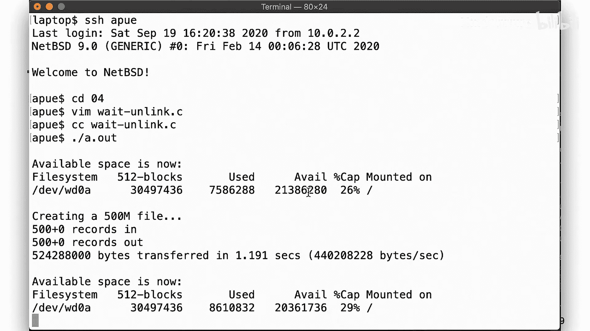

int main() {
    // 1. 显示当前可用空间
    system("df .");

    // 2. 创建一个 500MB 的文件
    system("dd if=/dev/zero of=foo bs=1M count=500 2>/dev/null");
    system("df .");

    // 3. 创建第二个硬链接
    system("ln foo bar");
    system("ls -li foo bar");
    system("df .");

    // 4. 打开文件并立即 unlink
    int fd = open("foo", O_RDONLY);
    unlink("foo");
    system("ls -li foo bar 2>/dev/null || echo 'foo not found'");
    system("df .");

    // 5. 删除第二个链接
    unlink("bar");
    system("ls -li foo bar 2>/dev/null || echo 'foo and bar not found'");
    system("df .");

    // 6. 关闭仍打开的文件描述符
    close(fd);
    system("df .");

    return 0;
}
```

程序运行逻辑如下：

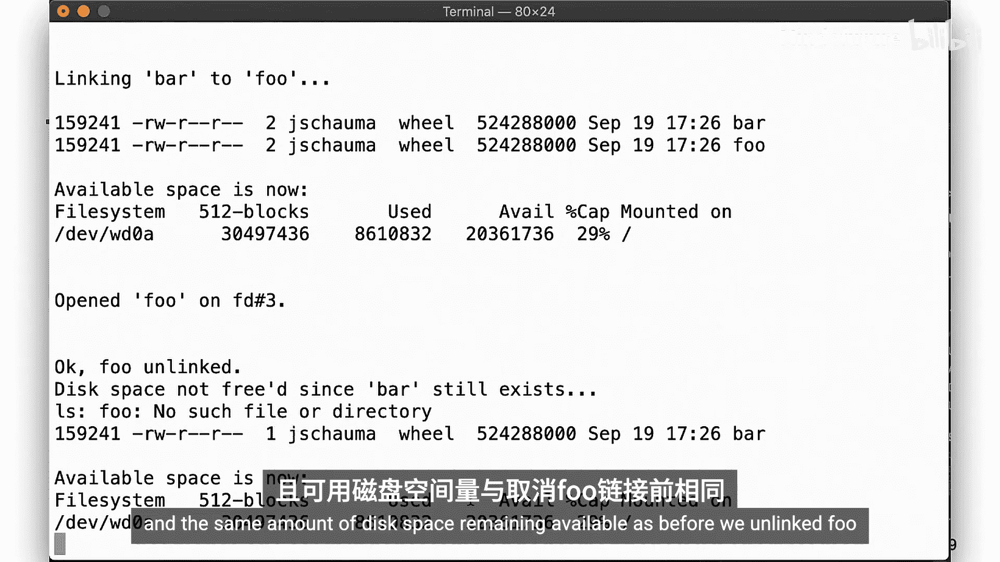

1.  初始显示可用磁盘空间。
2.  创建 500MB 文件 `foo`，磁盘空间减少。
3.  创建硬链接 `bar` 指向 `foo`。`ls -li` 显示两者 inode 号和链接计数相同（为2）。磁盘空间未变化。
4.  打开 `foo` 文件，然后立即 `unlink("foo")`。此时，`foo` 的目录项被删除，链接计数减为1，但我们仍持有该文件的打开描述符。磁盘空间仍未释放。
5.  删除第二个链接 `bar`。链接计数变为 0，但因为我们仍持有打开的描述符，数据块仍未释放。
6.  关闭文件描述符。此时，链接计数为 0 且无打开句柄，系统释放数据块，磁盘空间恢复。

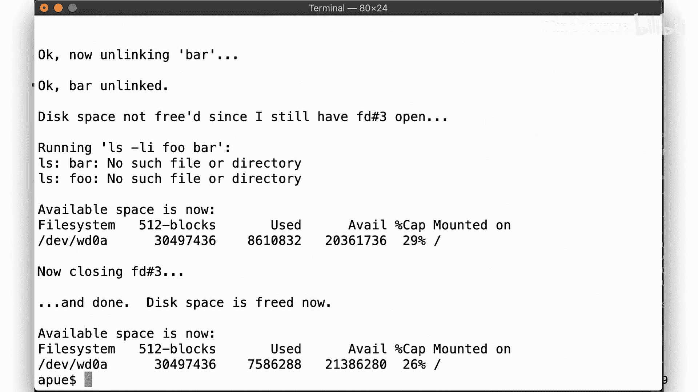

这个演示说明，我们通常所说的“删除文件”，实际上只是删除了指向该文件的**目录项**。数据块只有在没有链接且没有进程使用时才会被真正释放。这也是为什么即使误删了文件，数据通常仍能从磁盘恢复。

## 重命名文件与目录

在同一个文件系统内重命名文件，使用 `rename` 系统调用，其行为符合直觉：

*   如果 `from` 是一个文件，`to` 不存在，则简单地创建一个新链接 `to`，然后取消链接 `from`（这些操作是原子性的）。
*   如果 `to` 存在且是一个文件，则先取消链接 `to`，然后将 `from` 链接到 `to`，最后取消链接 `from`。
*   如果试图将文件重命名为一个目录，会出错。`mv` 命令将文件移动到目录下的行为是程序为满足用户期望而提供的便利，并非 `rename` 系统调用的功能。
*   显然，我们需要对进行更改的目录拥有写权限。

重命名目录的行为大致相同：

*   可以将目录重命名为另一个**空**目录。如果目标目录非空，则出错。
*   将目录重命名为文件没有意义，会出错。
*   同样需要受影响目录的写权限。
*   对于目录，还有一个边界条件：**不能将目录重命名为其自身的前缀**（例如，不能将 `/a/b` 重命名为 `/a/b/c`）。

`rename` 也不能跨文件系统工作。

## 符号链接

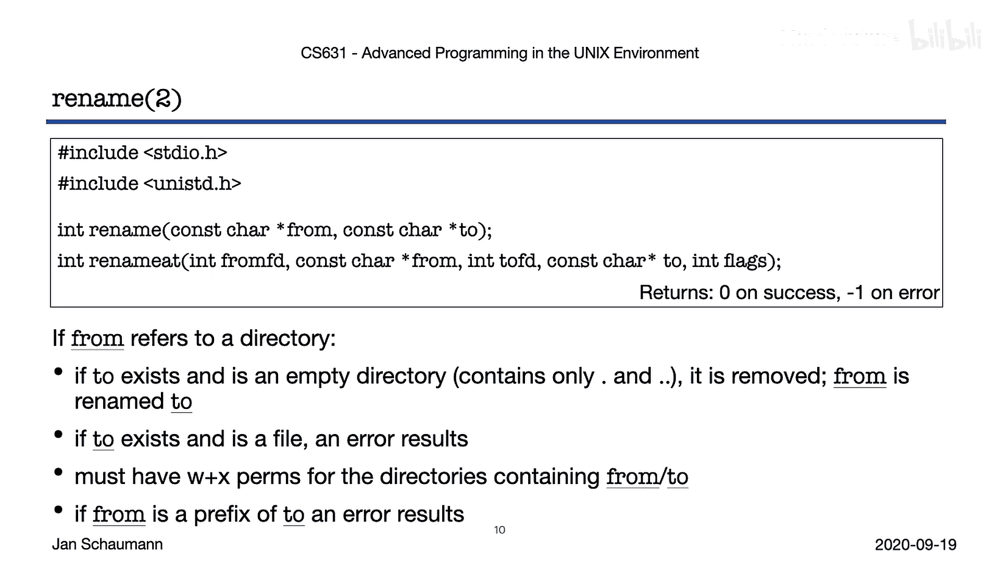

你已经看到了硬链接的一些限制：不能跨文件系统链接，不能创建指向目录的链接。有时这些功能很有用，因此我们有了 `symlink` 系统调用。

`symlink` 创建一个符号链接，这是一个特殊文件，其内容仅包含另一个文件的路径名。操作系统在遇到符号链接时会说：“嘿，别看我，看那个家伙。”

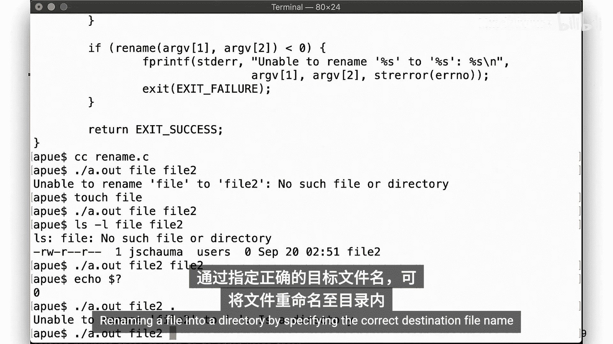

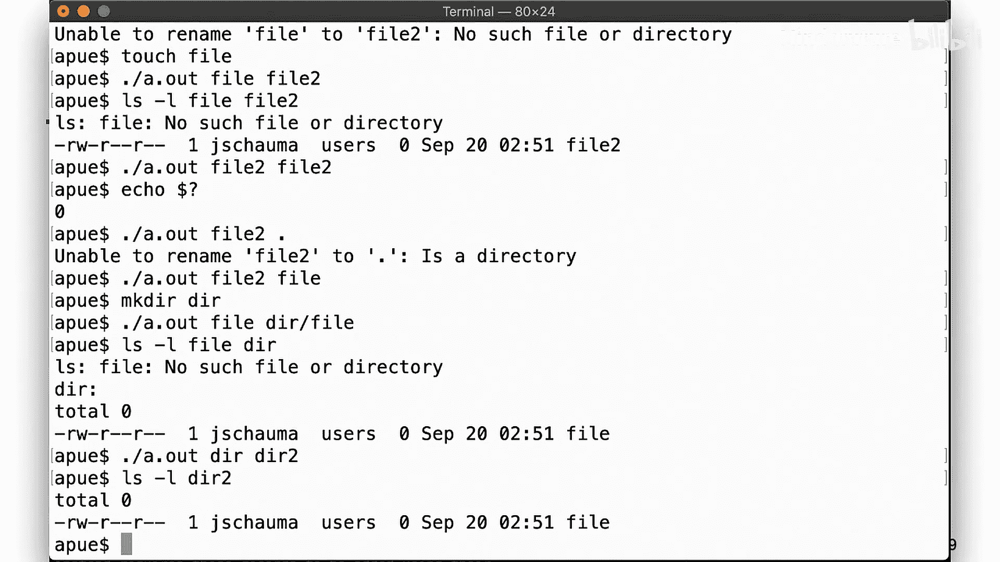

符号链接的优点在于：

*   可以创建指向任何类型文件的符号链接，包括不存在的文件或目录。
*   当你想获取符号链接本身的信息（而不是它引用的目标）时，需要使用 `l` 系列函数，如 `lstat`、`lchown`、`lchmod` 等。

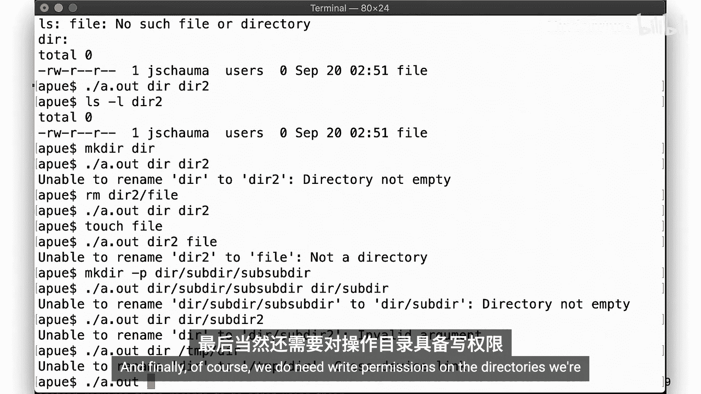

### 符号链接示例

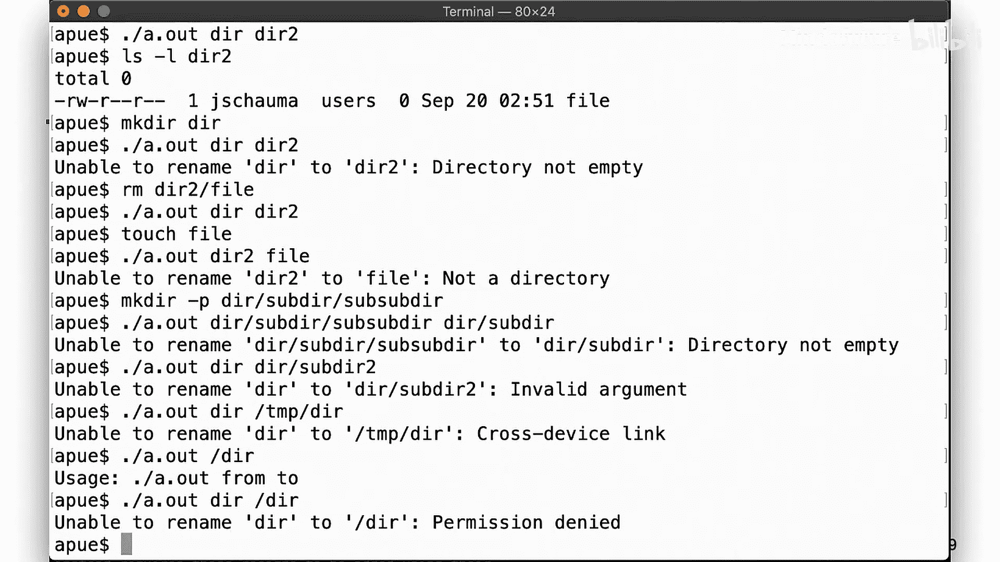

以下是一个最简单的 `ln -s` 命令实现：

```c
// 示例：创建符号链接
#include <unistd.h>

int main(int argc, char *argv[]) {
    if (argc != 3) {
        // 错误处理
        return 1;
    }
    symlink(argv[1], argv[2]); // argv[1]是目标，argv[2]是链接名
    return 0;
}
```

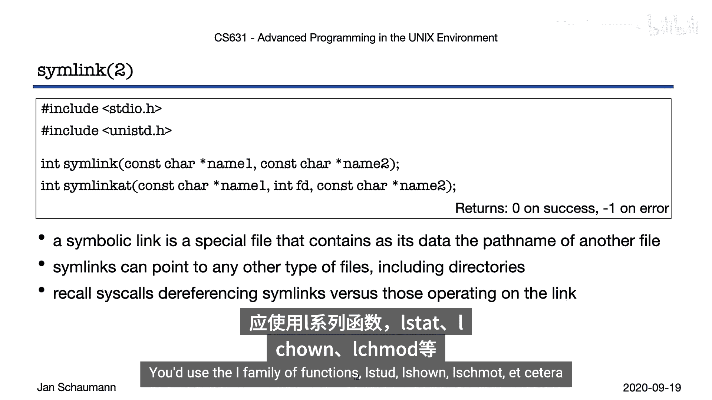

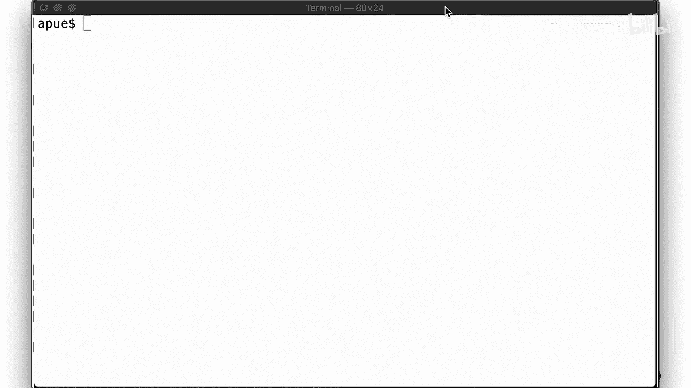

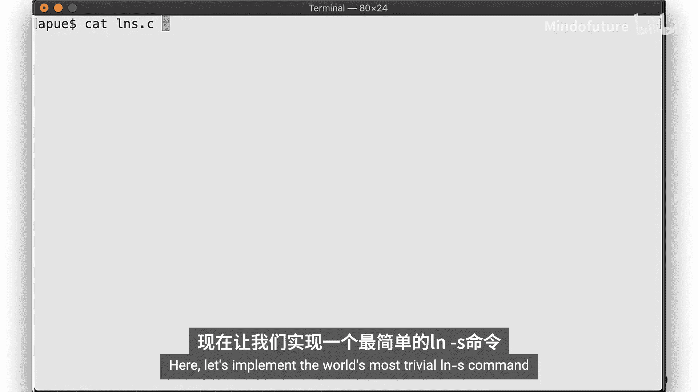

使用符号链接时：

*   可以创建指向不存在文件的符号链接，操作成功。但操作该链接文件会提示目标不存在。
*   一旦创建了符号链接的目标文件，操作链接文件就会成功。
*   符号链接可以指向另一个符号链接，操作时会递归解引用。
*   这可能导致创建符号链接的循环链（A->B->C->A）。幸运的是，文件系统会检测到这种情况并报错，而不是陷入无限解引用循环。
*   可以创建指向子目录的符号链接，但这可能导致路径遍历时出现奇怪现象（例如，`..` 指向可能不符合预期）。
*   **与硬链接不同，可以创建跨文件系统的符号链接**，因为符号链接只包含一个路径名字符串。

### 读取符号链接内容

对符号链接的操作通常会解引用到目标。但像 `ls -l` 这样的命令如何知道链接指向哪里呢？调用 `open` 会打开目标文件，没有 `lopen` 调用。

为此，有一个特殊的系统调用 `readlink`，用于获取类型为符号链接的文件内容（即它指向的路径）。

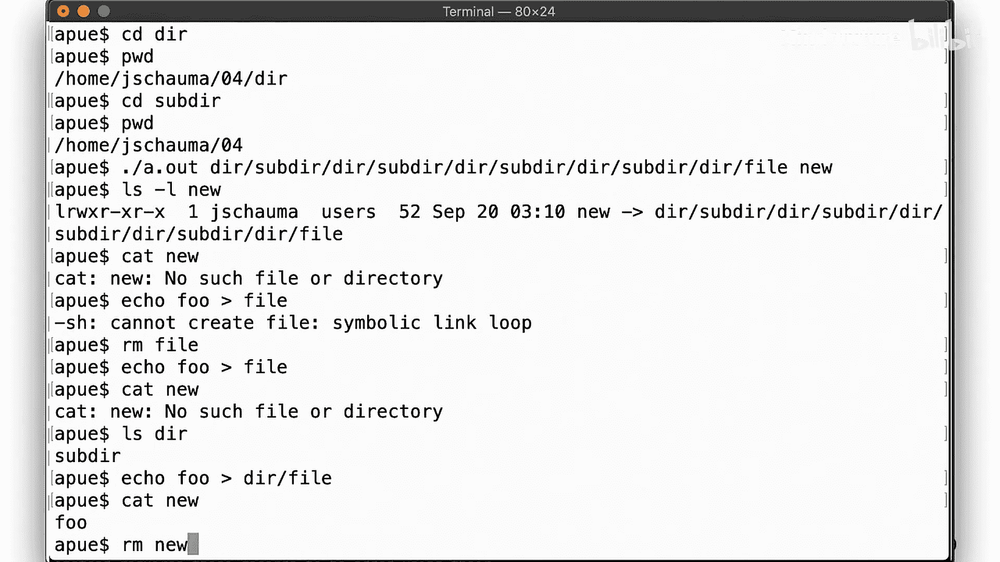

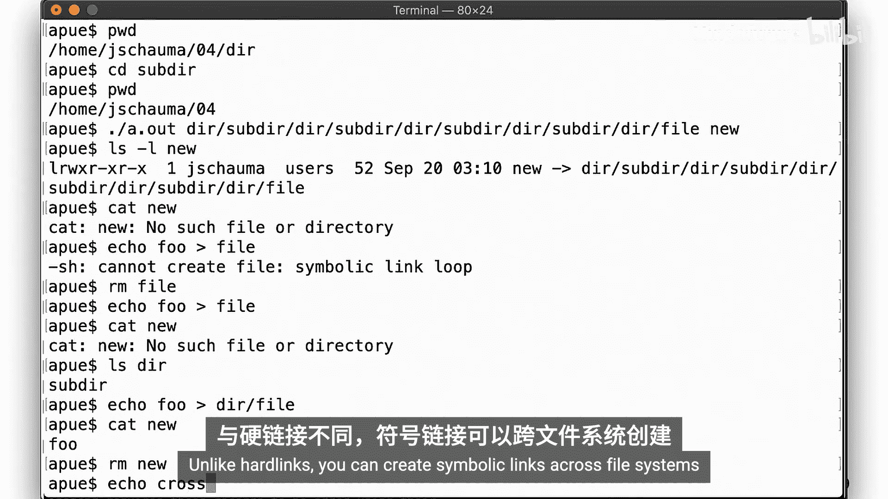

```c
ssize_t readlink(const char *restrict pathname, char *restrict buf, size_t bufsize);
```

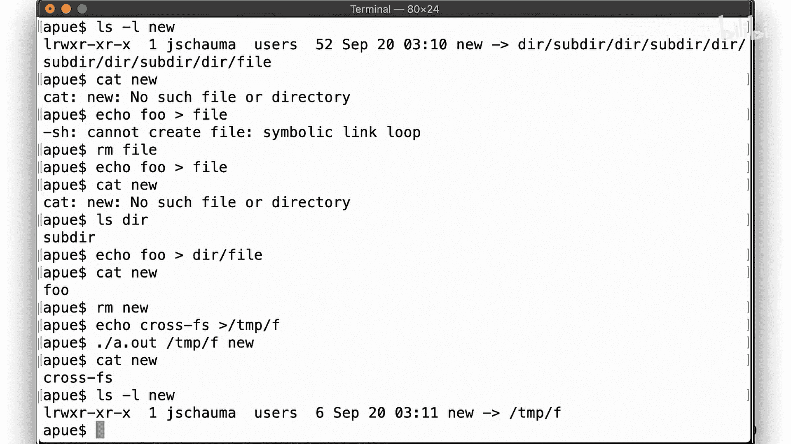

你需要处理适当大小的缓冲区，并告诉系统填充缓冲区。**注意，此缓冲区的内容不是空字符终止的**，这意味着你必须自己确保正确处理字符串。如果你想实现类似 `ls -l` 显示符号链接目标的功能，就需要使用 `readlink`。

## 总结

本节课我们一起学习了硬链接与符号链接的系统调用。

*   我们了解了如何使用 `link` 和 `unlink` 创建和删除硬链接，并理解了链接计数在决定何时释放数据块中的关键作用。
*   我们探讨了 `rename` 系统调用如何在文件系统内高效地重命名文件和目录。
*   我们学习了符号链接（`symlink`）如何克服硬链接的限制，可以指向任意目标，包括跨文件系统的目标。
*   我们还了解了如何用 `readlink` 读取符号链接本身的内容。

回顾这几节的内容，你现在应该能够实现更多常见的 UNIX 命令，特别是 `ln`、`mv` 和 `rm`。记住，在文件系统内移动文件是快速且独立于数据块的，而跨文件系统边界则需要复制数据。尝试自己动手，更创造性地使用符号链接，观察可能引发的意外行为或输出。

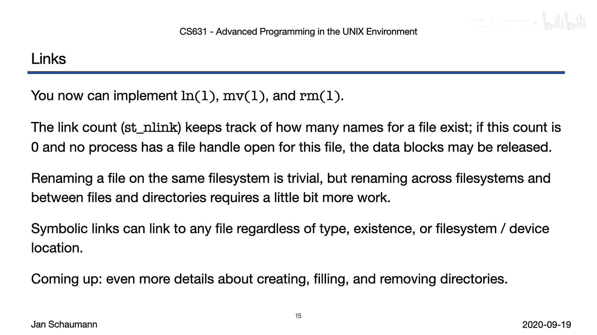

在下一个视频片段中，我们将更深入地探讨目录的结构，以及如何创建和删除目录。