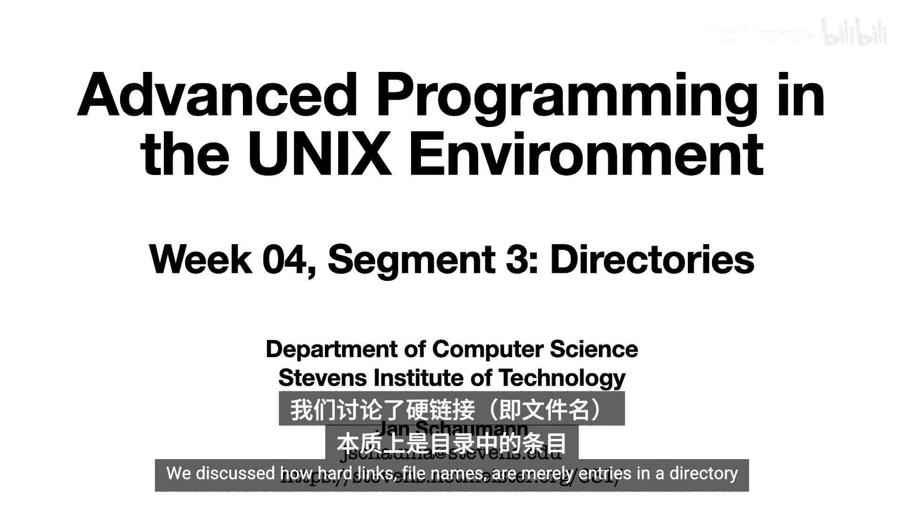
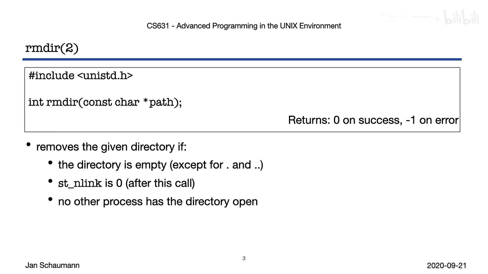
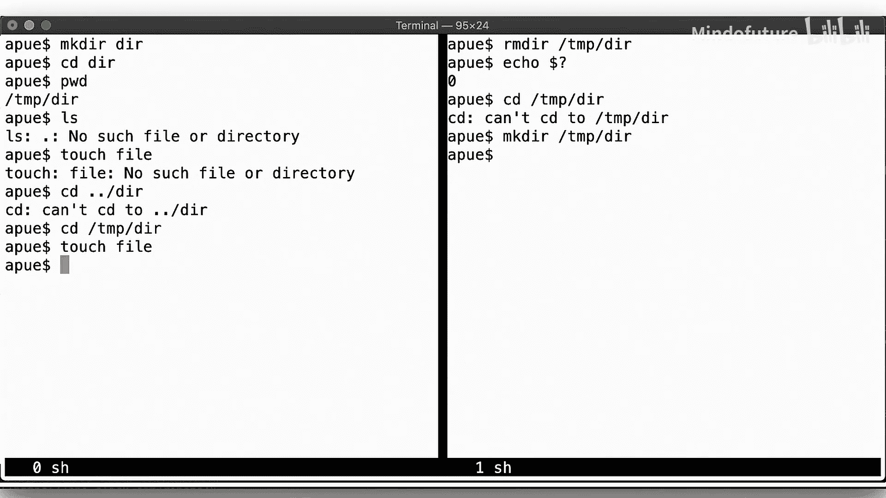
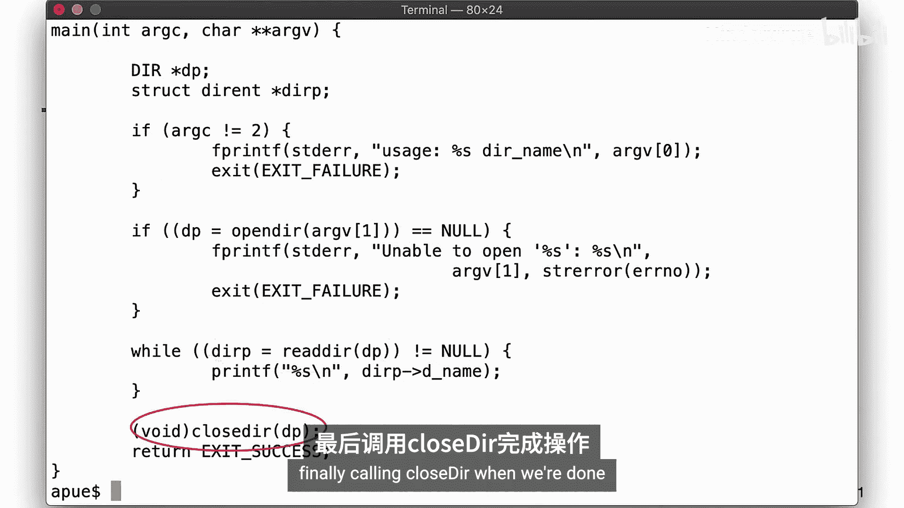
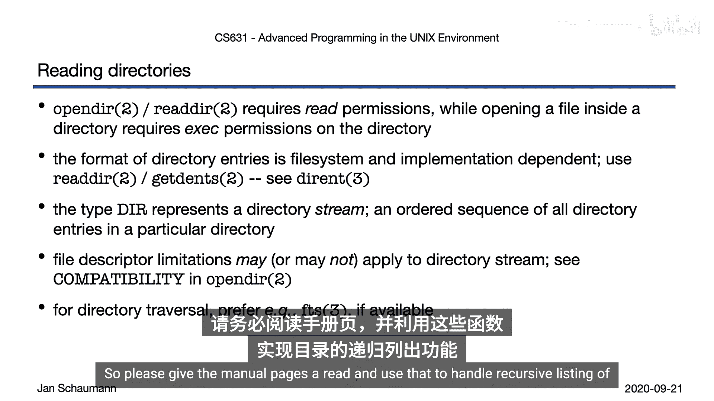
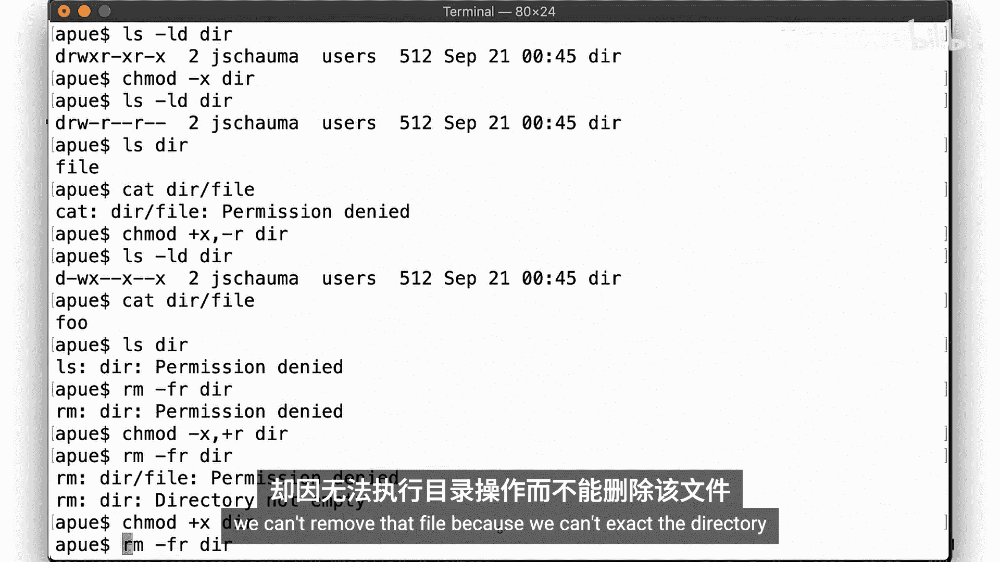
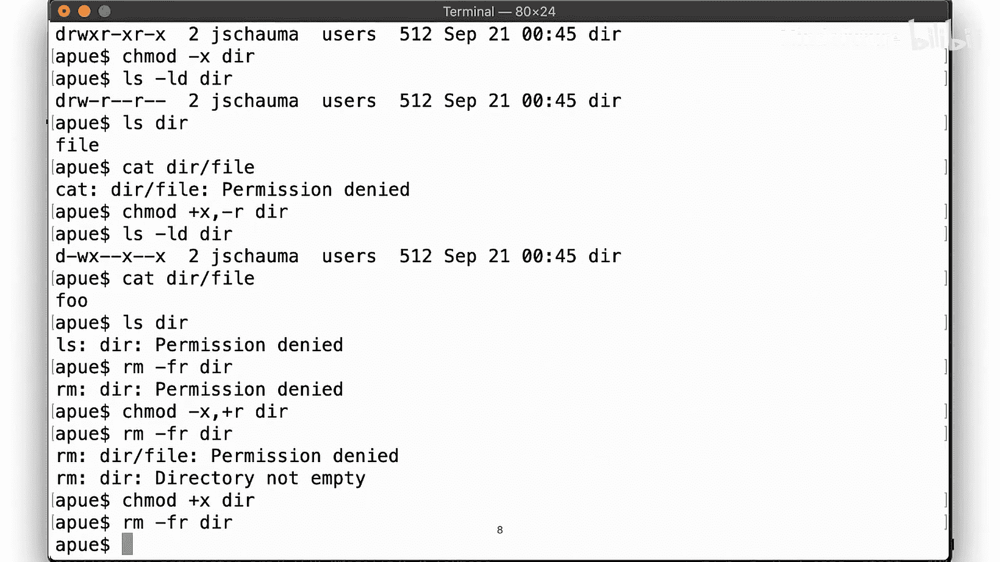
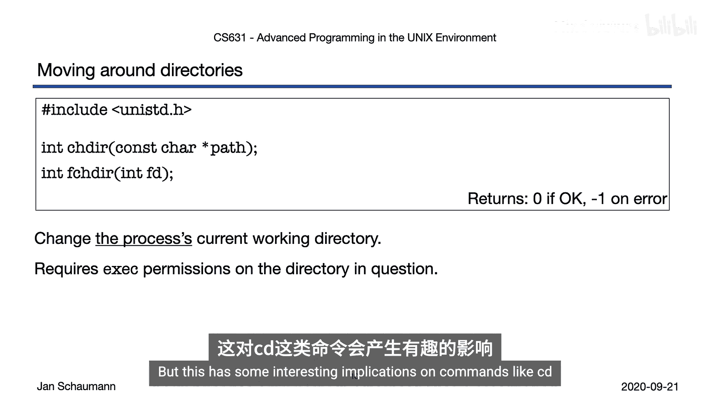
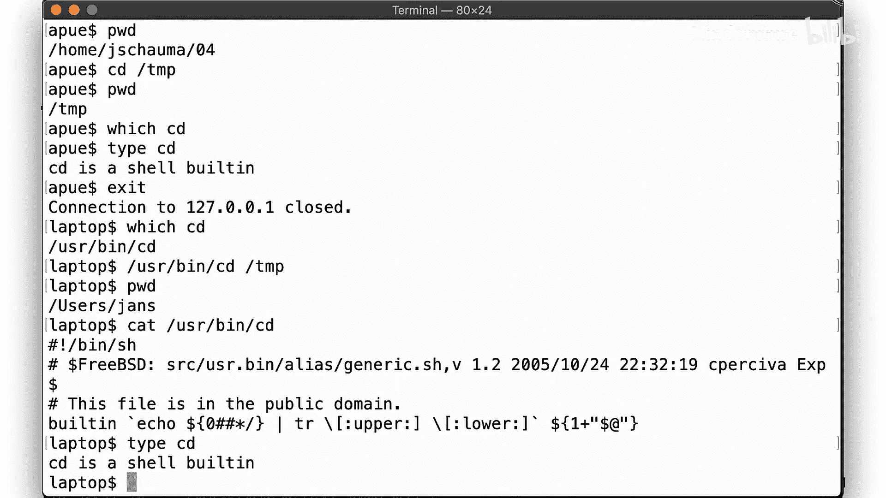
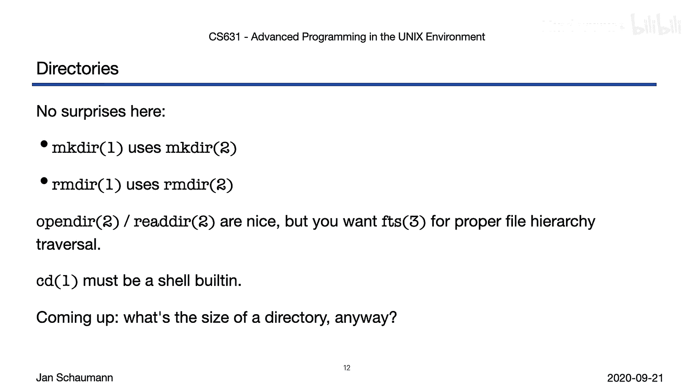

# 018：目录操作 📁



在本节课中，我们将学习如何在UNIX环境中创建、删除和读取目录。我们还将探讨进程的当前工作目录概念，以及相关系统调用的使用和注意事项。

上一节我们介绍了创建硬链接和符号链接。我们了解到，文件名本质上是目录中的条目。本节中，我们来看看如何创建目录。

## 创建目录

创建目录非常简单。只需调用 `mkdir` 系统调用。



```c
int mkdir(const char *pathname, mode_t mode);
```

`mkdir` 会创建一个新的空目录，其中仅包含必要的条目 `.` 和 `..`。新目录的权限由 `mode` 参数指定，但会受进程的当前 `umask` 值修改，这与创建新文件时的规则相同。目录的所有权遵循与之前讨论的文件所有权相同的语义，具体取决于所使用的UNIX版本。

## 删除目录



删除目录也不复杂，调用 `rmdir` 即可。

```c
int rmdir(const char *pathname);
```



`rmdir` 会删除给定的目录，前提是该目录是空的（即只包含 `.` 和 `..`）。如果目录为空，它将被删除，并且其父目录的链接计数会减1。如果此调用后链接计数变为零，并且没有其他进程打开此目录，则该目录将被移除。

关于目录，还存在进程将其作为当前工作目录打开的情况。删除这样的目录会导致一些令人困惑的情况。

## 读取目录

读取目录的操作应该从我们第一讲中简单的 `ls` 克隆程序里看起来很熟悉。

首先，我们调用 `opendir` 来打开目录的一个句柄。然后，通过反复调用 `readdir` 来遍历目录中的条目。最后，操作完成后调用 `closedir`。

```c
DIR *opendir(const char *name);
struct dirent *readdir(DIR *dirp);
int closedir(DIR *dirp);
```

需要注意的是，我们从目录获取条目的顺序对我们来说是不透明的。条目不以任何方式排序，或者即使排序，也是文件系统实现相关的、我们不能依赖的方式。

打开目录并列出其内容需要对该目录拥有读权限。然而，访问目录内的任何文件，正如上一节讨论的，需要对该目录拥有执行（或搜索）权限。



读取目录应始终使用 `readdir` 或 `getdents`，因为目录条目的实现是文件系统相关的。相关结构记录在 `dirent` 手册页中。

当你打开目录时，会得到一个 `DIR` 句柄，它将目录表示为一个流，意味着条目以有序的方式返回给你。但你不能假设这个顺序是可预测的，例如按字母顺序或按目录条目创建时间。目录内部的顺序对你是透明的。

虽然你可以通过一系列 `opendir`、`readdir` 和 `closedir` 调用来执行文件系统层次结构的遍历，但这很快就会变得非常复杂。相反，建议你查看 `FTS` 库函数，特别是对于你的 `ls` 期中项目。`FTS` 库函数底层确实调用了 `opendir` 等系统调用，但提供了许多额外的便利。这些文件层次遍历函数不能保证在所有UNIX版本中都可用，但幸运的是，它们在你们的目标平台上可用。



## 目录权限边界情况



以下是处理目录时的一些权限边界情况。

假设目录中有一个文件。如果我们从目录中移除执行权限，我们仍然能够列出其内容（即打开目录并调用 `readdir` 可以在没有执行权限的情况下工作）。然而，访问目录内的文件会失败，因为我们没有权限执行或搜索该目录。

如果我们更改权限以允许执行但移除读权限，那么尽管无法读取目录，我们仍然可以访问目录内的文件。但列出目录内容会失败。可能出乎意料的是，删除目录也会失败，因为我们无法打开它来查看其中是否有文件。

如果我们翻转权限，我们可以打开目录，看到里面有一个文件，但我们无法删除那个文件，因为我们不能执行该目录。由于无法删除文件，目录就不会为空，因此我们无法删除它。换句话说，要递归删除目录，我们需要同时拥有读和执行权限。

## 当前工作目录



我们已经看到，在进入一个目录后，我们可能拥有该目录的打开文件句柄，这引入了当前工作目录的概念，我们在学期早些时候提到过每个进程都有一个当前工作目录。

要获取当前工作目录，可以调用 `getcwd`。例如，`pwd` 命令以及大多数shell中的特殊变量都是这样做的。

我们刚刚也看到了如何通过 `cd` 命令更改当前工作目录，那么这是如何工作的呢？

要更改当前进程的当前工作目录，可以调用 `chdir`。如前所述，你需要对目标目录拥有执行权限，否则无法更改到该目录。

需要注意的是，当前工作目录是按进程设置的。也就是说，如果我们回想第一讲中的简单shell，当我们在shell中执行命令时，通常会 `fork` 一个新进程，然后执行二进制文件并返回。但这对于像 `cd` 这样的命令有一些有趣的影响。

让我们尝试实现一个 `cd` 程序。这并不特别困难。但当我们运行它时，会发现虽然程序内部成功调用了 `chdir`，但父进程（shell）的当前工作目录并没有改变。这是因为 `chdir` 只能影响当前进程，而不能影响父进程。

那么为什么shell内置的 `cd` 命令能工作呢？实际上，并没有一个独立的 `cd` 可执行文件。相反，`cd` 命令是内置在shell中的，这意味着shell不会为了运行它而 `fork` 一个新进程，它是在当前shell进程内调用的。事实上，`cd` 必须是shell内置命令才能正常工作。



但事情变得有点奇怪。在macOS上，确实存在一个 `/usr/bin/cd` 命令，但尝试使用它同样无法改变父shell的目录。那么，这个程序有什么用呢？事实证明，POSIX标准要求存在一个名为 `cd` 的独立实用程序。所以，如果你想成为一个符合POSIX标准的UNIX系统，你必须提供这个命令，即使它不起作用，因此完全没用。你仍然必须在你的shell中提供一个 `cd` 内置命令，以便实际更改当前工作目录，但同时你也会附带一个无用的实用程序来遵守一个无意义的标准。

## 总结

本节课中我们一起学习了：
*   创建目录：调用 `mkdir`。
*   删除目录：调用 `rmdir`。
*   遍历文件系统层次结构：可以使用 `opendir`、`readdir`，但对于期中项目，应使用 `FTS` 库。
*   当前工作目录特定于当前进程，更改当前工作目录只能在同一个进程内生效，这就是为什么 `cd` 必须始终是shell内置命令，而不能是一个标准的可执行文件，即使你的操作系统可能附带一个。



在下一节中，我们将看看目录的大小，你会发现它们可能比你最初想象的要复杂一些。