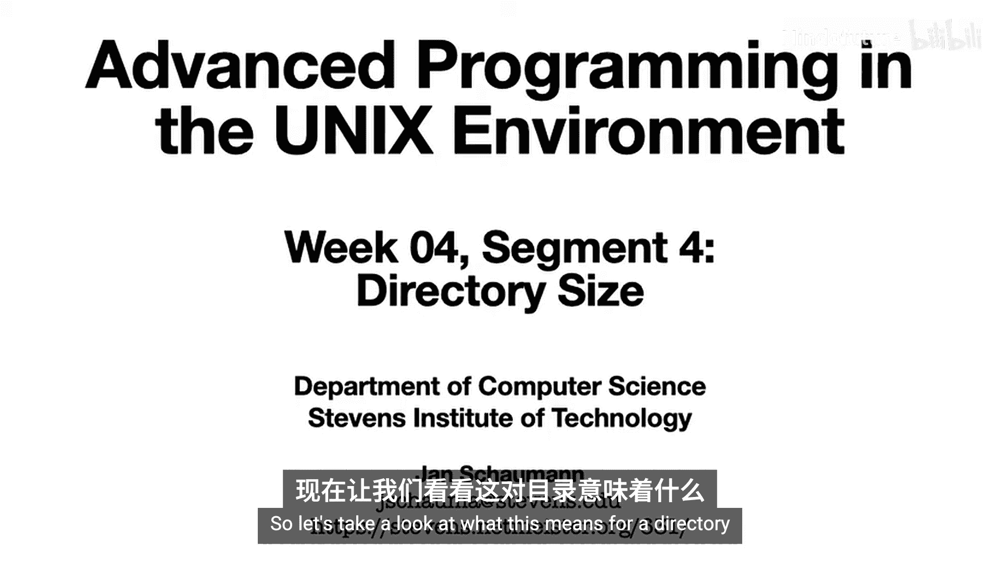
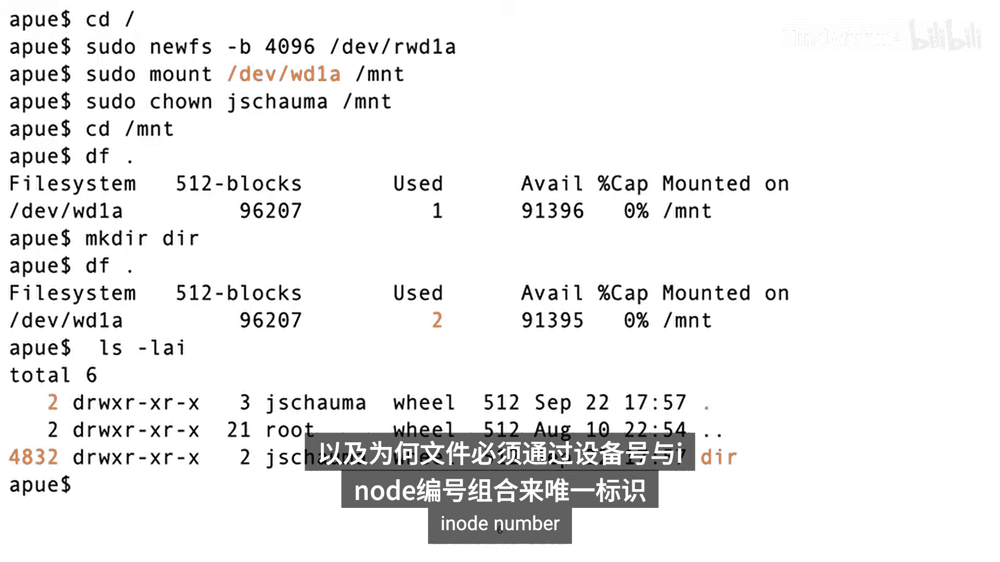
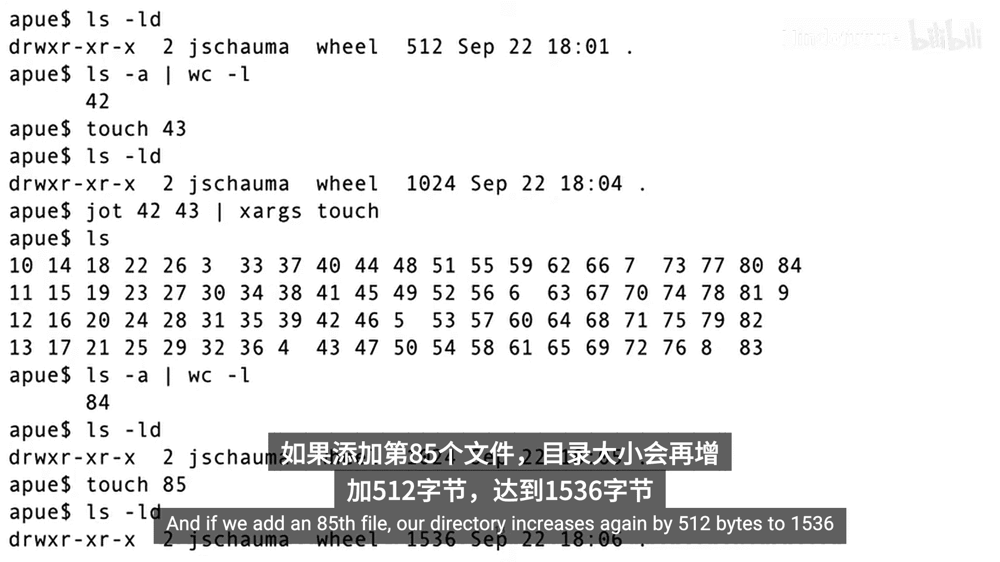
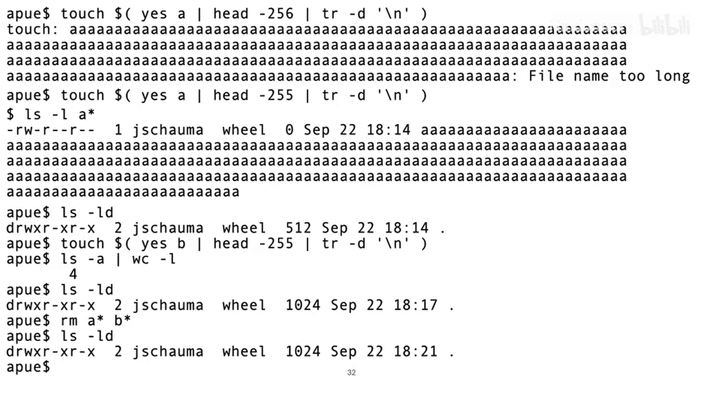
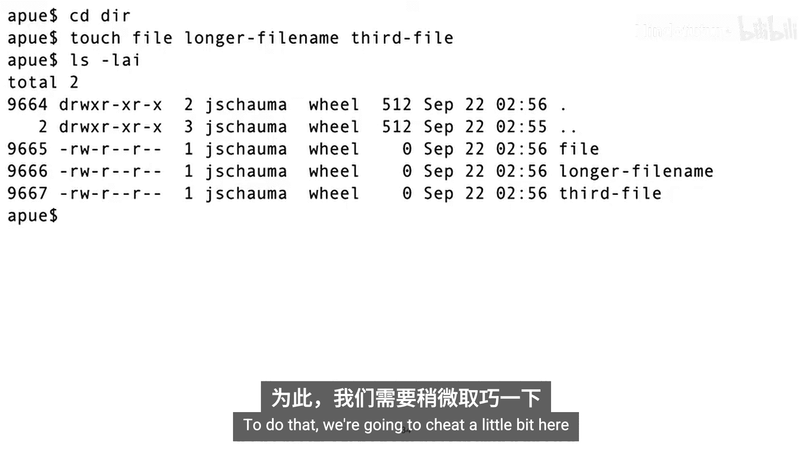
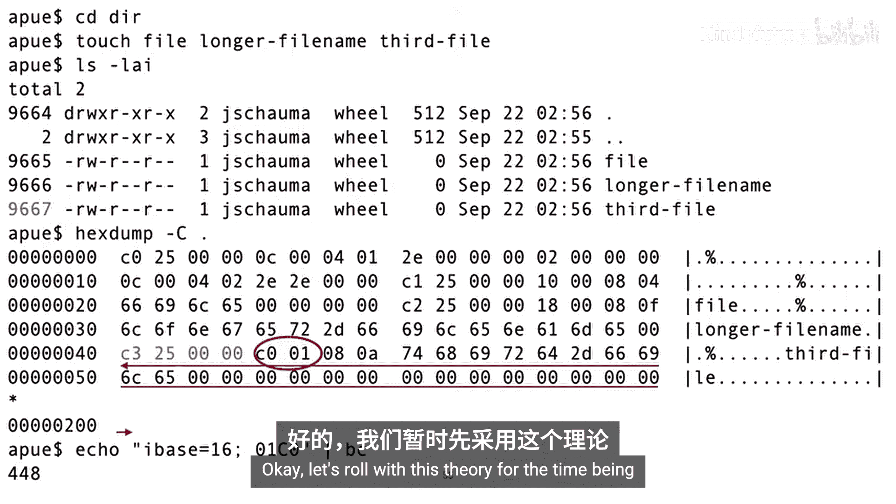
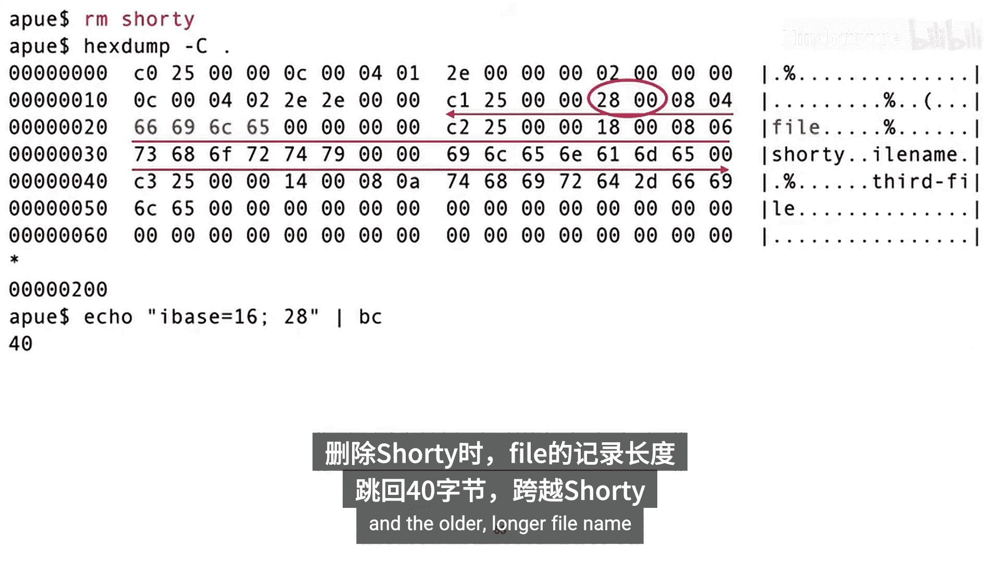
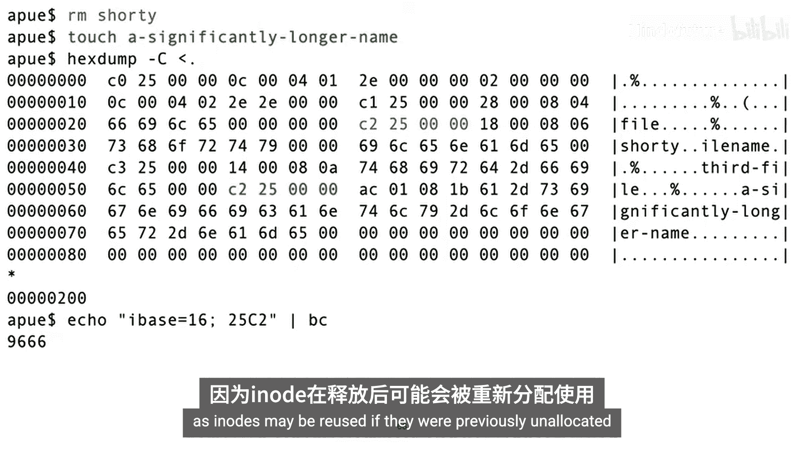
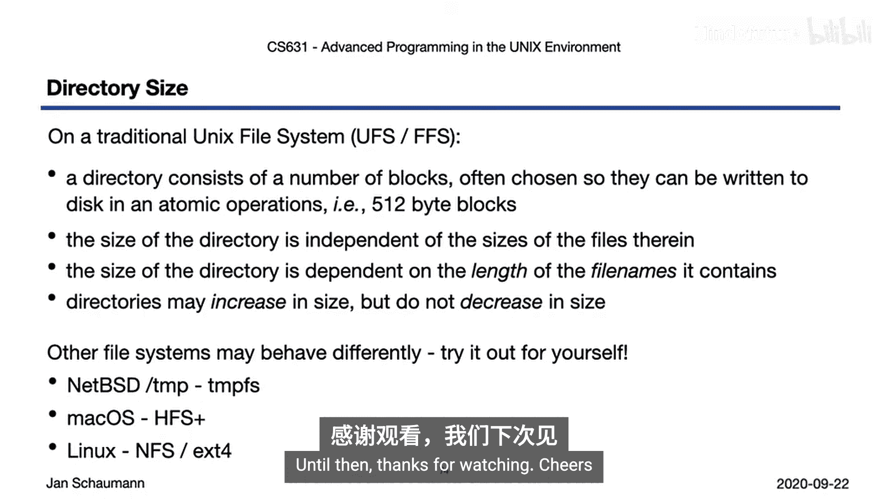

# 019：目录大小 📁



在本节课中，我们将要学习目录在文件系统中的大小是如何确定的。我们将探讨目录大小与其中文件数量、文件名长度的关系，并深入了解目录在磁盘上的内部组织结构。

上一节我们介绍了硬链接和文件大小（`st_size`）的概念。本节中我们来看看这些概念如何应用于目录。

## 不同类型文件的大小 📊

首先，回顾一下不同类型文件的“大小”含义。



*   **管道（FIFO）和套接字（Socket）**：文件大小始终为 **0**。它们仅用作进程间通信的汇合点，内核在进程间传递数据，这些数据从不写入磁盘。
*   **普通文件（Regular File）**：大小就是其包含的字节数。例如，包含三个星号和一个回车符的文件大小为 **4** 字节。
*   **符号链接（Symbolic Link）**：其“内容”是目标文件的路径字符串。例如，指向 `/wherever` 的符号链接大小为 **9** 字节（不包含结尾的空字符）。
*   **设备文件（Device）**：`ls -l` 命令不显示大小字段，而是显示设备的主次设备号。

## 目录的初始大小 🔍

现在让我们关注目录。为了观察，我们使用一个新建的空文件系统。

在一个空文件系统上创建一个新目录后，`ls -ld` 显示其大小为 **512** 字节。这个目录并非真正“空”，它包含两个默认条目：`.`（当前目录）和 `..`（父目录）。



有趣的是，`.` 和 `..` 可能拥有相同的 inode 编号。例如，在新挂载的文件系统根目录中，`.` 和 `..` 都指向该文件系统的根 inode（编号为2）。这说明了为什么不能跨文件系统创建硬链接，也说明一个文件的唯一标识是 **设备号** 和 **inode 编号** 的组合。

> 注意：在整个系统的根目录（`/`）下，`.` 和 `..` 也指向同一个 inode，因为根目录没有父目录。

## 目录大小如何变化？ 📈

一个“空”目录（仅含 `.` 和 `..`）占用 512 字节。那么添加新文件时，目录大小会增加吗？

以下是我们的实验观察：

1.  **添加文件**：向目录中添加多个文件（即使是大小为 3.1 MB 的大文件），目录大小可能**保持不变**（仍为 512 字节）。
2.  **突破阈值**：当文件数量增加到某个点（例如第 43 个文件），目录大小会突然**增加**到 1024 字节。继续添加，会在 84 个文件时再次增加到 1536 字节。
3.  **删除文件**：删除文件后，目录大小**不会缩小**。即使删除所有文件，目录大小也保持不变。
4.  **文件名长度的影响**：创建长文件名（如 255 字符）的文件后，目录大小会增长。这表明目录条目是**变长**的，取决于文件名长度。



总结初步发现：
*   目录可以增长以容纳更多文件，但删除文件时不会缩小。
*   目录大小与其中文件的数据大小**无关**。
*   目录条目大小与文件名长度**有关**。



## 目录的内部结构 🧱

为了理解上述行为，我们需要查看目录在磁盘上的实际结构。我们可以使用 `hexdump` 工具（需注意，直接读取目录文件是文件系统相关的，并非所有系统都允许）。

以下是一个目录内容的十六进制示例片段（已简化）：

```
# 假设的目录条目结构（单位：字节）
# +------------+-----------------+------------+-------------+----------+
# | inode (4)  | 记录长度 (2)    | 文件名长度(1)| 文件类型(1) | 文件名...|
# +------------+-----------------+------------+-------------+----------+
```

通过分析 `hexdump` 输出，我们可以解析出：
*   每个目录条目包含：inode 编号（4字节）、本条目总长度（2字节）、文件名长度（1字节）、文件类型（1字节），然后是实际的文件名字符串。
*   条目总长度总是向上对齐到 4 字节边界。
*   最后一个条目的“记录长度”会覆盖到目录块的末尾，标记剩余空间。



## 目录条目的管理机制 🔄

基于此结构，目录的管理机制变得清晰：

*   **查找条目**：通过“记录长度”字段定位下一个条目的起始位置。
*   **删除条目**：删除一个条目时，**并不擦除磁盘数据**。而是**增加前一个条目的“记录长度”**，使其“跳过”被删除的条目。这就是目录大小不缩小的原因。
*   **添加条目**：添加新文件时，系统会寻找第一个有足够空间容纳新条目的“空隙”（即被前一个条目的“记录长度”覆盖的已删除条目区域）。如果找到，就在那里写入新条目，并调整前后条目的长度。如果找不到足够大的空隙，就在目录末尾添加，并可能触发目录大小的增长。
*   **重用 inode**：新创建的文件可能重用之前已删除文件的 inode 编号。这提醒我们，inode 编号本身并不永久代表一个特定文件。

## 不同文件系统的差异 ⚠️



需要强调的是，目录的具体实现是**文件系统相关**的。本文描述的行为基于类似 UNIX FFS（快速文件系统）的传统文件系统。其他文件系统（如 Linux 的 ext4、Windows 的 NTFS、macOS 的 APFS 或内存文件系统 `tmpfs`）可能有不同的行为，例如：
*   使用不同的数据结构（如 B 树）来高效管理大量文件。
*   可能支持目录收缩。
*   文件名长度限制和条目格式可能不同。

鼓励你在自己可访问的系统上运行类似的实验，观察 `ls -l` 输出的链接数（link count）和大小（size）如何随文件增删和文件名长度变化。



## 总结 📝

本节课中我们一起学习了目录大小的奥秘。关键点如下：

1.  **目录大小独立于文件内容**：只记录文件名到 inode 的映射。
2.  **目录大小与文件名长度相关**：条目是变长的。
3.  **目录增长但不收缩**：这是由其内部管理已删除条目空间的机制决定的。
4.  **实现依赖文件系统**：不同文件系统管理目录的方式可能不同。

理解目录的内部工作原理，有助于我们理解文件系统性能（如为什么包含巨量文件的目录操作可能变慢）和一些系统行为。



下一节，我们将讨论与系统数据库（如密码文件）相关的几个系统函数，以及文件时间、系统标识等内容。