# 020：用户数据库 `/etc/passwd` 🔍

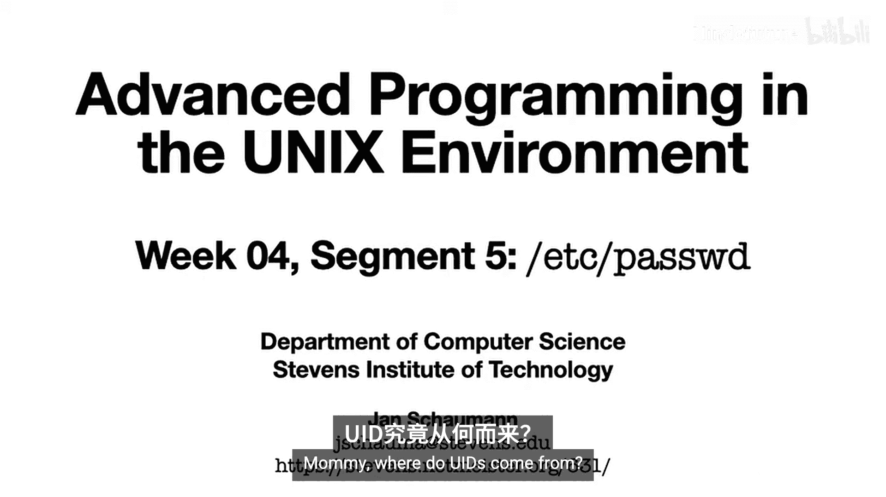

## 概述

在本节课中，我们将要学习UNIX系统中用户账户的核心数据库——`/etc/passwd`文件。我们将了解其结构、每个字段的含义，并通过实例探讨一些特殊和“奇怪”的配置可能带来的影响。

---

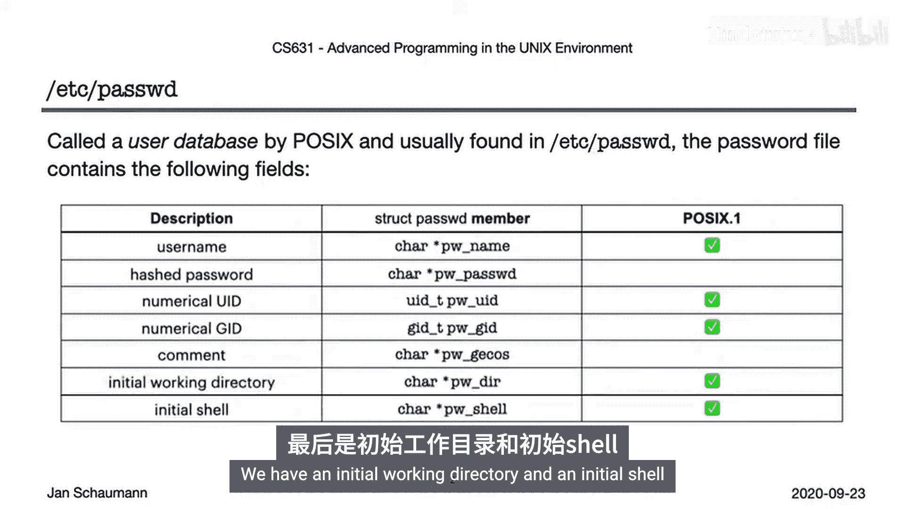

## 用户ID与用户名映射

上一节我们介绍了与账户相关的不同用户标识符（UID）。本节中我们来看看一个不可避免的问题：用户名和UID是如何关联起来的？

我们知道，UNIX系统使用数字UID来进行所有访问决策，因为计算机喜欢数字。但人类通常更喜欢字符串，所以我们也有用户名。密码数据库负责将这些用户名映射到用户ID，从而定义了系统上的本地账户。

---

## `/etc/passwd` 文件结构

传统上，这个用户数据库位于文件 `/etc/passwd` 中，它包含以下字段。这些字段映射到一个名为 `struct passwd` 的数据结构，该结构由执行查找的函数使用。

以下是 `/etc/passwd` 文件中各字段的说明：

1.  **用户名**：一个简单的字符串。
2.  **加密密码**：一个哈希密码。不过我们稍后会看到，如今这些数据通常存放在一个单独的文件中。
3.  **数字用户ID（UID）**。
4.  **数字组ID（GID）**。
5.  **GECOS字段**：存储为 `pw_gecos`。GECOS这个名字源于“通用综合操作系统”（General Comprehensive Operating System），这是UNIX早期为了与GEOS机器兼容而留下的遗迹。
6.  **初始工作目录**。
7.  **初始shell**。

用户数据库遵循经典的UNIX传统，是一个位于 `/etc/passwd` 下的纯文本文件。它包含以换行符分隔的记录，每条记录中的字段由冒号分隔。这意味着任何字段都不能包含冒号。

一个典型的 `/etc/passwd` 文件会包含以下账户的条目：超级用户 `root`、一些专门用于权限分离的服务账户，以及一些人类用户账户。

---

## 字段详解与特殊案例

现在，让我们仔细查看这个密码数据库。我们会发现一些需要深入理解的特殊情况。

首先，这个文件是定义系统本地账户的用户数据库。因此，我们通常期望一个用户名严格对应一个UID。但在文件开头，我们看到有两个账户拥有相同的UID（0），其中一个是众所周知的 `root`。这并非错误。拥有多个相同UID的账户虽然很少见，但系统是允许的。其实际意义是，有两个用户名在认证后都会拥有有效UID和真实UID 0。一旦登录，这两个账户在系统看来是完全无法区分的，因为请记住，系统只根据UID而非用户名来做访问决策。我们稍后会看到为什么可能需要两个相同ID的账户。

让我们再看几个其他特殊情况。

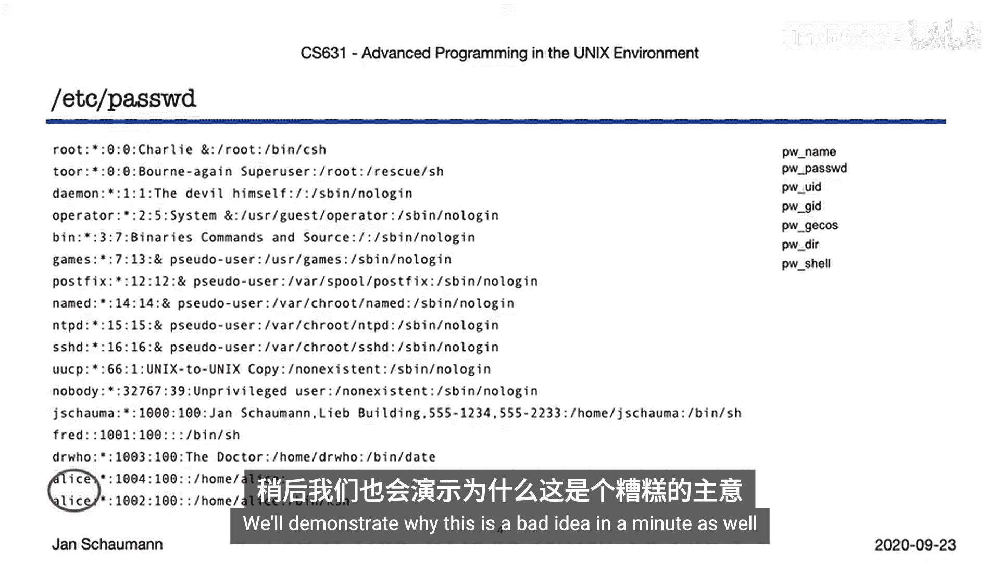

我们提到密码字段是加密密码的占位符。但这个字段也可以是空的，这意味着该账户没有密码，任何人都可以以此用户身份登录。这可能不是你想要的，但系统允许这样做，因为系统无权规定你授予谁访问权限。

其次，登录shell可以设置为任何程序。由于我们有许多仅用于权限分离的服务账户（即让进程拥有专用UID而不具备其他特权），但我们从不希望允许交互式登录，我们可以将登录shell设置为 `/sbin/nologin`。`/sbin/nologin` 在执行时直接返回失败，这意味着成功以此用户身份登录的用户会立即被登出。但你也可以将此shell设置为任何程序。

此外，你可以将登录shell留空，如示例所示。在这种情况下，系统会默认使用 `/bin/sh`。你的初始工作目录通常设置为你的家目录，但也可以留空，此时初始当前工作目录会变成根目录 `/`。

GECOS字段允许使用 `&` 符号扩展为大写的用户名（我们稍后会看到实例），也可以提供如前所述的附加信息。当然，如果你愿意，也可以将此字段留空。

多个相同组ID仅意味着这些用户属于同一个主组，这很正常。但为同一个用户名设置多个条目则绝对不正常。我们稍后也会演示为什么这是个坏主意。

---

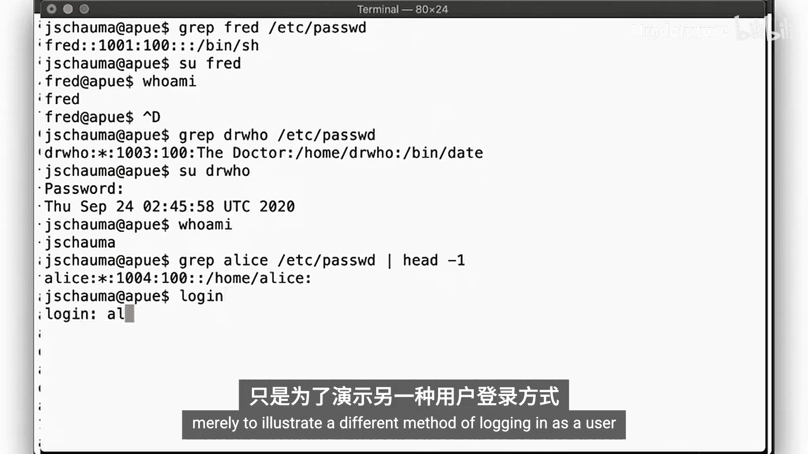

## 实例演示

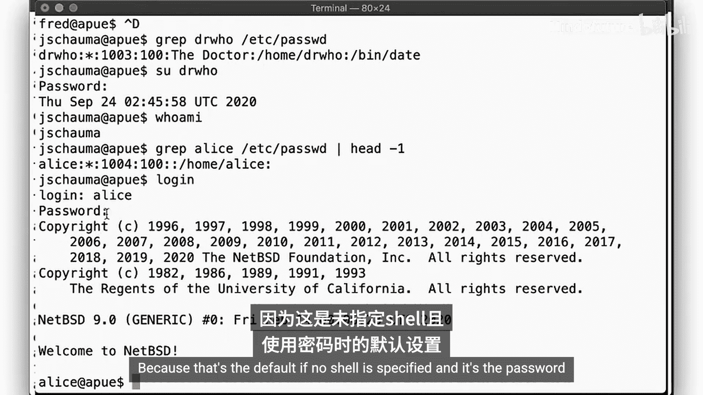

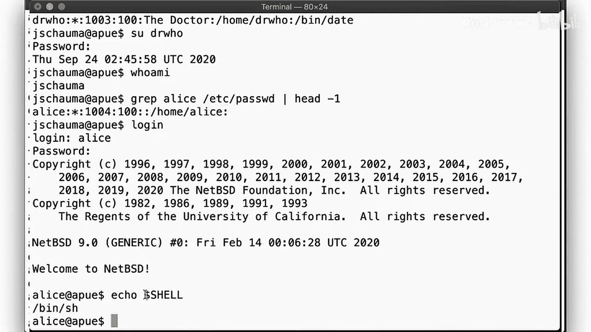

现在，让我们通过实例说明在 `/etc/passwd` 中可能遇到的各种“奇怪”情况。

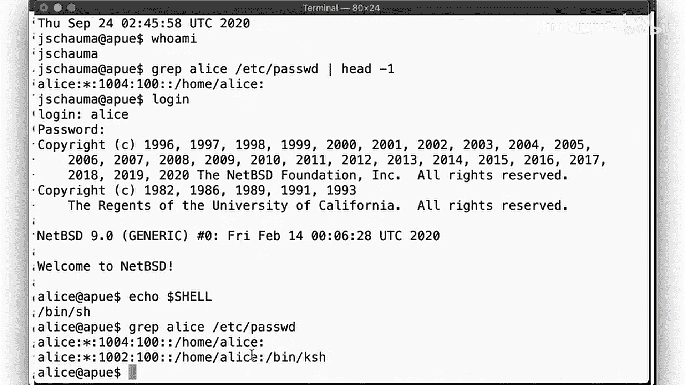

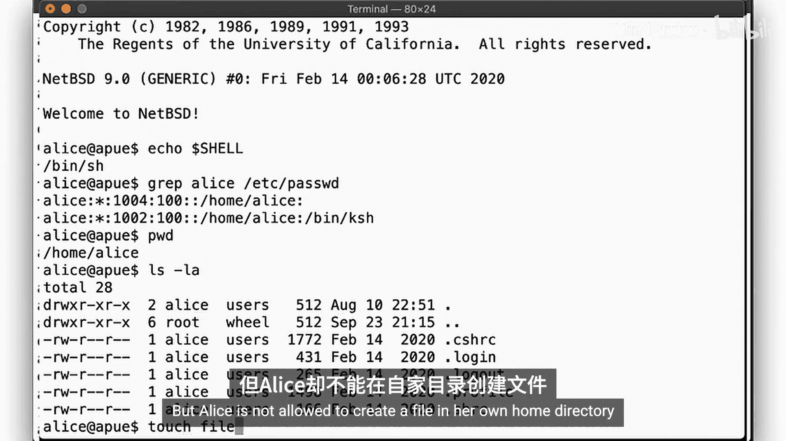

首先，说明拥有第二个与 `root` 相同UID的账户（例如 `toor` 账户，同样是超级用户）的用途。假设你正以 `root` 身份工作，不小心以某种方式损坏了你的登录shell。你遇到了问题，无法再登录了。怎么办？有了 `toor` 账户，你仍然可以登录，因为 `toor` 账户有一个不同的登录shell（例如救援工具集中的静态链接shell）。一旦你以 `toor` 身份登录，你就是 `root`。等等，这是如何工作的？还记得吗，系统只关心你的UID，而 `toor` 的UID是0。因此，就系统而言，你就是超级用户。所以你现在可以去修复损坏的shell，之后登出，再以 `root` 身份登录就会恢复正常了。请注意，`toor` 账户的使用是BSD系统的传统，大多数非BSD系统没有或未启用此账户。

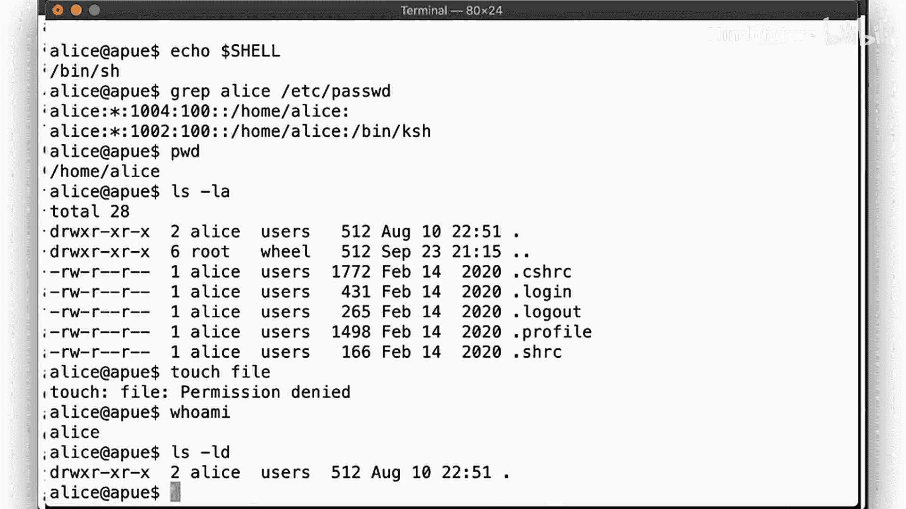

接下来，我们看看用户 `fred`。`fred` 没有密码哈希，意味着任何人都可以成为 `fred` 而无需提供密码。这可能不是你想要的，但确实可以。

然后，我们检查用户 `doctor`。记住，`doctor` 的登录shell是 `date` 命令。所以当我们以 `doctor` 身份登录时，该命令被执行，命令终止后，我们就被登出，变回平常的自己。这里我们看到 `date` 命令被执行，因为那是 `doctor` 的登录shell。

接着是用户 `alice`。`alice` 没有指定登录shell，但我们仍然可以以她的身份登录。这里我们使用 `login` 命令仅仅是为了演示以用户身份登录的不同方法（这就是系统在你登录时所做的事情，我们将在未来的课程中讨论这个程序）。如前所述，`alice` 得到了 `/bin/sh` 作为她的shell，因为如果在 `/etc/passwd` 中没有指定shell，这就是默认值。

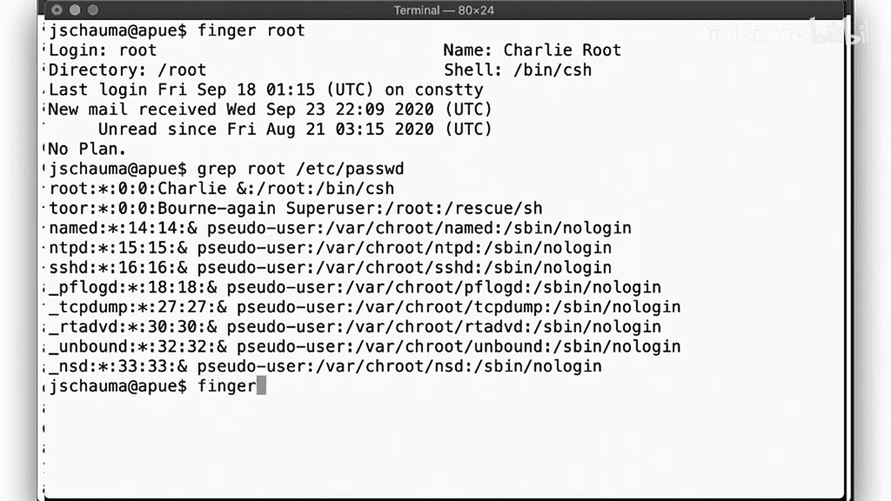

但请记住，关于 `alice` 还有一件奇怪的事情。除了没有shell，我们有两个 `alice` 账户，它们共享同一个家目录。现在来看看我们的文件。所有的 `palace` 文件。但 `alice` 不允许在她自己的家目录中创建文件。我们说过UNIX系统只关心数字ID。所以让我们看看这些ID。目录的所有者是UID 1002，但我们是UID 1004。这解释了为什么我们不能在这里创建文件。我们之所以能区分这两个教程账户，是因为我们看的是用户名，但系统只检查数字ID。因此，为同一个用户名设置两个账户可能是个坏主意。

最后，让我们看看GECOS字段的实际应用。`finger` 命令可以用来查找关于用户的信息。正如我们在这里看到的，`root` 的GECOS字段中的 `&` 符号被转换成了大写名称，所以我们得到了“Charlie Root”。为什么是Charlie Root？好问题，我找不到权威答案，但传闻这个账户确实是以棒球运动员Charlie Root命名的。UNIX的历史传说很奇特。让我们看看用户 `jschauma` 的信息。注意 `finger` 命令是如何能够从传统的逗号分隔值中解析出GECOS信息的，你在这里看到了我的办公室位置和电话号码。顺便说一下，`finger` 命令也可以通过网络查询另一台系统，前提是那台系统提供 `fingerd` 服务。

---

## 总结

本节课中我们一起学习了用户数据库 `/etc/passwd`。它是一个基于文本的文件，包含冒号分隔的字段。这些字段大多可以为空。一个空的密码字段意味着没有密码，这可能是个坏主意。一个空的家目录字段意味着你登录时会被放入 `/` 目录。一个空的shell字段意味着你会得到 `/bin/sh`。文件中的某些字段可能会重复，这并不总是错误。例如，多个用户共享同一个主组是完全正常的。多个用户名对应同一个UID通常很少见，但我们看到了它如何可能有用。然而，同一个用户名对应多个UID几乎肯定是个错误，会导致意想不到的问题。

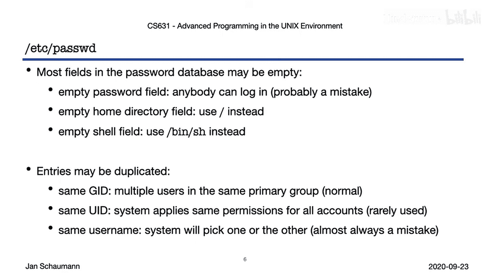

下次课，我们将看看用于处理这些用户ID查找的各种函数，以及如何获取关于组的信息。