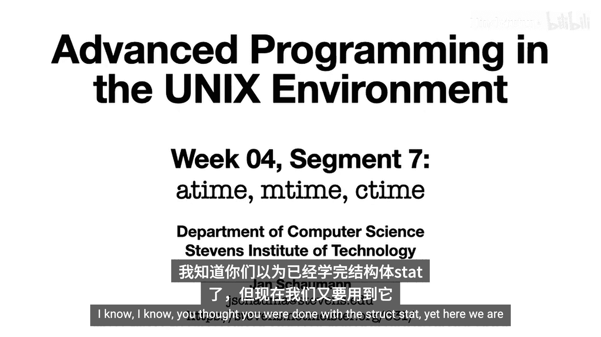
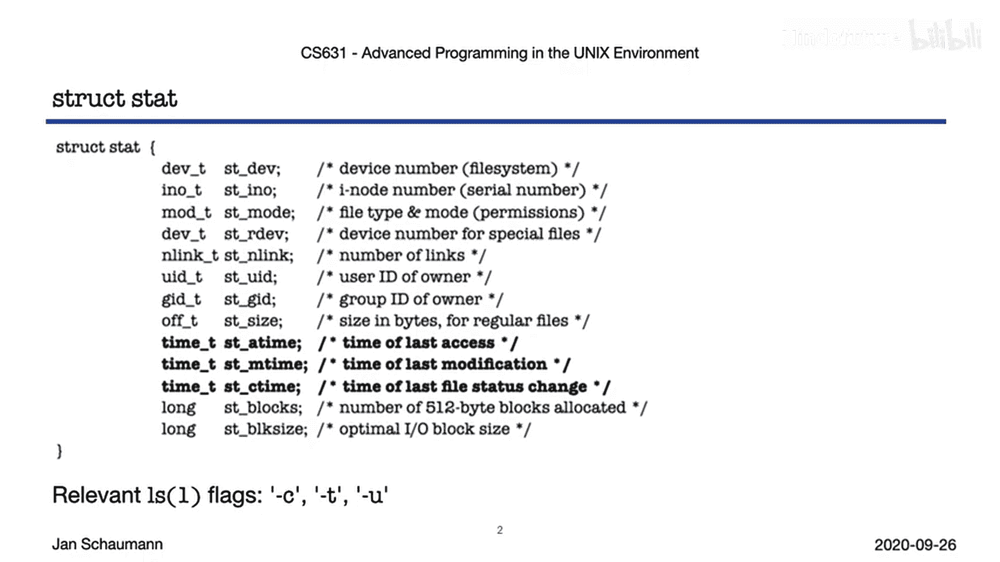
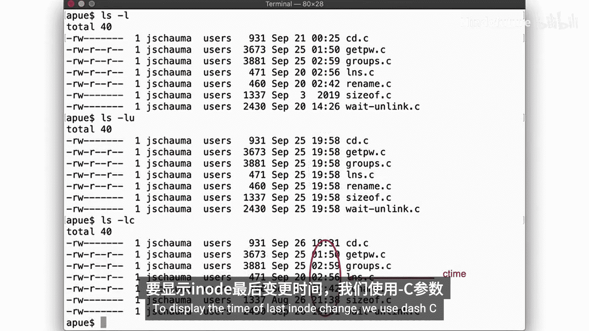
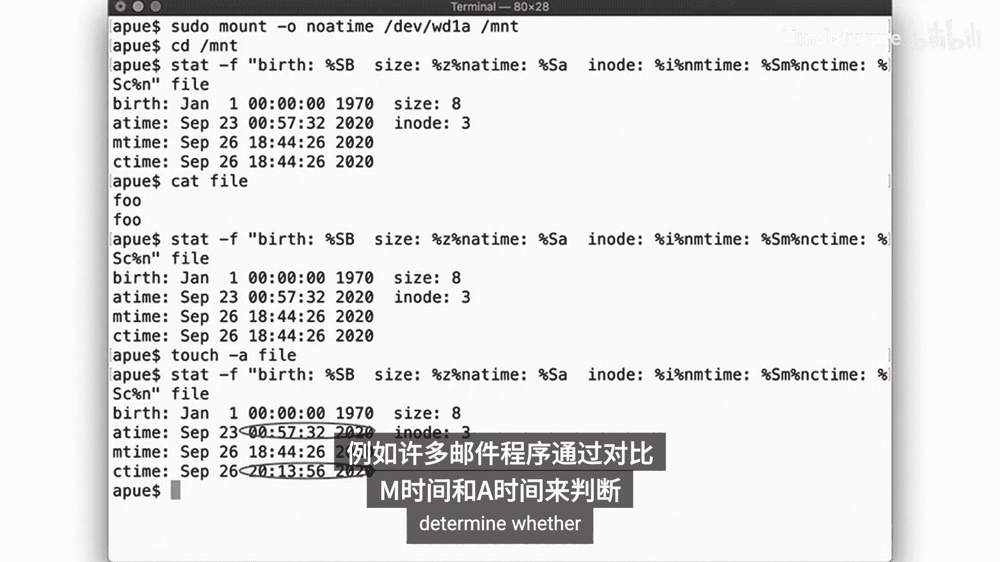
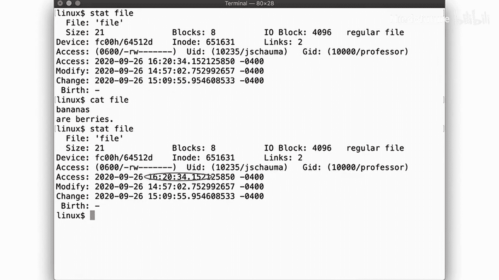
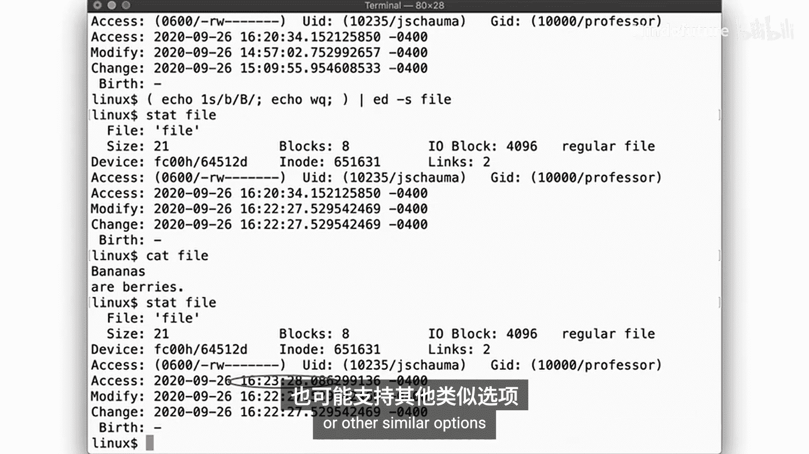
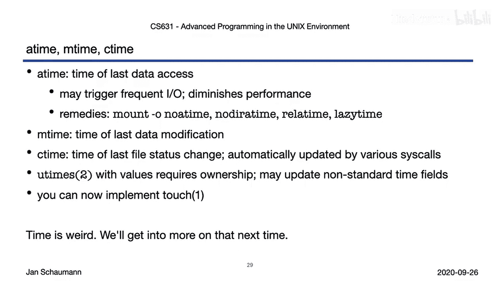

# 022：文件时间戳详解 📁⏰



在本节课中，我们将深入学习UNIX系统中文件的时间戳概念。我们将探讨`atime`、`mtime`和`ctime`这三个核心时间字段的含义、它们如何被系统操作所影响，以及相关的系统调用和实用命令。

---

## 概述



文件系统不仅存储数据，还记录关于文件的时间信息。理解这些时间戳对于系统管理、程序开发和性能分析至关重要。本节将详细解析`atime`、`mtime`和`ctime`。

---



## 核心时间戳概念

一个文件的`inode`结构中至少包含三个与时间相关的字段：

*   **`atime`**：表示文件的**最后访问时间**。当访问文件数据块时，此时间更新。
*   **`mtime`**：表示文件的**最后修改时间**。当文件数据内容被修改时，此时间更新。
*   **`ctime`**：表示文件的**最后状态改变时间**。当文件的`inode`元数据（如权限、所有者、链接数）发生变化时，此时间更新。

可以使用`ls`命令查看这些时间。

---

## 使用`ls`命令查看时间戳

默认情况下，`ls -l`显示的是文件的`mtime`。

以下是使用不同选项查看时间戳的方法：

*   `ls -lu`：显示`atime`。
*   `ls -l`：显示`mtime`（默认）。
*   `ls -lc`：显示`ctime`。

例如，在归档文件后，所有文件的`atime`可能相同，因为归档过程需要读取文件。

---

## 常见操作对时间戳的影响

上一节我们介绍了如何查看时间戳，本节中我们来看看执行不同文件操作时，这些时间戳如何变化。以下是各种操作对时间戳的影响：

*   **创建新文件**：`atime`、`mtime`、`ctime`（以及如果支持，`birthtime`）均被设置为当前时间。
*   **读取文件**：`atime`更新。
*   **向文件追加数据**：`mtime`和`ctime`更新（因为文件大小`st_size`改变）。
*   **创建硬链接**：`ctime`更新（因为链接数`st_nlink`改变），`atime`和`mtime`不变。
*   **更改文件权限**：`ctime`更新（因为模式`st_mode`改变），`atime`和`mtime`不变。
*   **更改文件所有者**：`ctime`更新，`atime`和`mtime`不变。

使用`touch`命令可以主动更新这些时间戳。默认情况下，`touch`会更新文件的`atime`和`mtime`到当前时间，同时也会触发`ctime`更新。

---

## `touch`命令的权限与行为

`touch`命令的行为受到文件权限的影响：

*   如果对文件有**读权限**，可以通过读取文件来更新`atime`。
*   如果对文件有**写权限**，可以通过写入文件来更新`mtime`。
*   如果要将时间戳设置为**任意指定时间**（而非当前时间），则必须是文件的**所有者**。

`ctime`无法被直接设置。任何改变文件状态（包括用`touch`修改`atime`或`mtime`）的操作都会自动将`ctime`更新为当前时间。

使用`touch -a`仅更新`atime`，使用`touch -m`仅更新`mtime`。

---

## 关于`atime`的性能考量与挂载选项

每次读取文件都更新`atime`会导致频繁的磁盘I/O操作，这可能影响性能，尤其是对固态硬盘（SSD）的寿命有损。

因此，许多文件系统支持挂载选项来优化`atime`行为：



*   **`noatime`**：完全禁用`atime`更新。即使使用`touch -a`命令也无法更新`atime`。
*   **`relatime` (相对atime)**：这是许多Linux系统的默认行为。`atime`只在以下情况更新：
    1.  `mtime`或`ctime`比当前的`atime`新。
    2.  当前的`atime`超过24小时未更新。
    这种方式在保证依赖`atime`的程序（如邮件客户端）正常运行的同时，大幅减少了I/O开销。

不同的UNIX变体和文件系统可能支持不同的选项。



---

## 相关的系统调用：`utimes`家族

`touch`命令的功能底层是通过`utimes`系列系统调用实现的。



其函数原型如下：
```c
#include <sys/time.h>
int utimes(const char *filename, const struct timeval times[2]);
```

*   第二个参数`times`是一个包含两个`timeval`结构（分别对应`atime`和`mtime`）的数组。
*   如果传入`NULL`，则将`atime`和`mtime`设置为当前时间（需要写权限）。
*   如果传入具体的时间值，则按此设置时间戳（需要文件所有权）。
*   无论哪种情况，`ctime`都会被自动更新为当前时间。

此外，还有更精确的变体函数（如`utimensat`），它们使用`timespec`结构，支持纳秒级精度。

---

## 总结

本节课中我们一起学习了UNIX文件系统时间戳的核心知识：

1.  **`atime`（访问时间）**：记录最后数据访问时间。出于性能考虑，可通过`noatime`或`relatime`挂载选项进行优化。
2.  **`mtime`（修改时间）**：记录最后数据修改时间，最为常用。
3.  **`ctime`（状态改变时间）**：记录文件元数据的任何改变。这是唯一一个不能由用户直接设置的时间戳。
4.  **`touch`命令与`utimes`调用**：`touch`命令是用户层工具，其核心功能通过`utimes()`等系统调用实现。设置任意时间戳需要文件所有权。

理解这些时间戳的差异和更新机制，有助于你更好地进行文件管理、编写系统工具或分析程序行为。现在，你可以尝试实现一个简化版的`touch`命令，或者去研究开源系统（如NetBSD）中相关工具的源代码了。



关于时间这个“一团乱麻”的话题，我们将在后续视频中继续探讨。