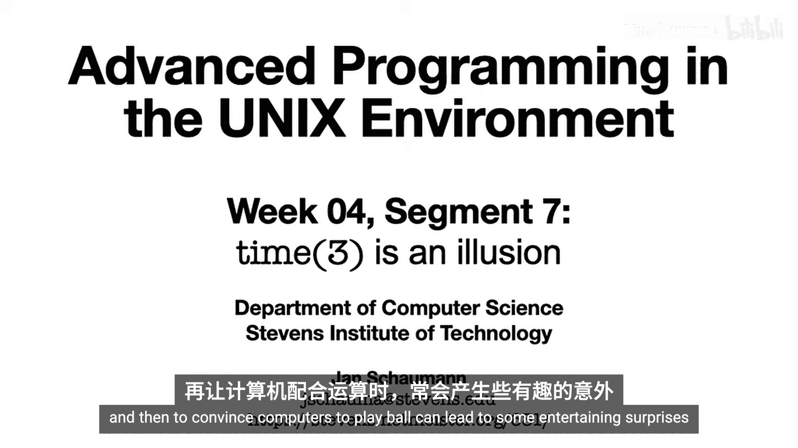
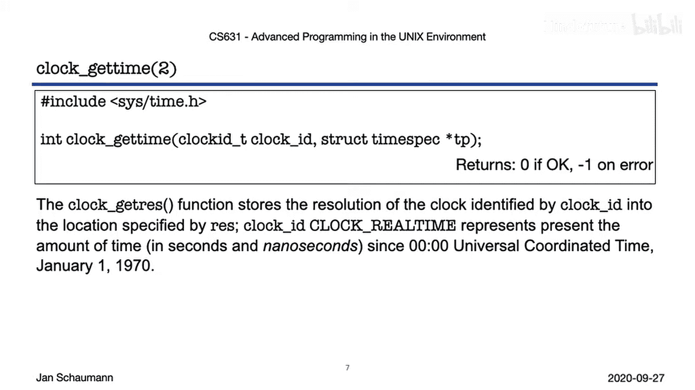
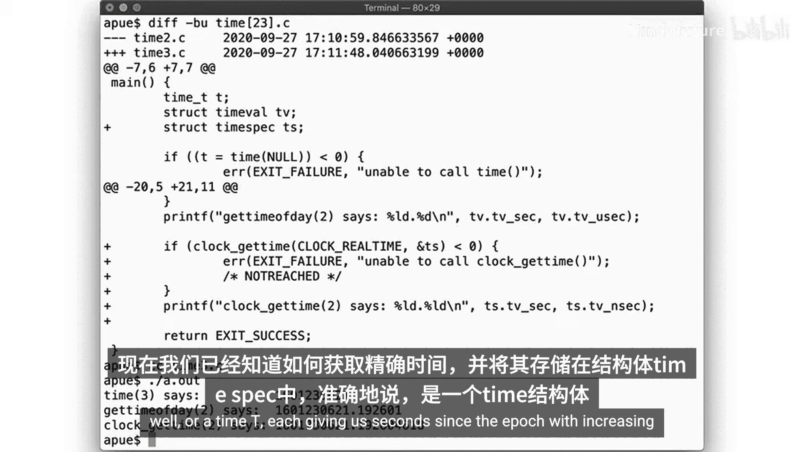
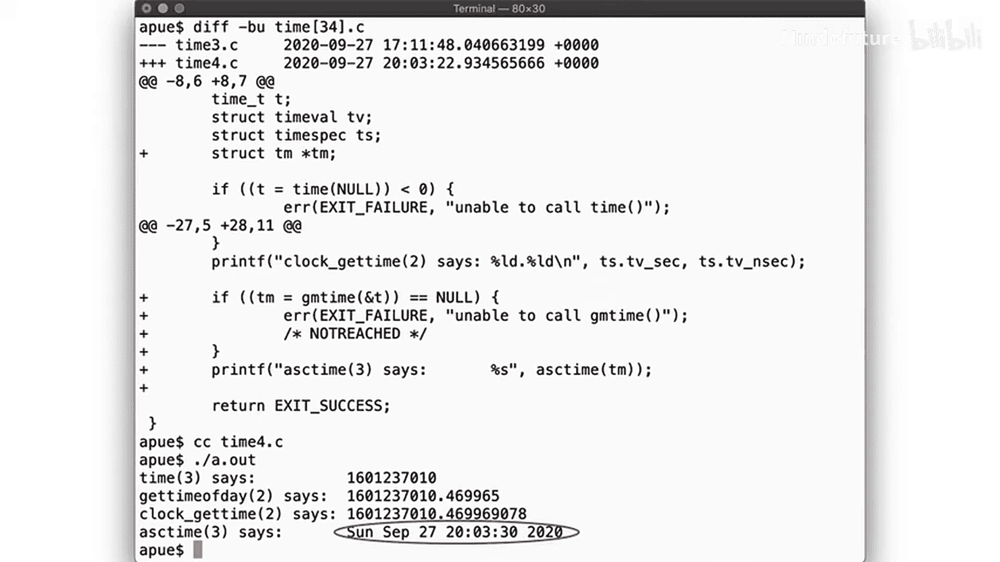
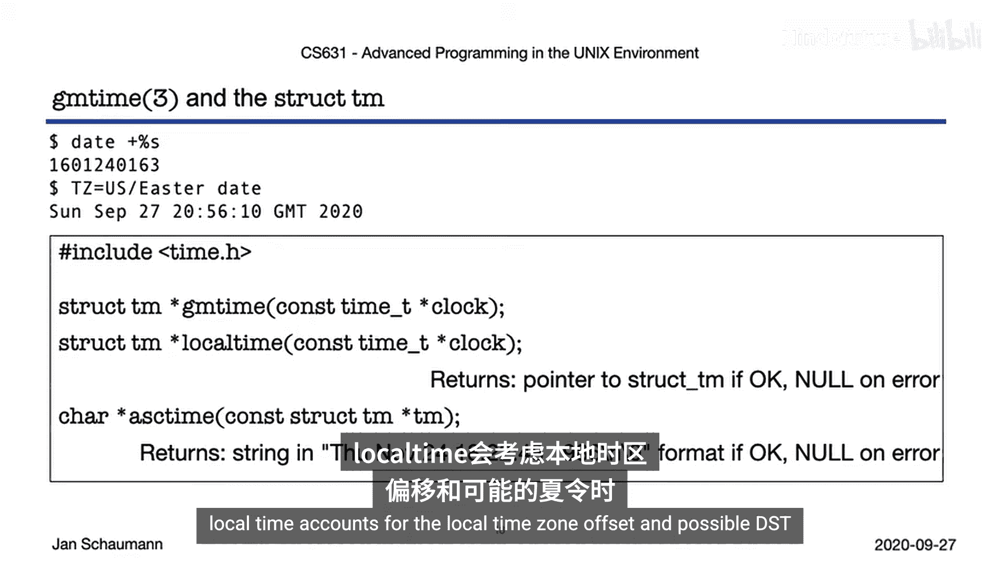
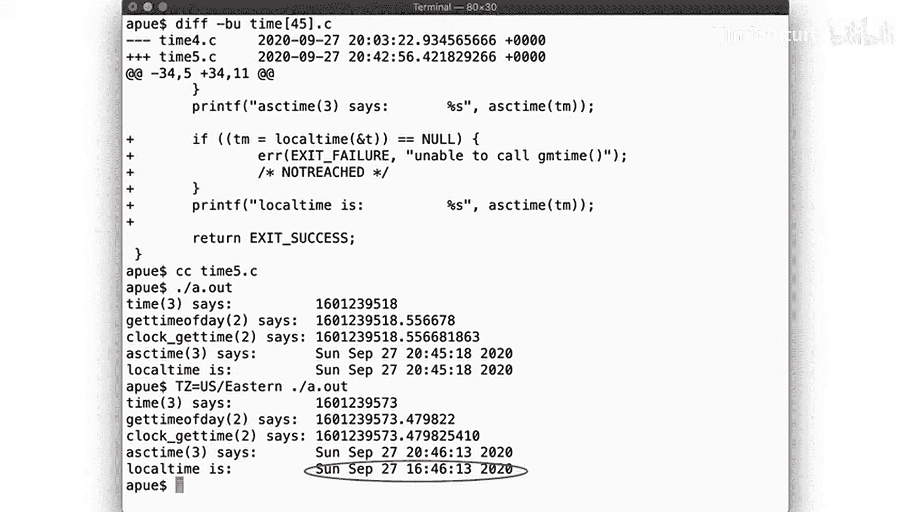
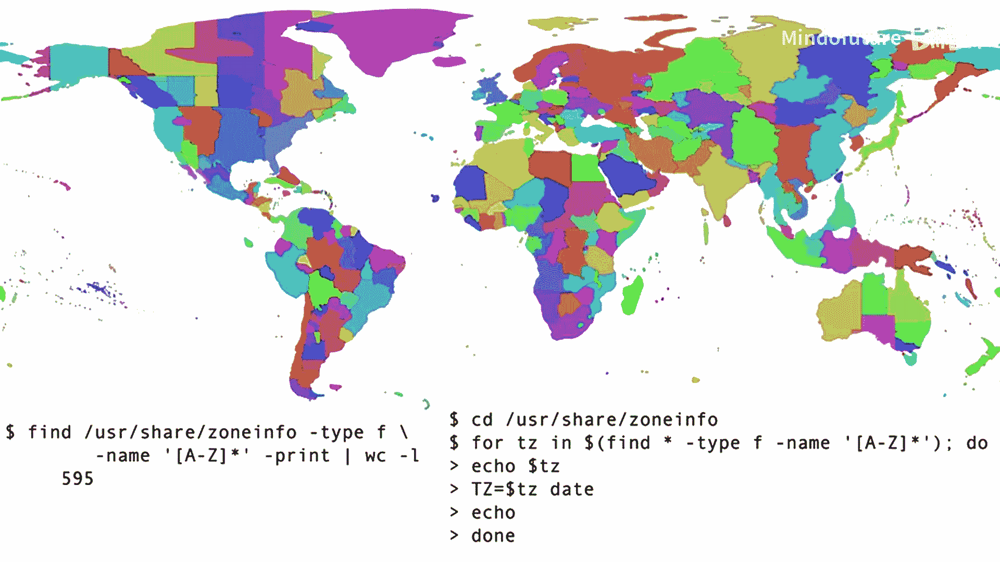
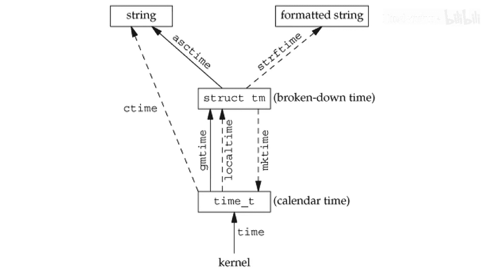

# 023：时间(3)是一个幻觉



在本节课中，我们将深入探讨UNIX系统中的时间处理。我们将学习如何获取系统时间，理解不同时间数据结构的含义，并掌握如何在机器可读的时间戳和人类可读的日期字符串之间进行转换。同时，我们也会揭示时间处理中一些令人困惑的细节和陷阱。

上一节我们介绍了`struct stat`中的访问时间、修改时间和状态改变时间。本节中我们来看看如何从系统获取当前时间。

## 时间的来源与获取

UNIX内核负责追踪时间，它通过计算晶体振荡等方式来维护时间。系统将时间记录为自**纪元**（1970年1月1日午夜）以来经过的秒数。

你可以通过调用`time`函数来获取这个计数，它返回一个抽象数据类型`time_t`。

```c
time_t t = time(NULL);
printf("Seconds since epoch: %ld\n", (long)t);
```

`time`是一个库函数，那么它从哪里获取时间呢？查看源码可以发现，它内部调用了`gettimeofday`系统调用。



`gettimeofday`返回一个`struct timeval`结构，其中包含自纪元以来的秒数和微秒数。



```c
struct timeval {
    time_t      tv_sec;     /* 秒 */
    suseconds_t tv_usec;    /* 微秒 */
};

struct timeval tv;
gettimeofday(&tv, NULL); // 第二个参数（时区）已被弃用，应设为NULL
printf("Seconds: %ld, Microseconds: %ld\n", (long)tv.tv_sec, (long)tv.tv_usec);
```

然而，`gettimeofday`的第二个参数（时区）已被忽略，且其精度只到微秒。为了获得更高精度（纳秒），POSIX标准推荐使用`clock_gettime`系统调用。

`clock_gettime`使用`struct timespec`结构，提供秒和纳秒的精度。

```c
struct timespec {
    time_t   tv_sec;        /* 秒 */
    long     tv_nsec;       /* 纳秒 */
};

struct timespec ts;
clock_gettime(CLOCK_REALTIME, &ts);
printf("Seconds: %ld, Nanoseconds: %ld\n", (long)ts.tv_sec, ts.tv_nsec);
```

至此，我们知道了如何获取精确的时间戳：`struct timespec`、`struct timeval`或`time_t`，它们都以自纪元以来的秒数为单位，只是精度不同。

## 将时间戳转换为可读日期

人类不喜欢计算自1970年以来的秒数，我们需要将`time_t`转换为可读的日期。首先，我们需要使用`gmtime`库函数将`time_t`分解为`struct tm`结构。

`gmtime`函数将`time_t`转换为**协调世界时**。

`struct tm`结构包含了年、月、日、时、分、秒等字段。但其中有一些“怪癖”：
*   `tm_year`字段表示的是自1900年以来的年数。
*   `tm_mday`和`tm_mon`等字段的计数通常从0开始（例如，一月是0）。
*   `tm_sec`字段的有效值可以是60，这涉及到**闰秒**。

闰秒是为了协调国际原子时与地球自转时间而偶尔增加或减少的一秒。POSIX标准要求自纪元以来的秒数单调递增，并且实现不需要考虑闰秒，这导致在闰秒时刻进行时间转换会出现问题。

尽管有这些复杂性，我们仍然可以使用`asctime`函数将`struct tm`格式化为一个标准的日期字符串。



```c
time_t now = time(NULL);
struct tm *tm_utc = gmtime(&now);
printf("UTC time: %s", asctime(tm_utc));
```

## 处理时区和夏令时

我们刚才看到的是UTC时间。为了显示本地时间，需要考虑时区偏移和夏令时。`localtime`函数可以完成这个任务。



`localtime`和`gmtime`一样，将`time_t`分解为`struct tm`，但它会根据本地时区规则进行调整。



```c
struct tm *tm_local = localtime(&now);
printf("Local time: %s", asctime(tm_local));
```

默认情况下，许多系统使用UTC。可以通过设置`TZ`环境变量来指定时区。

```bash
export TZ=America/New_York
```

时区和夏令时规则是软件工程师的噩梦。它们由政治边界、历史原因甚至南极科考站所属国决定，并且规则会频繁更改。这些信息存储在系统的时区数据库中，由IANA维护，需要定期更新。


## 自定义时间格式与反向转换

`asctime`和`ctime`生成的格式是固定的。为了生成自定义格式的日期字符串，可以使用`strftime`函数。

`strftime`允许你使用格式说明符（类似于`printf`）来格式化`struct tm`。

```c
char buf[BUFSIZ];
strftime(buf, sizeof(buf), "%Y-%m-%d %H:%M:%S %Z", tm_local);
printf("Formatted: %s\n", buf);
```



我们也可以反向操作：从一个`struct tm`结构生成`time_t`。这通过`mktime`函数实现。

`mktime`将本地时间的`struct tm`转换回`time_t`。它会自动规范化字段（例如，将超出范围的分钟数转换为小时）。

```c
struct tm some_time = {0};
some_time.tm_year = 121; // 2021年
some_time.tm_mon = 0;    // 一月
some_time.tm_mday = 1;
some_time.tm_hour = 0;
time_t t_epoch_2021 = mktime(&some_time);
printf("Epoch for 2021-01-01: %ld\n", (long)t_epoch_2021);
```

## 核心转换流程总结

本节课中我们一起学习了UNIX时间处理的核心流程，可以用下图概括：

1.  **获取时间**：内核提供`time_t`（通过`time`，或更高精度的`clock_gettime`）。
2.  **分解时间**：使用`gmtime`（得到UTC时间）或`localtime`（得到本地时间）将`time_t`转换为`struct tm`。
3.  **格式化时间**：使用`asctime`、`ctime`或更灵活的`strftime`将`struct tm`转换为人类可读的字符串。
4.  **反向构建**：使用`mktime`将`struct tm`转换回`time_t`。

时间在很大程度上是一种幻觉。计算机在表示时间时已经困难重重，而大部分问题源于人类对时间本身及其应有形态的不同理解。这意味着，编写任何处理时间的程序都可能隐藏着许多令人惊讶的“坑”。建议阅读更多关于“程序员对时间的错误认知”的资料，这既有趣又发人深省。本次讨论也提醒我们，所有编程都在往往不明显的方面受到地缘政治事件的影响。



今天就到这里。感谢观看。