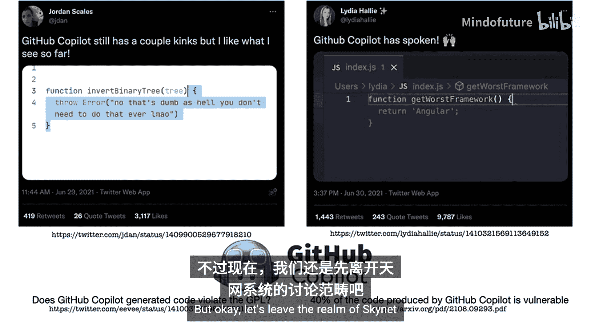
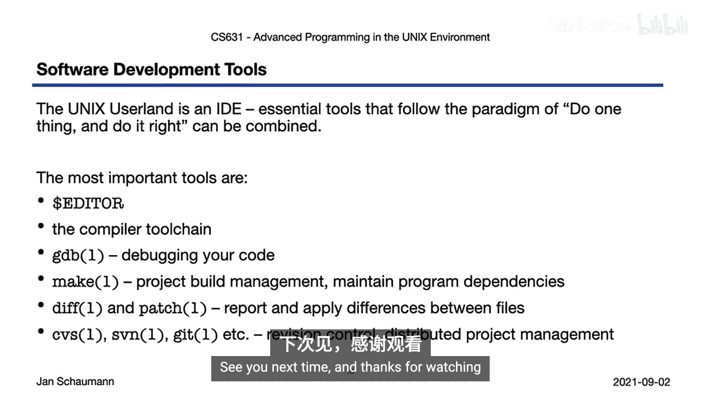

# 024：Unix开发环境 🛠️

在本节课中，我们将学习Unix开发环境的核心概念。我们将了解Unix系统本身如何构成一个强大的集成开发环境，并探索其核心组件如何协同工作，以提高编程效率。

## 概述

在之前的课程中，我们已经编写了一些代码并尝试调试程序，对Unix开发有了初步了解。为了更高效地使用系统，我们需要掌握更多工具。软件开发不仅仅是向文件中写入代码，还需要一系列工具来辅助。本周，我们将介绍一系列能极大简化程序员工作的工具，这些知识不仅适用于Unix或C编程，在其他环境中也同样有用。

## 什么是集成开发环境？


一个优秀的集成开发环境通常至少包含一个编辑器，该编辑器通常支持编程语言的语法高亮、自动缩进和其他格式化功能。它还应提供一个显示调试输出的区域、一个用于加载和组织项目文件的文件浏览器，以及一个可以查阅文档的地方。所有这些功能都旨在提高编程效率。一些IDE还包含额外的功能，如自动代码补全。



例如，Eclipse是一个非常流行的IDE，尤其受Java程序员欢迎。然而，在典型的IDE中，用于编写代码的屏幕区域可能只占整个应用程序窗口的30%左右，这与Unix哲学中高效利用资源的原则并不完全一致。

## Unix本身就是IDE 🖥️

Unix系统本身就是一个精心设计的集成开发环境。它遵循Unix哲学，将整个开发流程分解为多个独立、专注的工具。要利用这个环境，我们可以组合使用以下工具：

*   **编辑器**：你可以选择任何你喜欢的编辑器，如`vi`或`emacs`。
*   **编译器工具链**：对于C语言，这包括预处理器、编译器、汇编器和链接器。
*   **调试器**：用于调试和分析代码，例如`gdb`。
*   **项目构建管理工具**：如`make`，它可以根据文件变更情况，有条件地重新构建项目的特定部分。

除了这些核心工具，还有用于软件项目管理和协作的工具，例如基础的`patch`和`diff`工具，以及代码版本控制系统，如CVS、SVN，以及现在几乎无处不在的`git`。这些独立、小巧的工具共同构成了一个适用于任何编程语言的丰富开发环境，并且由于它们的模块化设计，你可以根据喜好替换其中的组件，实现高度定制。

## 工具协同工作示例

为了让你快速了解这些工具如何协同工作，让我们看一个简单的例子。

假设我们正在编辑一个C语言源文件。当我们完成部分代码后，希望编译程序，但不想离开编辑器窗口或点击任何按钮。这时，我们可以在编辑器中使用构建命令来调用`make`工具构建项目。

例如，执行一个简单的编译命令：
```bash
make myprogram
```
如果代码中存在错误，编译器会提供有帮助的错误信息，包括文件名、行号、列号以及错误描述。

修复错误后，我们可以直接返回源代码。优秀的编辑器（如配置得当的`vi`）甚至可以将光标直接定位到出错的行，并在下方显示错误输出。我们可以使用编辑器的内置快捷键（例如，在`vi`中按`K`键）调出光标下函数的联机帮助手册来确认其正确用法。查阅完毕后，我们会立刻回到代码编辑界面。

修复第一个错误后，我们可以直接跳转到下一个错误所在位置，继续进行修改。所有错误修复完成后，保存文件并再次运行`make`命令。如果编译成功，我们就可以运行生成的可执行文件了。

这个例子虽然简单，但展示了Unix开发环境中各工具流畅衔接的工作方式。在接下来的视频章节中，我们将更详细地探讨每个组件。

## 总结



本节课我们一起学习了Unix开发环境的核心思想。我们认识到，Unix系统通过一系列遵循“做一件事并做好”哲学的小型工具，本身就构成了一个强大、灵活且高效的集成开发环境。我们概述了编辑器、编译器工具链、调试器和构建工具等核心组件，并通过一个简单示例看到了它们如何协同工作。掌握这些工具将显著提升你的编程效率。下一节，我们将从编辑器开始，深入探讨每个组件。