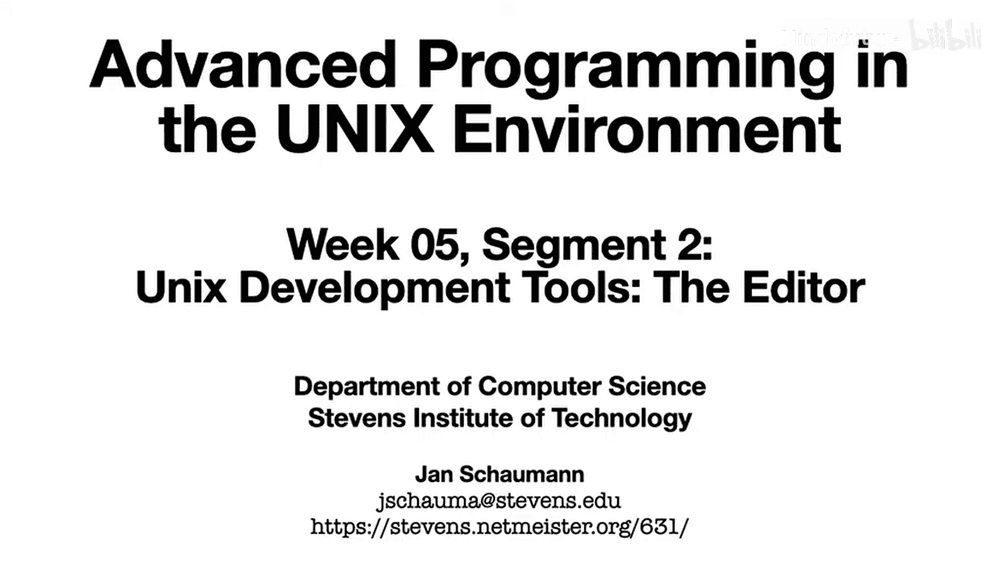
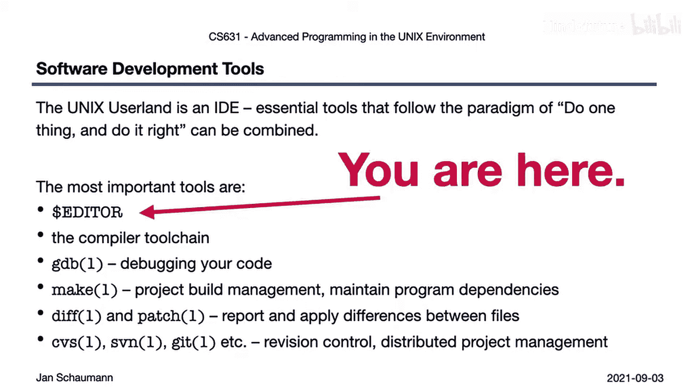
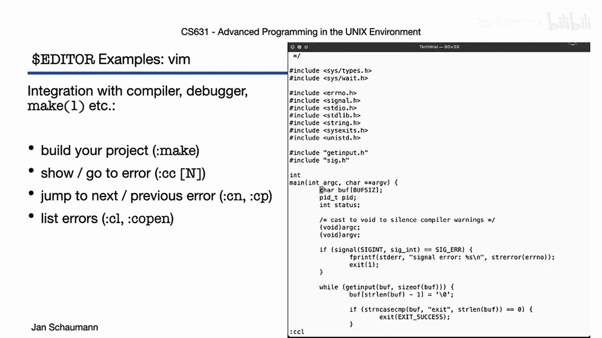
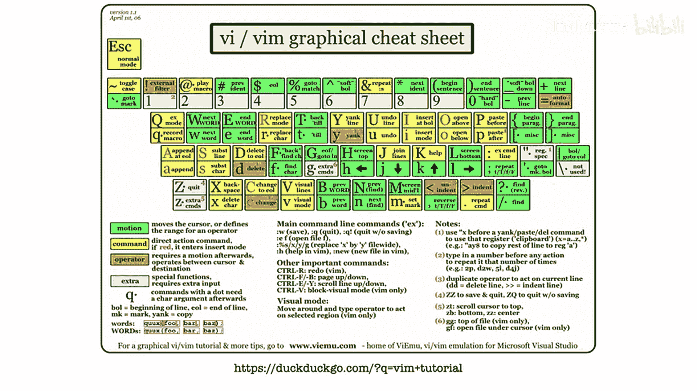
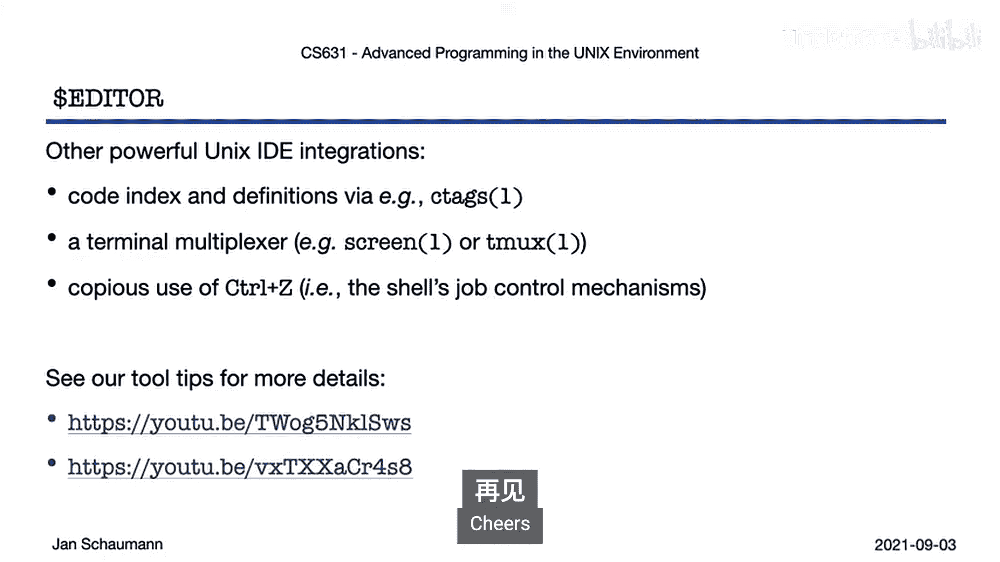

# 025：编辑器 🖥️

在本节课中，我们将学习Unix编程环境作为集成开发环境（IDE）的一个核心组件——编辑器。你将了解到一个优秀编程编辑器应具备的核心功能，并通过实例演示如何高效地使用它。

## 概述

Unix用户环境实际上是一个集成开发环境。本周的视频将快速总结其各个组成部分。编辑器是你最重要的工具，你将花费大量时间在其中编写、阅读和调试代码。

## 编辑器的核心功能

每个程序员都有自己偏爱的编辑器，但选择哪个并不重要，关键在于熟练使用。以下是优秀编程编辑器应具备的核心功能：

*   **语法高亮**：为你使用的不同编程语言提供色彩区分。
*   **高效的键盘操作**：无需将手离开键盘即可完成工作，使用鼠标会降低效率并导致思维切换。
*   **标记与跳转**：能够在代码中设置标记并快速跳转。
*   **多缓冲区操作**：使用多个缓冲区来复制、剪切、折叠和操作代码块。
*   **高效的搜索与替换**：快速定位和修改代码。
*   **多窗口显示**：能够并排或以其他布局显示多个代码窗口。
*   **自动补全**：为标准函数、常量甚至重复代码块提供补全建议。
*   **文档查询**：轻松查找正在使用的库或API的文档。
*   **外部命令过滤**：允许通过外部命令处理输入。

即使你已有惯用的编辑器，也应花时间学习其高级功能，而不是回避未知操作。

## 高效移动：无需图形界面

上一节我们介绍了编辑器的核心功能，本节中我们来看看如何在不依赖图形界面的情况下高效地在代码中移动。这包括使用 `H`、`J`、`K`、`L` 键进行上下左右移动，这些键位于打字基准行，手无需离开。

`Vim` 使用 `HJKL` 作为方向键源于其前身 `VI`。`VI` 的开发者 Bill Joy 使用的终端键盘将方向键设置在了 `HJKL` 的位置。

除了基本移动，我们还可以：
*   按单词跳转。
*   向前或向后搜索。
*   跳转到行首或行尾。
*   使用 `Ctrl+D` 和 `Ctrl+B` 进行向下和向上翻页。
*   使用 `zz` 将当前行置于屏幕中央，`zt` 置于顶部，`zb` 置于底部。
*   在代码块内移动，跳转到文件开头或结尾，或在多个文件间切换。

## 基本编辑任务

掌握了基本移动后，让我们来学习一些常见的编辑任务。为了在代码中任意位置高效跳转，我们可以设置标记以便返回。在移动代码时，高亮和选择代码块、自动缩进或格式化、以及将代码段删除或复制到临时缓冲区都非常有用。

处理大段代码时，折叠功能可以在不删除代码的情况下隐藏某些逻辑块或选定的行。编写代码时，我们可能希望编辑器提供自动补全或建议。

以下是使用同一段代码示例的快速演示：

1.  **显示行号**：`:set number`
2.  **设置标记**：在当前位置按 `m` 键后跟一个字母（如 `ma`）来设置标记 `a`。
3.  **选择与剪切代码块**：按 `Shift+V` 进入可视行模式，选择行，然后按 `d` 剪切到默认缓冲区。
4.  **粘贴代码**：移动到目标位置，按 `p` 粘贴缓冲区内容。
5.  **跳回标记**：按 `'`（单引号）后跟标记字母（如 `'a`）跳回标记处。
6.  **撤销操作**：按 `u` 撤销更改。
7.  **创建折叠**：移动到代码块开始处，按 `zf` 后跟移动命令（如 `zfap` 折叠一个段落）或跳转到标记处（如 `zf'a` 折叠到标记 `a` 处）。
8.  **展开折叠**：将光标移到折叠行上，按 `za`。
9.  **自动补全**：在插入模式下，输入部分内容后按 `Ctrl+N` 或 `Ctrl+P` 进行补全。
10. **查询手册**：将光标置于函数名上，按 `Shift+K`（默认查第1节）或 `3 Shift+K`（查第3节，即库函数）可查看手册页。

## 与开发工具集成

一个好的代码编辑器应能与你的其他开发工具集成。记住，Unix 本身就是一个 IDE。我们应该能够从编辑器内部运行编译器、调试器或构建软件。

以下是使用 `make` 功能及处理编译错误的示例：

1.  **运行构建**：在命令模式下输入 `:make`。编辑器窗口会暂时消失，显示 `make` 命令在 shell 中的输出。
2.  **跳转到第一个错误**：查看错误信息后，按回车键，Vim 会自动将你定位到第一个错误出现的文件和行。
3.  **查看完整错误信息**：按 `:cc` 可以查看当前错误的完整信息。
4.  **打开快速修复列表**：按 `:copen` 可以在底部打开一个窗口，持续显示所有错误列表。
5.  **在错误间导航**：修复一个错误后，可以使用 `:cnext` 跳转到下一个错误。
6.  **跳转到定义**：将光标置于标识符（如变量或函数名）上，按 `Ctrl+]` 可以尝试跳转到其定义处，按 `Ctrl+T` 返回。
7.  **关闭快速修复窗口**：所有错误修复后，使用 `:cclose` 关闭错误列表窗口。

这个流程很好地展示了编辑器如何与环境集成，让我们高效地编写代码并修复编译器指出的错误。

## 总结

本节课中我们一起学习了编辑器作为 Unix IDE 核心工具的重要性。我们探讨了优秀编辑器应具备的功能，并通过实例演示了高效移动、常见编辑操作以及与编译器等开发工具的集成。当然，编辑器还有成千上万的其他功能，建议你寻找并跟随一份好的教程来深入学习你的首选编辑器。`VI` 或 `Vim` 只是一个例子，其他优秀编辑器也提供非常类似的功能。

最后，编辑器与其他开发工具（如 `ctags` 和 `screen` 多路复用器）还有许多集成方式，你可以在相关视频中了解更多。在下一个视频中，我们将介绍默认的编译器工具链以及如何从 C 代码生成可执行文件。