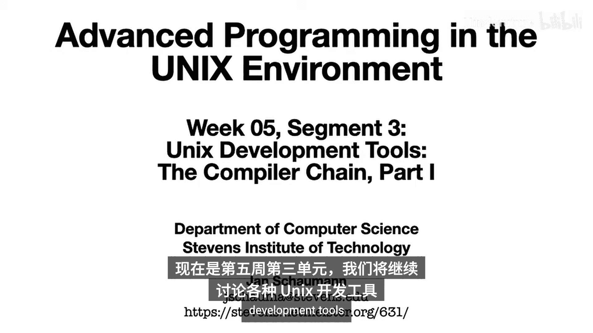
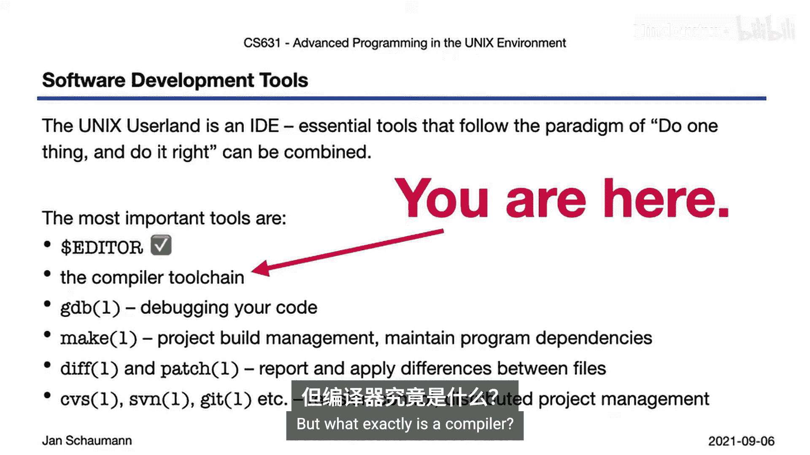
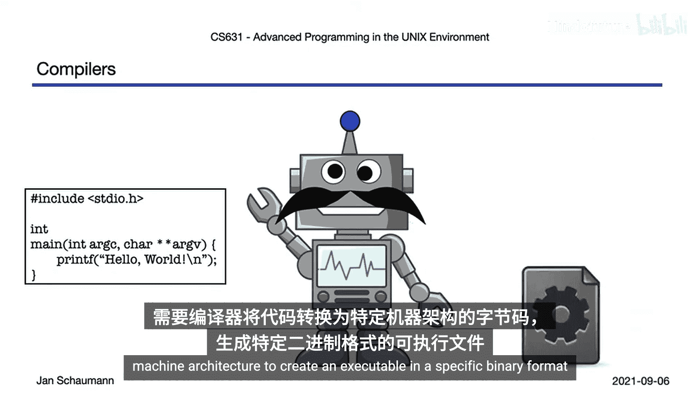
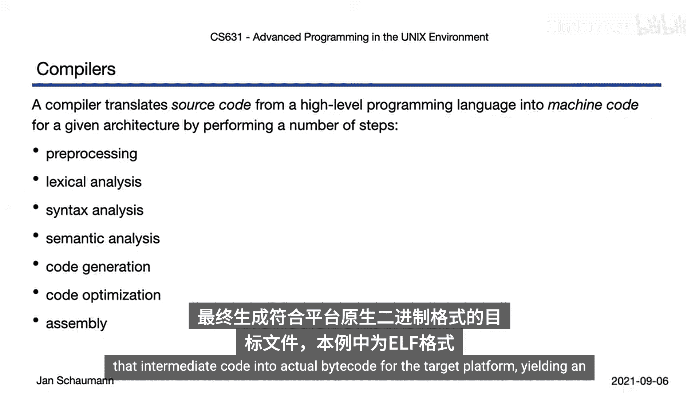
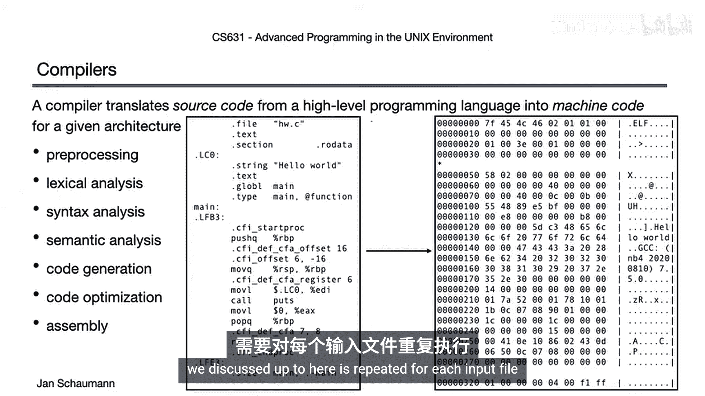
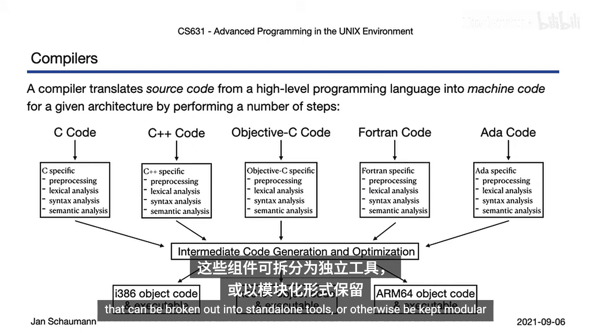
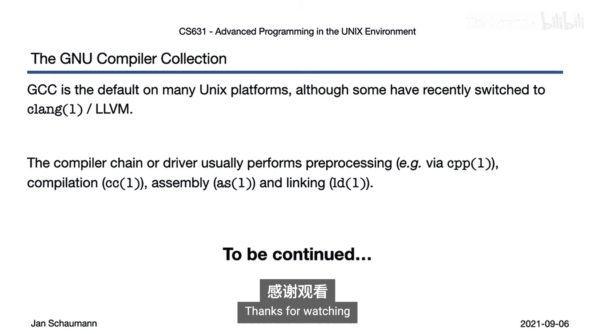

# 026：编译器（第一部分）👨‍💻



在本节课中，我们将学习编译器工具链。我们将了解编译器是什么，它如何将高级编程语言（如C语言）的源代码转换为特定机器架构的可执行文件，并概述编译过程的主要步骤。



上一节我们介绍了编辑器的核心功能，本节中我们来看看编译器工具链本身。



## 什么是编译器？🤔

与解释型语言不同，当我们使用C等编译型语言编写代码时，需要编译器将代码翻译成针对特定目标机器架构的字节码，以创建特定二进制格式的可执行文件。

更具体地说，编译器将高级编程语言的源代码翻译成特定架构的机器码。不同的源语言可以使用不同的编译器，它们可以为不同的目标架构生成不同的代码。

编译器的任务通常被分解为一系列不同的步骤。

## 编译过程的主要步骤

以下是编译器将源代码转换为可执行文件所经历的主要阶段。

### 1. 预处理

许多编程语言允许通过宏定义、常量或包含其他文件的代码来使用快捷方式，这些语法在严格意义上可能不属于该编程语言的有效语法。例如，考虑这个简单的程序：

```c
#include <stdio.h>
#define MESSAGE "Hello"
int main() {
    printf(MESSAGE);
    return 0;
}
```

在预处理阶段，编译器或独立的预处理器程序会展开宏，并从给定的头文件中引入代码。最重要的是，它会提供各种函数的前向声明。预处理器还会替换所有已定义的宏，无论它们是在输入文件中定义的还是从包含的文件中引入的，从而将左侧的打印语句转换为右侧的形式。

### 2. 词法分析

在此阶段，编译器解析给定的源代码，并将其分解为单独的标记（Token）。例如，像 `if (num > 42) message = “yes”;` 这样的语句可能被分析并分解为：语言特定的关键字、标记、变量标识符、运算符、数字、另一个标记、另一个变量标识符、另一个标记、字符串和最终的分号。这种词法分析也使得编辑器能够执行语法高亮。

### 3. 语法分析

在将输入分解为标记后，我们可以进行语法分析。即，根据编程语言的语法规则，检查我们得到的标记序列是否有意义。对于简单的语句，此阶段可能会捕获错误，例如忘记分号或括号未闭合。然后，编译器会构建一个表示该语句的抽象语法树。



### 4. 语义分析



在此阶段，编译器不仅检查基本语法是否正确，还检查我们所写的内容是否至少具有基本的逻辑意义。例如，假设我们写的是 `if (message > 42) num = “yes”;`，那么对此抽象语法树的语义分析会指出，虽然if语句的整体逻辑似乎正确，但尝试将字符串与数字进行比较在此处没有意义，尝试将字符串赋值给int类型的变量也没有意义。因此，编译器将抛出错误。

### 5. 代码生成与优化

如果一切检查无误，我们将进入代码生成阶段，通常还包括代码优化。编译器可以通过优化循环、减少诸如循环不变式等语句的求值次数或移除无效果的语句来提高代码效率。例如，消除冗余语句，使左侧的代码被编译器转换为右侧的代码。有些优化是机器无关的，但有些优化可能依赖于目标架构，这就是为什么代码优化通常在生成中间代码之后进行。

无论如何，在代码生成阶段，编译器将我们漂亮的C代码转换为一种中间格式，例如汇编代码。

### 6. 汇编与链接

然后，编译器将该中间代码汇编成目标平台的实际字节码，生成一个采用平台原生二进制格式（例如ELF）的目标文件。这一系列步骤针对所有输入文件执行。请记住，大多数软件项目不仅仅包含单个源文件。因此，我们到目前为止讨论的所有内容都会为每个输入文件重复。

我们最终会得到一组目标文件，这些文件需要与系统库链接在一起以创建最终的可执行文件。这通常涉及另一个工具——链接器的帮助，链接器由编译器在最后阶段调用，它知道在哪里查找某些库，例如C运行时库（称为libc）等。所有这些步骤最终使我们从输入程序得到可执行文件，并完成了编译器执行的一系列步骤。

## 编译器的组件与分类



观察所有这些步骤，我们可能会注意到它们属于不同的类别。例如，预处理、代码分析、抽象语法树的构建和语义一致性保证都必然与特定的编程语言相关。也就是说，这些步骤取决于所使用的编程语言，如果你使用C、C++或Go，它们会有所不同。

然而，一旦过了那个阶段，开始生成中间代码，就不再与特定编程语言相关。你的编译器可以通过为不同编程语言提供不同的前端，配合相同的代码生成引擎，来支持多种编程语言。

最后，汇编和链接步骤既不再与编程语言相关，也与特定平台相关。根据目标机器架构的不同，编译器需要生成不同的输出。

## 常见的编译器

由于C等编程语言是标准化的，因此存在许多不同的编译器实现，包括商业闭源产品和开源编译器。一些比较知名的编译器有英特尔C编译器（ICC）、Borland Turbo C编译器和微软的Visual C++编译器。这三个例子是商业闭源编译器，可能需要购买，并且可能仅作为集成开发环境的一部分提供，而不是作为独立工具。

更常见的开源编译器包括Clang（LLVM编译器工具链的C/C++/Objective-C前端）和GCC（GNU编译器套件）。Clang近年来已成为FreeBSD、OpenBSD（至少在amd64和i386平台上）以及macOS上的默认编译器。在这些平台上，Clang取代了另一个最流行、使用最广泛的开源编译器GCC。

GCC仍然是大多数Linux发行版以及NetBSD上的默认编译器，它支持许多硬件架构和平台，而Clang可能不支持。因此，在我们的课程中，我们使用GCC作为默认编译器。

还有其他开源编译器，例如PCC（可移植C编译器），你可以从各自的包管理系统中将其安装在不同的Unix系统上。PCC是20世纪70年代在贝尔实验室编写的早期编译器之一，并在21世纪中期进行了修订以支持现代C标准。

此外，还存在许多其他编译器，尝试使用不同于默认编译器的编译器来构建项目可能非常有用。包括GCC在内的许多编译器都添加或支持对语言的自定义扩展。如果你想编写可移植的代码，最好了解这些扩展是什么，何时使用以及何时不使用。因此，安装第二个编译器可以帮助你捕获不可移植的代码。观察不同编译器是否生成更高效的可执行文件以及各自应用了哪些类型的优化也很有趣。

## 总结



本节课中我们一起学习了编译器工具链的基础知识。我们了解到，编译器是一个将高级语言源代码转换为机器可执行代码的复杂工具集，其过程包括预处理、词法分析、语法分析、语义分析、代码生成与优化、汇编和链接等多个阶段。我们还简要介绍了几种常见的编译器，如GCC和Clang。在接下来的视频中，我们将详细探讨这些阶段的细节以及其中提到的各个工具。