# 027：预处理器详解 🧠

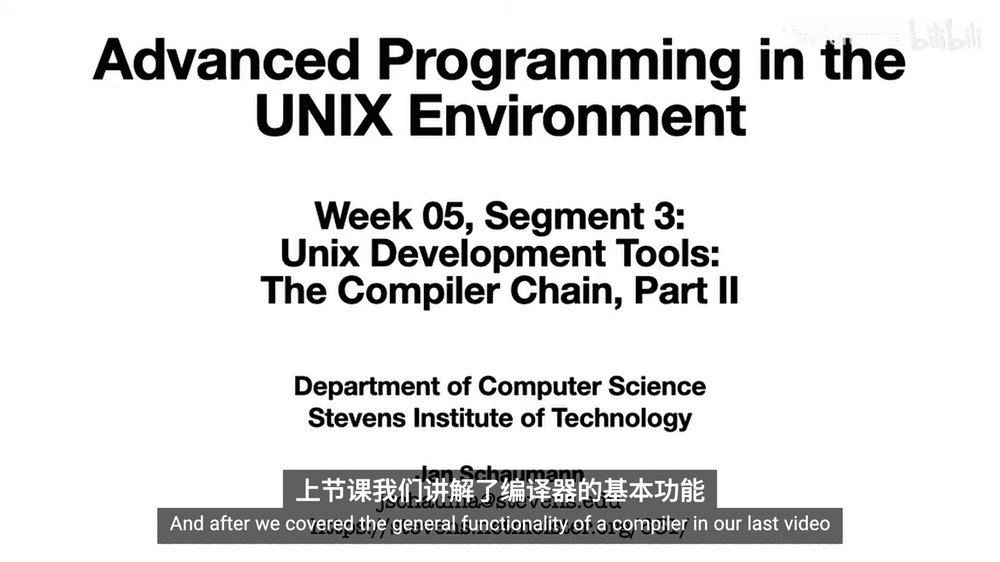

在本节课中，我们将深入学习编译器工作的第一阶段：预处理器。我们将通过具体示例，详细讲解预处理器如何展开源代码，以及如何通过命令行工具手动控制这一过程。

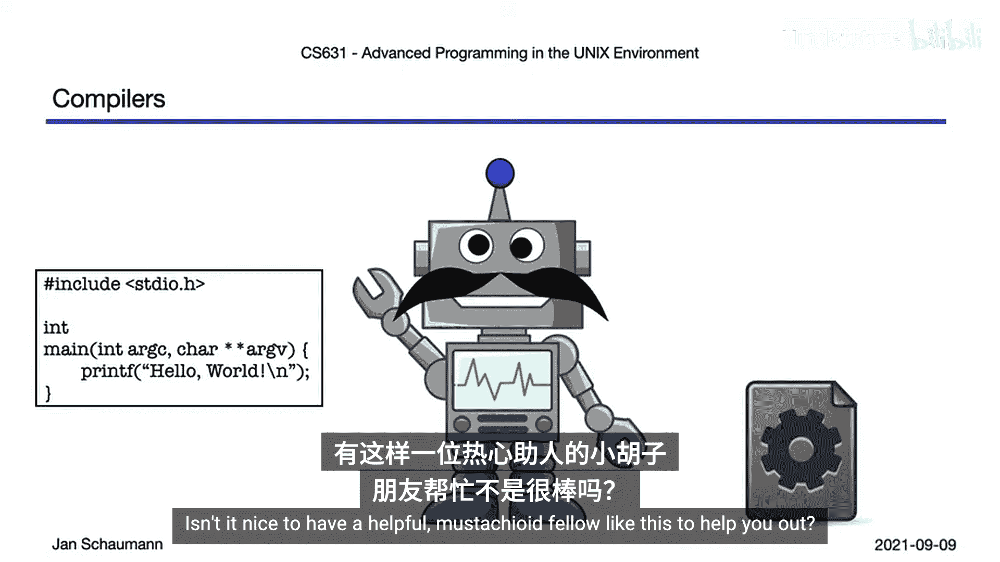

上一节我们介绍了编译器的整体功能，本节中我们来看看预处理器在实践中的具体工作。

## 预处理器的作用

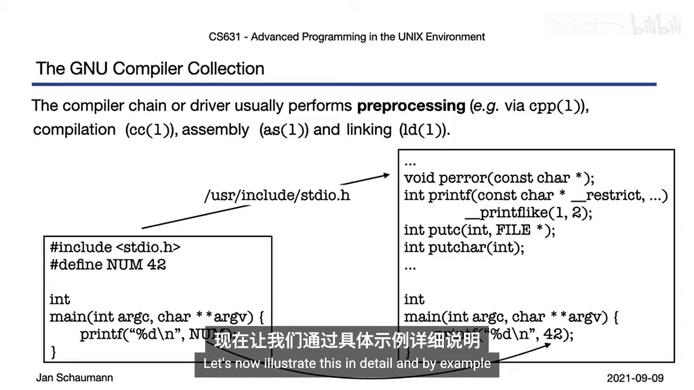

预处理器是编译过程的第一步。它接收我们的源代码，并根据特定的指令（如 `#include` 和 `#define`）对代码进行展开和替换。这个过程发生在真正的编译之前。

## 一个简单的示例

我们从一个简单的C语言程序开始，文件名为 `hello.c`。

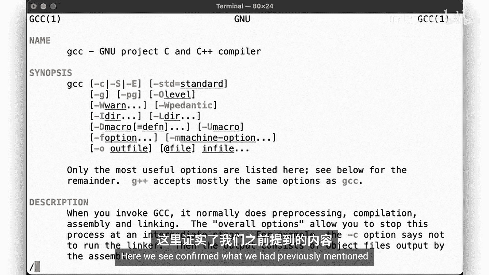

```c
#include <stdio.h>

void func2() {
    printf("%s are great on anything.\n", FOOD);
}

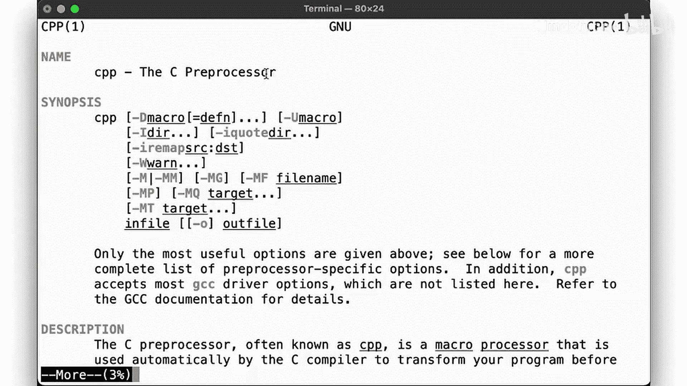

void func1() {
    func2();
}

int main() {
    func1();
    return 0;
}
```

在这个程序中，我们使用了一个预处理器指令 `#ifdef` 来根据是否定义了 `FOOD` 宏，决定打印哪种食物。

## 观察预处理器的输出

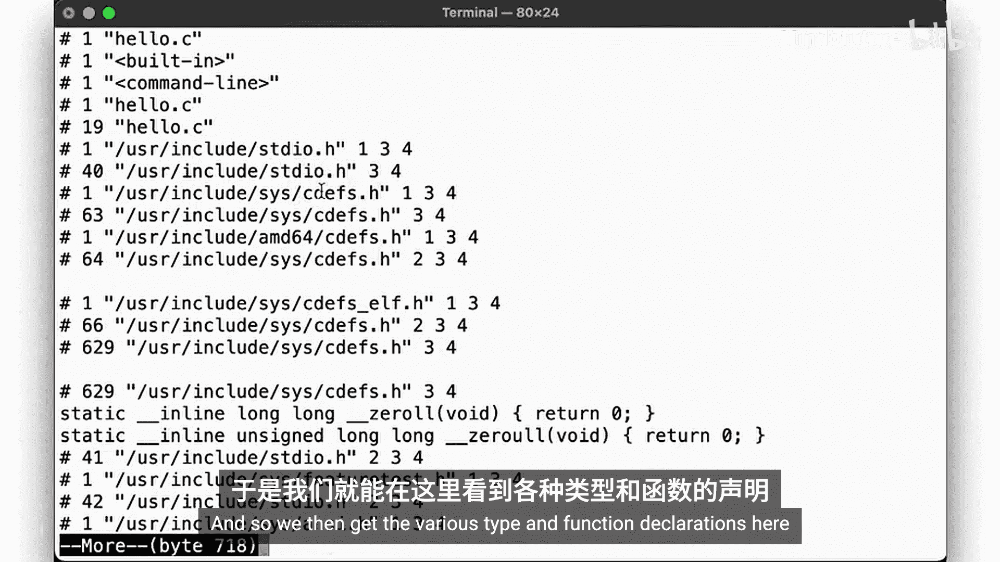

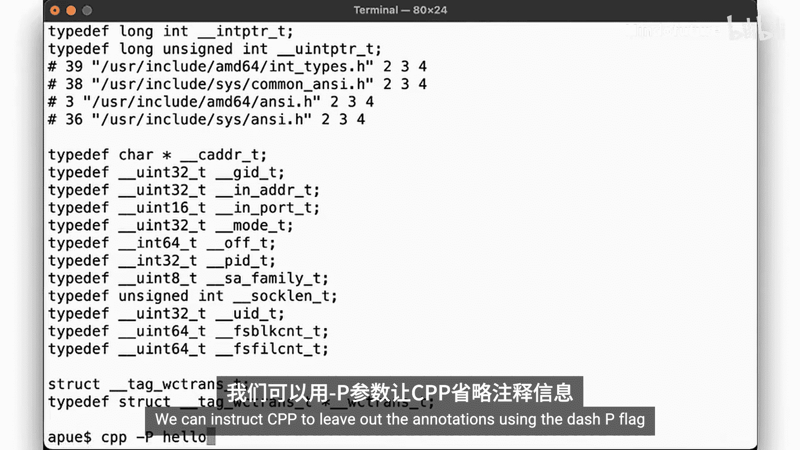

编译器 `cc` 会自动调用预处理器 `cpp`。但我们可以手动运行 `cpp` 来查看预处理后的代码。

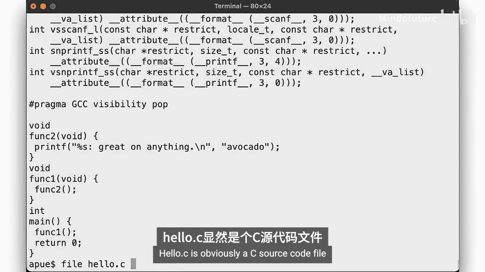

运行以下命令：
```bash
cpp hello.c
```

你会看到大量输出。除了我们自己的代码，还包含了从 `stdio.h` 等头文件中引入的所有类型定义和函数声明。这表明预处理器的主要工作之一就是处理 `#include` 指令，将头文件的内容“复制粘贴”到源文件中。

为了获得更清晰的视图，我们可以使用 `-P` 选项来移除行号等调试信息：
```bash
cpp -P hello.c
```

预处理后的代码（通常保存在 `.i` 文件中）仍然是合法的C源代码，但已经没有任何预处理器指令了。例如，所有的 `#ifdef` 判断都已被解析，`FOOD` 被替换成了具体的值（如果没有定义，则使用代码中的默认值）。

## 通过编译器驱动控制预处理

我们通常不直接调用 `cpp`，而是通过 `cc` 来控制。`cc` 的 `-E` 选项会让它在执行完预处理阶段后停止。

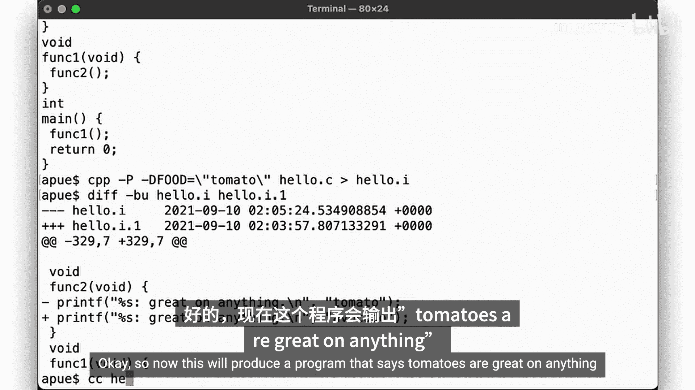

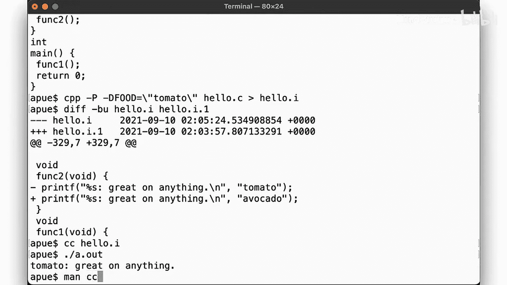

运行以下命令，效果与直接调用 `cpp -P` 类似：
```bash
cc -E hello.c
```

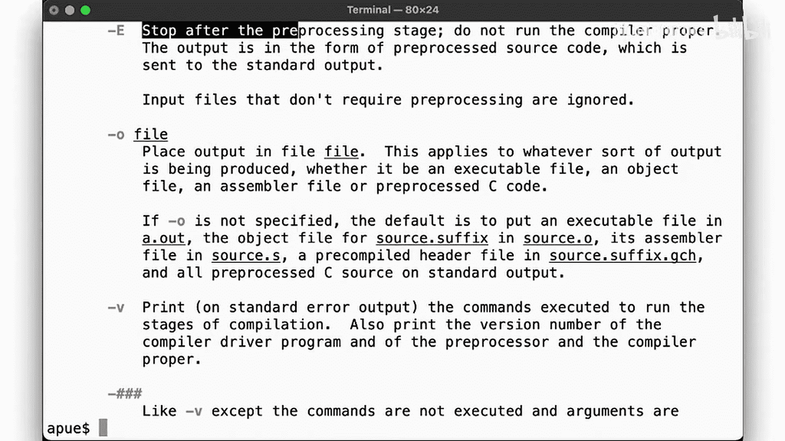

如果你想观察 `cc` 在背后具体执行了哪些步骤，可以加上 `-v`（verbose）选项：
```bash
cc -E -v hello.c
```
输出会显示编译器查找头文件的路径、使用的内部标志等详细信息。

## 定义宏

预处理器另一个关键功能是宏替换。我们可以在命令行中直接定义宏。

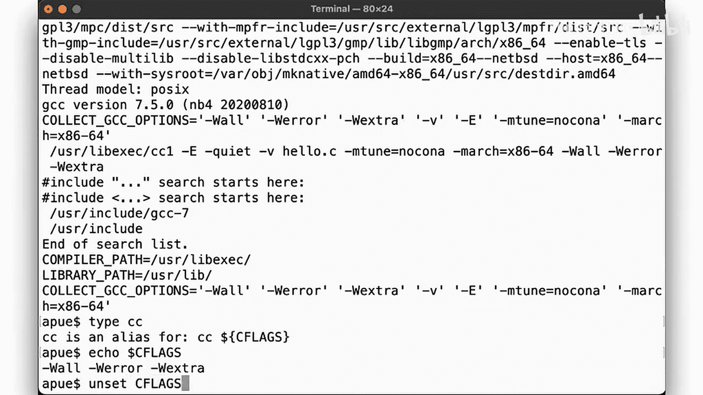

例如，以下命令将 `FOOD` 宏定义为字符串 `"tomato"`：
```bash
cc -D FOOD='"tomato"' hello.c -o hello
./hello
```
程序将输出：“tomato are great on anything.”

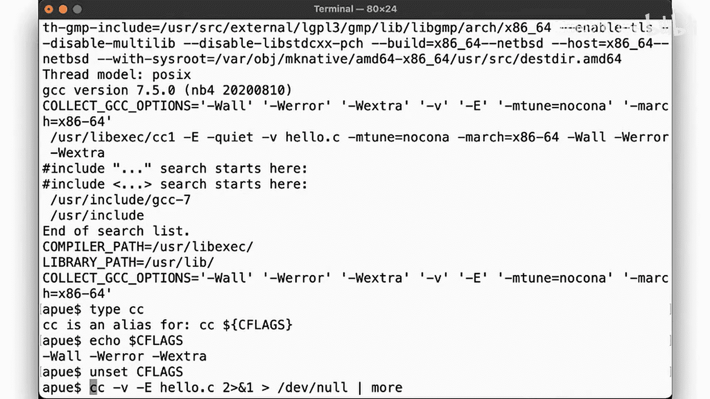

**核心概念**：`-D` 标志用于在命令行定义宏。其语法为 `-DNAME` 或 `-DNAME=VALUE`。预处理器会在编译前，将源代码中所有 `NAME` 出现的地方替换为 `VALUE`。

需要注意的是，这种替换是简单的文本替换。因此，如果 VALUE 在C语法中需要引号（比如字符串），你必须在定义时加上引号，并确保shell能正确传递它们（通常需要转义）。

## 编译全过程预览

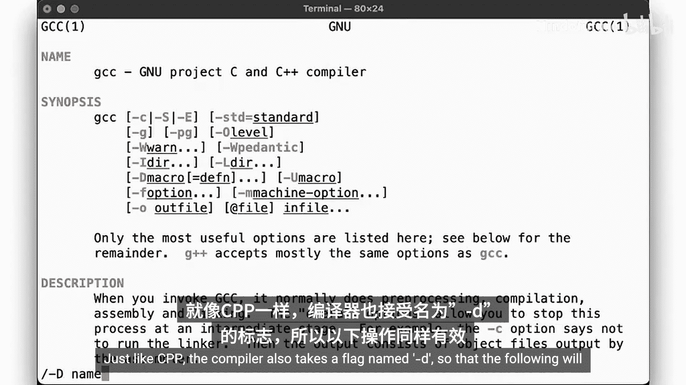

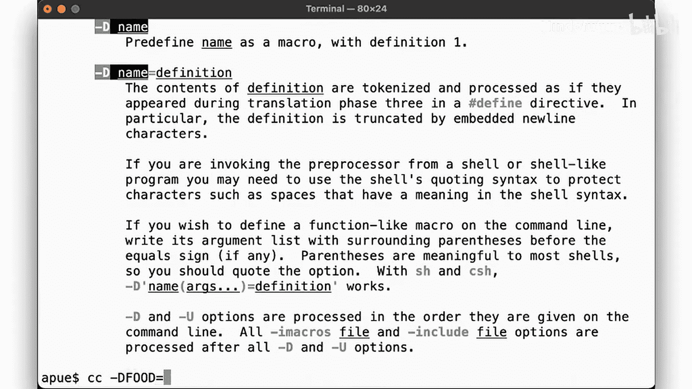

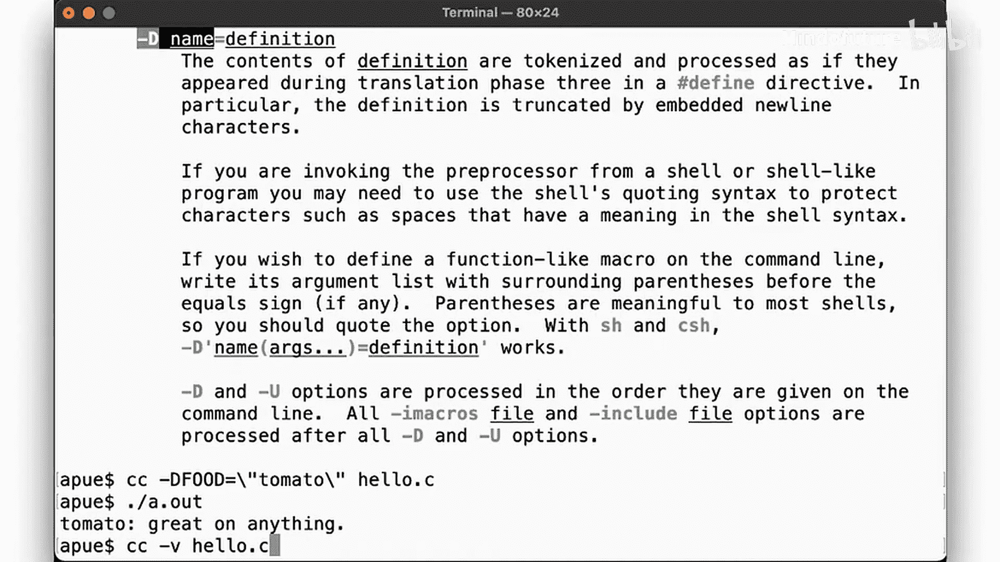

使用 `-v` 标志而不使用 `-E`，我们可以看到完整的编译流程：

```bash
cc -v hello.c -o hello
```

输出会显示 `cc` 依次调用了：
1.  `cpp`（预处理器）
2.  `cc1`（真正的编译器，进行词法、语法、语义分析并生成汇编代码 `.s` 文件）
3.  `as`（汇编器，将汇编代码转换为目标文件 `.o`）
4.  `ld`（链接器，将目标文件与库链接成最终可执行文件）

## 本节要点总结

本节课中我们一起学习了：
*   预处理器 `cpp` 是编译的第一步，负责处理 `#include` 和 `#define` 等指令。
*   我们可以手动运行 `cpp` 或使用 `cc -E` 来查看预处理后的代码。
*   预处理后的代码（`.i` 文件）是纯C代码，已展开所有头文件和宏。
*   使用 `-D` 标志可以在命令行定义宏，预处理器会据此进行文本替换。
*   使用 `-v` 标志可以详细观察 `cc` 驱动整个编译过程所调用的所有工具和步骤。

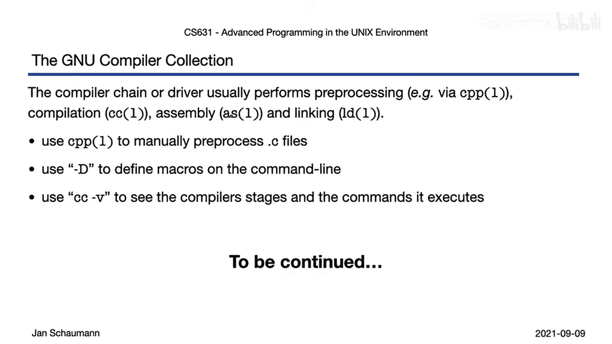

通过理解预处理器的工作，我们能够更好地控制源代码在编译前的形态，这是理解整个编译链和进行高级调试的基础。下一节，我们将进入编译的下一阶段：编译与代码生成。