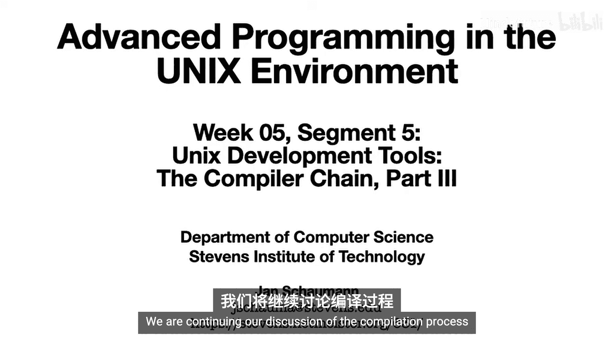
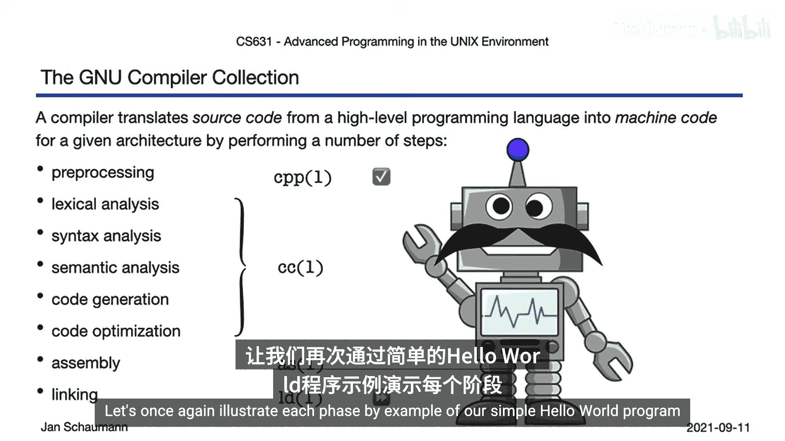
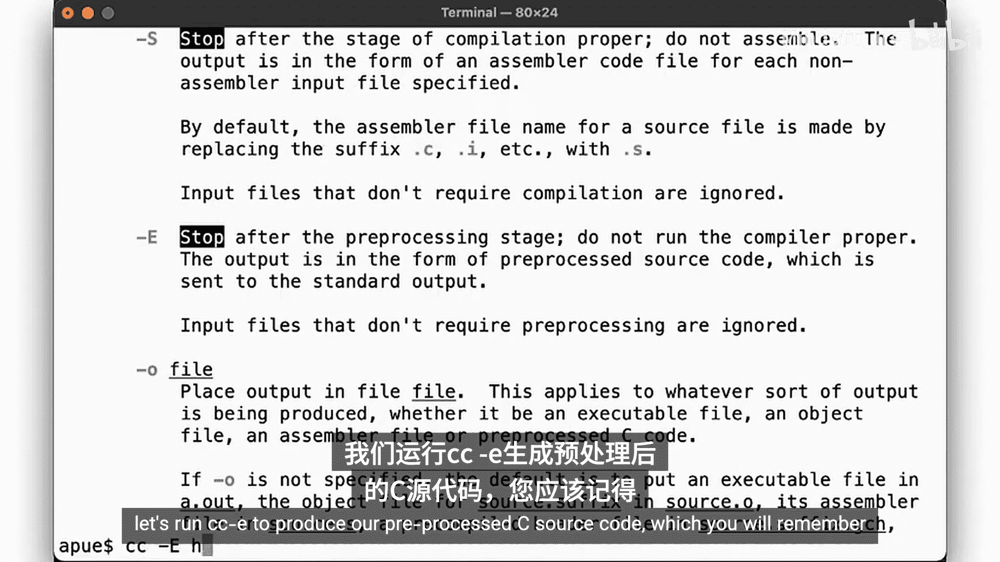
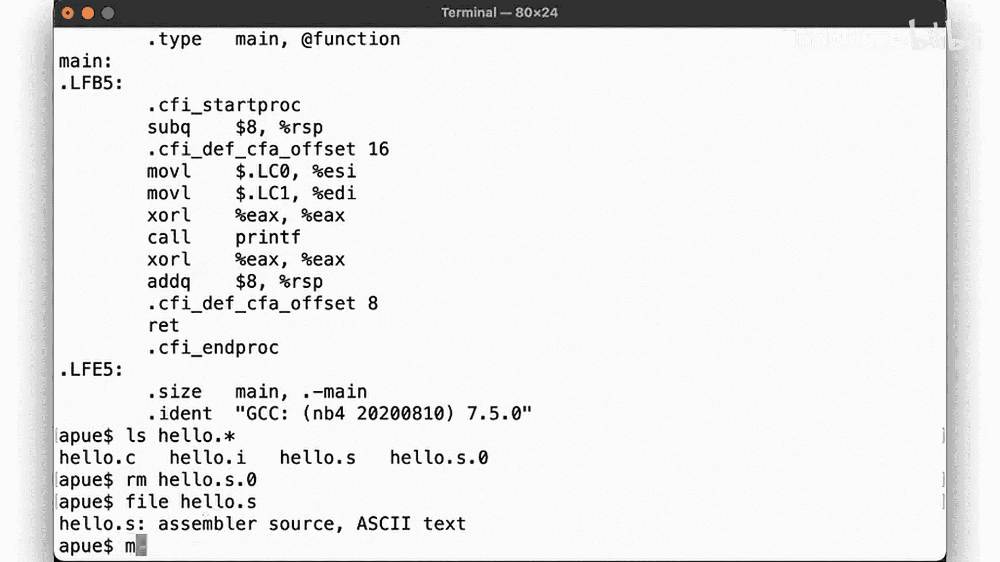
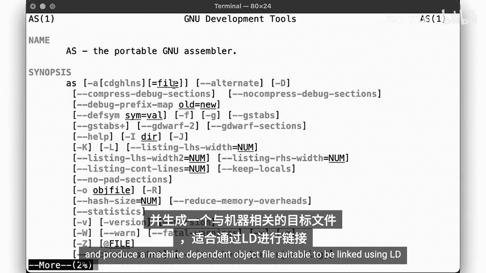
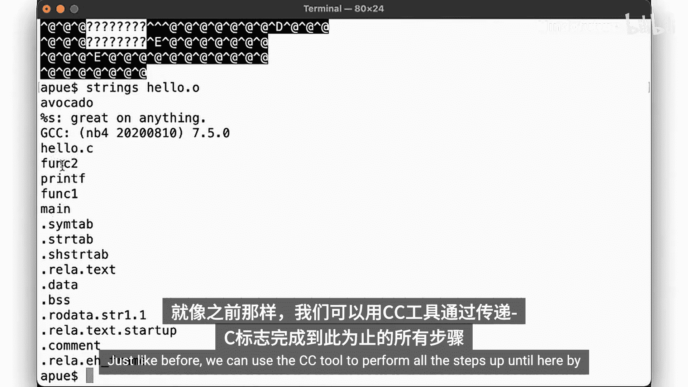
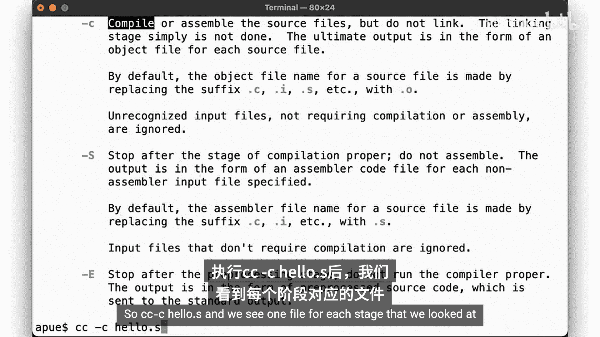
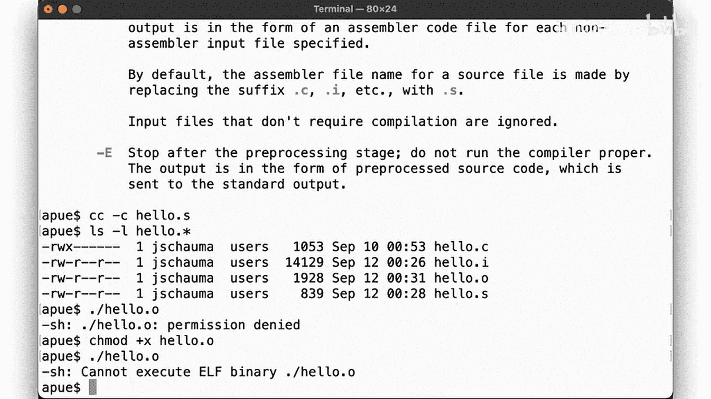
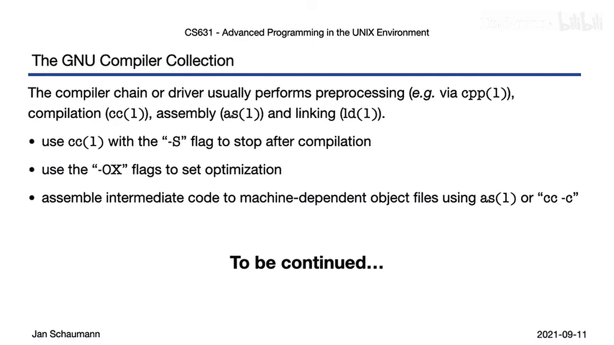

# 028：编译与汇编 🛠️



在本节课中，我们将要学习编译过程的两个核心阶段：编译（Compilation proper）和汇编（Assembly）。我们将通过一个简单的“Hello World”程序示例，一步步演示如何手动执行这些步骤，并观察编译器优化带来的影响。

上一节我们介绍了预处理阶段，本节中我们来看看如何将预处理后的C源代码转换为机器可识别的目标文件。

## 概述

编译过程包含多个阶段。在预处理之后，接下来的步骤由 `cc` 命令处理，包括词法分析、语法分析、语义分析、中间代码生成以及可能的优化。之后，我们会得到汇编代码，再通过汇编器 `as` 将其转换为机器码，最终生成一个二进制目标文件（`.o` 文件）。本节课将重点讲解编译和汇编这两个阶段。

## 从预处理到编译



首先，我们回顾一下上节课结束时的状态。我们有一个简单的C程序 `hello.c`，并使用 `cc -E` 命令生成了预处理后的文件 `hello.i`。



现在，我们将 `hello.i` 文件作为输入，进入编译阶段。我们可以使用 `cc` 命令的 `-S` 选项来在编译后停止，生成汇编代码。

以下是生成汇编代码的命令：
```bash
cc -S hello.i
```
执行该命令后，会生成一个名为 `hello.s` 的汇编代码文件。

## 查看汇编代码

生成的 `hello.s` 文件内容大致如下。我们可以看到 `main` 函数，以及其中调用的 `func1` 和 `func2` 函数。汇编代码中包含了诸如 `LFB`（局部函数开始）和 `LFE`（局部函数结束）的标记，以及将字符串常量（`LC0`, `LC1`）加载到寄存器并调用 `printf` 的指令。

这个流程与我们的C源代码逻辑一致：`main` 调用 `func1`，`func1` 调用 `func2`，`func2` 调用 `printf`。

## 编译器优化

然而，`func1` 和 `func2` 的调用看起来是多余的。编译器在编译阶段可以进行优化。通过查阅手册，我们知道 `cc` 命令支持不同级别的优化选项，例如 `-O1`, `-O2`, `-O3`。

让我们尝试使用最高级别的优化来重新编译：

以下是启用优化后生成汇编代码的命令：
```bash
cc -S -O3 hello.i
```
现在，再看生成的 `hello.s` 文件，你会发现 `main` 函数不再调用 `func1` 和 `func2`，而是直接执行了原本在 `func2` 中的操作——加载字符串并调用 `printf`。编译器通过优化，识别并消除了不必要的函数调用链。



## 从汇编到目标文件



现在，我们得到了汇编代码（`.s` 文件）。下一步是使用汇编器 `as` 将其转换为机器码，生成目标文件（`.o` 文件）。

以下是使用汇编器的命令：
```bash
as -o hello.o hello.s
```
`as` 工具读取汇编代码，并生成一个与机器相关的、适合链接器 `ld` 使用的目标文件。

生成的目标文件是二进制格式，无法直接用文本编辑器阅读。但我们可以使用 `strings` 工具来查看其中包含的可读字符串，这通常会显示程序中用到的函数名和常量字符串。

## 使用 cc 命令整合步骤





实际上，我们不需要手动执行每一个步骤。`cc` 命令的 `-c` 选项可以一次性完成从预处理、编译到汇编的所有工作，直接生成目标文件。

以下是使用 `cc -c` 命令直接生成目标文件的命令：
```bash
cc -c hello.c
```
这条命令会生成 `hello.o` 文件，效果与我们分步执行 `cc -E`、`cc -S` 和 `as` 是相同的。



此时，我们尝试运行 `hello.o` 文件，会发现它无法执行。这是因为目标文件还不是最终的可执行文件，它缺少链接（Linking）这一最后步骤。

## 总结

本节课中我们一起学习了编译过程的两个关键阶段。
1.  **编译**：我们使用 `cc -S` 将C源代码（或预处理后的代码）转换为汇编语言。在这个过程中，编译器可以进行各种优化（通过 `-O` 选项），以提高代码效率。
2.  **汇编**：我们使用汇编器 `as` 将汇编代码（`.s` 文件）转换为二进制的目标文件（`.o` 文件）。这个文件包含了机器指令，但还不是独立的可执行程序。



我们还了解到，可以使用 `cc -c` 命令来简化流程，直接生成目标文件。目前，我们得到了一个目标文件，但它还不能运行。在下一节课中，我们将探讨编译过程的最后一步——链接（Linking），它将多个目标文件和库文件组合在一起，生成最终的可执行文件。