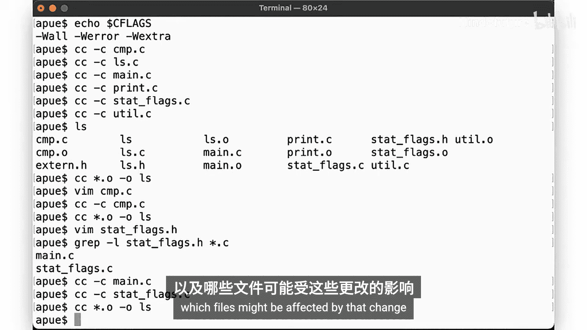
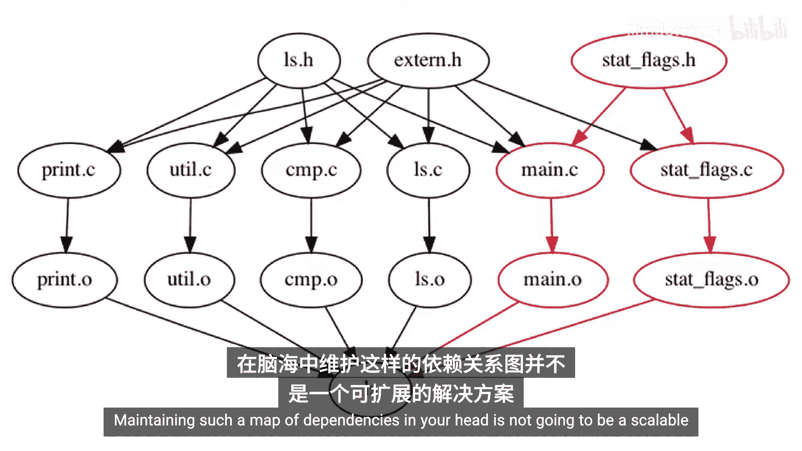
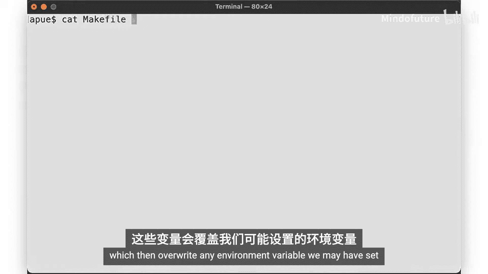
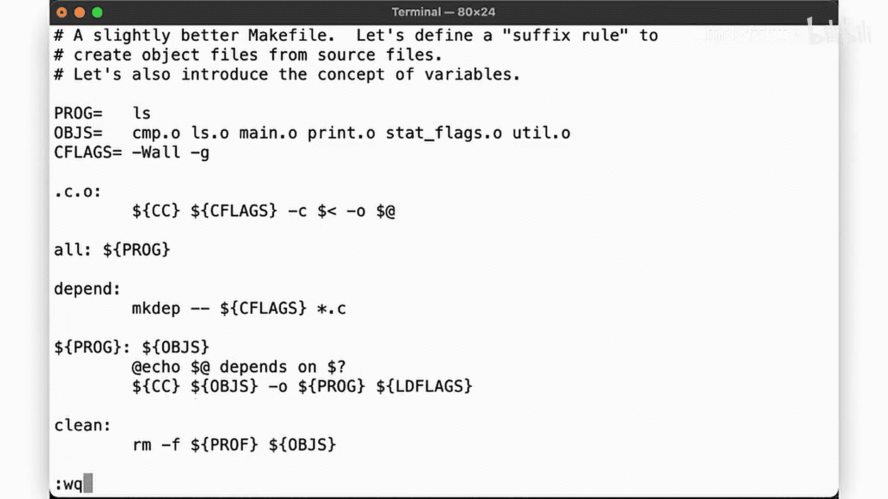
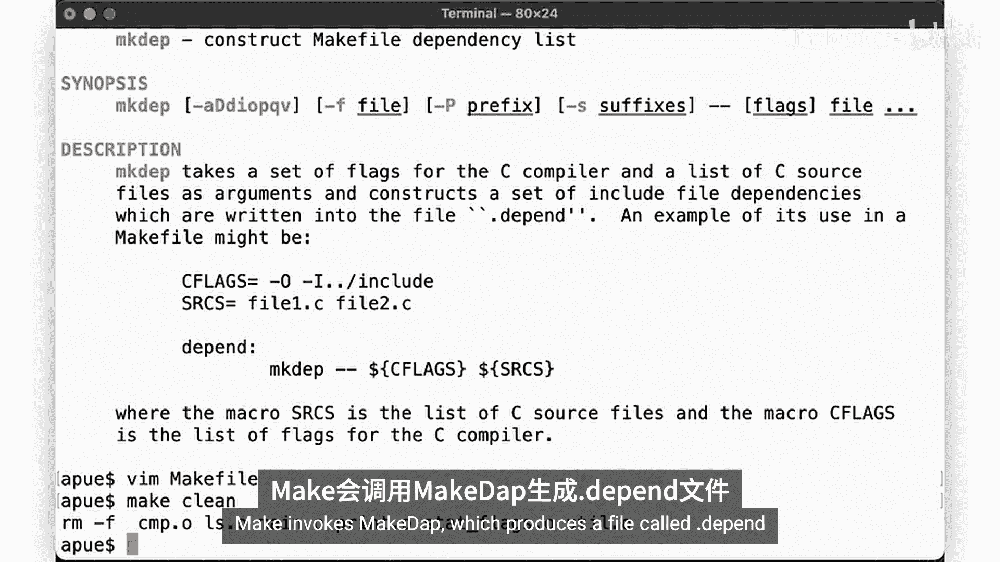
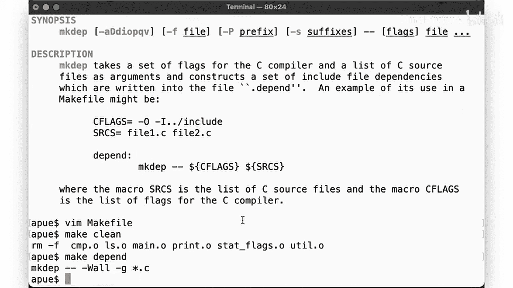
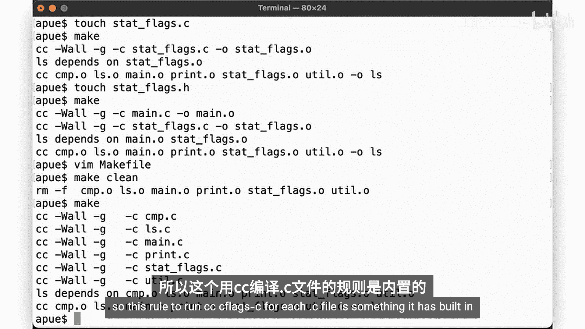
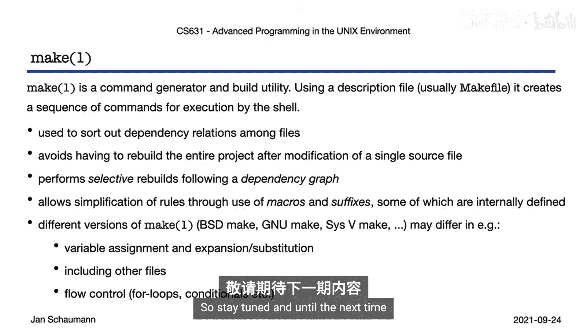

# 030：make(1)工具详解 🛠️

在本节课中，我们将要学习一个名为 `make` 的Unix工具。`make` 是一个用于根据源文件和目标文件之间的依赖关系，有选择性地构建代码项目的工具。我们将看到，`make` 不仅仅是一个在调用编译器时节省打字的便捷方式，它还能智能地管理复杂的构建过程。


## 为什么需要make工具？ 🤔

让我们从一个简单的软件项目开始说明为什么需要 `make`。假设我们的项目由几个源文件和头文件组成。

我们最初可能会这样编译整个程序：
```bash
cc -Wall -Werror -Wextra *.c -o ls
```
这可以正常工作。

现在，假设我们编辑了 `cmp.c` 文件并做了一个简单的修改。当我们重新编译项目时，我们再次运行了相同的命令。但请注意，在这种情况下，我们再次编译了**所有**源文件，即使我们只修改了 `cmp.c` 这一个文件。

对于一个拥有成百上千个源文件的复杂软件项目来说，每次都重新编译所有文件会浪费大量时间。

## 更高效的构建方法 ⚙️

一种更高效的方法是单独编译每个源文件，生成目标文件（`.o` 文件），然后再将它们链接成可执行文件。



我们可以使用 `-c` 选项让编译器只生成目标文件：
```bash
cc -Wall -Werror -Wextra -c cmp.c
cc -Wall -Werror -Wextra -c ls.c
cc -Wall -Werror -Wextra -c main.c
cc -Wall -Werror -Wextra -c stat_flags.c
```
然后链接它们：
```bash
cc cmp.o ls.o main.o stat_flags.o -o ls
```

现在，如果我们只修改了 `cmp.c` 文件，我们只需要重新编译这一个文件，然后重新链接所有目标文件即可。这比重新编译所有文件要高效得多。



## 依赖关系图 📊

然而，当修改涉及到头文件时，情况会变得更复杂。例如，如果我们修改了 `stat_flags.h` 头文件，那么所有包含了这个头文件的源文件（比如 `main.c` 和 `stat_flags.c`）都可能受到影响，需要重新编译。

我们的软件项目可以表示为一个**依赖关系图**。图中显示了文件之间的依赖关系。例如：
*   对 `cmp.c` 的修改要求我们重建 `cmp.o`，然后重建 `ls` 可执行文件。
*   对 `stat_flags.h` 的修改意味着 `main.c` 和 `stat_flags.c` 必须被视为过时，需要重建 `main.o` 和 `stat_flags.o`，然后重新链接生成可执行文件。

在脑海中维护这样一张依赖关系图是不可行的，尤其是对于大型项目。

## 引入make工具 🚀

`make` 工具就是用来维护这些依赖关系的。它从一个名为 `Makefile` 的文件中读取定义，确定所谓的“目标”是由哪些“源”文件构建的。然后，`make` 通过执行指定的 shell 命令来构建这些目标。

`make` 允许我们指定从源文件构建可执行文件所需的命令。

让我们创建一个简单的 `Makefile`。按照惯例，我们使用一个名为 `all` 的目标：
```makefile
all:
    cc -Wall -Werror -Wextra *.c -o ls
```
现在，只需输入 `make` 命令即可构建项目。这节省了打字，但并没有解决依赖问题，我们仍然在重新编译所有文件。

## 改进Makefile：指定依赖 🔗

我们可以通过指定目标及其依赖项来改进 `Makefile`。我们希望构建 `ls` 可执行文件，所以将其作为目标：
```makefile
ls: cmp.o ls.o main.o stat_flags.o
    cc cmp.o ls.o main.o stat_flags.o -o ls

cmp.o: cmp.c
    cc -Wall -Werror -Wextra -c cmp.c

ls.o: ls.c
    cc -Wall -Werror -Wextra -c ls.c

main.o: main.c
    cc -Wall -Werror -Wextra -c main.c

stat_flags.o: stat_flags.c
    cc -Wall -Werror -Wextra -c stat_flags.c
```
现在，`make` 知道 `ls` 依赖于这些 `.o` 文件，而每个 `.o` 文件又依赖于对应的 `.c` 文件。如果 `cmp.c` 的修改时间比 `cmp.o` 新，`make` 就会运行指定的命令重新编译 `cmp.o`，然后重新链接生成 `ls`。

这样，当我们只修改一个源文件时，`make` 会智能地只重新编译必要的文件。

## 使用变量和隐式规则简化 📝

上面的 `Makefile` 有很多重复。我们可以使用变量和隐式规则（后缀规则）来简化它。

以下是如何在 `Makefile` 中定义和使用变量（按照惯例使用大写）：
```makefile
PROGRAM = ls
OBJS = cmp.o ls.o main.o stat_flags.o
CFLAGS = -Wall -Werror -Wextra
```
我们可以定义一个后缀规则，告诉 `make` 如何从 `.c` 文件构建 `.o` 文件：
```makefile
.c.o:
    $(CC) $(CFLAGS) -c $<
```
在这个规则中：
*   `$(CC)` 和 `$(CFLAGS)` 是变量。
*   `$<` 是一个特殊的自动化变量，代表依赖项（即 `.c` 文件）。

现在，我们可以简化我们的目标规则：
```makefile
all: $(PROGRAM)




$(PROGRAM): $(OBJS)
    $(CC) $(OBJS) -o $(PROGRAM)
```
`make` 会自动使用我们定义的后缀规则来构建所需的 `.o` 文件。

## 添加其他常用目标 🧹

一个常见的做法是添加一个 `clean` 目标，用于清理中间生成的文件（如 `.o` 文件）：
```makefile
clean:
    rm -f $(OBJS) $(PROGRAM)
```
运行 `make clean` 会删除所有目标文件和可执行文件，让你可以从头开始构建。

## 处理头文件依赖 🧠

到目前为止，我们的 `Makefile` 还没有处理头文件依赖。如果我们修改了 `stat_flags.h`，`make` 不会知道需要重新编译 `main.c` 和 `stat_flags.c`。

我们可以手动添加这些依赖：
```makefile
main.o: main.c stat_flags.h
stat_flags.o: stat_flags.c stat_flags.h
```
但这对于大型项目来说非常繁琐且容易出错。

## 自动生成依赖：makedepend 工具 🔧





幸运的是，有一个名为 `makedepend` 的工具可以自动分析 C 源文件并生成依赖规则。



我们可以在 `Makefile` 中添加一个 `depend` 目标：
```makefile
depend:
    makedepend -- $(CFLAGS) -- *.c
```
运行 `make depend` 会生成一个包含所有依赖关系的文件（通常是 `.depend` 或 `Makefile.dep`），然后我们可以将这个文件包含到主 `Makefile` 中。这样，`make` 就能知道所有头文件的依赖关系，并在头文件改变时重新编译正确的源文件。

## make 的内置规则和变量 ⚡

`make` 有许多内置的规则和变量，这使得编写 `Makefile` 更加简单。例如：
*   `CC` 变量默认是 `cc`（C 编译器）。
*   对于从 `.c` 文件构建 `.o` 文件，`make` 有一个内置的隐式规则，其命令大致是 `$(CC) $(CFLAGS) -c -o $@ $<`。



这意味着，即使我们不显式地编写 `.c.o` 后缀规则，`make` 通常也知道如何构建 `.o` 文件。我们只需要设置好 `CFLAGS` 等变量即可。

## 命令行覆盖变量 🎛️

我们可以在运行 `make` 时通过命令行覆盖 `Makefile` 中定义的变量。例如：
```bash
make CFLAGS="-O2"
```
这将在构建时使用 `-O2` 优化标志，而不是 `Makefile` 中定义的 `-Wall -Werror -Wextra`。

## 总结 📚

本节课中我们一起学习了 `make` 工具的核心概念和用法。

`make` 本质上是一个命令生成器，它根据 `Makefile` 中的描述来运行命令。但其强大之处在于，它能够基于文件之间的依赖关系和时间戳，智能地决定需要执行哪些命令以及执行的顺序，从而避免在只修改少量文件时重新构建整个项目。

我们学习了如何：
1.  编写基本的 `Makefile` 来定义目标和命令。
2.  指定文件间的依赖关系，实现选择性编译。
3.  使用变量来简化和参数化 `Makefile`。
4.  利用隐式规则（后缀规则）来避免重复代码。
5.  添加像 `clean` 这样的实用目标。
6.  理解头文件依赖的问题，并了解如何使用 `makedepend` 工具（或现代编译器如 `gcc -M`）自动生成依赖。
7.  利用 `make` 的内置规则和变量。
8.  通过命令行覆盖变量值。



虽然我们在这里介绍的示例相对简单，但 `make` 的功能非常强大和复杂。存在不同的实现（如 BSD make 和 GNU make），它们在变量扩展、流程控制等方面略有不同。掌握 `make` 这样的强大构建工具，是充分利用 Unix 作为集成开发环境的重要一环。