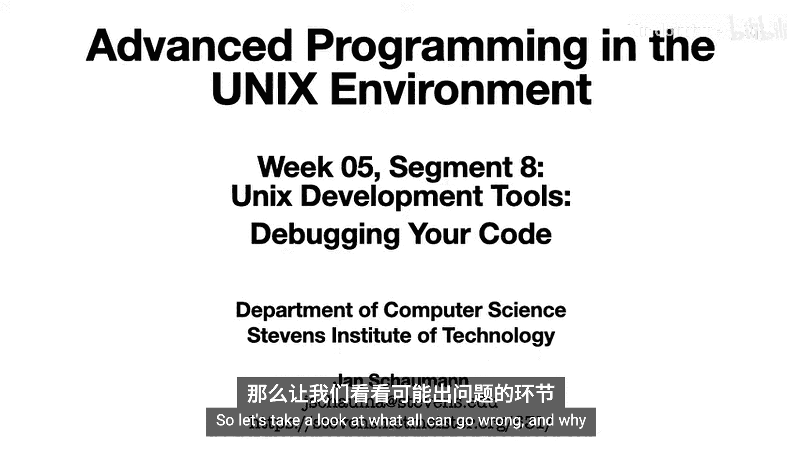
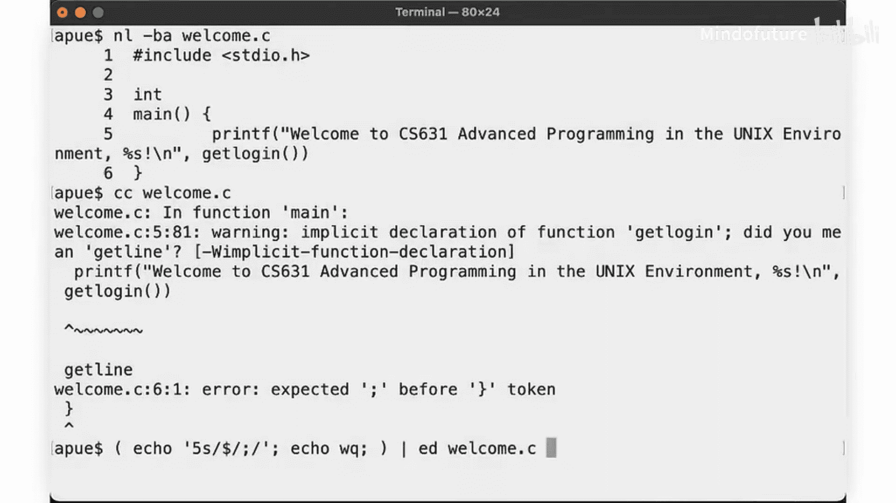
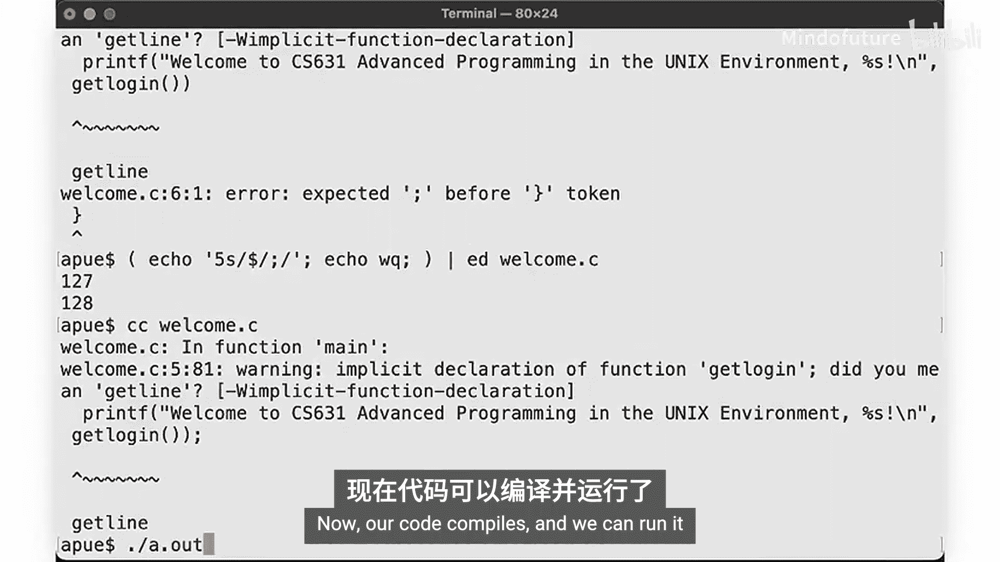
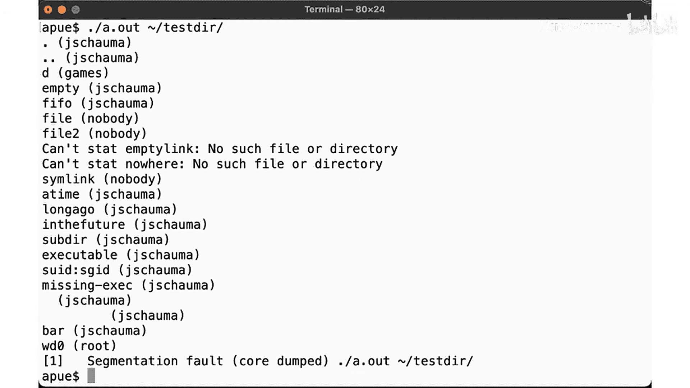
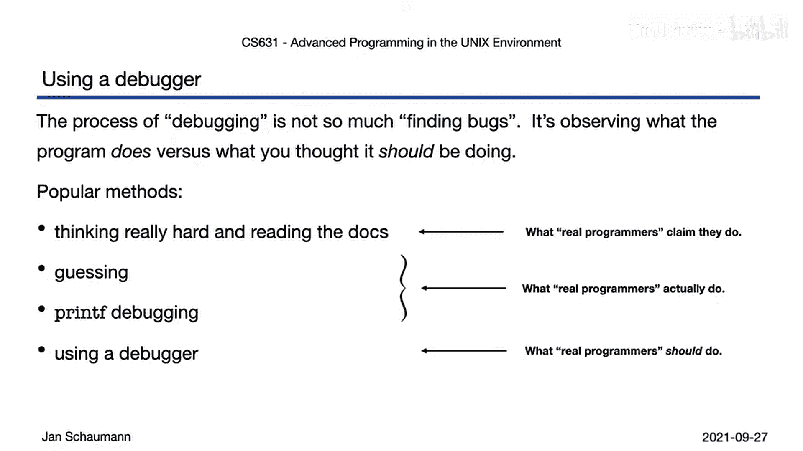

# 031：调试你的代码 🐛

在本节课中，我们将要学习软件开发过程中可能占用你最多时间的一个环节：调试。我们将探讨代码可能出错的原因，并了解为什么使用调试器这样的工具可以显著改善开发流程。



## 概述



上一节我们介绍了如何使用编译器从多个文件构建可执行文件。本节中，我们来看看当代码编译成功但行为不符合预期时，应该如何进行调试。



## 调试的本质

调试不仅仅是“去除错误”。这个过程更偏向于哲学层面，即确定“什么是”和“什么不是”。我们认为自己告诉了计算机要做什么，但计算机有一个恼人的习惯：它只会精确地执行我们告诉它的事情，而不是我们本意想让它做的事情。调试的核心就在于找出我们理解和假设中的错误之处。

## 常见的调试方法

以下是几种最流行的调试方法：

1.  **凝视代码并深入思考**：尝试通过阅读代码本身来理解问题。
2.  **查阅文档**：阅读编译器错误信息、手册页或其他相关文档。
3.  **猜测与尝试**：提出可能的修改方案，这通常与猜测无异。我们不断尝试各种改动，然后重新编译和运行程序来观察效果。
4.  **使用打印语句**：为了检查程序当前在做什么、变量的值或执行到了代码的哪个位置，我们会在代码中插入大量的 `printf` 语句。

## 一个调试示例

让我们回顾一个早期的简单 `ls` 示例。我们对其进行了扩展，使其除了打印文件名外，还打印文件所有者。



```c
// 示例代码片段
struct passwd *pwd = getpwuid(file_stat.st_uid);
printf("Owner: %s\n", pwd->pw_name);
```

这段代码看起来没问题。让我们在 `/tmp` 目录下试试。运行正常。现在，在我们为元终端作业创建的测试目录中试试。哦，看，又一个段错误。这些错误似乎经常发生，真烦人。

我们尝试解决的每个程序最终都以段错误告终。显然，我们的程序存在缺陷。

## 为什么需要调试器

正如刚才试图说明的，使用打印语句进行调试确实是一种有些痛苦的方法。有没有更好的方式呢？答案是肯定的：我们可以使用调试器。

调试器是一个工具，它允许我们检查正在运行的程序，查看程序执行时的确切状态，或者查明程序崩溃时正在做什么。这是一个非常有用的方法。

诚然，真正的程序员可能会声称他们只需戴上“思考帽”，比别人更专注地凝视代码就能解决问题。但在现实中，几乎每个人都在使用快速迭代的猜测性修改混合打印语句的方法。实际上，我们都应该使用一个合适的调试器。

## 本节总结

本节课中，我们一起学习了调试在软件开发中的重要性，回顾了几种常见的、但效率较低的调试方法，并认识到使用专用调试工具的必要性。我们明白了调试的核心是找出自身理解与代码实际行为之间的偏差。



在接下来的视频中，我将向你展示一些简单的例子，教你如何使用强大的调试器 GDB 来修复我们之前未能纠正的程序，以及如何轻松地精确定位程序失败的地点和原因。一旦你掌握了这个技巧，你的效率将会大大提高。准备好你出错的代码示例，点击进入下一个视频吧。