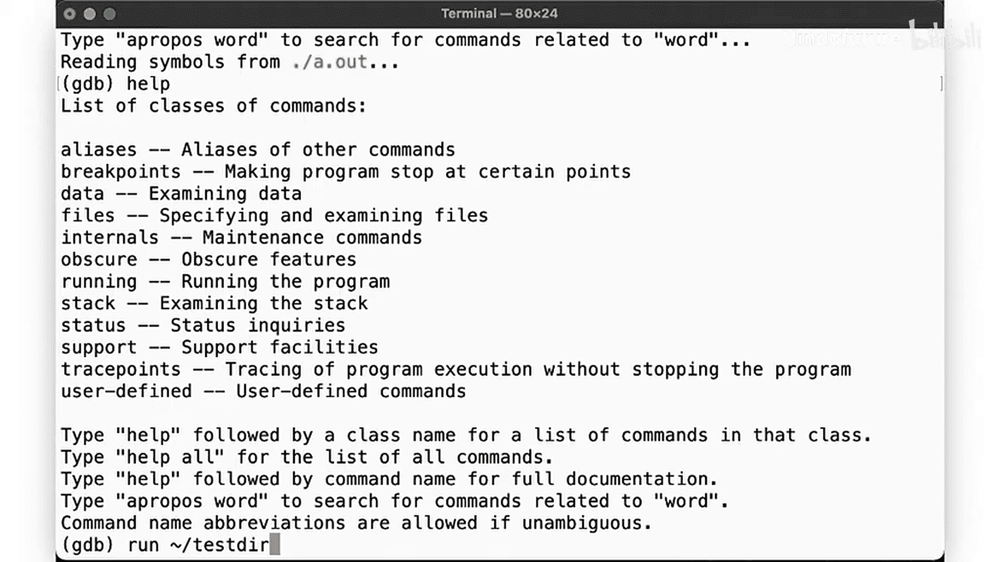
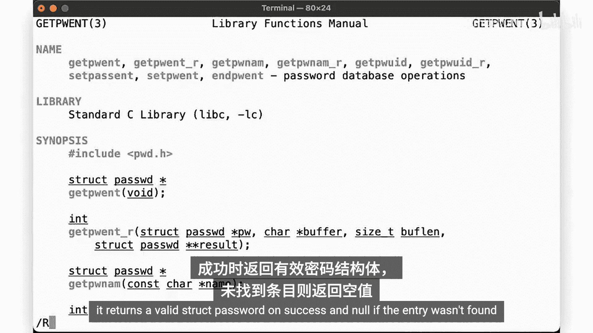
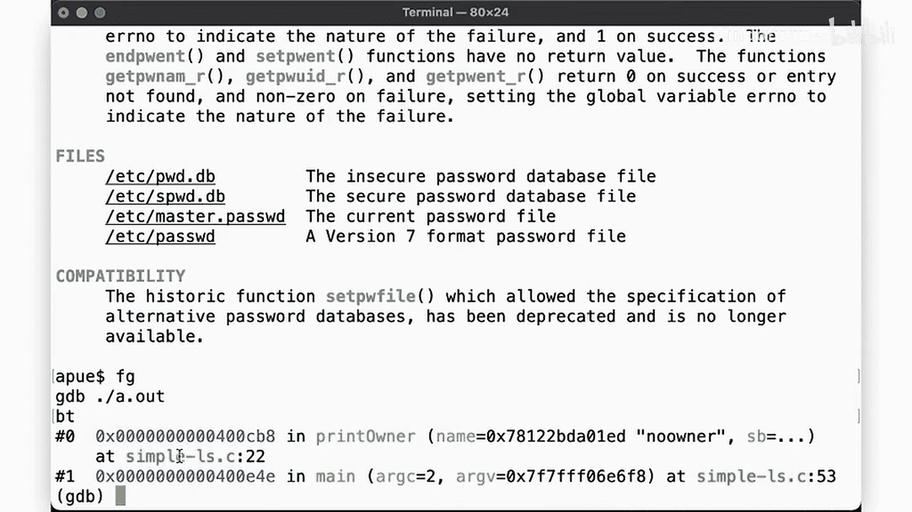
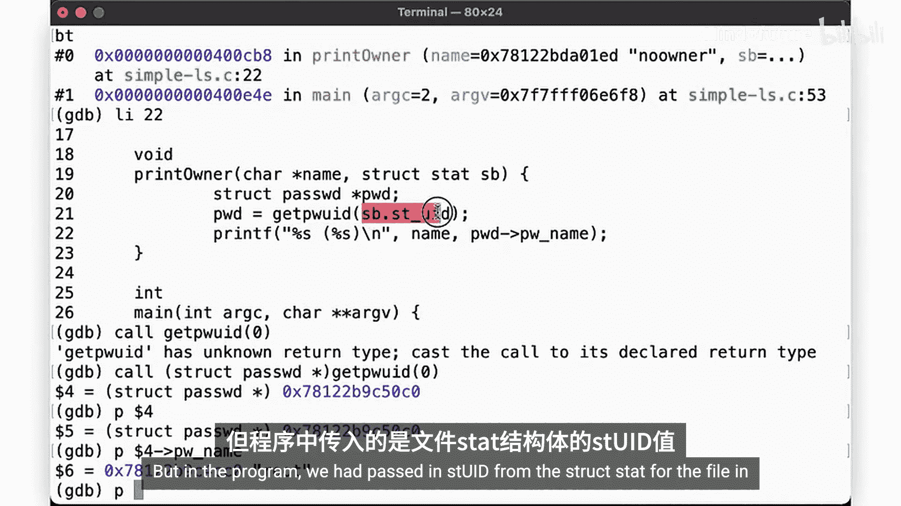
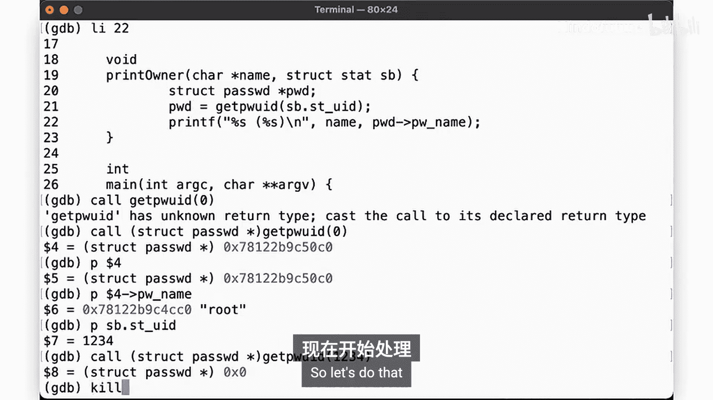
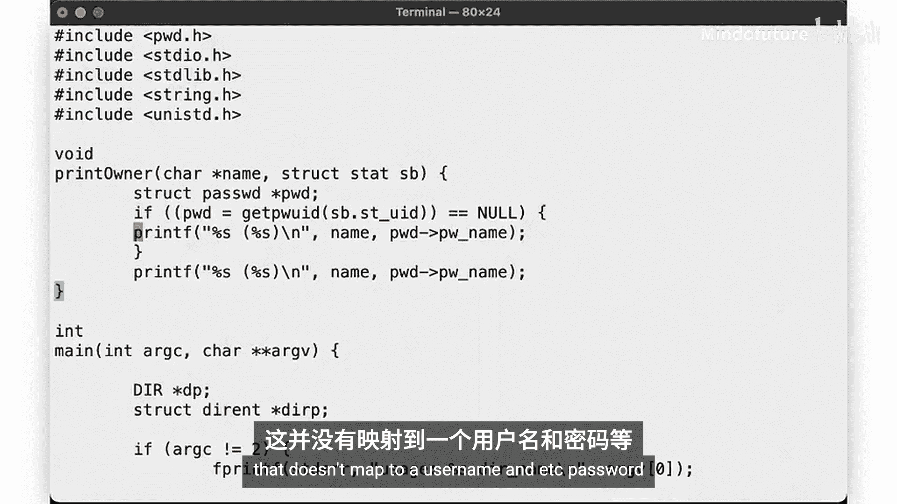
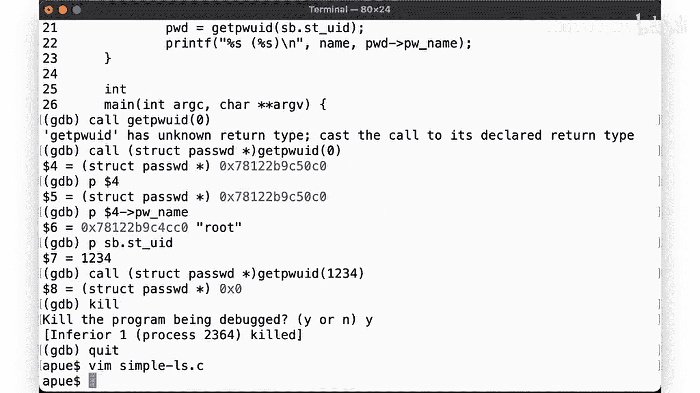
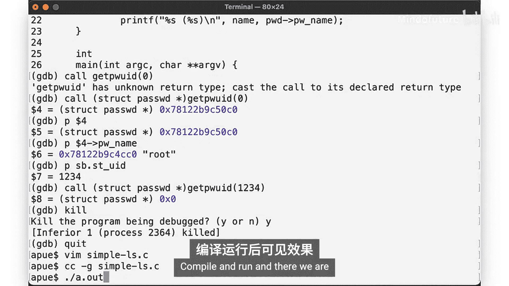
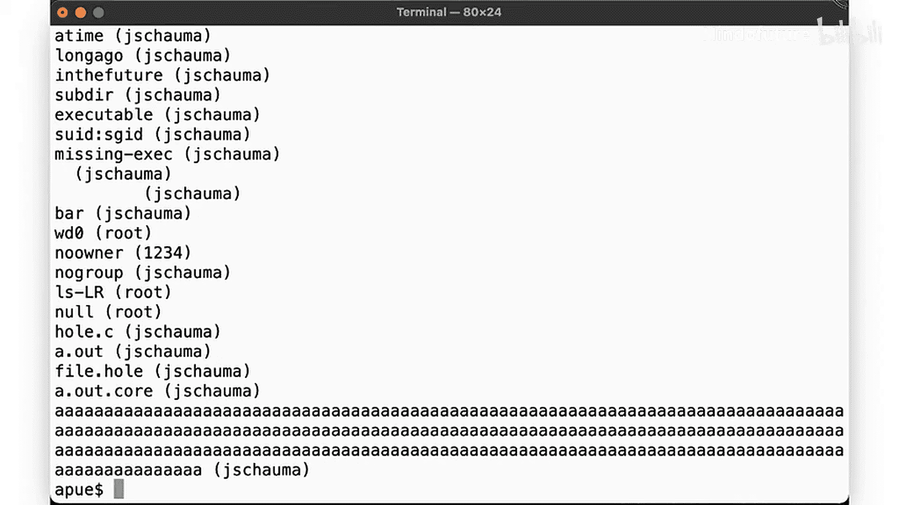
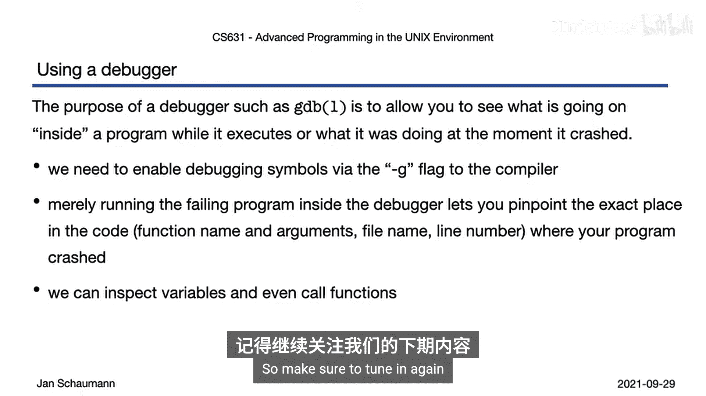

# 032：使用GDB调试程序 🐛

在本节课中，我们将学习如何使用GDB调试器来检查正在运行的程序，并观察其执行过程中的状态。


## 概述

上一节我们遇到了程序段错误。本节中，我们来看看如何使用GDB来定位并解决这个问题。

## 编译程序以启用调试

首先，我们需要在编译程序时启用调试符号。这可以通过在编译命令中添加 `-g` 标志来实现。

```bash
gcc -g simple.c -o simple
```



## 启动GDB并运行程序

编译完成后，我们可以启动GDB来调试程序。

```bash
gdb ./simple
```

GDB会提供一个交互式提示符。要运行程序，可以使用 `run` 命令，后面可以跟上程序所需的命令行参数。

```gdb
run
```

程序将在调试器中执行。当程序发生段错误时，GDB会立即告诉我们错误发生的具体位置。

## 定位错误

GDB会显示错误发生的函数、文件名和行号。例如，它可能显示错误发生在 `simple.c` 文件的第22行，位于 `print_owner` 函数中。

这是调试器的核心功能之一：它无需我们手动添加 `printf` 语句来追踪，就能直接指出问题所在。



我们可以使用 `list` 命令查看出错位置附近的代码。

```gdb
list
```



## 检查变量值

在程序崩溃时，我们可以检查变量的值。例如，要查看变量 `name` 的值，可以使用 `print` 命令或其缩写 `p`。

```gdb
p name
```

如果发现某个指针变量（例如 `pw`）的值为 `0x0`（即 `NULL`），这通常就是导致段错误的原因——我们试图解引用一个空指针。



## 检查函数返回值

GDB允许我们在调试会话中直接调用函数并检查其返回值。这有助于理解为什么某个函数调用会失败。

例如，我们可以手动调用 `getpwuid` 函数，看看它对于特定用户ID（UID）返回什么。



```gdb
p getpwuid(0)
```

如果返回一个有效的结构体指针，说明UID 0（root用户）存在。如果我们传入程序中导致崩溃的UID（例如1234），并发现返回 `NULL`，则说明系统中没有对应的用户。



## 修复代码





基于调试信息，我们发现问题在于 `getpwuid` 可能返回 `NULL`，而代码没有检查这一点就直接使用了返回值。

以下是修复后的常见模式：



```c
struct passwd *pw = getpwuid(statbuf.st_uid);
if (pw == NULL) {
    printf("%d", statbuf.st_uid); // 打印数字UID
} else {
    printf("%s", pw->pw_name); // 打印用户名
}
```

这种模式与 `ls` 命令的行为一致：当文件的所有者UID在系统中没有对应的用户名时，就显示数字UID。

## 验证修复

重新编译并运行修复后的程序，验证段错误是否已解决，并且程序能按预期显示数字UID。

```bash
gcc -g simple.c -o simple
./simple
```

## 总结

本节课中我们一起学习了使用GDB调试程序的基本步骤：
1.  使用 `-g` 标志编译程序以包含调试信息。
2.  启动GDB并运行程序。
3.  利用GDB在程序崩溃时精确定位错误位置（函数、文件、行号）。
4.  在调试器中检查变量的值。
5.  在调试会话中调用函数以测试其行为。
6.  关键收获：**任何可能失败的函数调用，都必须检查其返回值**。

GDB的功能远不止于此。在下一节中，我们将在此基础上，学习如何单步执行程序，并修复之前有缺陷的斐波那契数列程序。



---
**附：核心命令速查**
*   编译调试：`gcc -g file.c -o output`
*   启动GDB：`gdb ./output`
*   运行程序：`run`
*   显示代码：`list`
*   打印变量：`print variable_name` 或 `p variable_name`
*   查看堆栈：`backtrace` 或 `bt`
*   退出GDB：`quit`