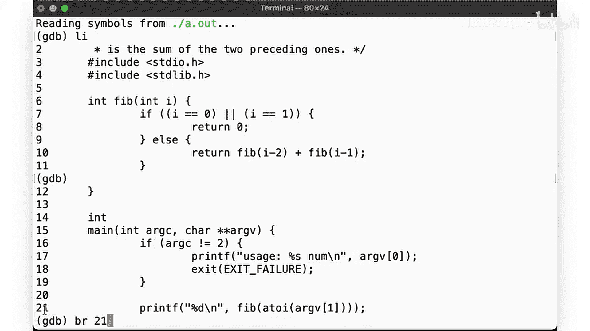
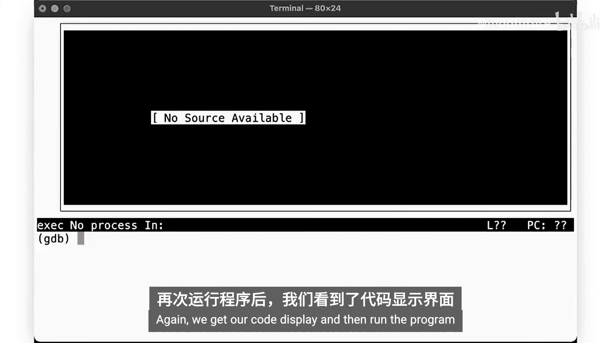
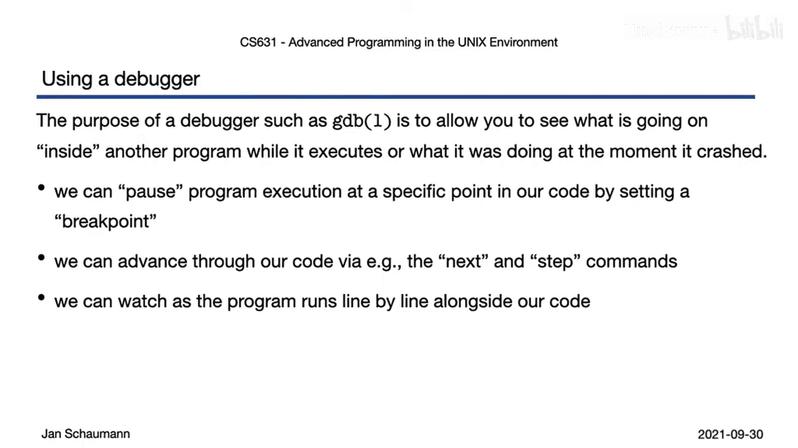

# 033：使用gdb调试（第二部分）🔧

在本节课中，我们将继续学习如何使用gdb调试器来修复程序中的错误。我们将通过一个存在逻辑缺陷的斐波那契数列程序，实践如何设置断点、单步执行以及观察程序运行状态，从而定位并解决问题。

上一节我们通过检查函数返回值修复了一个段错误。本节中，我们来看看如何调试一个逻辑有问题的递归程序。

## 程序问题回顾

我们之前遗留的斐波那契数列程序存在缺陷。其代码如下所示，运行时会导致段错误。

```c
int fib(int i) {
    if (i == 0) {
        return 0;
    }
    return fib(i-1) + fib(i-2);
}
```

## 启动调试并定位问题

首先，在调试器中运行程序。gdb会立即指出错误发生的位置。

```
Segmentation fault in fib on line 6.
```

但这次的错误原因并不像上次那样显而易见。因此，我们不再让程序直接运行失败，而是观察其运行过程。

## 设置断点与观察执行

以下是设置断点并控制程序执行的步骤。

1.  **在主函数设置断点**：在程序启动时暂停执行，以便我们从开始就进行观察。使用命令 `break main`。
2.  **运行程序**：使用 `run` 命令启动程序，它会在 `main` 函数入口处暂停。
3.  **查看代码**：按下 `Ctrl + X` 然后按 `O`，可以切换到同时显示源代码和汇编代码的视图，方便我们跟踪执行到了哪一行。
4.  **单步执行**：使用 `next` (或 `n`) 命令执行当前函数内的下一条语句。

如果此时让程序继续运行，它仍然会在 `fib` 函数中触发段错误。这并没有帮助我们找到根本原因。

## 深入递归过程



为了理解递归是如何出错的，我们在 `fib` 函数内部也设置一个断点。



1.  **在fib函数设置断点**：使用命令 `break fib`。
2.  **查看所有断点**：使用 `info breakpoints` 确认我们有两个断点。
3.  **重新运行并单步跟踪**：从 `main` 开始，使用 `next` 执行到调用 `fib(7)` 的语句。然后使用 `step` (或 `s`) 命令**进入** `fib` 函数内部。
4.  **观察递归调用**：反复使用 `step` 或直接按回车（重复上一条命令），观察递归的调用过程。我们发现程序会以 `i-2` 的方式递归调用 `fib(5)`, `fib(3)`, `fib(1)`, `fib(-1)`... 这永远不会满足 `i == 0` 的基本条件，从而导致了无限递归和栈溢出。

`info breakpoints` 显示断点已被触发了数十次，这证实了递归没有正确终止。

## 分析与修复逻辑错误

问题的根源在于递归的基本情况定义不完整。斐波那契数列的正确定义是：
*   **fib(0) = 0**
*   **fib(1) = 1**
*   **fib(n) = fib(n-1) + fib(n-2) (当 n > 1 时)**

我们的原始代码缺少了对 `fib(1)` 的处理。因此，我们修改 `fib` 函数：

```c
int fib(int i) {
    if (i == 0) {
        return 0;
    }
    if (i == 1) {
        return 1; // 修复：添加基本情况 fib(1) = 1
    }
    return fib(i-1) + fib(i-2);
}
```

修复后，程序为 `fib(7)` 正确返回了结果 `13`。我们进一步测试了从0到10的输入，结果均正确。

## 核心调试技巧总结

本节课中我们一起学习了以下关键的gdb调试技巧：

*   **设置断点**：使用 `break <函数名>` 或 `break <行号>` 在特定位置暂停程序执行。
*   **控制执行流**：
    *   `next`：执行当前函数内的下一条语句，**不进入**被调用的函数内部。
    *   `step`：执行下一条语句，如果该语句是函数调用，则**进入**该函数内部。
*   **观察状态**：在断点处暂停时，可以检查变量的值，并使用布局视图观察代码执行位置。

通过设置断点和单步执行，我们能够可视化程序的执行流程，从而识别并修复那些仅靠错误信息难以追踪的逻辑问题。



当然，调试器还有更多强大的功能。在下一个视频中，我们将探索另一个需要调试的程序，并学习更多调试技巧。敬请期待，感谢观看！