# 034：使用gdb(1)第三部分 🔍

在本节课中，我们将学习如何使用调试器（gdb）来修复一个存在问题的程序。我们将通过一个具体的例子，演示调试的迭代过程，并巩固一些重要的编码实践。

## 概述

我们将分析一个简单的C程序，该程序因未正确处理命令行参数和内存分配而崩溃。通过使用gdb，我们将逐步定位问题根源，并学习如何动态修改变量以测试不同场景。

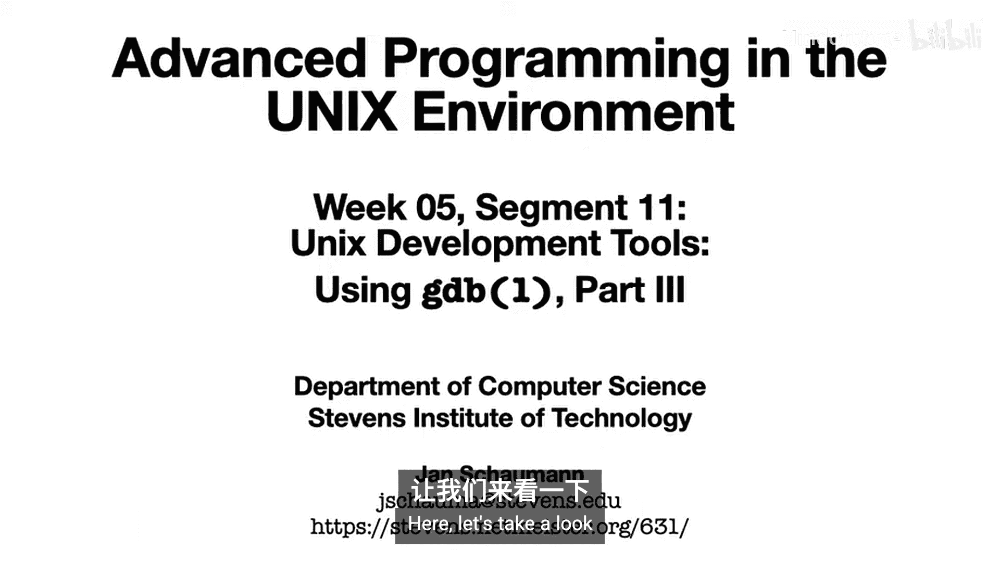

---

上一节我们介绍了调试器的基本用法，本节中我们来看看如何应用这些技能解决实际问题。

这是一个非常简单的`main`函数，它调用了一个名为`print_buffs`的函数。

```c
int main(int argc, char **argv) {
    print_buffs(argv[1]);
    return 0;
}
```

`print_buffs`函数接收一个数字参数，为几个缓冲区分配内存，复制一些数据，读取用户输入并打印结果。

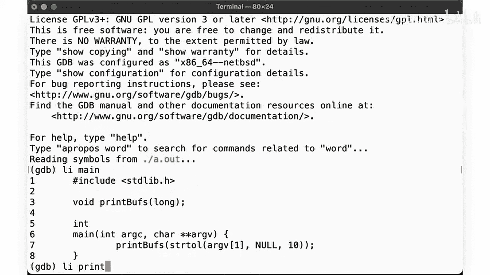

```c
void print_buffs(char *num_str) {
    long n = strtol(num_str, NULL, 10);
    char *buff = malloc(n);
    gets(buff);
    printf("You entered: %s\n", buff);
    free(buff);
}
```

编译程序时，编译器会警告我们使用了不安全的`gets`函数，但我们将暂时忽略此警告。

运行程序时，它崩溃了（段错误）。这是预料之中的。

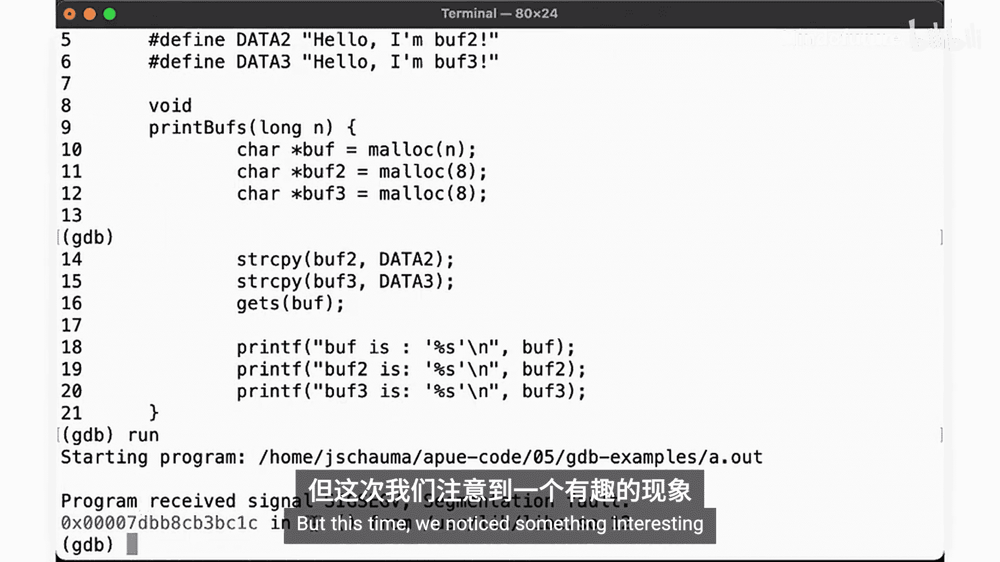

## 初步调试

我们遇到这类问题时，首先在调试器中运行程序。

使用`gdb`启动程序，并列出`print_buffs`函数的代码。注意，我们无需指定文件名即可列出多个源文件的代码，这非常方便。

运行程序，再次发生段错误。但这次我们注意到一个有趣的现象：段错误并非发生在我们的函数中，而是发生在`libc`库的某个地方（例如`strtol`）。

我们只看到问号，因为标准C库没有调试符号，所以调试器无法像查看我们的代码一样深入查看库代码。

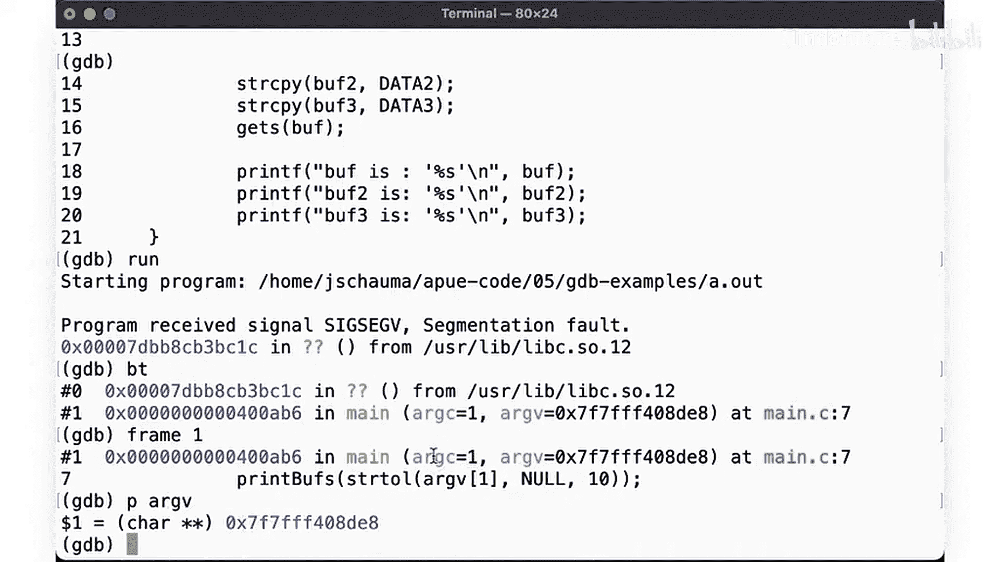

让我们查看调用堆栈（backtrace）。错误仍然发生在`main`函数中。

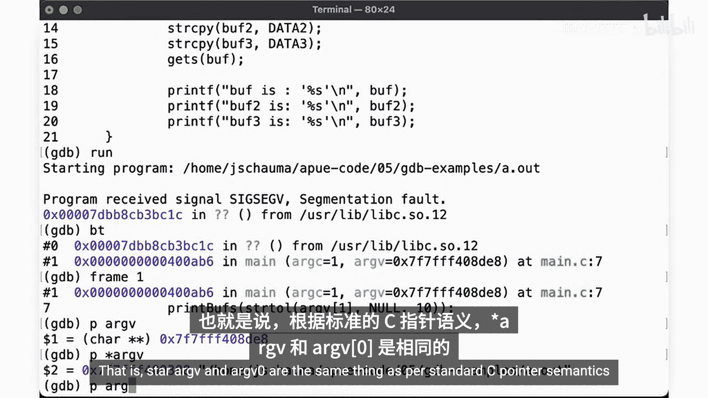

选择相关的栈帧。错误发生在这里。段错误发生在`libc`的`strtol`中，而不是`print_buffs`中。因此，问题一定出在对`strtol`的调用上。

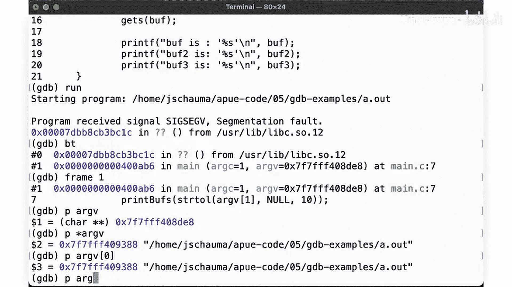

我们向`strtol`传递了`argv[1]`，让我们检查`argv`。

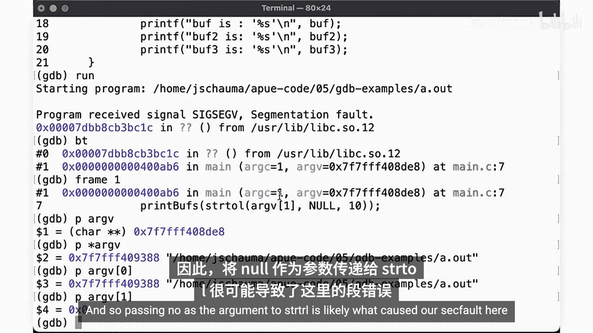

`argv`是一个`char **`类型。它的第一个元素是什么？

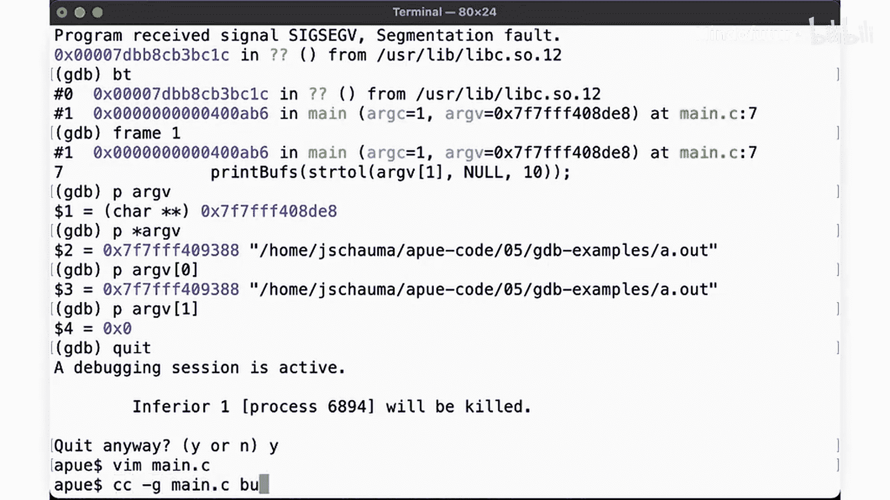

要获取数组的第一个元素，我们可以查看内存位置。我们会发现可执行文件的路径，正如预期的那样。`*argv`和`argv[0]`在标准C语义中是相同的。

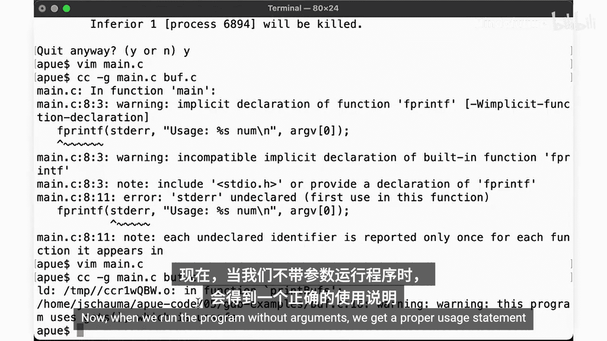

那么，`argv[1]`是什么？它是`NULL`，因为我们没有提供任何命令行参数。因此，将`NULL`作为参数传递给`strtol`很可能导致了这次段错误。

## 修复第一个问题

我们在`main`函数中添加一个检查，以确保程序被正确使用。

```c
int main(int argc, char **argv) {
    if (argc < 2) {
        fprintf(stderr, "Usage: %s <number>\n", argv[0]);
        return 1;
    }
    print_buffs(argv[1]);
    return 0;
}
```

现在，当我们不带参数运行程序时，会得到一个正确的用法说明。到目前为止，一切顺利。

## 发现第二个问题

现在我们需要提供一个数字。让我们输入`-1`。程序提示我们输入。我们输入“hey there”。结果，我们又得到了一个段错误。

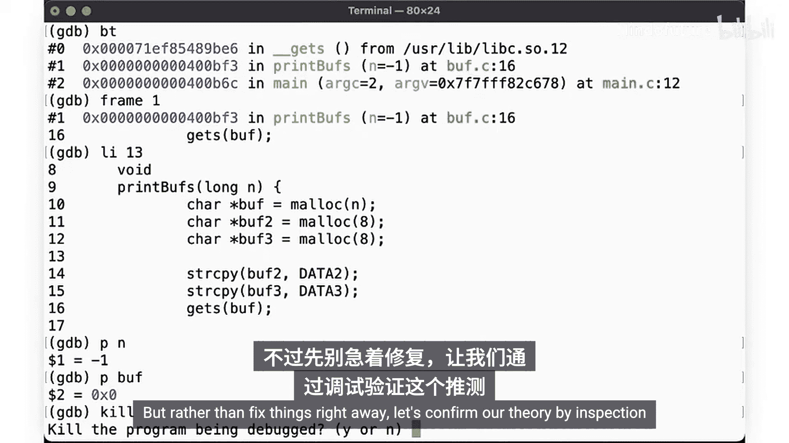

再次进入调试流程。`gets`尝试读取我们在此处分配的缓冲区数据。段错误发生在`gets`中。

查看调用堆栈。`main`调用了`print_buffs`，`print_buffs`调用了`gets`，然后`gets`崩溃了。

让我们查看栈帧1（`print_buffs`）。这里有什么？`n`是`-1`。`buff`是什么？它是`NULL`。

这并不奇怪。我们告诉`malloc`分配`-1`字节，这当然会失败。但由于我们没有检查函数的返回值，我们随后尝试访问`NULL`来存放用户数据，因此导致了段错误。

## 动态测试与验证

与其立即修复，不如先通过检查来确认我们的理论。我们在`print_buffs`函数处设置断点。

再次以`-1`作为参数运行。`n`确实是`-1`。它的类型是`long`。

假设我们没有使用`-1`，而是用了不同的值，会发生什么？让我们在gdb中尝试一下。我们可以在运行时修改变量。

因此，即使我们传递了`-1`，我们现在也可以将其更改为不同的值。`-1`显然是无效的，我们不知道用户可能想输入多少数据。所以，让我们通过将`n`设置为一个非常大的数字（例如1024）来确保获得足够大的缓冲区。

检查并确认`n`现在是1024。然后继续执行。那么`malloc`将不会尝试分配`-1`字节，而是分配那么多字节。

我们可以再次输入数据。然而，再次发生段错误，在相同的位置。因为`buff`再次是`NULL`。这同样不奇怪。我们尝试为`buff`分配一个 insane 数量的内存（接近1PB）。当然，`malloc`会失败。但我们又一次没有检查返回值。

## 修复核心问题

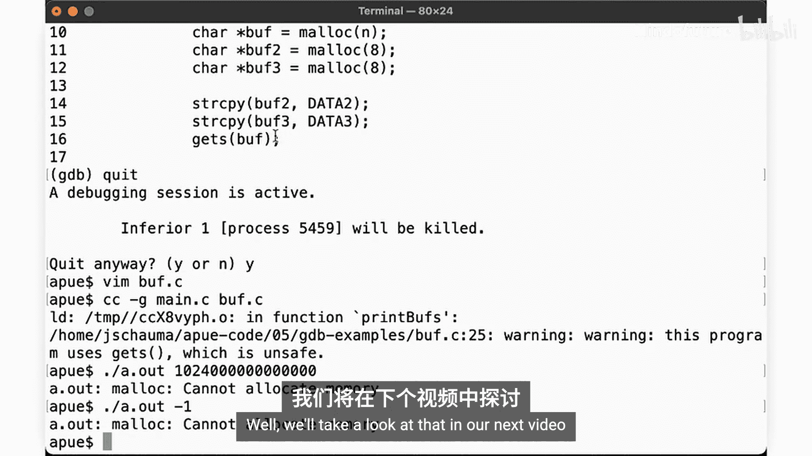

让我们更新程序，修复它，使其验证`malloc`是否成功，无论用户在命令行输入什么值。

```c
void print_buffs(char *num_str) {
    long n = strtol(num_str, NULL, 10);
    char *buff = malloc(n);
    if (buff == NULL) {
        fprintf(stderr, "malloc failed!\n");
        exit(1);
    }
    gets(buff);
    printf("You entered: %s\n", buff);
    free(buff);
}
```

这是所有代码应有的样子。如果`malloc`失败，就报错。始终检查任何可能失败的函数的返回值，并适当地处理错误。对其他缓冲区也重复此操作。

现在编译它。用户不再能输入无效的数字。

## 总结

本节课中我们一起学习了如何利用gdb进行迭代式调试。

*   我们能够看到调试器可以毫无问题地跟踪程序的执行，并将其与代码行关联起来，即使是跨多个源文件。
*   然而，如果错误发生在没有调试符号的代码位置（例如，失败发生在标准C库提供的函数中），那么调试器只能告诉我们错误发生了，或提供其他最少的信息。
*   最后，我们在这个例子中看到，我们不仅能够被动地观察程序的执行，还可以在程序运行时改变它。例如，我们可以为变量分配不同的值，以观察程序可能的行为。

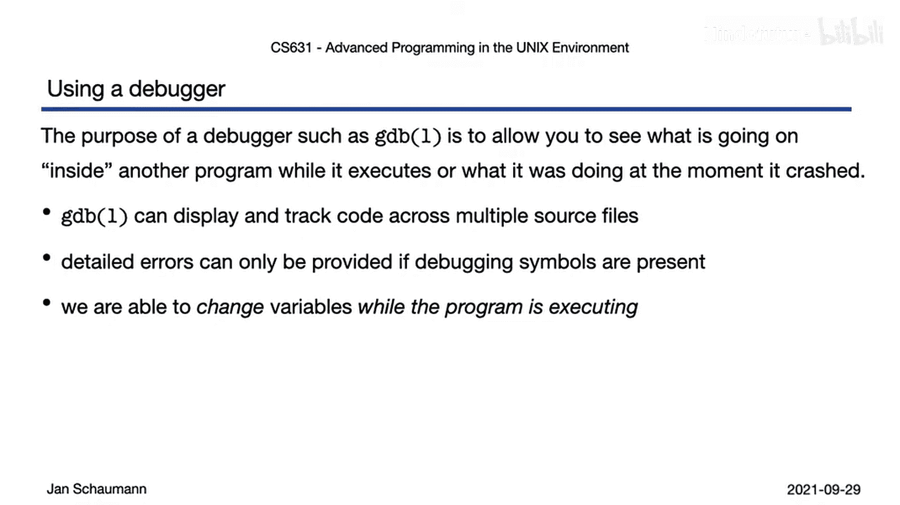

现在，我们的程序看起来行为正常了，但我们还有最后一个视频要讲解，我将展示如何使用调试器来检查特定的内存位置，并帮助你理解数组和指针的工作原理。敬请关注，感谢观看。