# 037：标准文本编辑器ed(1) 🖋️

在本节课中，我们将要学习Unix系统中的标准文本编辑器——`ed`。尽管它看起来古老且不直观，但理解`ed`的工作原理对于深入掌握Unix哲学、理解后续工具（如`vi`、`sed`）的起源，以及在某些特定场景下的脚本化编辑至关重要。

## 概述：ed是什么？🤔

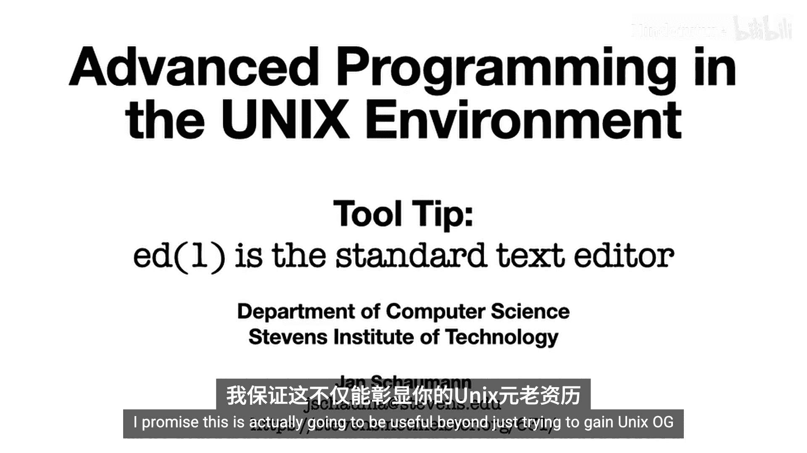

`ed`是一个行导向的文本编辑器。它不会在屏幕上显示文件的全部内容，而是基于行进行操作。`ed`由Ken Thompson于1969年编写，是原始Unix系统的三个核心组件之一（另外两个是Shell和汇编器）。它后来启发了`ex`编辑器，并最终演变为`vi`。

## 初识ed：一个典型的“初体验” 😅

让我们启动`ed`，看看会发生什么。

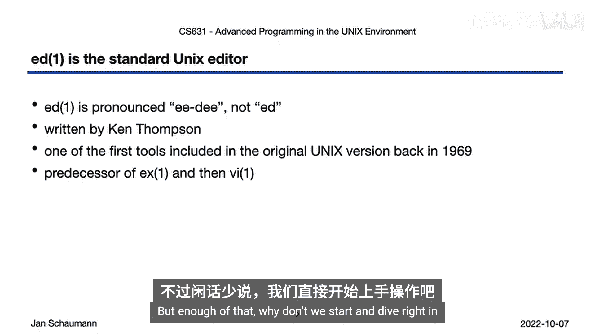

```
$ ed
?
?
```

输入任何字符，`ed`都只回复一个问号。输入`help`或`?`也得不到帮助。这是因为`ed`启动后默认处于**命令模式**，而我们输入的内容被当作无效命令处理了。

要退出，可以尝试按`Ctrl+C`，或者输入`Ctrl+D`（发送EOF信号）。这通常是用户第一次使用`ed`的经历，并不友好。

## 理解ed的工作模式 🔄

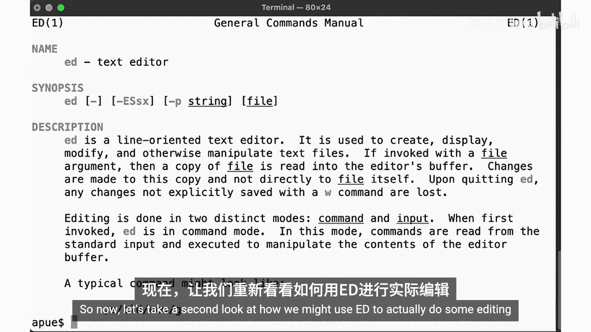

根据手册页，`ed`在两种不同的模式下运行：
*   **命令模式**：在此模式下，可以输入命令来操作文本（如打印、删除、替换）。
*   **输入模式**：在此模式下，输入的内容会被当作文本插入到文件中。

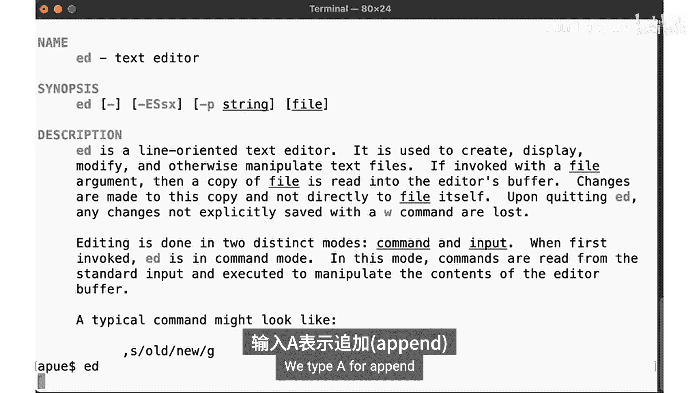

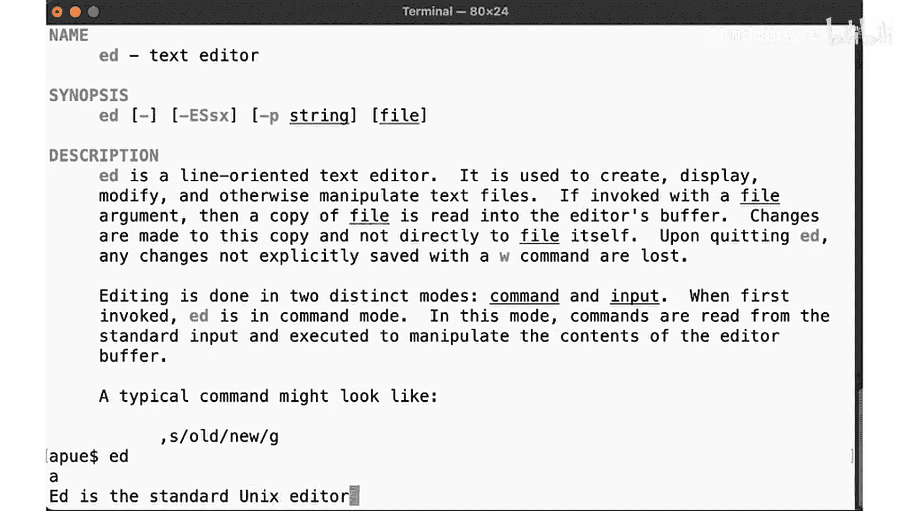

模式之间的切换是关键。我们第一次启动时处于命令模式，所以无法直接输入文本。

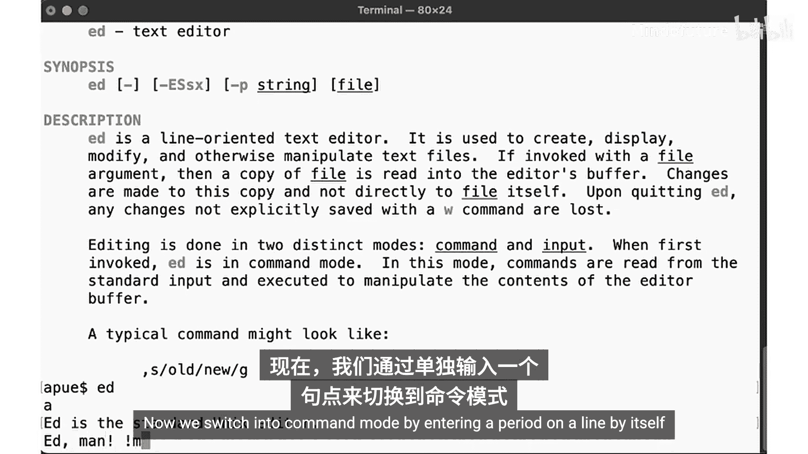

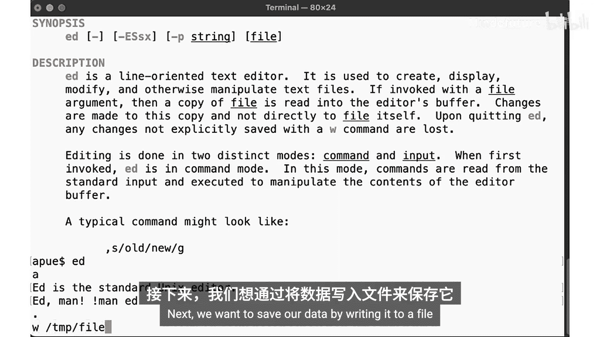

## 基础编辑：创建并保存文件 📝

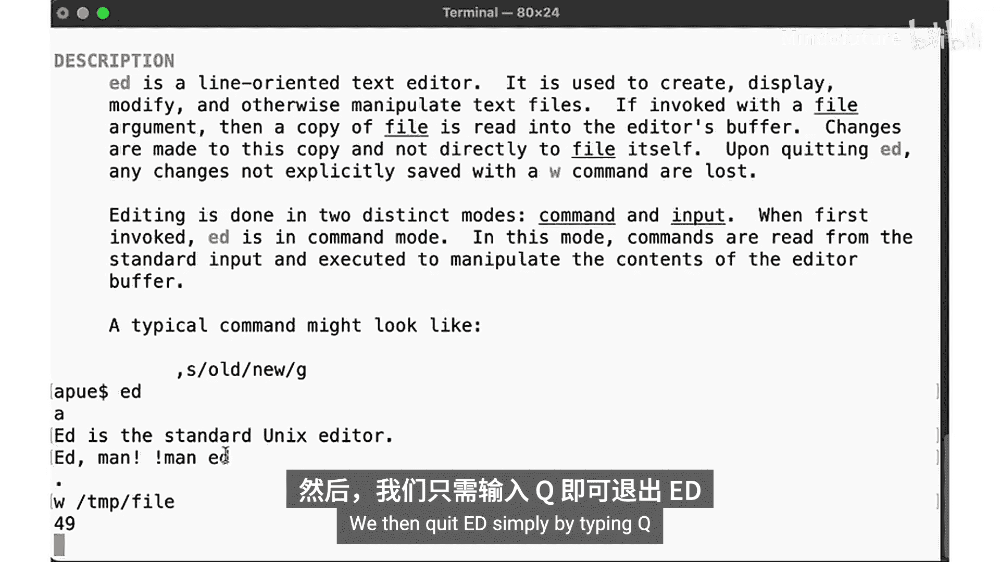

上一节我们介绍了`ed`的两种模式，本节中我们来看看如何实际使用它来创建和编辑一个文件。

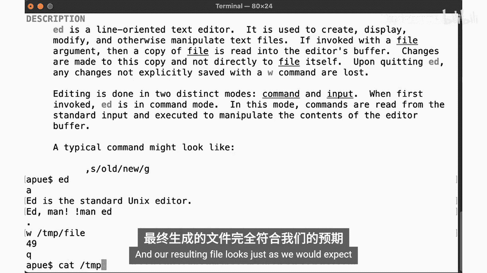

1.  启动`ed`并进入命令模式。
    ```
    $ ed
    ```
2.  输入追加命令`a`，进入输入模式。
    ```
    a
    ```
3.  输入文本内容，每行以回车结束。
    ```
    Hello, world!
    This is a test.
    ```
4.  在新的一行输入一个单独的句点`.`，退出输入模式，返回命令模式。
    ```
    .
    ```
5.  使用写入命令`w`后跟文件名，保存内容。
    ```
    w myfile.txt
    29
    ```
    `ed`会显示写入的字节数（例如`29`）。
6.  使用退出命令`q`离开编辑器。
    ```
    q
    ```

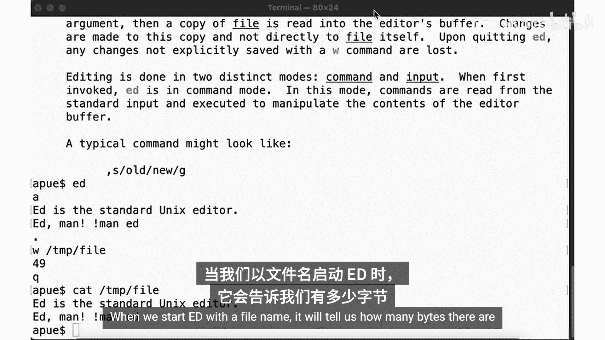

现在，文件`myfile.txt`已经保存了我们输入的内容。

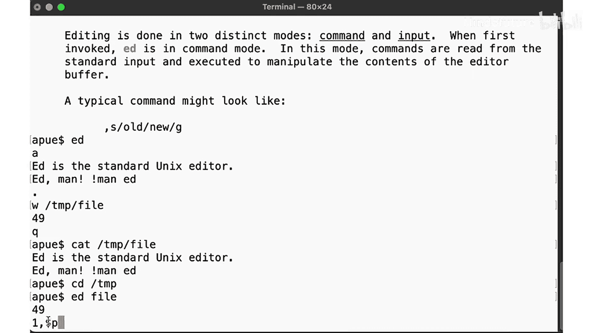

## 编辑现有文件与命令语法 ✏️

我们已经学会了创建新文件，现在让我们学习如何编辑一个已存在的文件。

使用文件名作为参数启动`ed`：
```
$ ed myfile.txt
29
```
`ed`会显示文件的字节数，并将当前位置置于文件末尾的命令模式。

`ed`命令可以对**行范围**进行操作。行地址可以是：
*   数字：如`1`表示第一行。
*   `$`：表示最后一行。
*   正则表达式：如`/pattern/`。

以下是常用命令示例：

*   **打印文件内容**：使用`p`（print）命令。
    ```
    1,$p
    ```
    打印第1行到最后一行。可以简写为：
    ```
    ,p
    ```
*   **插入文本**：使用`i`（insert）命令，在指定行**之前**插入。
    ```
    1i
    [进入输入模式，输入文本]
    .
    ```
*   **追加文本**：使用`a`（append）命令，在指定行**之后**追加。
    ```
    $a
    [进入输入模式，输入文本]
    .
    ```
*   **替换文本**：使用`s`（substitute）命令，语法为`s/旧内容/新内容/`。
    ```
    1s/Hello/Hi/
    ```
    将第一行的“Hello”替换为“Hi”。
*   **删除行**：使用`d`（delete）命令。
    ```
    2d
    ```
    删除第二行。
*   **显示行号**：使用`=`命令。
    ```
    ,=
    ```
    显示文件的总行数。
    ```
    1,3=
    ```
    显示第1到3行的行号。

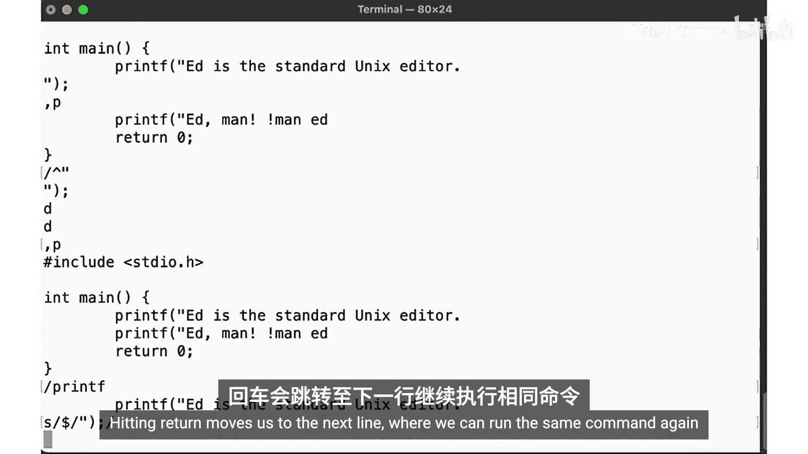

## 实战：将文本文件改为C程序 💻

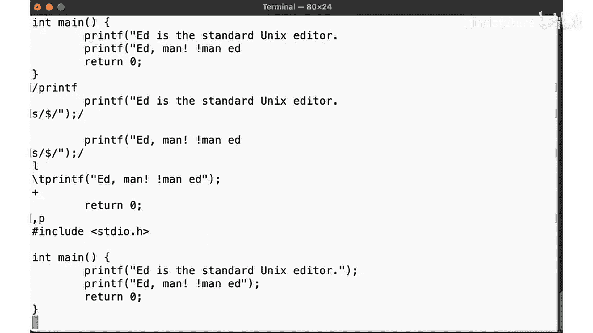

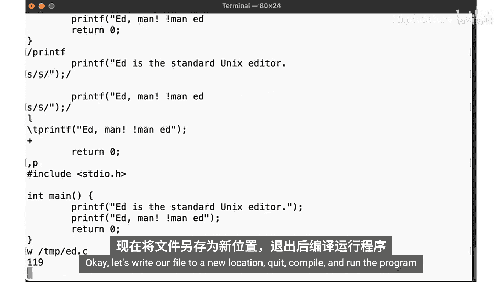

让我们用`ed`将一个文本文件编辑成一个简单的C程序。

1.  假设我们有一个文件`hello.txt`，内容为两行文本。我们想把它变成：
    ```c
    #include <stdio.h>
    int main() {
        printf("Hello, world!\n");
        printf("This is a test.\n");
    }
    ```
2.  首先，在开头插入头文件和主函数定义。
    ```
    $ ed hello.txt
    1i
    #include <stdio.h>
    int main() {
    .
    ```
3.  将原有的两行文本替换为`printf`语句。我们可以使用全局命令`g`配合替换命令`s`。
    ```
    g/.*/s/^/    printf("/  # 在所有行前添加"printf("
    g/.*/s/$/");/           # 在所有行后添加");"
    ```
4.  在文件末尾追加右大括号。
    ```
    $a
    }
    .
    ```
5.  保存并退出。
    ```
    w hello.c
    q
    ```

## ed与脚本化编辑 🤖

由于`ed`拥有独立的命令模式，并且可以从标准输入读取命令，这使得它非常适合**脚本化编辑**。这是`ed`一个非常强大且至今仍有价值的特性。

我们可以将一系列`ed`命令写在一个脚本文件中，或者通过管道传递给它。

**示例1：通过echo传递命令**
```
$ echo -e '1,$p\nq' | ed hello.c
```
这个命令会打印`hello.c`的所有内容然后退出。`-e`参数允许echo解释反斜杠转义符（如`\n`为换行）。

**示例2：使用脚本文件进行编辑**
创建一个脚本文件`ed_script.txt`：
```
4,5s/");/\\n");
w
q
```
然后执行：
```
$ ed -s hello.c < ed_script.txt
```
`-s`标志用于抑制诊断信息（如字节数）。这个脚本将第4-5行的`");`替换为`\n");`，然后保存退出。

这种“通过命令描述变更”的思想，直接影响了后来的`diff`和`patch`工具，也是`sed`（stream editor，流编辑器）工具诞生的基础。事实上，`sed`的许多命令语法与`ed`一脉相承。

## ed与vi的联系 🔗

理解`ed`能极大地帮助你掌握`vi`（或`vim`），因为`vi`是从`ed`和`ex`演化而来的可视化编辑器。

它们的核心共同点包括：
*   **模式分离**：`vi`也有明确的**命令模式**和**输入模式**（在`vi`中叫插入模式）。你需要按`i`进入插入模式才能输入文本，按`Esc`返回命令模式。
*   **命令相似性**：许多基本编辑命令是相通的。
    *   `:w` 写入文件（`vi`中需加冒号）。
    *   `:q` 退出。
    *   `:s/old/new/` 替换当前行文本。
    *   `:1,$p` 在`vi`的命令行模式下同样可以执行。
*   **行地址操作**：在`vi`的命令行模式（按`:`进入）中，你可以使用和`ed`一样的行地址语法来执行操作，例如`:4,8d`删除4-8行。

主要区别在于，`ed`是纯**行导向**的，而`vi`是**可视化**的，允许你在屏幕上直接看到和移动光标。

## 总结 🎯

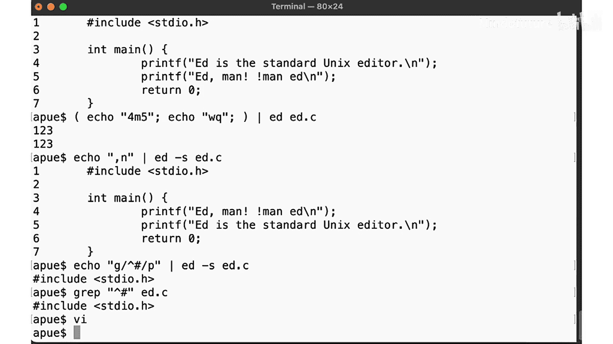

本节课中我们一起学习了Unix的标准文本编辑器`ed`。我们从其令人困惑的初次体验开始，逐步理解了它的**命令模式**与**输入模式**。我们学习了如何创建文件、编辑行、使用行地址范围以及执行搜索替换。

更重要的是，我们探讨了`ed`在**脚本化编辑**方面的强大能力，以及它与后续工具（如`sed`、`vi`）的深刻联系。虽然今天你可能不会在日常工作中使用`ed`，但理解它的设计哲学和操作方式，能让你更深入地领悟Unix“一切皆文件，工具做一事并做好”的理念，并成为一个更强大的命令行用户。

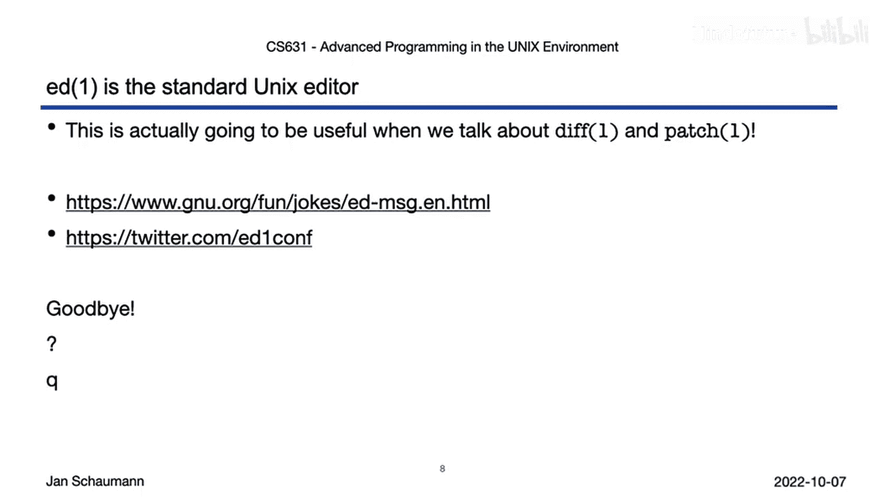

在接下来关于Unix开发工具（如`diff`和`patch`）的课程中，我们将再次回到“通过行命令描述变更”这一核心思想。同时，不妨偶尔打开`ed`，和这位Unix世界的老朋友打个招呼，体验一下最原始的编辑之力。