**UNIX高级编程：第6周：进程的内存布局** 🧠

在本节课中，我们将学习进程在内存中的布局。理解进程的内存结构对于后续学习进程执行、内存管理等高级概念至关重要。我们将通过编写C语言程序来实际查看不同程序元素的内存地址，从而直观地理解进程的各个内存段。

---

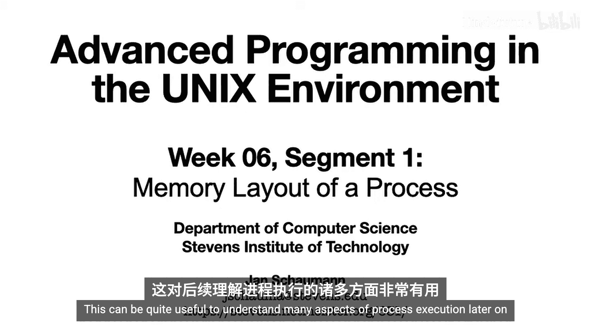

### **概述：进程内存布局**

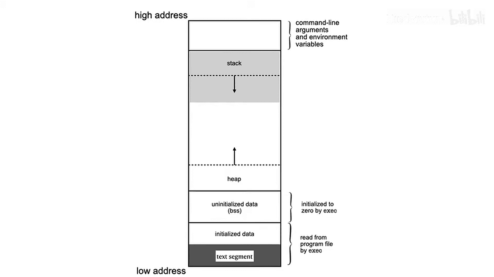

进程在内存中并非杂乱无章，而是被划分为几个逻辑段。每个段都有特定的用途。一个典型的进程内存布局如下图所示，从高地址到低地址依次包含：环境变量、命令行参数、栈、堆、未初始化数据段（BSS）、初始化数据段和文本段。


上一节我们介绍了进程的基本概念，本节中我们来看看如何通过代码来探索这个内存布局。

---

### **如何查看内存地址**

在C语言中，我们可以直接查看任何程序元素的内存地址，甚至无需使用调试器。每个变量本质上就是存储在特定内存位置的数据，其占用的内存大小由变量类型决定。指针则是一种特殊的变量，其值是一个内存地址。

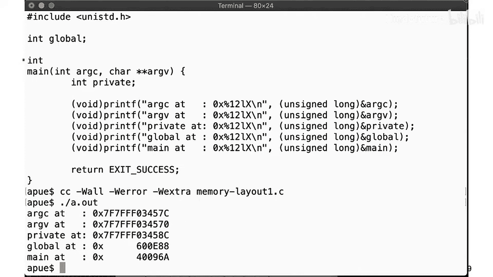

使用取地址运算符 `&`，我们可以获取变量的地址。然后，我们可以将这个地址转换为数字（例如 `long` 类型）并以十六进制形式打印出来。

以下是获取变量地址的示例代码：
```c
int var = 10;
printf("变量 var 的地址是：%p\n", (void*)&var);
```

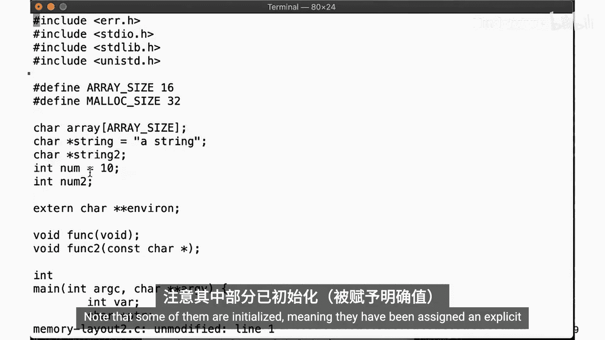

通过这种方式，我们可以开始探索程序在内存中的分布。

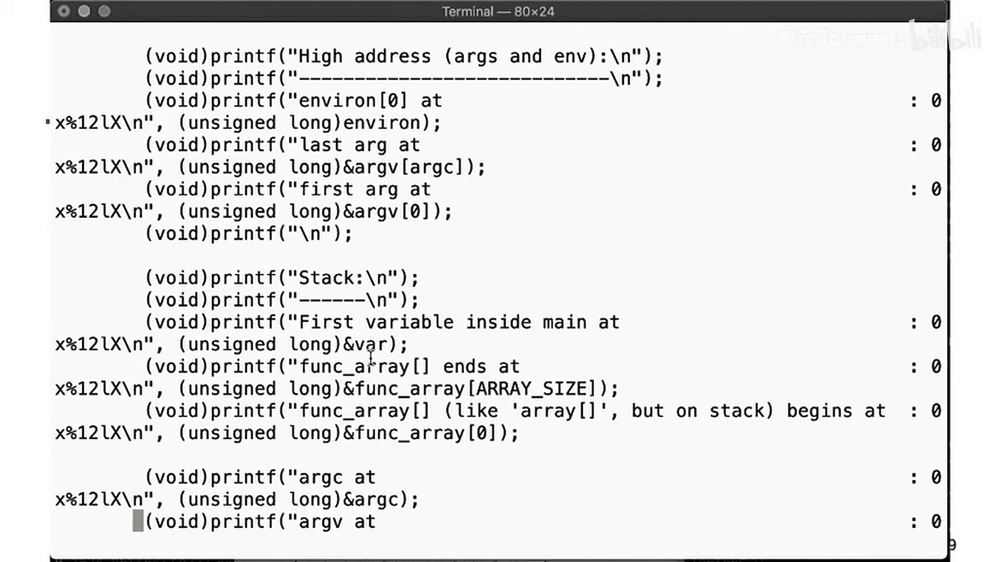

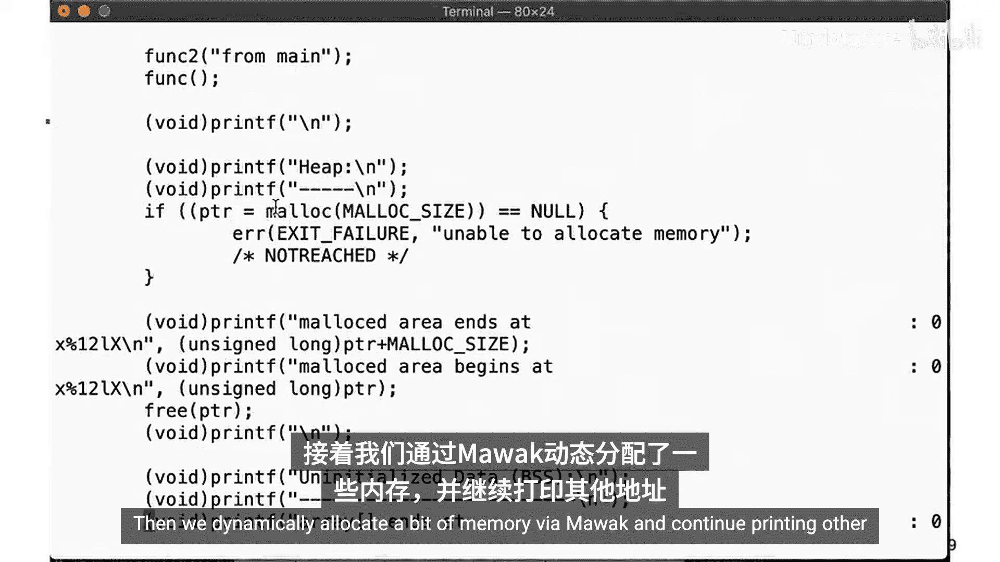

---

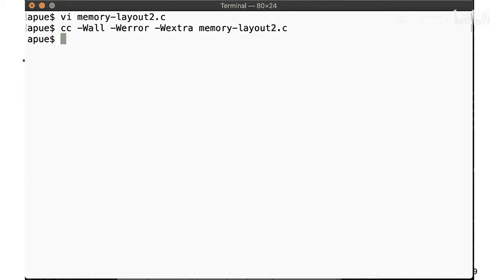

### **探索程序内存布局**

为了更全面地了解内存布局，我们编写一个更复杂的程序，声明不同类型的变量和函数，并打印它们的地址。

以下是程序中包含的主要元素：
*   **全局变量**：在函数外部声明的变量。
*   **静态变量**：使用 `static` 关键字声明的变量，其生命周期贯穿整个程序运行期。
*   **局部变量**：在 `main` 函数内部声明的变量。
*   **函数**：`main` 函数和其他自定义函数。
*   **动态分配的内存**：使用 `malloc` 在堆上分配的内存。

运行该程序后，我们得到按内存地址排序的输出结果。输出显示，从高地址到低地址依次是：环境变量、命令行参数、栈、堆、BSS段、数据段和文本段。这与我们之前的内存布局图完全吻合。

---

### **详解各内存段**

现在，让我们详细看看每个内存段的作用和特点。

#### **1. 文本段（Text Segment）**
文本段位于内存的最低地址区域，包含程序的**可执行指令**。此段通常被标记为只读（`read-only`）。历史上，文本段与“粘着位”（sticky bit）的用途有关。如果可执行文件设置了粘着位，操作系统可以在进程终止后将文本段保留在交换空间（swap space）中。当再次执行同一命令时，内核可以快速地将该段从交换空间移回物理内存，这比从磁盘读取要快得多。因此，粘着位也被称为“保存文本位”（save-text bit）。现代Unix系统已很少使用此功能。

#### **2. 数据段（Data Segment）**
数据段位于文本段之上，包含**已初始化的全局变量和静态变量**。这些变量在程序启动时就从可执行文件中读取并加载到内存中。

#### **3. BSS段（BSS Segment）**
BSS段位于数据段之上，其名称来源于“**Block Started by Symbol**”。该段包含**未初始化的全局变量和静态变量**。在程序加载时，操作系统（`exec`）会将这个区域的所有内存初始化为零。这包括显式初始化为零的静态变量。

#### **4. 堆（Heap）**
堆位于BSS段之上，是用于**动态内存分配**的区域。当程序调用 `malloc`、`calloc` 或 `realloc` 等函数时，内存就从堆中分配。堆由进程中的所有线程共享。随着内存的不断分配，堆向**高地址方向增长**。

#### **5. 栈（Stack）**
栈位于内存的高地址区域，紧邻命令行参数和环境变量。栈是一种**后进先出（LIFO）** 的数据结构，用于管理函数调用。每次调用函数时，一个新的“栈帧”会被压入栈中，其中包含该函数的局部变量、参数和返回地址等信息。栈向**低地址方向增长**。栈指针（SP）总是指向栈的“顶部”（即当前使用的最高地址）。

**注意**：有些图示会将内存布局上下翻转，使栈在顶部（高地址在底部），栈指针指向视觉上的“顶部”。本教程采用更常见的图示，即高地址在顶部，栈向下增长。

#### **6. 命令行参数与环境变量**
进程内存的最高地址区域存放着传递给 `main` 函数的**命令行参数（`argv`）** 和**环境变量（`envp`）**。`argv` 是一个指针数组，其中 `argv[0]` 是程序名，最后一个元素是 `NULL`。

---

### **栈溢出实验**

我们了解到，堆向上增长，栈向下增长，两者相向而行。那么，如果持续进行函数调用，不断将新的栈帧压入栈中，会发生什么？

为了验证这一点，我们修改程序，让函数 `func2` 调用 `func`，`func` 又调用 `func2`，形成无限递归。正常情况下，程序会因递归过深而崩溃。

如果我们编译时定义了 `STACK_OVERFLOW` 标志来启用这个无限递归，程序运行一段时间后，最终会触发**段错误（Segmentation Fault）**。这是因为递归调用导致栈不断增长，最终超出了操作系统为栈分配的内存区域，访问了非法内存地址，这就是**栈溢出（Stack Overflow）**。

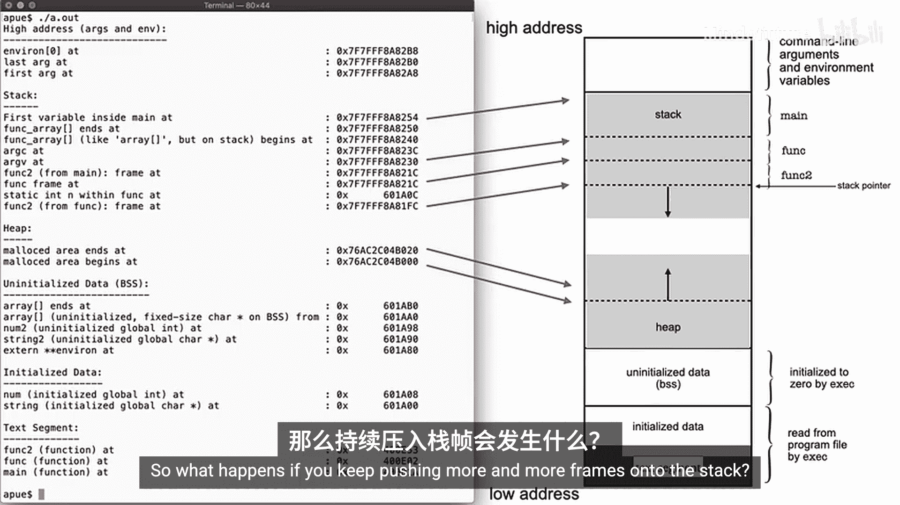

这个实验直观地展示了栈的动态增长和其边界。

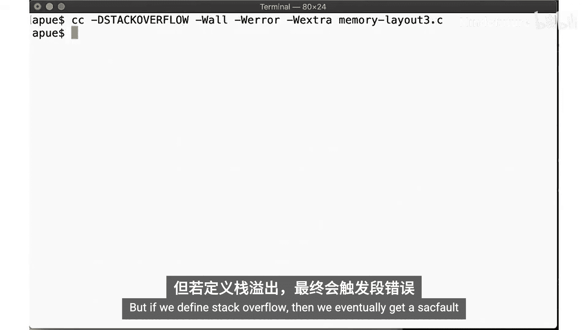

---

### **总结**

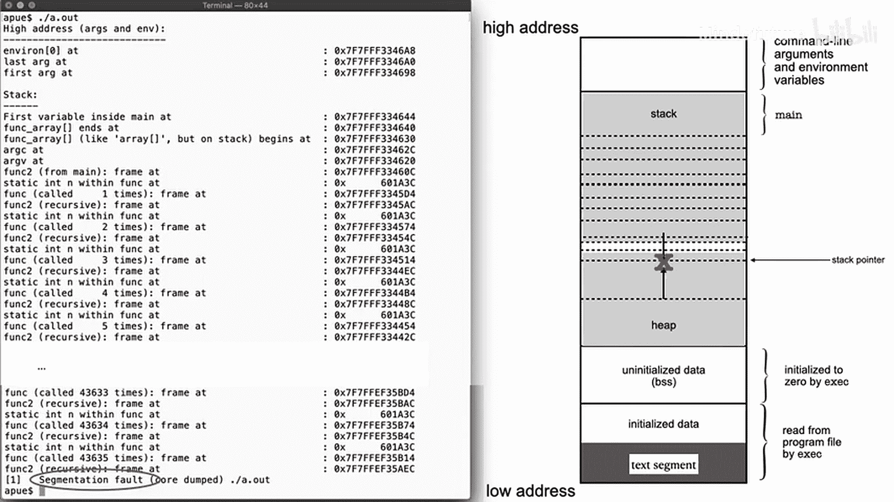

本节课中我们一起学习了进程在内存中的布局。我们通过编写C程序，实际查看了文本段、数据段、BSS段、堆和栈等关键内存区域的地址分布。我们了解到：
*   **文本段**存放只读的机器指令。
*   **数据段和BSS段**存放全局和静态变量。
*   **堆**用于动态内存分配，并向高地址增长。
*   **栈**用于函数调用管理，并向低地址增长。
*   不当的递归或过深的函数调用可能导致**栈溢出**错误。

理解进程的内存布局是深入学习进程控制、内存管理和系统编程的基础。建议下载课程提供的源代码进行实验，并阅读相关链接以巩固知识。

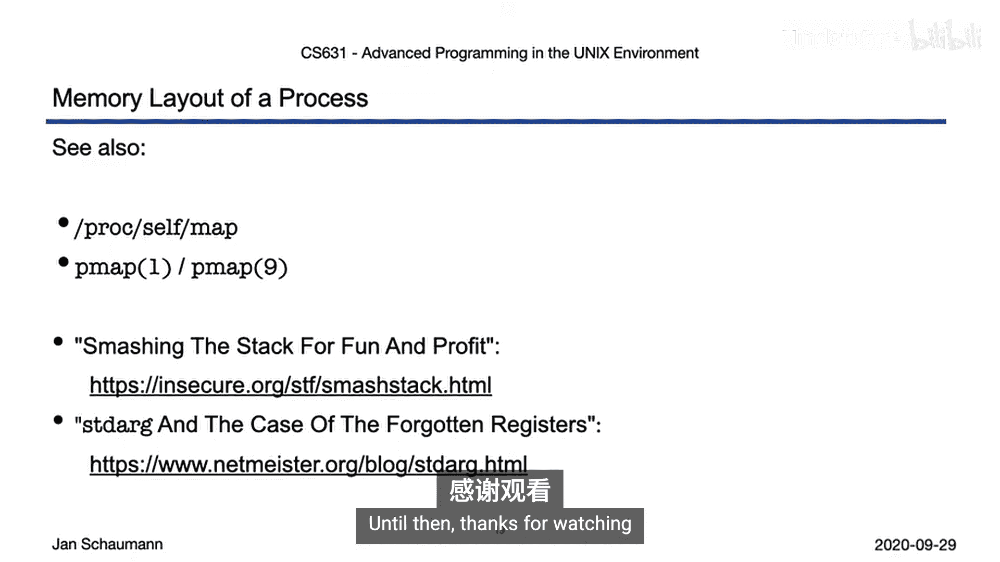

下一节，我们将讨论进程是如何启动的，以及我们如何进入 `main` 函数。