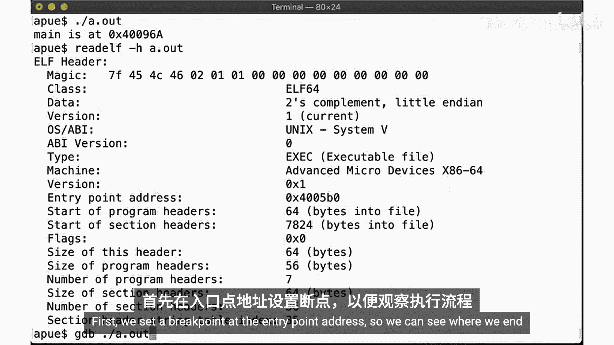
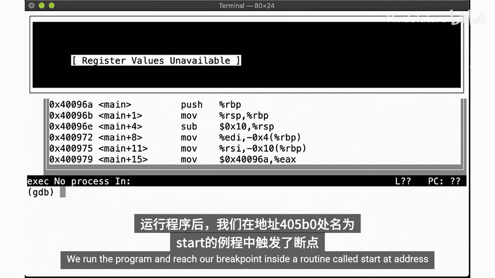
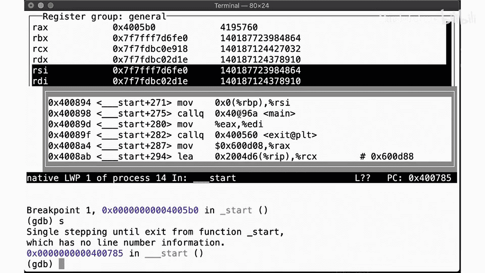
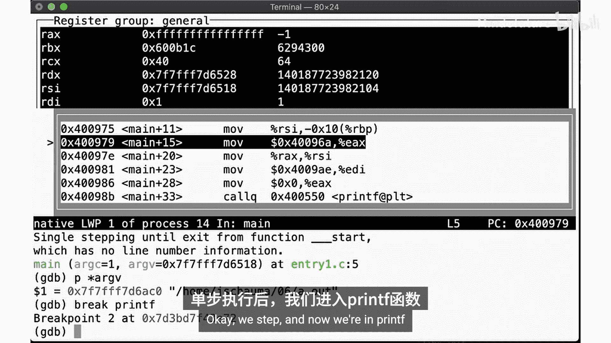
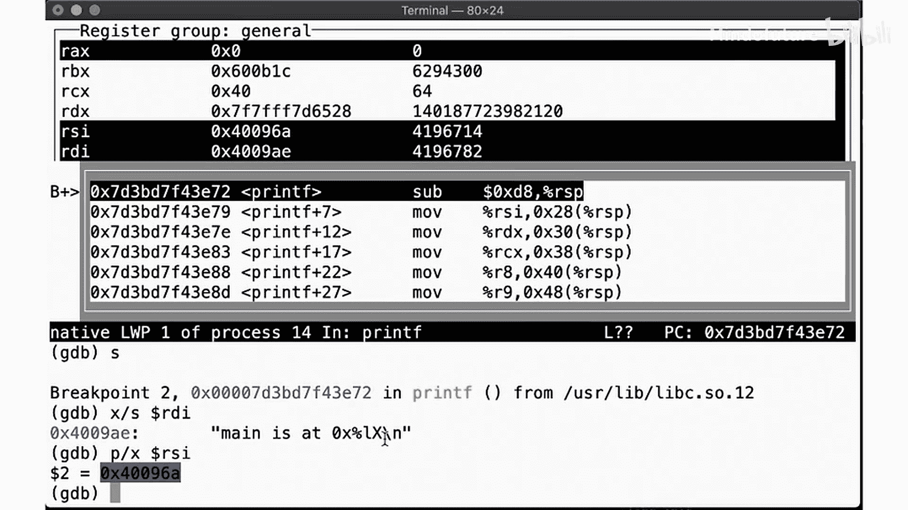
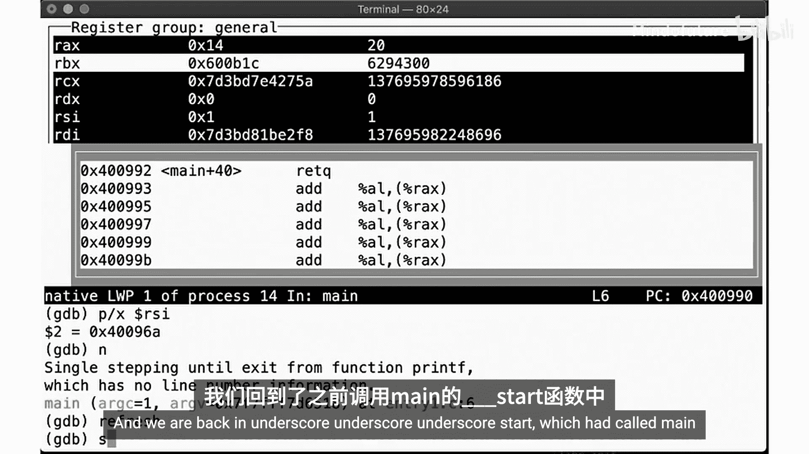
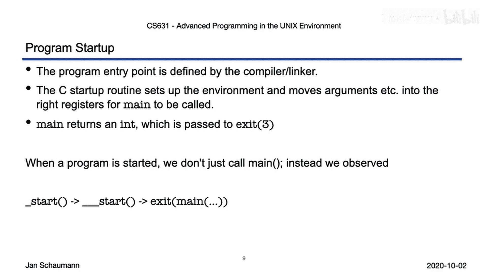

# 039：程序启动过程 🚀


在本节课中，我们将学习一个C程序从启动到退出的完整生命周期。我们将深入探讨`main`函数的特殊性、程序的真实入口点以及启动过程中的关键步骤。

---

上一节我们介绍了进程在内存中的布局，本节中我们来看看程序启动时的具体过程。

我们知道，进程是通过`exec`系列函数之一加载到内存中的。编写过C程序的人都知道，程序从`main`函数开始执行。然而，`main`函数有些特殊。在终端输入`man main`不会得到手册页。在系统头文件中搜索`main`函数的前向声明，也找不到它。那么，`main`函数是在哪里定义的呢？

这需要参考标准，但这次不是POSIX标准，而是C语言标准。C标准规定，程序启动时调用的函数名为`main`。实现方不为该函数声明任何原型。它应被定义为返回类型为`int`且不带参数。具体来说，标准列出了几种可能的原型，最常见的是带两个参数的原型：
```c
int main(int argc, char *argv[]);
```
但标准也指出，可能存在其他实现定义的方式。这意味着我们可以有其他调用`main`的方式。





根据标准给出的宽泛指导，我们知道在程序启动时，`main`函数会被调用。当某个`exec`函数被调用时，内核需要以某种方式启动程序。为此，它会调用一个特殊的启动例程，该例程设置进程基础，将命令行参数和环境变量放入正确的位置等。





我们知道，`argc`作为命令行参数的数量传递给`main`，`argv`是一个指向参数（包括程序名`argv[0]`）的指针数组。我们还知道这个数组以`NULL`结尾，因此可以轻松遍历。



以下是观察程序启动过程的步骤：



1.  编写一个简单的程序，打印`main`函数的地址。
2.  使用`-g`标志编译以启用调试符号，并使用`-std=c89`标准。
3.  使用`readelf`工具查看可执行文件的头部信息，注意其入口点地址。
4.  使用调试器（如`gdb`）在入口点地址设置断点，观察程序启动时的执行流程。

通过调试器，我们发现程序并非直接从`main`开始执行。真正的入口点是一个名为`_start`的例程，它位于地址`0x4005f0`。`_start`例程会填充一些寄存器，然后调用`__libc_start_main`。

`__libc_start_main`函数执行一系列初始化操作，包括调用`__libc_csu_init`等。最终，它会调用我们的`main`函数。当`main`函数执行完毕并返回一个整数值后，控制权会回到`__libc_start_main`，该函数随后调用`exit`，并将`main`的返回值传递给`exit`。

那么，`_start`例程在哪里定义呢？我们可以在源代码树的`libc/csu/`目录下找到它，具体在`crt0.S`文件中（`CRT`代表C运行时）。这个文件包含了程序的初始入口点，即`_start`汇编例程，它会调用`__libc_start_main`函数。

`__libc_start_main`是一个常规的C函数，位于`crt0.c`文件中。它接收两个参数：一个函数指针和一个`struct ps_strings`结构体。这个结构体位于栈顶，用于定位参数和环境字符串。

`__libc_start_main`函数使用这些字符串来设置`environ`变量和`__progname`字符串（后者被`getprogname`库函数使用）。接着，它调用`atexit`（我们将在下个视频中讨论）和`__libc_csu_init`函数。最后，它调用`exit`，并将`main`的返回值（连同`argc`、`argv`和环境指针一起传递给`main`）传递给`exit`。这意味着`main`实际上可以被实现定义为一个接收三个参数的函数。

既然入口点是`_start`而不是`main`，并且`_start`会调用`main`，我们能否绕过`main`呢？我们可以尝试使用一个名为`foo`的函数作为入口点。通过向编译器和链接器传递`-e foo`标志，可以创建一个直接跳转到`foo`而不是`main`的可执行文件。

然而，当我们运行这个程序时，它直接调用了`foo`，但在之后出现了段错误。这是因为`foo`函数执行完毕后，尝试返回到一个无效的地址（保存在未初始化的返回地址寄存器中），而正常的`_start`例程则正确地设置了返回路径。

为了避免段错误，我们可以让替代入口点函数不返回，而是直接调用`exit`。例如，创建一个名为`bar`的函数，它在打印消息后调用`exit(0)`。这样，程序就能正常退出，而不会因为无效的返回地址而崩溃。

---



本节课中我们一起学习了程序启动的完整过程。我们了解到，程序的入口点是由编译器/链接器定义的，这意味着我们可以更改它。我们看到了C启动例程如何设置环境并将命令行参数移动到适当位置。我们还明白了为什么`main`函数总是返回一个`int`值——这个值会被传递给`exit`函数。总而言之，我们的程序并非简单地以`main`开始，而是默认从`_start`入口点开始，`_start`调用`__libc_start_main`，后者最终调用`exit`，并将`main`的返回值作为参数。我们还看到了程序如何退出和返回，这将在下一个视频片段中进一步讨论。