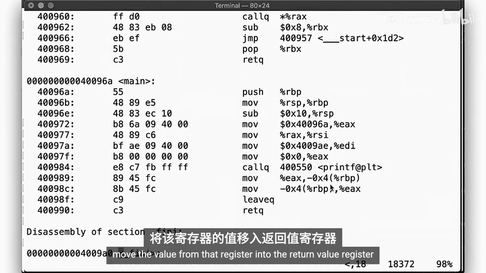
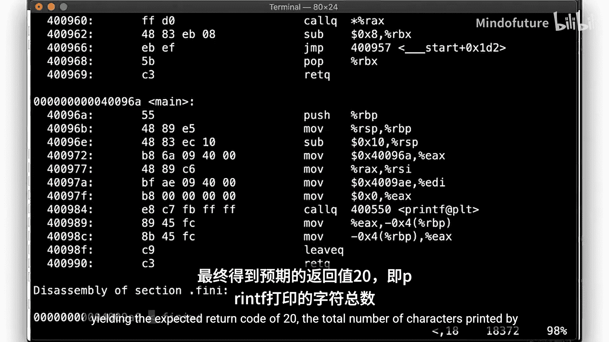
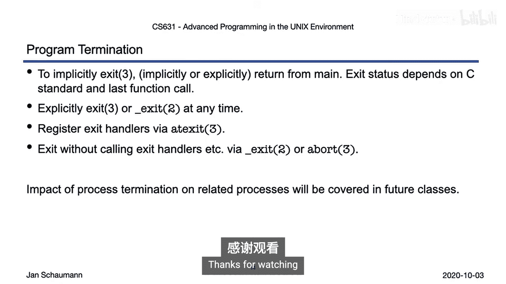

# 040：程序终止 🚪

在本节课中，我们将要学习程序终止的多种方式，包括从`main`函数返回、调用`exit`函数、以及使用`_exit`系统调用。我们还将探讨如何注册退出处理函数，并理解不同终止方式对程序行为的影响。

---

上一节我们介绍了程序启动的过程，本节中我们来看看程序如何终止。尽管我们在上一段视频中已经简单提及，但这里将进行更深入的探讨。

还记得我们上次是如何开始的吗？我们只是打印了`main`函数的地址，然后没有显式返回值就结束了`main`函数。在使用默认编译器选项时，返回值是0。但如果使用C89标准编译程序，我们会收到一个关于缺少返回值的警告，并观察到程序返回了一个神秘的值20，而这个值恰好是`printf`打印消息的长度。

让我们比较一下使用C89和C11标准时生成的指令有何不同。为此，我们使用`objdump`工具来反汇编可执行文件。首先查找`main`函数。我们看到调用了`printf`，随后函数返回，没有其他操作。

现在，让我们使用默认的C11标准进行比较。反汇编并对比。生成的代码差异很小。以`+`开头的行是C89代码，以`-`开头的行是C11代码。它们几乎相同。但在C11代码中，我们看到在返回之前，有一条显式语句将值0移入返回值寄存器`EAX`。

因此，C语言似乎被修改为：如果没有显式指定返回值，则默认返回0。毕竟，我们并没有真正使用`printf`调用的返回值。

让我们改变一下。如果我们将返回值赋给一个变量会发生什么？当我们编译代码时，现在会收到一个关于整数`n`被设置但未被使用的警告。然而，我们的返回值保持不变。再次反汇编代码并与C89代码比较。在那里，我们也得到了相同的警告，但同样看到了关于缺少显式返回值的警告。

让我们看看C89的汇编代码。在`main`函数内部，我们看到我们使用了`printf`的返回值，并将其移到一个通用寄存器中，这一步代表了将值赋给我们的整数`n`。在函数返回之前，与C11代码相比，我们看到完全相同的步骤发生。但此时，它后面再次跟着将0显式赋值给返回值寄存器的操作。

因此，仅仅将值赋给变量本身并没有改变太多。编译器似乎足够聪明，能意识到`n`并没有真正被使用，因此我们在编译时收到了警告，然后仍然按照C11标准的要求显式地将0赋为返回值。

现在，让我们比较一下如果我们确实使用了返回值的情况。这里，我们编辑代码使其返回`n`。注意，现在我们不再收到警告，因为我们正在使用这个变量。对于C11标准编译，行为相同。让我反汇编两者。我们应该发现生成的代码现在是相同的。看起来是这样：我们调用`printf`，将返回值移入寄存器，然后执行返回语句，将该寄存器的值移入返回值寄存器。

使用预期的返回码20，即`printf`打印的总字符数。

---

在之前的视频中，我们已经看到了进程终止的多种方式。

一方面，有正常的、预期的终止。我们见过：
*   `main`函数的隐式返回，根据所使用的C标准，可能产生不同的返回值。
*   `main`函数的显式返回。
*   调用`exit`库函数，这可以发生在`main`函数内或任何其他函数中。

但也有`_exit`系统调用，以及奇怪的大写变体`_Exit`。这是C语言标准（要求`_Exit`）和POSIX标准（要求`_exit`）之间差异的产物。

此外，还有两种仅适用于多线程程序的方式，我们在此跳过。

除此之外，我们也有异常终止进程的方式。我们可以调用`abort`。我们可能被信号（如`SIGABRT`或`SIGKILL`）终止。同样，如果是多线程的，我们可能会在收到取消请求时终止。

让我们仔细看看`exit`函数。`exit`是一个库函数，因此你可以推测它包装了`_exit`系统调用并提供了额外的功能。我们知道，`exit`接受一个整数值作为参数，该值随后成为程序的退出状态。当然，`exit`本身不会返回，因为它会导致进程终止，正如我们在代码探索中看到的那样。

在退出之前，它执行以下步骤：
1.  调用任何先前通过`atexit`注册为退出处理程序的函数。
2.  刷新所有打开的输出流，然后关闭它们。
3.  删除由`tmpfile`函数创建的任何文件。
4.  最后，调用`_exit`。

`_exit`系统调用可以直接调用，然后进程会立即终止，而不执行上述任何操作。不过，通过此调用退出进程时，仍然会发生一些事情，但我们将在未来的讲座中讨论进程间通信和信号时重新审视这些考虑。

如前所述，`exit`库函数可能会调用任何先前通过`atexit`函数注册的退出处理程序。让我们看看这个。`atexit`接受一个函数指针作为参数，该函数是一个简单的、无参数且无返回类型的函数。成功时，`atexit`将函数指针压入一个栈中，而`exit`则会从该栈中弹出函数指针并执行，这意味着在进程终止时，它们的执行顺序与注册顺序相反。

没有理由不能多次注册同一个函数，我们只需要多次注册它即可。所有这些都很有用，可以确保不仅在从`main`返回时，而且在任何时候退出时执行某些任务。

让我们看一个例子。这里有几个琐碎的函数，它们只是打印一条消息。函数`func`打印一条消息，然后根据给定的参数数量，可能调用`exit`、`_exit`或`abort`来终止程序。在`main`中，我们通过`atexit`将上述函数注册为退出处理程序。请记住，函数将以与我们注册顺序相反的顺序从栈中弹出并执行，因此我们预计退出时的顺序是`my_exit1`、`my_exit2`。运行它，顺序符合预期：我们调用了`func`，然后返回到`main`，再从`main`返回，然后我们的退出处理程序按我们看到的顺序被调用。

如果我们传递一个参数，那么`func`会自己调用`exit`，我们观察到我们没有返回到`main`，但注册的退出处理程序仍然按承诺执行了。如果我们传递第二个参数，那么`func`会调用`_exit`，这将立即终止进程，而不触发对退出处理程序的调用。最后，传递第三个参数时，`func`会调用`abort`。我们通过调用退出处理程序退出，但这次带有一个核心转储。检查核心转储，我们可以看到回溯，然后找到程序被`SIGABRT`信号终止的确切代码位置。看起来发生在`example.c`的第36行。当然，我们可以在执行时检查变量。

---

让我们通过这张图来看看UNIX进程的生命周期。新进程通过内核的`exec`调用诞生，然后进入C启动例程和用户空间，最终调用`main`。`main`可以调用任意数量的函数，这些函数最终返回到`main`。`main`返回后，我们回到C启动例程，它调用`exit`，我们从那里离开用户空间，并通过`_exit`终止进程。

然而，我们也可以从`main`内部或任何函数中自己调用`exit`。`exit`可能会调用任何先前通过`atexit`注册的退出处理程序，然后在调用`_exit`之前执行对未关闭文件流或临时文件的清理。

但我们也有选择从`main`或任何其他函数中自己调用`_exit`。

---

本节课中我们一起学习了多种退出程序的方式。

从`main`返回（无论是显式还是隐式）将通过C启动例程导致对`exit`的调用。返回值取决于你是否传递了一个值，以及你所遵循的C标准版本。

我们可以随时自己调用`exit`或`_exit`。如果我们希望执行某些任务，或者希望在程序终止时执行某些操作，可以通过`atexit`注册退出处理程序。这些退出处理程序可以通过调用`_exit`或`abort`来绕过。

当我们的程序最终终止时，对其他进程的影响我们将在未来的讲座中讨论。

至此，是时候结束本视频段落了。感谢观看。