# 041：进程环境详解 🖥️

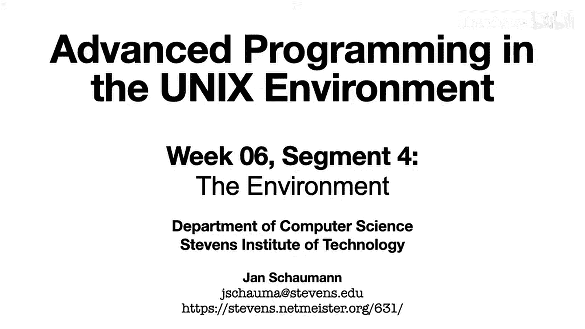

在本节课中，我们将学习进程环境。我们将利用之前学到的进程内存布局知识，来理解环境变量是如何存储的，以及在必要时是如何被移动的。在这个过程中，我们也会快速了解一下 `malloc` 函数的工作原理。

## 环境变量概述

在Shell中，我们可以通过运行 `env` 命令来打印当前的环境。我们看到的是一个键值对列表，其中许多变量在我们日常使用Unix系统时非常熟悉。

通过设置环境变量，进程可以轻松地向用户提供信息，同时用户也可以向那些设计为查找特定环境变量的程序提供信息。按照惯例，许多Unix工具都会识别并使用一些常见的环境变量。具体示例可以参考 `environ` 的手册页。

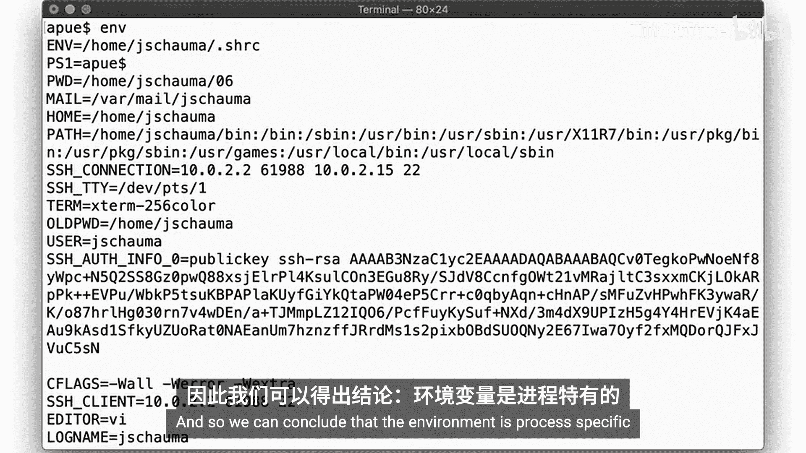

通过实验和日常使用，你可能已经注意到，在一个进程中设置变量不会对另一个进程产生任何影响。因此，我们可以得出结论：环境是进程特定的。

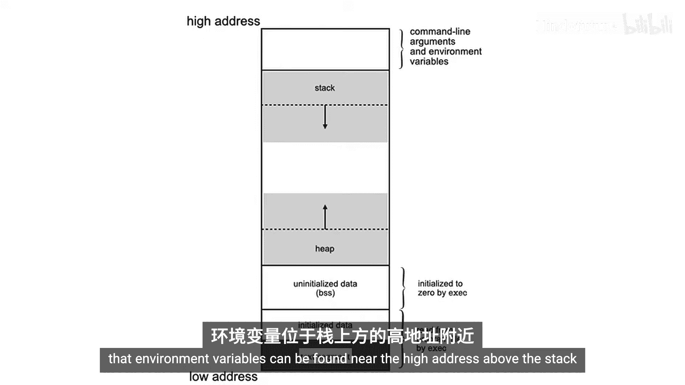

## 进程如何访问环境？

在之前的视频中，我们记得进程在内存中的布局可以这样可视化。我们已经注意到，环境变量可以在栈上方的高地址区域找到。

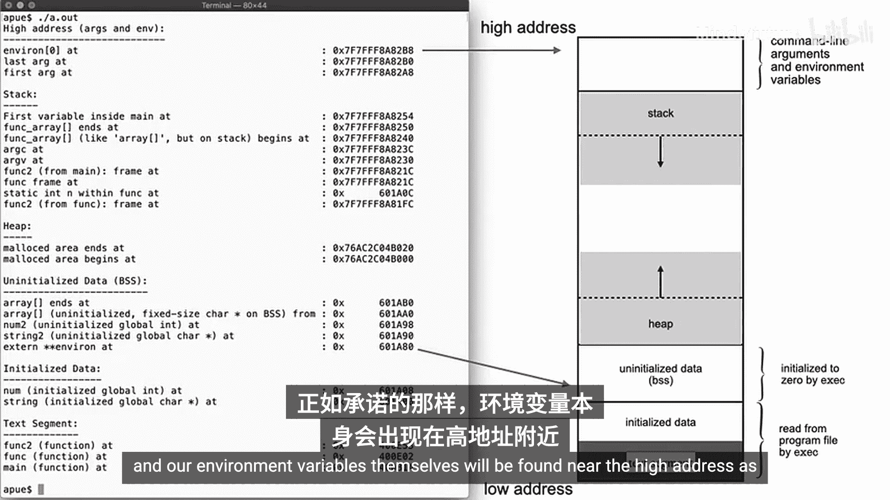

### 环境变量的存储位置

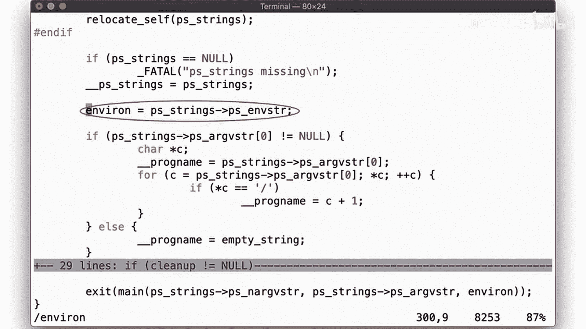

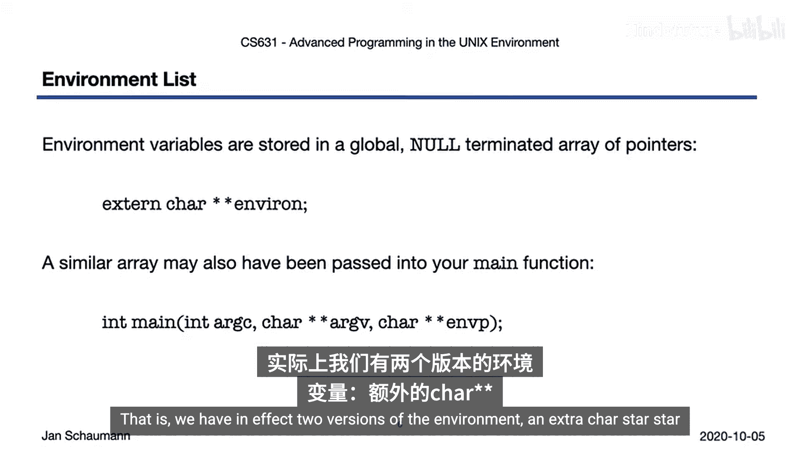

让我们更仔细地观察一下。我们的外部变量 `extern char **environ` 位于BSS段，因为它在我们的代码中被声明但未定义。一旦 `exec` 将控制权转移给启动程序，环境就被初始化了。正如所承诺的，环境变量本身位于高地址附近。

### 环境变量如何到达那里？

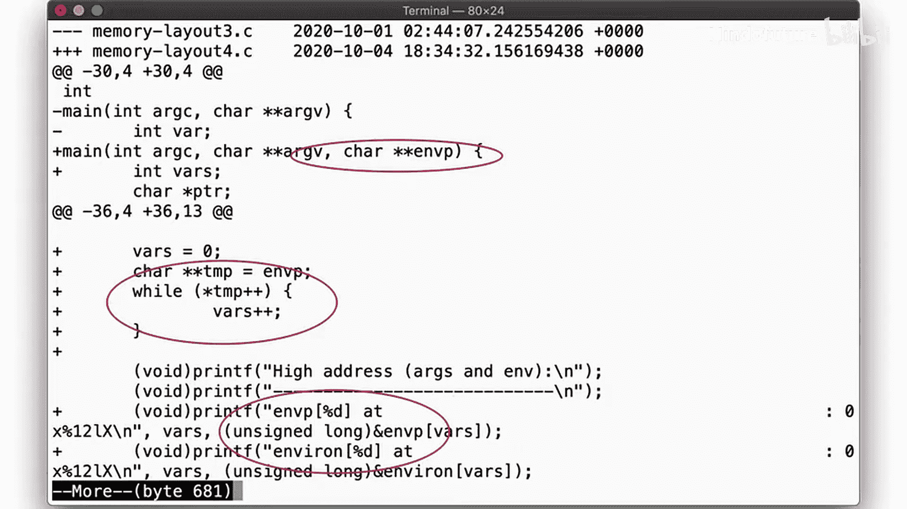

回想一下之前章节中 `__start` 例程的样子。在这里，我们设置了环境，并将其作为参数传递给 `main` 函数。

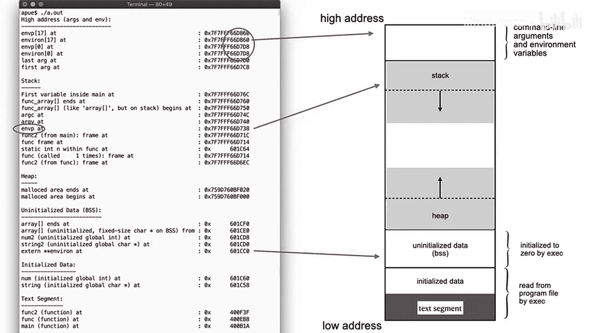

也就是说，我们实际上有两个版本的环境变量数组：一个是作为参数传递给 `main` 的 `char **envp`，另一个是全局变量 `extern char **environ`。在程序启动时，`environ` 是空的。

让我们更新代码，比较外部变量 `environ` 和作为参数传递给 `main` 的 `envp`。我们将计算环境变量的数量，并输出数组的起始和结束地址。

运行程序后，我们看到环境包含18个元素，最后一个元素（索引17）位于最高地址。我们的外部变量 `environ` 位于BSS段，而 `char **envp` 作为参数传递给 `main`，因此位于栈上，就像 `argc` 和 `argv` 一样。注意，`envp` 和 `environ` 看起来相同，它们起始于相同的地址，也结束于相同的地址。

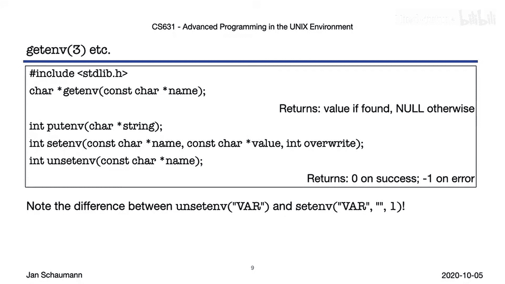

## 如何操作环境变量？

为了访问或操作环境，我们有以下库函数：
*   `getenv`：检索环境变量的值。
*   `putenv`：添加一个新的环境变量。
*   `setenv`：更改给定环境变量的值。
*   `unsetenv`：从环境中移除一个环境变量。

需要注意的是，将一个变量设置为空字符串与将其从环境中完全移除是不同的。有些工具可能只测试变量是否存在，而不测试其具体值，而一个没有值的变量仍然被视为已设置。

现在，让我们更深入地思考这些函数是如何工作的。

## 环境变量的动态管理

请记住，环境最初被放置在高地址附近，因此空间必然是有限的。然而，我们被允许更新、添加或删除这个数组中的值。这是如何实现的呢？

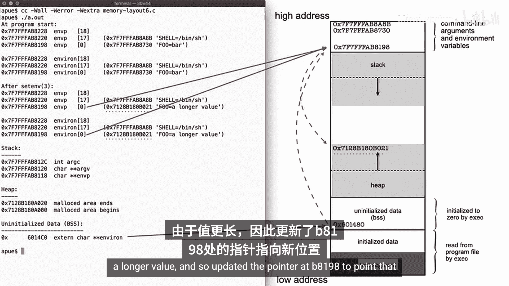

正如我们所说，作为 `main` 参数的 `envp` 必须在栈上。这个数组的第一个元素 `envp[0]` 指向栈上方的一个地址（例如 `0xcb18`）。在这个位置，我们找到一个 `char *` 类型的指针，它指向包含实际字符串（如 `"FOO=bar"`）的字符数组，该字符串位于地址 `0xcc080`。

我们的外部变量 `environ` 位于BSS段，但它的第一个元素也指向相同的地址 `0xcb18`。同样，数组的最后一个元素也位于相同的地址，`envp` 和 `environ` 都指向高地址附近。

### 使用 `setenv` 改变值

现在，让我们看看当我们使用 `setenv` 来更改环境中已存在的变量的值时会发生什么。假设我们将 `FOO` 的值改为一个更长的字符串。

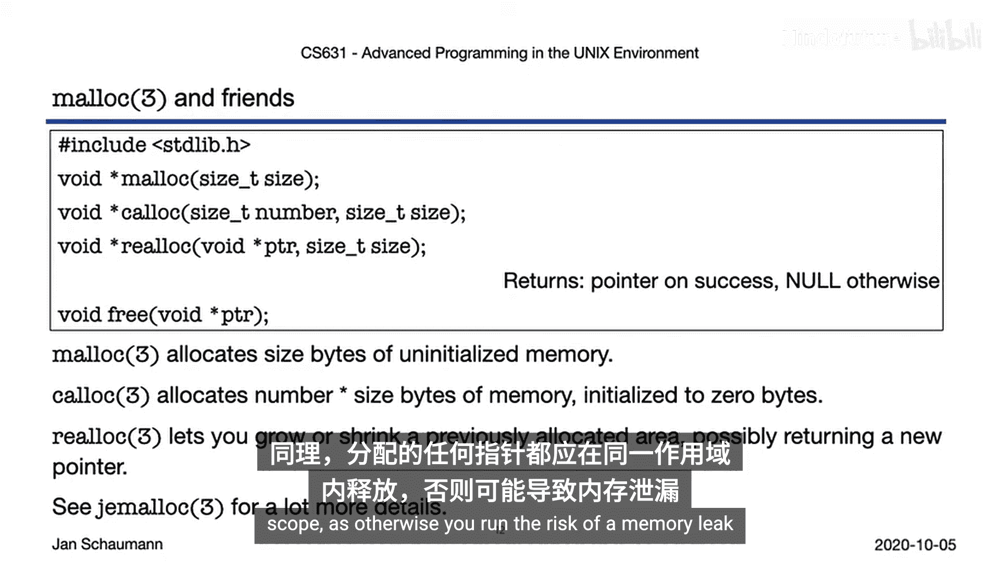

调用 `setenv` 后，`envp[0]` 仍然指向 `0xb8198`，`environ[0]` 也是如此。但是，该地址处的 `char *` 指针现在指向一个不同的地方。具体来说，`setenv` 似乎通过 `malloc` 为新的、更长的字符串动态分配了一些内存，并更新了 `0xb8198` 处的指针以指向这个新位置。

### `malloc` 函数简介

它是如何做到这一点的？为了动态分配缓冲区，我们使用 `malloc` 函数。这个库函数会尝试分配指定数量的内存，并返回一个指向它保留的内存区域起始位置的指针。

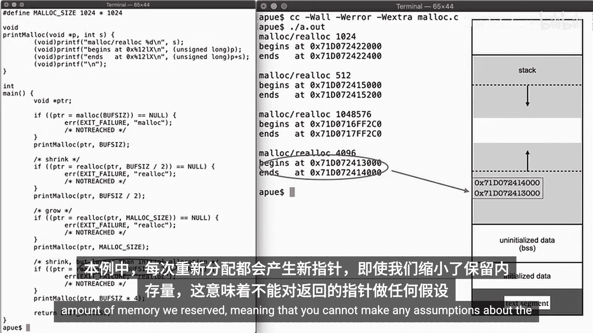

这段内存是未初始化的。如果你希望它被初始化为全零，请使用 `calloc`。如果你需要改变所需的内存大小，可以使用 `realloc` 来增大或缩小内存区域。如果它可以在不移动数据的情况下进行更改，你可能会得到与传入相同的指针，但它仍然会更新保留的字节数。当然，与所有资源一样，一旦你使用完毕，应该使用 `free` 释放指针。这类似于我们总是在打开文件描述符的同一作用域内关闭它。同样，你应该总是在分配指针的同一作用域内释放它们，否则就有内存泄漏的风险。

在回到 `setenv` 之前，让我们简要观察一下 `malloc` 及其相关函数在实际中的表现。左侧是一个小程序，它首先分配内存，然后在中间将其重新分配到更大和更小的区域。在输出中，我们看到第一次调用 `malloc` 在堆上保留了一些数据。随后调用 `realloc` 最终在我们最初保留的区域下方保留了一个更小的区域。同样，重新分配到更大区域发生在另一个地方。而最后一次重新分配到更小区域时，又在堆上保留了另一个内存区域。在这种情况下，每次重新分配都使用了新的指针，即使我们缩小了保留的内存大小。这意味着你不能对返回的指针做任何假设。

### 使用 `putenv` 添加新变量

回到我们的环境。我们看到 `setenv` 通过 `malloc` 为新值保留了一些空间。现在，让我们看看当向环境中添加一个新变量时会发生什么。

调用 `putenv` 后，`envp[0]` 仍然指向与之前相同的地址。但是，`environ` 中的第一个变量现在位于不同的地方——它在堆上了。然而，这个新地址处的指针仍然指向我们调用 `setenv` 后得到的相同地址。

那么，为什么 `environ[0]` 移动了？我们位于栈顶的环境只有那么大，向环境中添加一个新变量可能无法在栈顶容纳。因此，为了添加一个新变量，`putenv` 必须首先将整个环境复制到一个新位置。也就是说，`putenv` 在堆上为整个环境数组分配了新的内存，然后复制了环境的所有元素（即所有指向值的指针），只有这样才能追加新值。这当然解释了为什么我们的新值 `environ[18]` 指向堆上的这个地址。而这个地址又指向另一个变量的位置，该变量位于程序的数据段中。这个字符串位于程序的数据段，因为它是作为固定字符串包含在程序中的。

所以，我们注意到在这里 `envp` 和 `environ` 出现了分歧。调用 `putenv` 后，`environ` 被更新了，但 `envp` 没有。这有一定道理，因为 `envp` 实际上只是 `main` 函数的一个局部变量，而 `environ` 是一个全局变量。

### 使用 `unsetenv` 移除变量

现在，让我们看看调用 `unsetenv` 函数时会发生什么。我们调用 `unsetenv("FOO")`，因此数组减少了一个元素，原来索引18的内容现在变成了索引17。但它仍然位于我们调用 `unsetenv` 之前的相同地址。

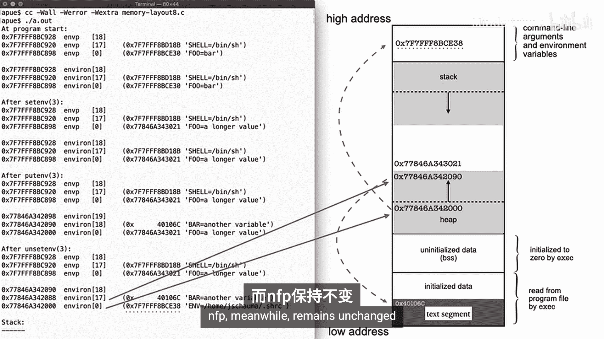

然而，`unsetenv` 移除了数组的第一个元素（在这个例子中是 `environ[0]`），因此所有元素都向下移动了一位。原来 `environ[1]` 的内容现在变成了 `environ[0]`。`environ[0]` 本身的地址没有改变，但它包含的指针（指向 `"HOME=/jxmas/HRRC"`）被更新了。而这个值仍然位于原始环境的最顶部，所以 `environ[0]` 现在可以指向那里。与此同时，`envp` 保持不变。

## 总结与注意事项

让我们回顾一下。进程环境由一个字符串数组组成，形式为 `key=value` 对。这是一种惯例，尽管你当然可以在其中放入任何内容。

初始环境由启动例程在进程空间顶部设置，并由外部变量 `extern char **environ` 指向。启动例程可能会将当前环境作为第三个参数传递给 `main`。

我们看到，当我们添加新变量、更新或移除现有变量时，数组的元素可能会被移除或移动。我们看到，数组的元素可能会在我们添加新变量、更新或移除现有变量时被移动。有时这涉及到将它们移动到 `malloc` 分配的区域中。但重要的是要注意，对环境的操作应该只通过库函数和外部变量 `environ` 进行，而不是通过传递给函数的 `envp`。

最后，虽然许多工具依赖环境或以常规方式使用它，但作为一名防御性程序员，你必须始终验证计划使用的任何变量的内容的合理性。用户可能能够更改它们，如果你不小心，很容易导致未定义或至少是意外的行为。

在结束之前，这里有一个练习链接供你思考：环境是如何更新的？如果用户添加了数百、数千甚至数万个新的环境变量，可能会发生什么？或者，如果用户添加了一个长达数千个字符的单个变量，可能会发生什么？尝试探索一下，看看是否能识别出其中的限制和副作用。

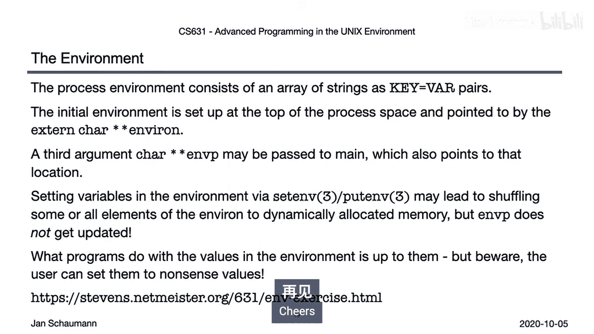

祝你好运，玩得开心！😊