UNIX高级编程：P42：进程限制与标识符 🔧

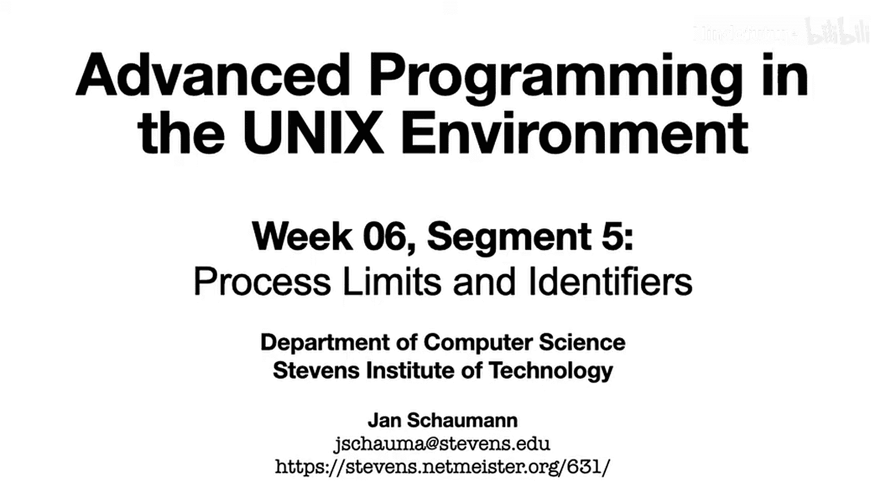

在本节课中，我们将学习进程的两个重要方面：资源限制和进程标识符。我们将了解如何查看和设置进程的资源限制，以及进程ID（PID）和父进程ID（PPID）的含义与用法。

在之前的视频中，我们探讨了进程的内存布局以及进程如何启动和终止。在深入进程控制和进程关系之前，我们将花几分钟时间了解每个进程的另外两个特性：资源限制和进程ID。

### 进程资源限制

我们可以通过 `ulimit` 命令来检查进程的资源限制。

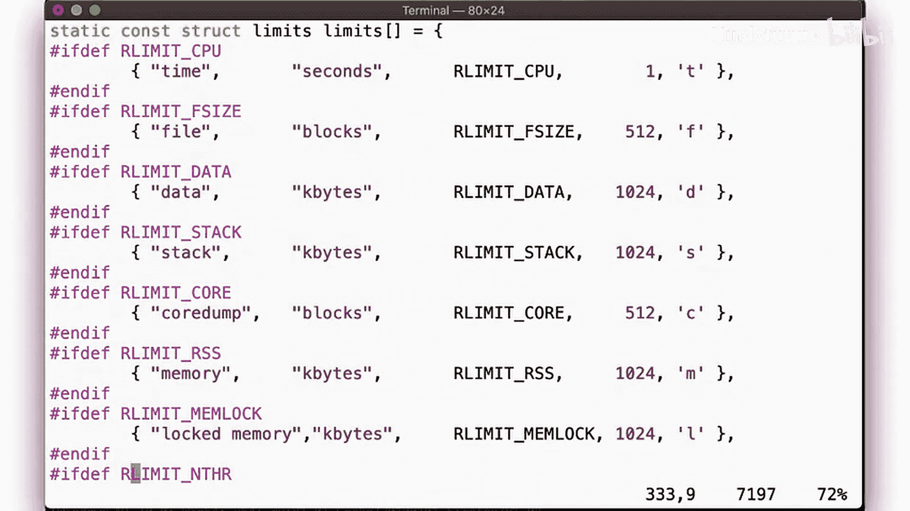

这些限制描述了例如一个进程允许占用CPU的时间、可以分配多少内存、可以创建多少子进程，或者一个进程可以打开多少个文件描述符。

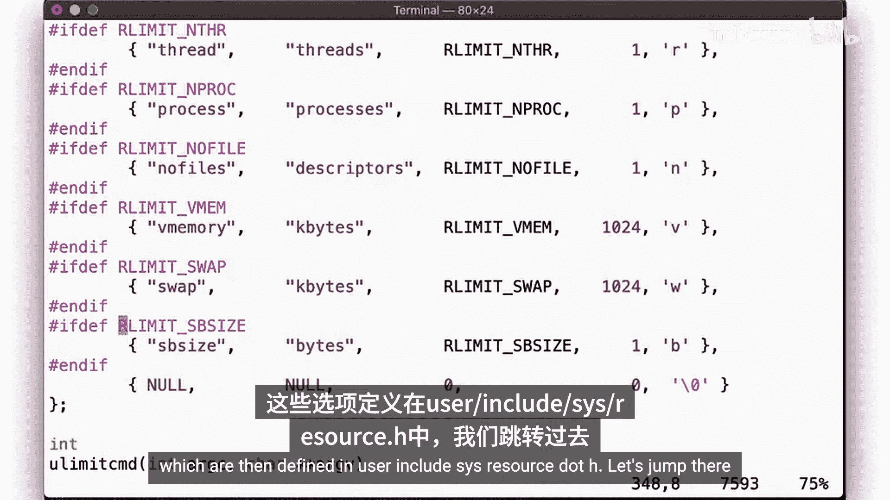

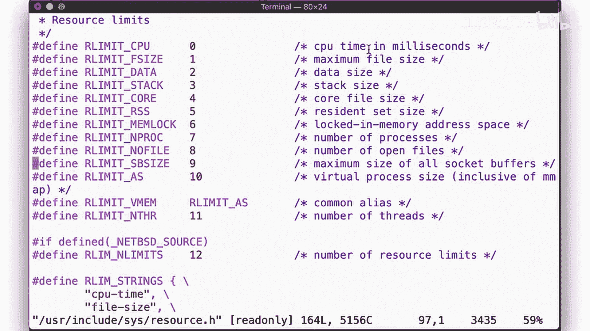

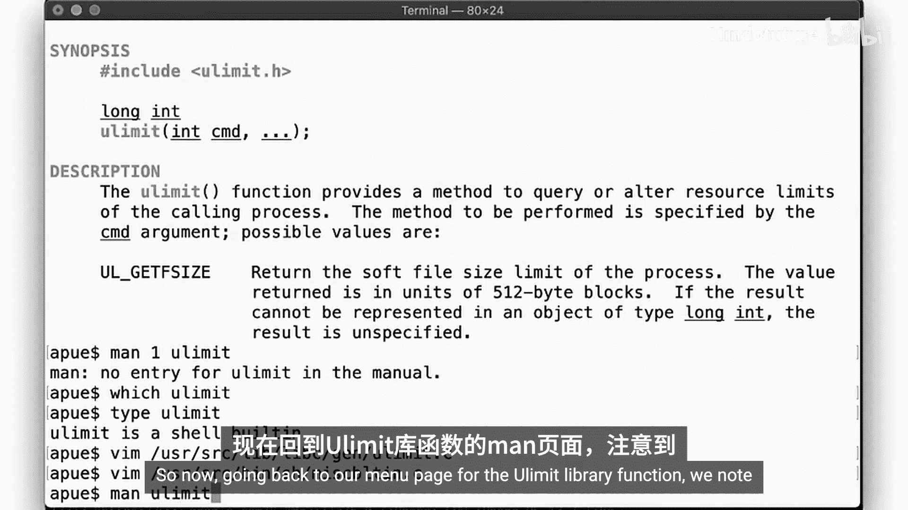

以下是 `ulimit` 命令支持的一些常见资源选项：

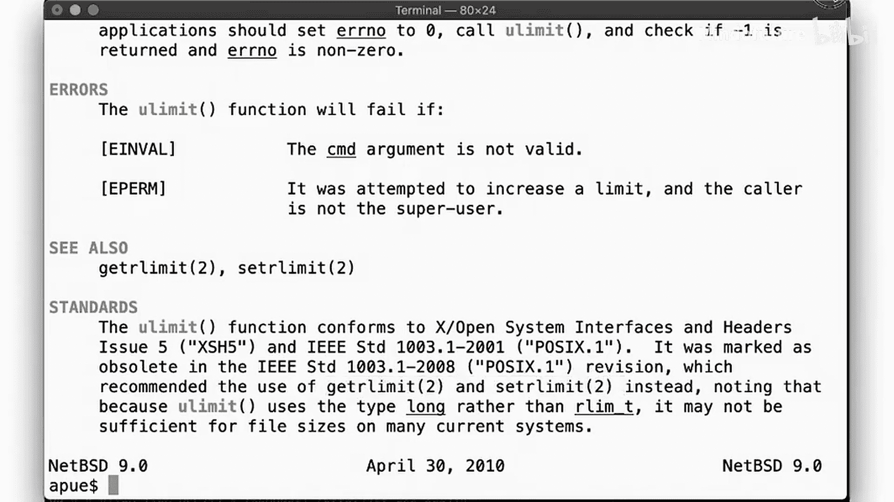

*   `-t`：CPU时间（秒）
*   `-v`：虚拟内存（KB）
*   `-n`：打开文件描述符的数量
*   `-u`：单个用户可创建的最大进程数

`ulimit` 命令是Shell的内置命令。其底层实现依赖于C库函数 `getrlimit` 和 `setrlimit`。在头文件 `<sys/resource.h>` 中定义了资源限制的结构体 `rlimit`，它包含两个成员：`rlim_cur`（软限制）和 `rlim_max`（硬限制）。

```c
struct rlimit {
    rlim_t rlim_cur;  // 软限制
    rlim_t rlim_max;  // 硬限制
};
```

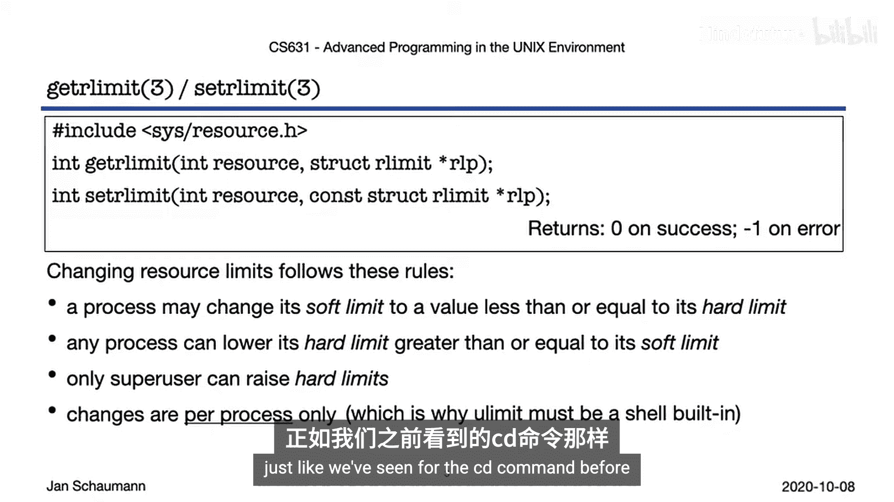

资源限制分为软限制和硬限制。当进程尝试超出软限制时，操作可能会失败或进程收到一个信号，但如果进程捕获了该信号，它可以继续运行。硬限制是资源使用的绝对上限，进程无法超越。

使用 `setrlimit` 更改限制遵循以下规则：

1.  进程可以降低软限制。
2.  进程可以将软限制提高到不超过硬限制的值。
3.  任何对软限制的更改都会同时设置一个新的硬限制（等于新的软限制值）。这意味着一旦你降低了软限制，就无法再将其提升到原来的硬限制之上，除非你是超级用户。
4.  只有超级用户（root）可以提高硬限制。
5.  所有更改仅影响当前进程及其未来的子进程。

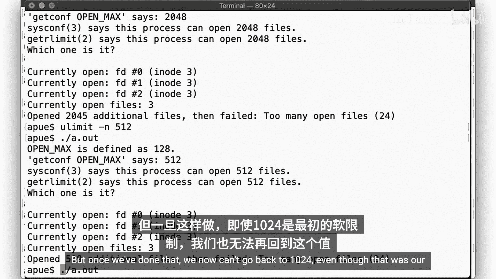

这解释了为什么 `ulimit` 必须是Shell内置命令，而不能是一个独立的可执行程序。

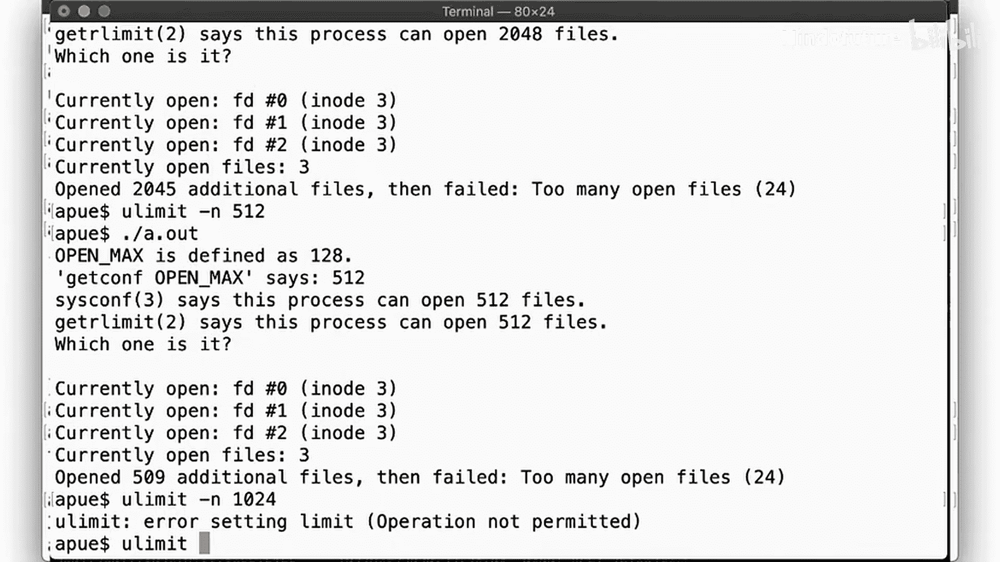

### 实践示例

让我们回顾第2周关于打开文件数量限制的例子。默认软限制可能是1024，而硬限制可能更高（例如4096）。

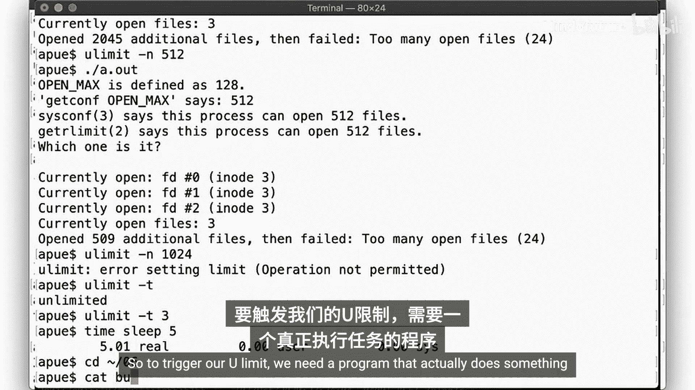

我们可以将软限制提高到硬限制内的任意值，例如2048。之后，我们也可以将其降低到512。但一旦降低，我们就无法再将其提升回最初的1024，因为降低操作同时设置了新的硬限制。

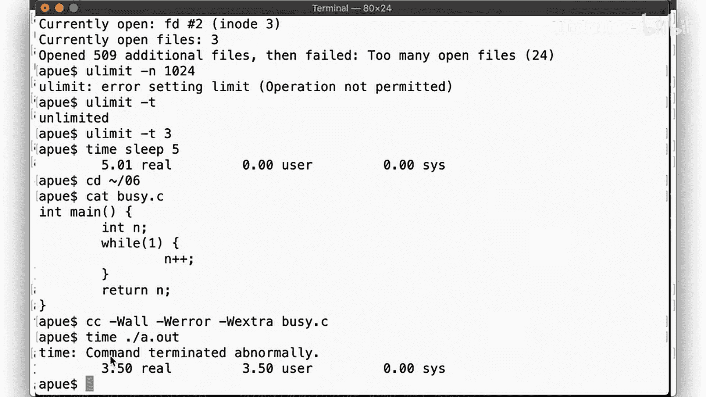

这种机制确保了一个进程可以限制自身及其子进程，并且之后无法自行解除这个限制，类似于永久降低权限的机制。

再看一个CPU时间限制的例子。如果我们将CPU时间限制设置为3秒，那么任何后续运行超过3秒CPU时间的程序都会被终止。需要注意的是，像 `sleep` 这样的函数是主动挂起进程，并不消耗CPU时间，因此不会触发CPU时间限制。要测试限制，需要一个真正进行计算的“忙”循环程序。

### 进程标识符

现在，我们来看看进程标识符。每个进程都有一个唯一的进程ID（PID），同时也有一个父进程ID（PPID）。你可以使用 `getpid()` 和 `getppid()` 系统调用来获取它们。

```c
#include <unistd.h>
pid_t getpid(void); // 返回当前进程的PID
pid_t getppid(void); // 返回当前进程的父进程的PID
```

进程ID在特定时间点唯一标识一个进程。但系统不保证一个PID在进程终止后不会被重用。当进程终止，新进程启动时，可能会被分配相同的PID。PID的分配方式对用户是不透明的（无法预测）。

有一些特殊的进程ID：
*   **PID 0**：通常是系统进程（如调度进程或空闲进程）。
*   **PID 1**：通常是 `init` 或 `systemd` 进程，它是所有用户进程的祖先，负责系统启动和清理孤儿进程。
*   **PID 2**：在一些系统（如旧版BSD）上是页面守护进程（`pagedaemon`），负责虚拟内存的分页操作。

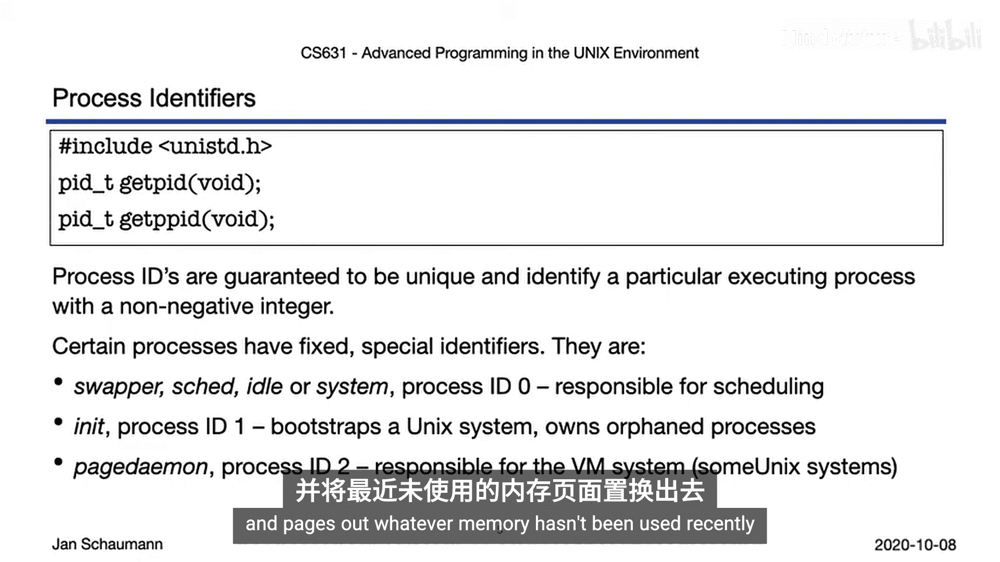

### 查看进程关系

通过一个简单的程序打印PID和PPID，我们可以看到进程间的父子关系。例如，一个程序的PID是980，其PPID是396（即启动它的Shell的PID）。使用 `ps` 命令或 `pstree` 命令可以更清晰地展示整个系统的进程树状关系，从PID 1（init）开始，逐级向下到我们的Shell，再到我们运行的程序。

### 总结

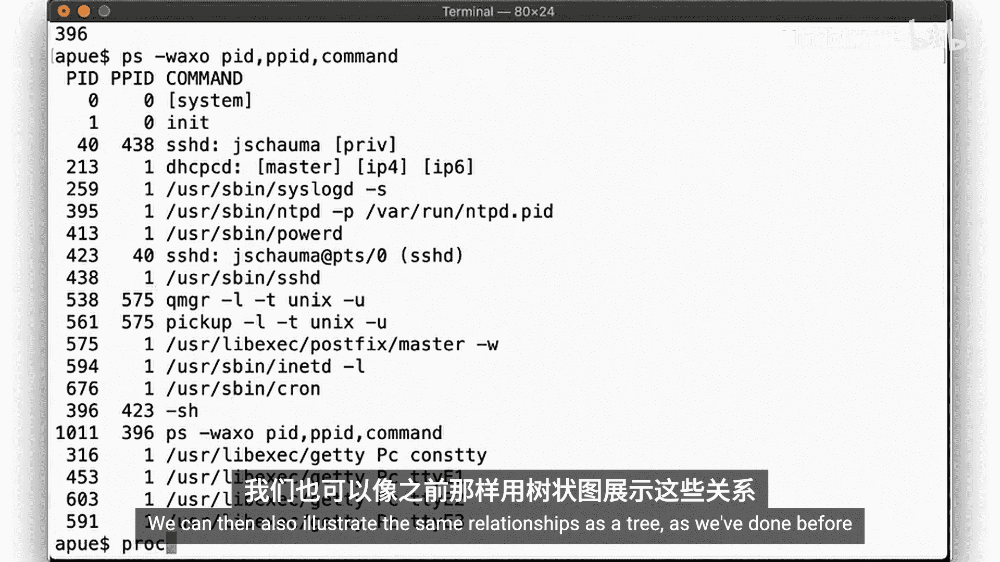

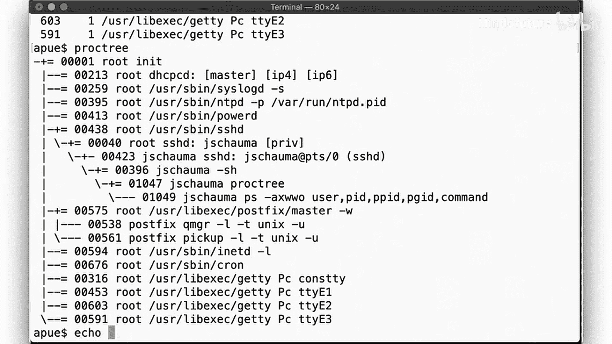

本节课我们一起学习了进程的资源限制和标识符。

我们了解到，进程在资源使用上受到软限制和硬限制的约束。进程可以降低这两种限制，但只能将软限制提高到不超过硬限制的值，且只有root用户能提高硬限制。这些限制是进程特定的，因此 `ulimit` 必须是Shell内置命令。

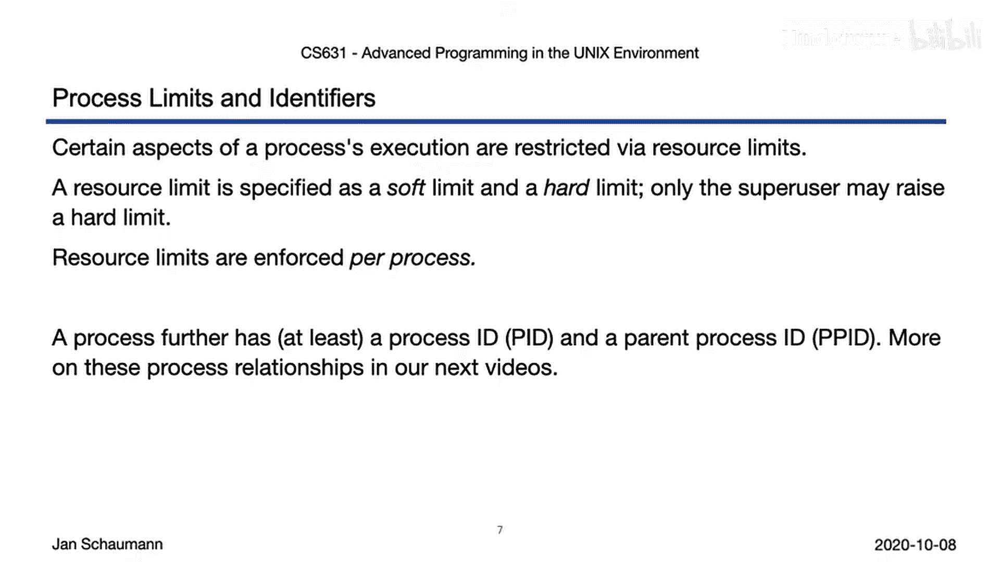

我们还初步了解了进程标识符（PID和PPID）以及一些特殊PID的含义，并通过实例观察了进程间的父子关系。在接下来的视频中，我们将更详细地探讨进程关系。