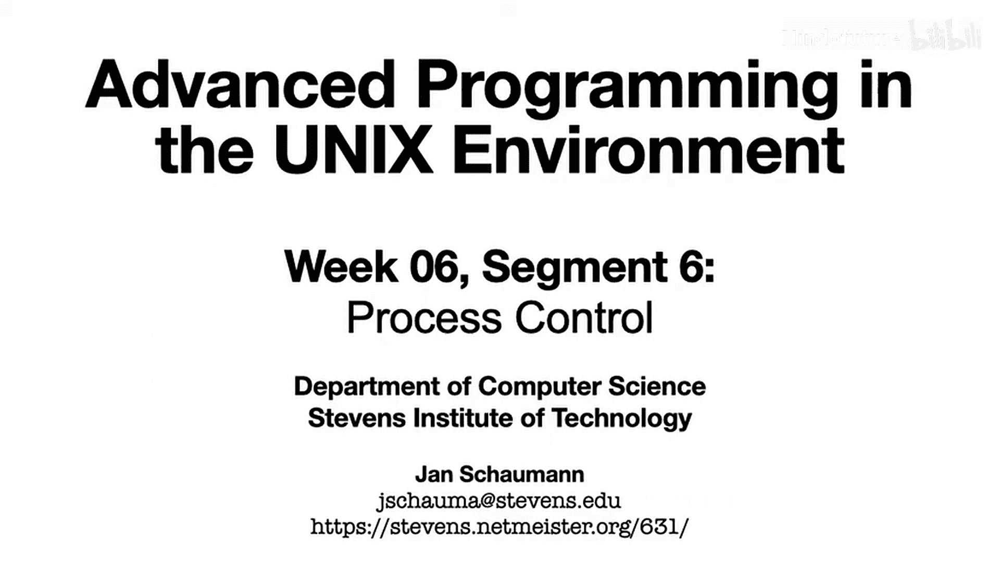
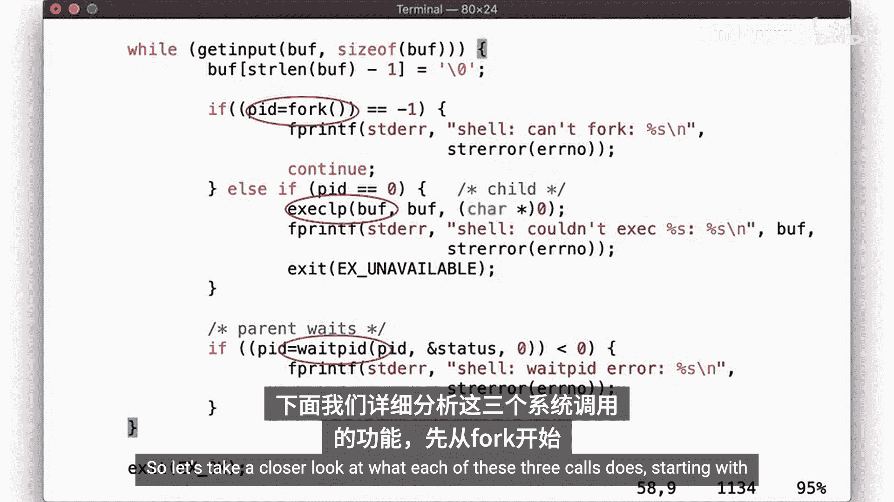
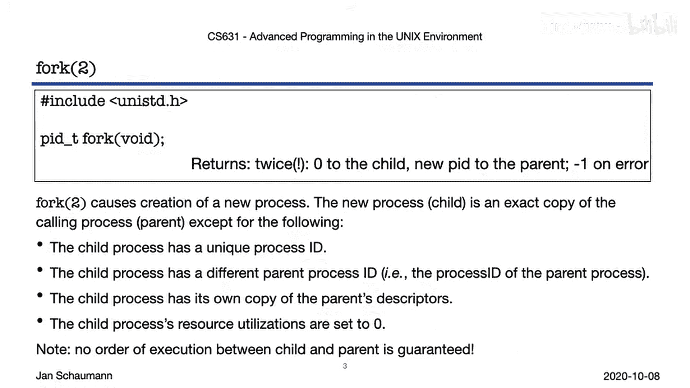
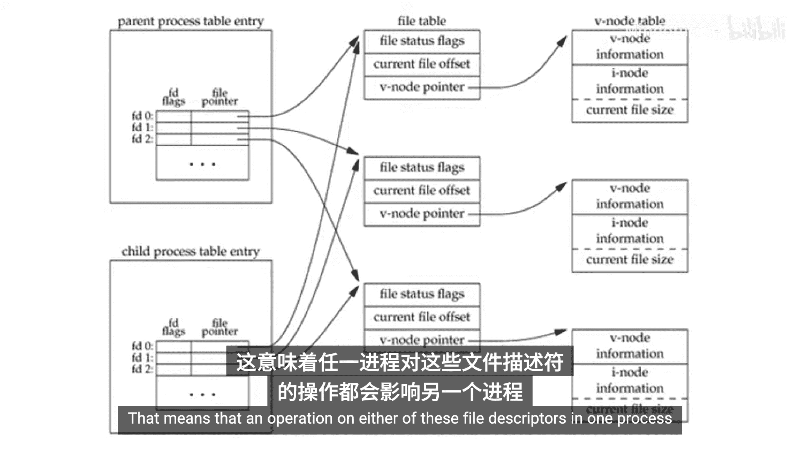
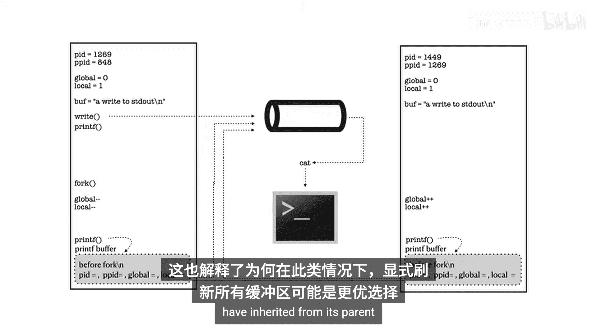
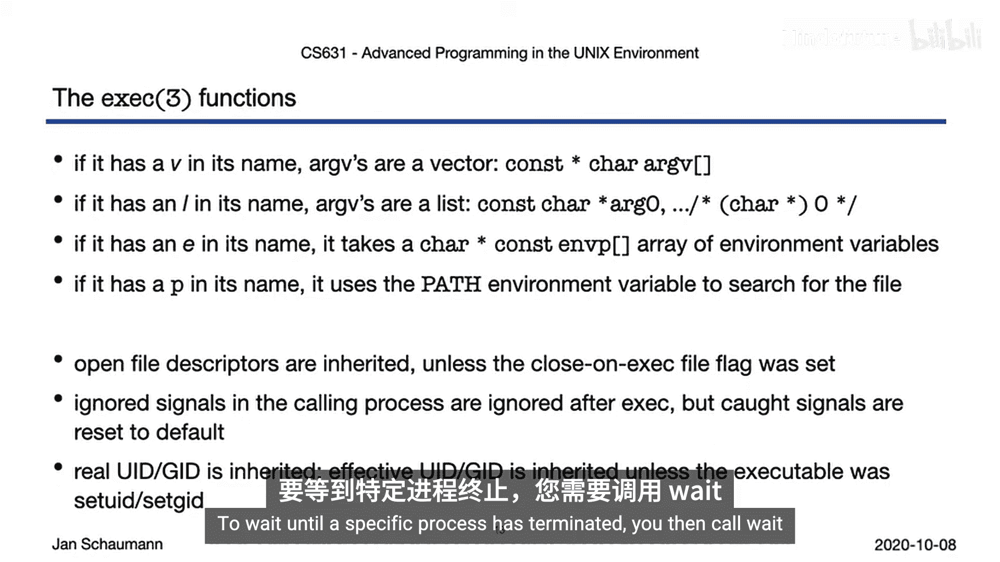
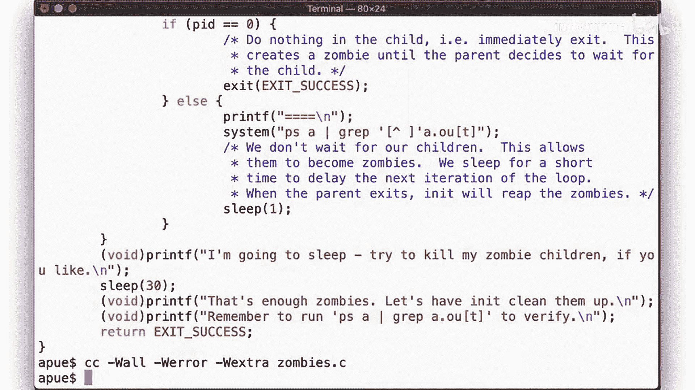
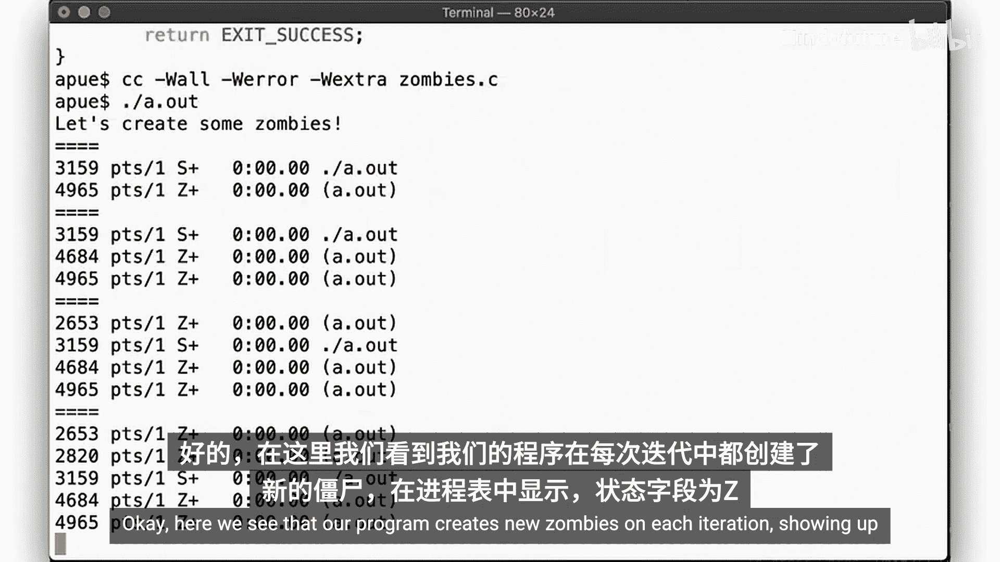
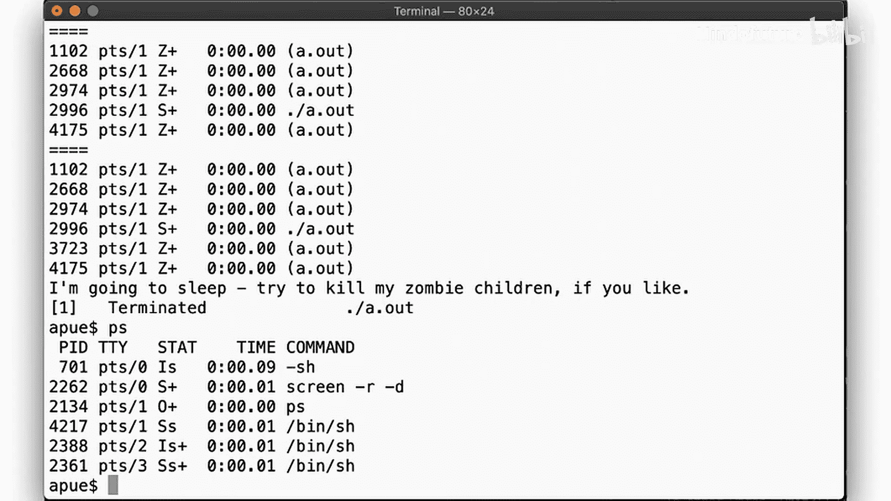
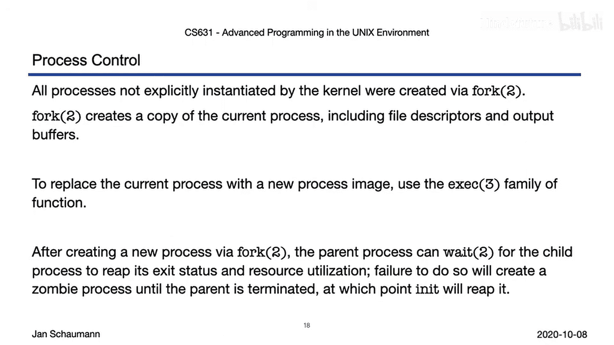

# 043：进程控制 🧬



在本节课中，我们将学习进程控制的核心概念：如何通过可执行文件启动新进程，以及进程终止时会发生什么。这是理解后续课程中更详细的进程关系知识的先决条件。



## 进程创建：`fork`系统调用

上一节我们介绍了进程的基本概念，本节中我们来看看如何创建一个新进程。`fork`系统调用是创建新进程的基础，它的行为有些特殊。

`fork`系统调用会返回两次。它创建一个新进程，导致当前进程出现两个副本。这意味着它会在原始进程和新创建的进程中各返回一次。我们分别称这两个进程为**父进程**和**子进程**。

新进程与父进程几乎完全相同，但存在以下关键差异：
*   子进程拥有一个**唯一的进程ID（PID）**。
*   子进程拥有其**父进程的ID（PPID）**，即调用`fork`的进程的PID。
*   子进程获得父进程中所有**打开的文件描述符的副本**，这些副本指向相同的内核数据结构。这意味着，例如，在子进程中对某个文件描述符进行读取操作，会影响父进程中同一文件描述符的偏移量。
*   子进程的**资源使用统计**被重置为零。
*   需要特别注意的是，`fork`返回后，父进程和子进程的**执行顺序是不确定的**。你不能依赖任何观察到的特定执行顺序。



为了更详细地说明父进程和子进程在文件描述符上的关系，让我们回顾一下与打开文件相关的数据结构。当一个进程打开文件时，会创建文件表项。当该进程调用`fork`时，会创建一个子进程，它继承了父进程的文件描述符。重要的是，子进程的文件描述符指针指向与父进程相同的文件表项。这意味着，在一个进程中对这些文件描述符进行的任何操作（如`lseek`）都会影响另一个进程。

以下是一个演示此行为的代码示例：
```c
#include <stdio.h>
#include <unistd.h>
#include <fcntl.h>



void read_data(int fd) {
    off_t cur_offset = lseek(fd, 0, SEEK_CUR); // 获取当前偏移量
    printf("Current offset: %ld\n", (long)cur_offset);
    char buf[32];
    read(fd, buf, sizeof(buf)); // 读取数据，改变偏移量
}

int main() {
    int fd = open("data.txt", O_RDONLY);
    pid_t pid = getpid();
    printf("Process ID: %d\n", pid);

    read_data(fd); // 父进程读取，偏移量变为32

    pid_t child_pid = fork();
    if (child_pid == 0) {
        // 子进程
        lseek(fd, 32, SEEK_CUR); // 向前移动32字节
        sleep(1); // 让父进程先运行
        read_data(fd);
    } else {
        // 父进程
        sleep(1); // 让子进程先执行lseek
        read_data(fd);
    }
    return 0;
}
```
运行此程序，你将看到子进程的`lseek`操作改变了父进程中文件描述符的偏移量。

## 变量与缓冲区的继承

现在，让我们看看`fork`如何处理内存中的变量和I/O缓冲区。

以下程序演示了变量在`fork`后的行为：
```c
#include <stdio.h>
#include <unistd.h>

int global_var = 10;

int main() {
    int local_var = 20;
    write(STDOUT_FILENO, "Before fork\n", 12);
    printf("Printf before fork\n");

    pid_t pid = fork();
    if (pid == 0) {
        // 子进程
        global_var++;
        local_var--;
        printf("Child: PID=%d, PPID=%d, global=%d, local=%d\n",
               getpid(), getppid(), global_var, local_var);
    } else {
        // 父进程
        global_var--;
        local_var++;
        printf("Parent: PID=%d, PPID=%d, global=%d, local=%d\n",
               getpid(), getppid(), global_var, local_var);
    }
    return 0;
}
```
运行此程序，你会看到父进程和子进程拥有全局变量和局部变量的**独立副本**，修改互不影响。

然而，当输出被重定向时（例如，通过管道），情况会变得有趣。如果你运行`./program | cat`，可能会发现“Printf before fork”这条消息被打印了两次。这是因为`printf`使用了缓冲区。

以下是原因分析：
1.  `write`是**无缓冲I/O**，会立即将数据写入终端。
2.  `printf`是**缓冲I/O**。当标准输出连接到终端时，它是**行缓冲**的，遇到换行符`\n`时缓冲区会被刷新。
3.  当标准输出被重定向到管道时，它变成**全缓冲**，`printf`的数据会留在缓冲区中，不会立即刷新。
4.  调用`fork`时，这个包含`printf`数据的**输出缓冲区也被复制**到了子进程。
5.  当父进程和子进程终止时，它们各自的缓冲区都会被刷新，写入管道，从而导致消息出现两次。

因此，在调用`fork`之前，显式地刷新I/O缓冲区（例如使用`fflush`）通常是一个好习惯。同样，子进程调用`_exit`而不是`exit`可以避免刷新从父进程继承的缓冲区。

## 执行新程序：`exec`函数族

使用`fork`，我们可以创建一个新进程，但父进程和子进程是相同的，任何差异都必须编码在`if (pid == 0)`的逻辑中。然而，更多时候，我们希望在`fork`之后执行一个完全不同的程序。为此，我们使用`exec`函数族。

`exec`函数用指定的可执行文件的新映像**替换**当前进程。如果`exec`返回，则意味着发生了错误。所有`exec`函数都是`execve`系统调用的前端。



以下是`exec`函数族的常见变体及其参数特点：
*   `execl`, `execv`: 需要提供可执行文件的**完整路径**。
*   `execlp`, `execvp`: 使用`PATH`环境变量搜索可执行文件（函数名中的`p`代表path）。
*   `execle`, `execvpe`: 允许传递一个**新的环境变量数组**（函数名中的`e`代表environment）。
*   函数名中的`l`代表参数以**列表（list）**形式传递（可变参数）。
*   函数名中的`v`代表参数以**向量（vector/数组）**形式传递。

例如：
```c
execl("/bin/ls", "ls", "-l", NULL); // 参数列表
char *argv[] = {"ls", "-l", NULL};
execv("/bin/ls", argv); // 参数数组
execvp("ls", argv); // 使用PATH搜索“ls”
```

调用`exec`时需要注意的副作用：
*   **打开的文件描述符**默认会被继承，除非在文件打开时设置了`FD_CLOEXEC`标志。
*   调用进程中设置为忽略的**信号**，在`exec`后仍被忽略；但捕获（caught）的信号会被重置为默认动作。
*   进程继承真实的用户ID（UID）和组ID（GID）。除非可执行文件设置了`set-user-ID`或`set-group-ID`位，否则有效的UID和GID也一同继承。

## 进程同步与回收：`wait`函数族

创建新进程（并可能执行新程序）后，父进程和子进程同时执行。为了等待特定子进程终止并获取其退出状态，父进程需要调用`wait`函数。

`wait`挂起当前进程的执行，直到有子进程的状态信息可用。如果你想等待特定的进程或进程组，可以使用`waitpid`或`wait4`函数。



“等待”一个进程意味着：
1.  阻塞直到该进程终止。
2.  更具体地说，是**检视一个已不再存活的进程的特定信息**。

进程退出时，会留下一个**退出状态**。`wait`函数可以获取这个状态，并通过一系列宏进行解析：
*   `WIFEXITED(status)`: 判断进程是否正常退出。
*   `WEXITSTATUS(status)`: 如果正常退出，获取退出状态码。
*   `WIFSIGNALED(status)`: 判断进程是否因信号而终止。
*   `WTERMSIG(status)`: 如果因信号终止，获取导致终止的信号编号。
*   `WCOREDUMP(status)`: 判断进程是否产生了核心转储（core dump）。
*   `WIFSTOPPED(status)`: 判断进程是否被暂停（例如，被作业控制信号暂停）。

此外，`wait3`和`wait4`还可以检索终止进程的**资源使用情况**（如CPU时间、内存使用等）。

## 僵尸进程与进程回收

为什么必须等待（回收）子进程？因为当进程终止时，其退出状态信息必须保留以供父进程查询。如果永远没有人来清理这些退出状态信息，那么这个进程就变成了一个**僵尸进程**。



僵尸进程是**已经死亡但尚未被等待（reaped）**的进程。它不再运行，但仍然占用着进程ID、退出状态、资源使用记录等内核资源。



考虑以下创建僵尸进程的例子：
```c
#include <stdio.h>
#include <unistd.h>
#include <stdlib.h>

int main() {
    for (int i = 0; i < 5; i++) {
        if (fork() == 0) {
            // 子进程立即退出
            exit(0);
        }
        // 父进程不调用wait，子进程成为僵尸
        printf("Created zombie child #%d\n", i+1);
        sleep(2);
    }
    // 父进程退出前不回收子进程
    sleep(10);
    return 0;
}
```
运行此程序，在另一个终端使用`ps`命令查看，可以看到状态栏标记为`Z`的僵尸进程。你无法用`kill`命令杀死僵尸进程，因为它们已经死了。

当父进程先于子进程终止时，子进程成为**孤儿进程**。内核会将孤儿进程**过继**给`init`进程（PID 1）。当孤儿进程终止时，`init`进程会收到信号并调用`wait`回收它，从而避免其成为僵尸。因此，在上面的例子中，如果你杀死了父进程，所有僵尸子进程都会被`init`回收并消失。



## 总结

本节课中我们一起学习了进程控制的核心机制：
1.  我们学习了如何使用`fork`创建新进程，并了解到`fork`会创建当前进程的一个几乎完全相同的副本，包括文件描述符和I/O缓冲区。
2.  我们探讨了调用`exec`函数族的不同方式，以使用新的程序映像替换当前进程。
3.  我们掌握了如何通过`wait`函数族获取终止进程的状态信息和资源使用情况，并理解了必须调用`wait`来回收子进程，以防止僵尸进程占用系统资源。同时，我们也了解到`init`进程会负责回收孤儿进程。



在接下来的课程中，我们将更深入地研究进程之间的关系，然后进入信号处理的学习。