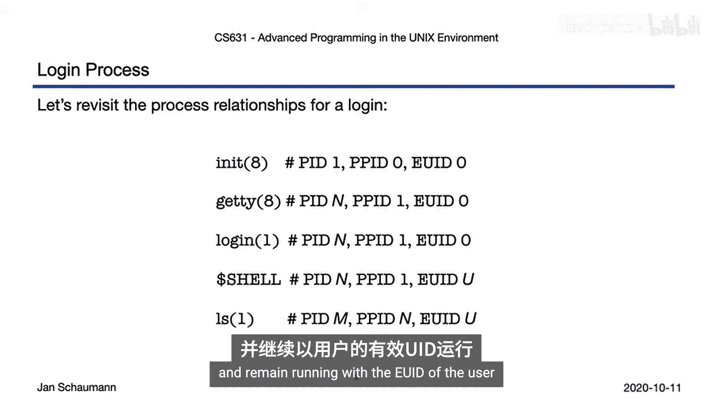
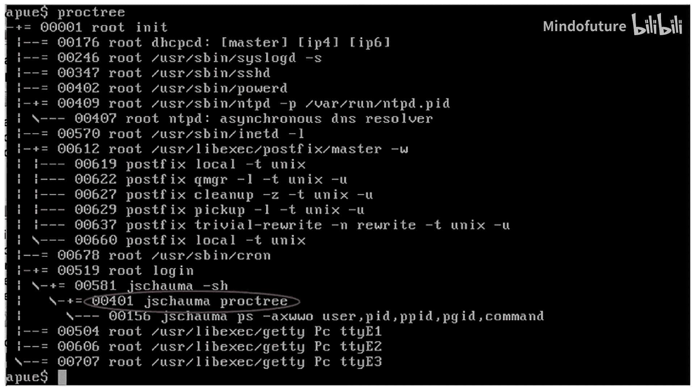
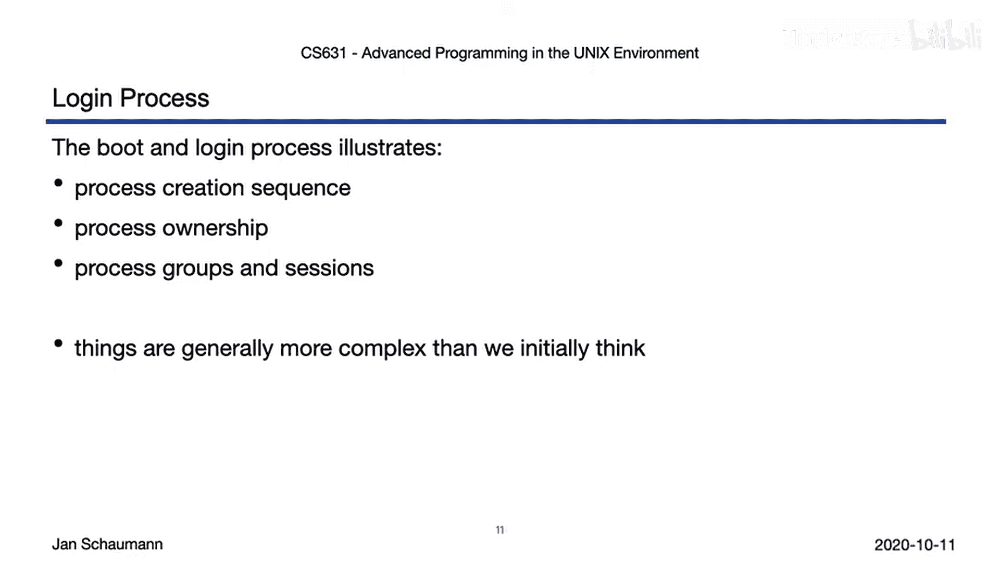

# 044：第1节 - 登录过程 🚀

在本节课中，我们将要学习UNIX系统启动和用户登录过程中进程是如何被创建和关联的。我们将从系统启动开始，一直追踪到用户获得一个可交互的Shell，并理解这个过程中进程ID、父进程ID以及用户ID的变化。

## 概述

当UNIX系统启动时，内核会初始化硬件并最终将控制权交给`init`进程。随后，系统会为每个终端启动`getty`进程来管理登录。用户输入用户名和密码后，`login`程序会验证凭证并最终启动用户的Shell。本节将详细拆解这一系列步骤。

## 系统启动与进程创建

系统启动时，内核会在串行控制台输出大量消息。这些消息记录了硬件初始化的过程。内核启动完成后，控制权会交给`init`进程，此后发送到串行控制台的消息通常不会被保存到文件中。

要查看这些消息，需要直接连接到物理串行端口，或者通过虚拟主机提供商提供的远程控制台访问。这些消息显示了各种守护进程的启动过程，直到系统最终打印出登录提示符，准备接受连接。

## 登录流程详解

如果你连接到串行控制台，系统会提示你输入用户名。输入用户名并回车后，系统会提示输入密码。提供正确的密码后，系统会记录你的登录信息并启动你的Shell。

以下是登录过程中进程创建的顺序：

1.  `init`进程由内核显式创建。
2.  系统通过配置文件`/etc/ttys`可以配置允许多个终端连接。对于其中的每一个条目，`init`都会`fork`一个新进程。
3.  该新进程会`exec` `getty`程序。`getty`负责配置TTY、读取登录名，然后调用`login`命令。
4.  当用户在终端输入用户名时，`getty`会`exec` `login`程序。
5.  登录成功后，`login`程序会`exec`用户的Shell。
6.  正如我们之前所见，对于在Shell中输入的每个命令，Shell都会`fork`一个新进程并`exec`给定的命令。
7.  当Shell退出时，`init`会回收该进程，再次`fork`，并在现在可用的终端上重新`exec` `getty`。

## 登录程序的关键操作

登录过程的前几个步骤都以超级用户权限运行。`login`程序会执行以下关键操作：

*   关闭终端回显，这样输入密码时就不会显示。
*   读取密码，计算其哈希值，并与存储在`/etc/master.passwd`中的哈希值进行比较。
*   如果验证成功，将登录信息记录到系统数据库中（可通过`w`或`who`命令查询）。
*   读取并可能向用户显示系统文件，例如`/etc/motd`，允许管理员在登录时向所有用户显示重要消息。
*   初始化用户的所有补充组成员身份。
*   将当前工作目录更改为用户`passwd`条目中列出的目录。
*   更改终端设备的所有权，使用户可以读写该设备。
*   最后，在调用Shell之前，将用户ID从0（root）更改为用户的UID。

## 进程ID与用户ID的变化

我们刚刚看到了进程是如何创建的。现在来看看这些进程的ID和用户ID是如何变化的：

*   `init`：进程ID为1，父进程ID为0，有效用户ID为0。
*   `getty`：由`init` `exec`，具有未指定的新进程ID，父进程为`init`，有效用户ID仍为0。
*   `login`：由`getty` `exec`，继承`getty`的进程ID和父进程ID，有效用户ID仍为0。
*   `Shell`：由`login` `exec`，继承`login`的进程ID和父进程ID，但有效用户ID已变为用户的UID。
*   用户命令：由Shell `fork`并`exec`，获得新的进程ID，以Shell的进程ID作为父进程ID，并以用户的有效用户ID运行。

如果你使用VirtualBox启动带有图形控制台的虚拟机，可以在此虚拟串行控制台上登录，并显示进程树来复现我们刚刚讨论的内容。

例如，我们可能看到：
*   `init`的进程ID是1。
*   监听多个串行控制台的`getty`进程ID是504、606和707。
*   我们从`getty`运行的`login`程序进程ID是519。
*   我们的Shell进程ID是581。
*   而`proc tree`命令本身的进程ID是401。

## 总结与过渡

本节中，我们一起学习了系统启动和登录过程如何创建进程，以及进程ID、父进程ID和进程所有权的变化。我们也看到了某些进程是如何被分组在一起的，这暗示了我们将要在下一节视频中讨论的更大主题：**进程组和登录会话**。

此外，我们还看到登录过程可能比最初想象的要复杂一些。它不仅仅是打印提示符、验证密码然后为用户执行Shell那么简单。

为了更深入地理解其中涉及的所有细节，建议你：
*   查看`login`程序的源代码（通常位于`/usr/src/usr.bin/login`）。
*   复习`sh`手册页中关于Shell启动及其可能读取的各种配置文件的部分。

希望这些内容能让你有所收获，直到下一节视频发布。

