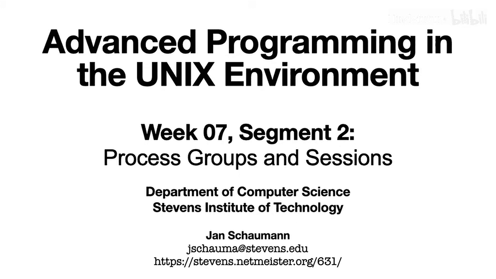
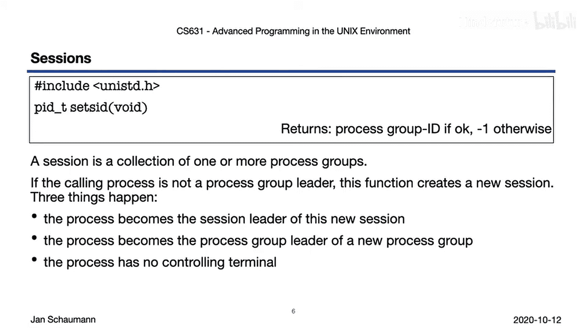
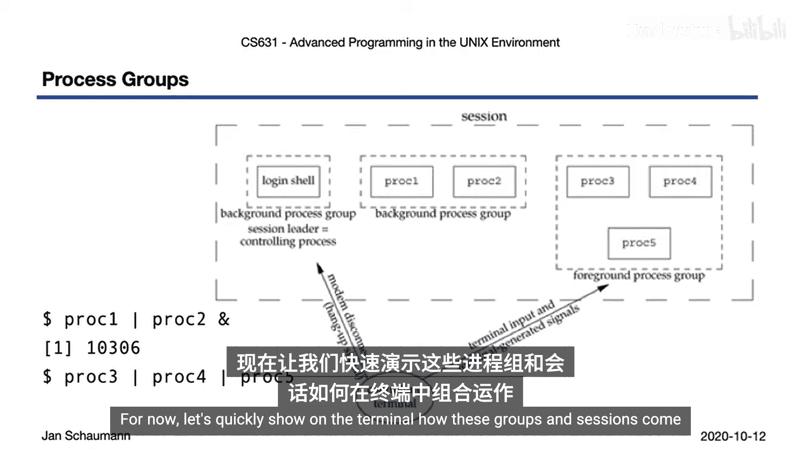
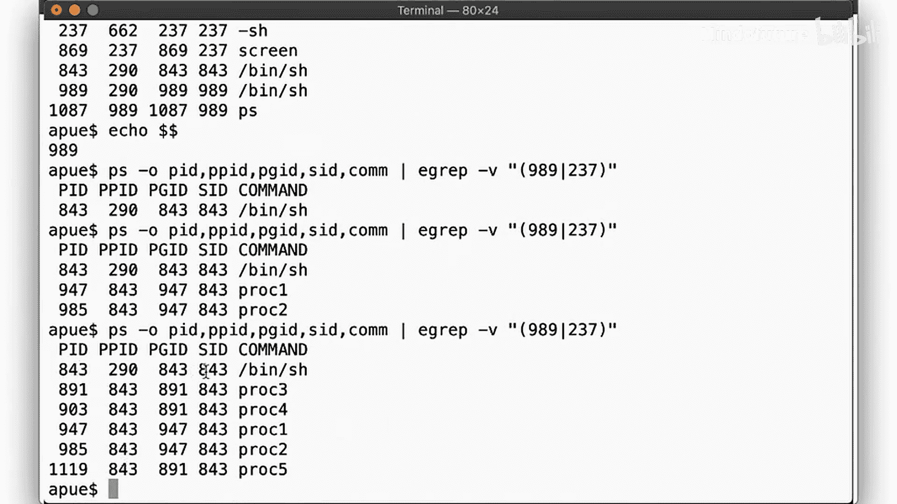
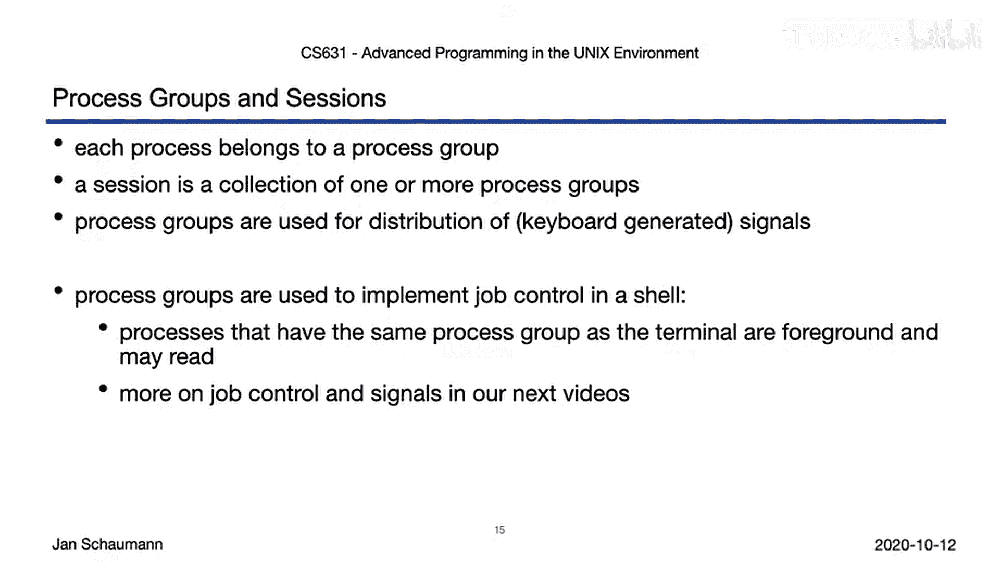

# 045：进程组与会话 👨‍💻

在本节课中，我们将要学习UNIX系统中进程组和会话的概念。理解这些概念对于掌握进程管理、作业控制和信号分发至关重要。

上一节我们介绍了进程的创建和用户登录流程，本节中我们来看看进程如何被组织成组和会话。

我们直观地理解某些进程是相互关联的，应该形成一个组，例如当我们把一个命令的输出通过管道传递给另一个命令时。接下来，让我们详细了解其工作原理。

## 什么是进程组？ 👥

首先，每个进程，无论它是否是命令管道的一部分，都属于一个进程组。

进程组通常是指属于同一个作业或终端的进程集合。进程组像进程ID一样，通过一个进程组ID来标识。这些进程组ID也是小的非负整数，唯一地标识一个进程组，并且实际上可以存储在 `pid_t` 数据类型中。

你可以通过调用 `getpgrp()` 系统调用来获取当前进程的进程组ID，或者使用 `getpgid(pid)` 来确定任何指定进程的进程组ID。

每个进程组可能有一个进程组组长。这个组长的特点是其进程ID与进程组ID相同。这个组长可以创建一个新的进程组，并在此组内创建进程。

要显式地设置任何进程的进程组，可以调用 `setpgid()`。当然，这只对当前进程或其子进程有效，除非你是超级用户。

## 进程组示例 🖥️

让我们看看这在实际中是什么样子。当我们登录时，会发现自己处于一个登录Shell中，准备代表我们执行命令。这个登录Shell将处于它自己的进程组中。

当我们从这个Shell调用一个新命令时，例如这里显示的后台管道 `proc1 | proc2`，那么管道中的所有命令都将被放入它们自己的进程组中。

由于我们将 `proc1 | proc2` 管道放入了后台，我们现在可以执行一个新的命令管道 `proc3 | proc4 | proc5`。这组进程也将被放入它们自己唯一的进程组中。

这意味着，在这种情况下，我们至少有**三个进程组**：
*   一个用于Shell。
*   一个用于在后台运行的进程。
*   一个用于在前台运行的管道。

以这种方式将进程分组是有意义的，因为我们以不同的方式与不同的进程交互。

## 什么是会话？ 📦

但是，所有这些进程仍然以某种方式属于一个整体，对吗？它们都是作为登录Shell的子进程启动的。如果你从终端断开连接，你会发现它们都会被终止，因为我们的登录会话被中断了。而这正是这组进程组的集合——一个**会话**。

你可以通过调用 `setsid()` 来创建这样一个会话，即一个进程组的集合。当你这样做时，会发生以下情况：
1.  你成为一个新会话的**会话领导者**。
2.  你也成为一个新创建的进程组的**进程组领导者**。

也就是说，你从一个干净的状态开始，调用进程将是会话和进程组中唯一的进程。这个新会话也将没有**控制终端**。

因此，如果你希望分配一个控制终端，你必须在System V衍生的UNIX变体中打开一个，或者调用 `ioctl()` 来请求一个控制终端。设备 `/dev/tty` 就代表控制终端。

## 会话结构图 🗺️

这就是我们所理解的会话结构：它包含我们之前看到的所有三个进程组。会话中的不同进程组可以以不同的方式与控制终端交互。

**前台进程组**可以接收键盘输入以及键盘生成的信号。终端的挂断信号将发送给会话领导者。

我们将在下一个视频片段中看到更多这方面的实例。现在，让我们快速在终端上展示这些组和会话是如何组合在一起的。

## 终端演示 🧪

以下是演示步骤的总结：
1.  我们的登录Shell进程ID是843。
2.  当我们运行后台管道 `proc1 | proc2` 时，`proc1` 和 `proc2` 作为Shell的子进程出现，拥有自己的进程组ID（例如947）。
3.  当后台进程运行时，我们再运行前台管道 `proc3 | proc4 | proc5`。现在，`proc3`、`proc4` 和 `proc5` 出现在另一个独立的进程组中（例如891），但仍然是进程843的子进程。
4.  所有这些进程都被分组在**同一个会话**中，会话ID为843，我们的Shell作为会话领导者。

## 管道与进程组映射 🔄

让我们再次回顾一下管道中的各个进程如何映射到进程组。这里我们有两个 `cat` 命令的副本，以便在进程表中更容易区分它们。

过程如下：
1.  我们从登录Shell（进程ID 265）开始。
2.  输入命令行后，Shell解析整个命令，然后 `fork` 一个新进程（PID 296）来执行 `ps` 命令。
3.  Shell再次 `fork`，生成PID 689来执行第一个 `cat` 命令（`cat1`）。这个进程通过管道连接到 `ps` 命令（PID 296）。
4.  Shell第三次 `fork`，创建PID 981来执行第二个 `cat` 命令（`cat2`）。这个进程也通过管道连接到 `cat1`。
5.  父进程（初始Shell）得到通知。

需要注意的是，在 `ps` 的输出中，我们可能不会立即看到 `cat1` 或 `cat2` 出现。这是因为 `ps` 命令被调用时，`cat` 程序可能尚未执行。Shell为管道的三个组件 `fork` 了三个进程，然后 `ps` 读取进程表，看到这些进程被列为 `sh`（Shell），之后两个子Shell进程才执行 `cat` 命令。

所有三个命令都在**同一个进程组**（组296）中，`ps` 命令是进程组组长。但它们都与初始Shell一起，处于**同一个会话**（会话265）中，初始Shell是会话领导者。

## 总结 📝

本节课中我们一起学习了进程组和会话的核心概念。

*   除了拥有唯一的进程ID，每个进程都属于**恰好一个进程组**。
*   多个进程组可以组合成一个**会话**。
*   这些进程组和会话用于分发信号，从而允许Shell实现**作业控制**，引入了前台和后台进程组的概念。

前台进程组可以与控制终端交互，但是当后台进程组想要与控制终端通信（无论是读取还是写入数据）时会发生什么？我们将在下一个视频中探讨这个问题。

---
**核心概念公式/代码表示：**
*   获取当前进程组ID：`pid_t getpgrp(void);`
*   获取指定进程的进程组ID：`pid_t getpgid(pid_t pid);`
*   设置进程组ID：`int setpgid(pid_t pid, pid_t pgid);`
*   创建新会话并成为会话领导者：`pid_t setsid(void);`