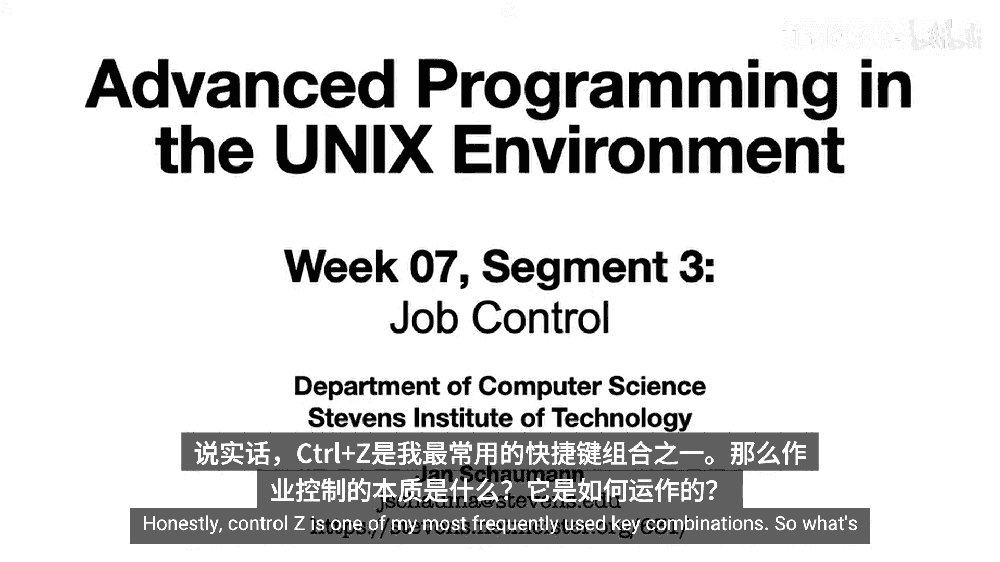
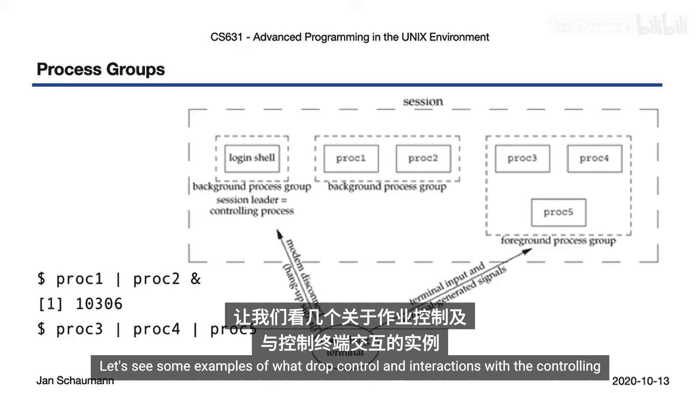
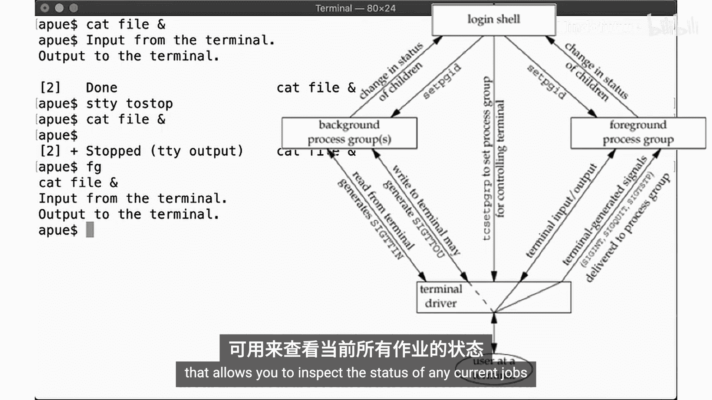
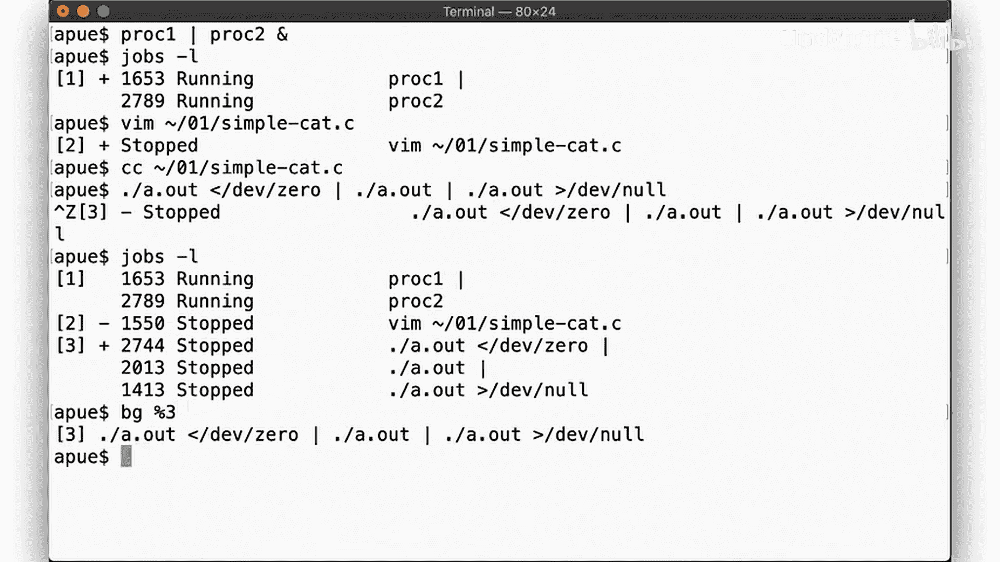
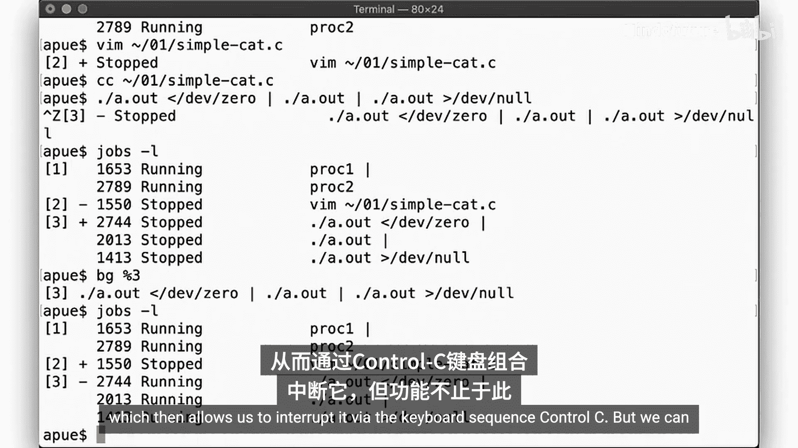
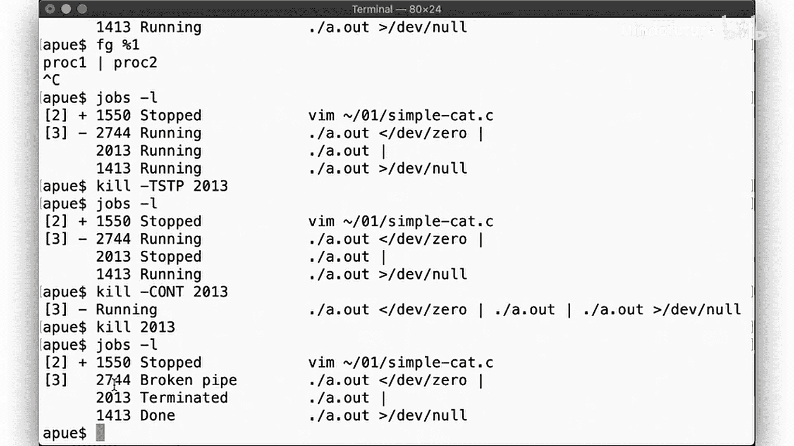
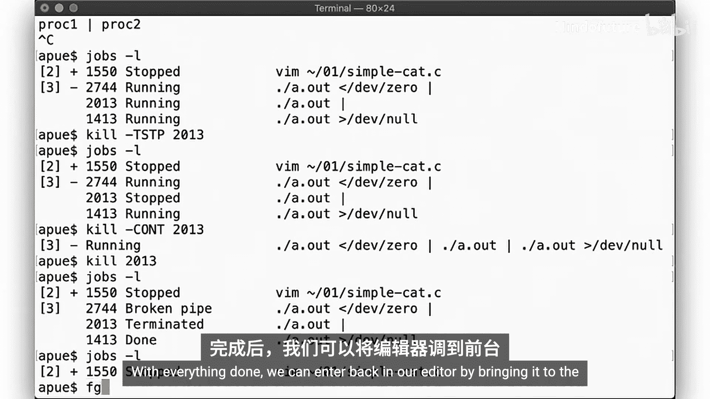
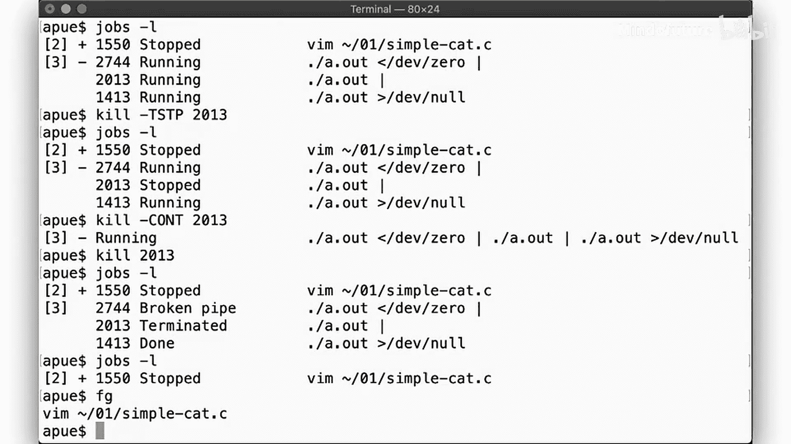
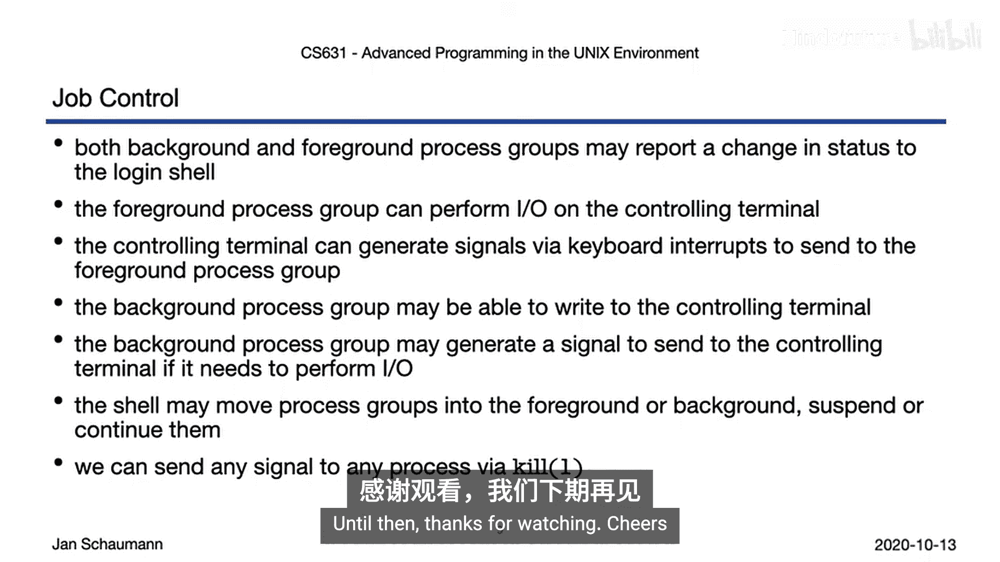

# 046：作业控制 🖥️

## 概述
在本节课中，我们将学习UNIX环境下的作业控制概念。我们将探讨进程组、会话与控制终端如何交互，以及Shell如何利用这些机制来管理前台和后台任务。

---



## 进程组、会话与控制终端回顾
上一节我们介绍了进程组、会话以及它们与控制终端的交互。一个登录会话包含多个进程组，其中前台进程组与控制终端交互，会话领导者则接收来自控制终端的变更通知，例如挂起信号。



## 作业控制简介
本节中，我们来看看作业控制的具体实现。作业控制最初由C Shell引入，后被Korn Shell采纳，并最终成为标准Bourne Shell的一部分。其设计源于80年代单终端交互的局限性，用户只有一个终端，无法同时运行多个任务。伯克利的Bill Joy（后来共同创立了Sun Microsystems）在C Shell中引入了让Shell暂停当前进程并切换到另一个前台进程的方法。

## 前台与后台进程组
以下是前台与后台进程组工作方式的对比。

### 前台进程示例
在Shell中执行命令时，该命令会被放入自己的进程组。例如，Shell（进程ID 41，进程组领导者，会话领导者）执行 `ps` 命令。Shell会调用 `fork` 和 `exec`，然后使用 `setpgid` 将新进程放入其自己的进程组（例如PGID 753）。`ps` 完成后退出，其退出状态会保留，直到父进程（Shell）通过 `wait` 回收它。Shell会阻塞等待子进程终止，然后报告其退出状态。

### 后台进程示例
使用 `&` 符号在后台启动命令时，该命令同样被放入其会话内的一个独立进程组。如果此后台命令完成，表面上似乎没有立即发生什么，因为Shell没有阻塞等待它。但当我们按下回车键时，Shell会报告后台进程已完成。这是因为当后台进程终止并生成 `SIGCHLD` 信号通知父进程（Shell）时，Shell会捕获此信号并调用 `wait` 获取状态信息。

## 与控制终端的交互
控制终端允许我们控制前台进程组。登录Shell必须通过调用 `tcsetpgrp` 来为控制终端设置前台进程组。

### 输入输出流
来自终端的输入会发送给前台进程（例如 `cat`）。命令的输出默认发送到终端，除非被重定向到文件。当 `cat` 等待输入时，它会调用 `read` 并阻塞，直到我们提供更多数据。

### 键盘信号
我们可以通过控制终端发送特定键盘序列来影响前台进程：
*   **Control-D**：发送EOF字符。
*   **Control-C**：发送 `SIGINT` 信号，中断程序。
*   **Control-Z**：发送 `SIGTSTP` 信号，挂起程序。

终端驱动程序负责将这些键盘序列转换为信号，并发送给前台进程组。

## 后台进程的终端访问
如果后台进程组尝试进行I/O操作会怎样？

### 默认行为
如果我们在后台运行 `cat file`，该进程会向仍连接着控制终端的标准输出写入数据。Shell不会等待该命令终止就打印下一个提示符，导致命令输出可能会干扰当前终端屏幕。

### 限制后台输出
我们可以配置终端，禁止后台进程随意输出。使用 `stty` 命令，可以要求终端驱动程序在后台进程尝试生成输出时将其挂起，并发送 `SIGTTOU` 信号。此后，当后台进程尝试写终端时，它会被挂起，直到我们将其切换到前台。

类似地，如果后台进程尝试从终端读取（`SIGTTIN`），也会被挂起。Shell处理这些信号，并能在前台和后台之间移动进程组，这就是所谓的作业控制。

## Shell作业控制命令实践
大多数Shell都实现了 `jobs` 内置命令，用于查看当前所有作业的状态。

以下是使用作业控制管理多个任务的示例步骤。



1.  **启动后台作业**：运行一个后台管道命令。
    ```bash
    command1 | command2 &
    ```
    使用 `jobs -l` 查看，会显示这个包含两个进程的进程组正在后台运行。

2.  **前台工作与挂起**：在前台启动一个编辑器（如 `vim`）。如果想暂时做别的事情，可以按 **Control-Z** 挂起整个前台进程组（编辑器）。Shell会报告进程已挂起。

3.  **管理多个作业**：此时，可以运行其他前台命令，或再次挂起它们。`jobs -l` 会列出所有作业状态：后台运行的任务、被挂起的编辑器、被挂起的管道。





4.  **恢复作业**：
    *   使用 `bg %作业号` 将挂起的作业放到后台继续运行。
    *   使用 `fg %作业号` 将后台或挂起的作业带到前台。

5.  **向进程发送信号**：我们可以使用 `kill` 命令向任何进程发送信号。
    *   挂起一个后台进程：`kill -SIGTSTP %作业号`
    *   让一个挂起的进程继续：`kill -SIGCONT %作业号`
    *   终止一个作业：`kill -SIGKILL %作业号`

6.  **管道作业的影响**：如果终止一个管道中的某个进程，其他进程会受到影响。例如，写入已关闭管道的进程会收到 `SIGPIPE` 信号；从已关闭管道读取的进程会读到EOF并正常结束。







7.  **返回原有工作**：最后，可以使用 `fg` 将之前挂起的编辑器带回前台，并正常退出。

## 总结
本节课中我们一起学习了UNIX作业控制的核心机制：

*   前台和后台进程组都能向登录Shell报告状态变更。
*   前台进程组可以在控制终端进行I/O。
*   控制终端能通过键盘交互生成信号（如 **Control-C** 发送 `SIGINT`，**Control-Z** 发送 `SIGTSTP`）发送给前台进程组。
*   后台进程组在尝试进行终端I/O时可能被挂起，并产生 `SIGTTOU` 或 `SIGTTIN` 信号。
*   Shell可以移动进程组到前台或后台、挂起或继续它们，这构成了作业控制。
*   可以使用 `kill` 命令向任何进程发送任何信号。



在下一个视频中，我们将更深入地研究信号传递机制以及进程接收到信号时的行为。