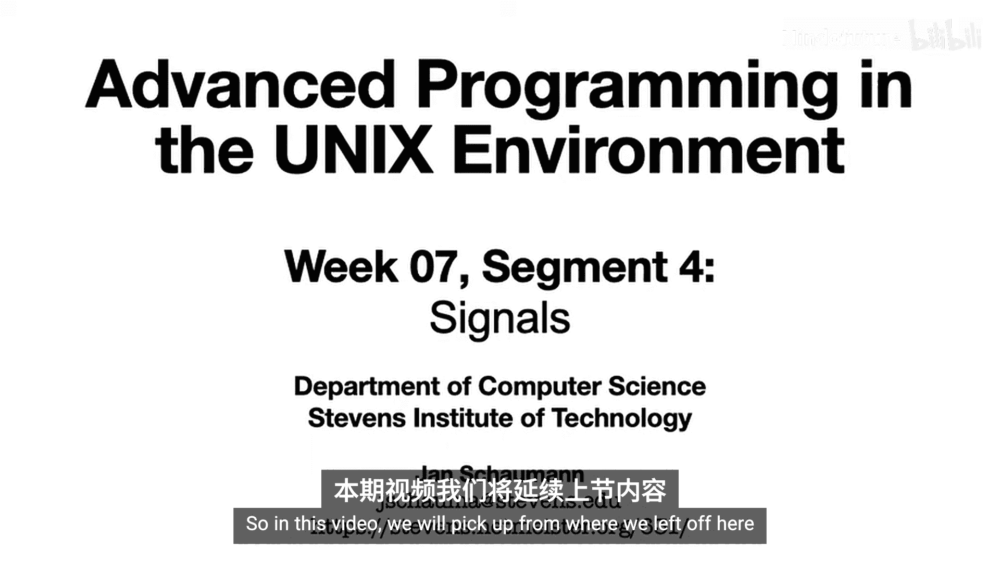
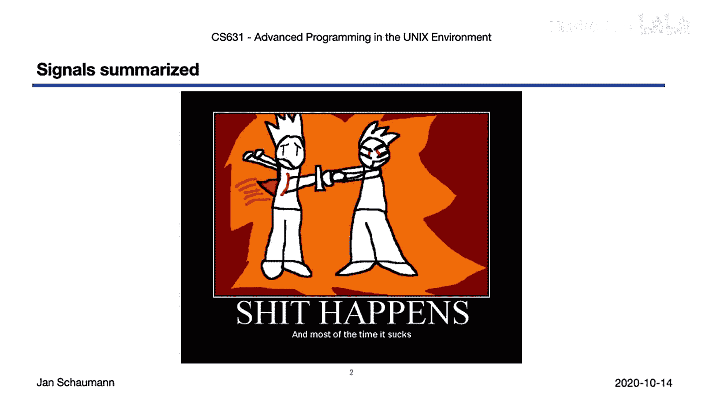
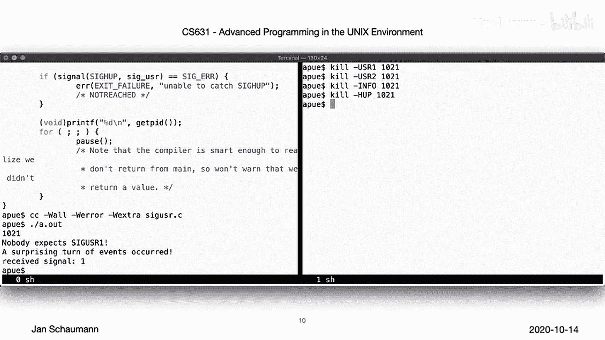
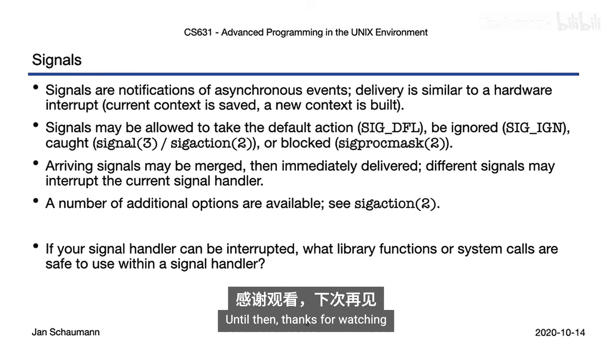

UNIX高级编程：P47：信号详解 🚦

在本节课中，我们将深入学习UNIX环境下的信号机制。信号是一种进程间异步通信的基本方式，允许一个进程通知另一个进程某个事件已经发生。我们将探讨信号的产生、发送、接收和处理方式。

上一节我们介绍了终端控制，看到了shell如何通过控制终端与前后台进程组通信。本节中，我们将详细探讨信号这一异步进程间通信机制。




信号是计算机通知进程某事件发生的一种方式。多数情况下，这并非好消息。事实上，进程常因接收到信号而被终止。




但并非总是如此。让我们更仔细地观察一下。

信号是进程获知事件发生的一种方式。信号最重要的特性是**异步性**和**不可预测性**。你无法预知信号何时发生，甚至不知道它是否会发生。信号可能在任何时间点到达，也可能永不发生。

你已经见过许多例子。至少，你已经无数次使用过 `SIGINT` 信号。这个信号，连同我们已经见过的其他一些信号，是由终端驱动程序在按下特定键盘组合键时生成的。

其中包括我们上一节讨论过的 `Ctrl+Z`（`SIGTSTP`）。我们还看到一些信号无需我们干预，由进程自身生成。例如，当后台进程试图在终端进行I/O操作时。

其他可能导致信号产生的情况包括：定时器超时、用户与控制终端断开连接（导致 `SIGHUP` 被发送给会话首进程）、用户调整窗口大小（要求可视化编辑器重绘屏幕）等等。当然，还有很多其他情况。

你可以在 `signal` 手册页中找到完整的信号列表。根据你的UNIX版本，细节可能在不同章节描述。

除了键盘组合键，某些硬件异常也会产生信号，例如常见的段错误 `SIGSEGV`，或除零错误 `SIGFPE`。还有一些软件条件，例如当你尝试向一个读取端进程已终止的管道写入数据时。

我们可以通过 `kill` 命令向任何进程发送任何信号。你或许不会惊讶，`kill` 命令是通过 `kill` 系统调用来实现的，其原型如下：

```c
int kill(pid_t pid, int sig);
```

如果你传入一个有效的进程ID（PID），该系统调用的用法很简单。但你可能希望向多个进程发送信号，例如当前进程组中的所有进程。为此，可以传入一个 `pid` 值为 `0`。

那么，如果传入的进程ID是 `-1` 会怎样？POSIX标准没有定义此行为，但BSD衍生系统和Linux至少实现了以下逻辑：如果你是超级用户，信号将发送给除某些系统进程（如 `init` 或 `swapper`）和当前进程之外的所有进程。这允许你在不注销或终止进程的情况下，将系统带入可调试或重启的状态。

如果你不是超级用户，信号将发送给你拥有的所有进程，除了调用进程本身。

Linux还支持另一种特殊行为：如果你传入一个小于 `-1` 的负数，信号将发送给该PID绝对值所代表的进程组中的所有进程。注意，这显然不具备可移植性。

最后，值得注意的是，你可以传入 `0` 作为信号编号（`sig` 参数）。在这种情况下，`kill` 系统调用仅检查进程是否存在：如果进程存在则返回 `0`，否则返回 `-1`。这样，你可以在不实际发送信号的情况下，轻松检查给定进程是否存在。

当一个信号被递送到你的进程时，你可以做什么？最简单的做法是：在你的代码中什么都不做，这样就会执行该信号的默认行为。

在大多数情况下，默认动作是终止当前进程，但这可能并非你想要的。例如，回想我们第一讲中的简单shell程序。因为我们没有做任何信号处理，如果用户按下 `Ctrl+C` 发送 `SIGINT` 给shell，它就会被终止。

因此，一个更好的解决方案可能是明确指示你的代码完全忽略该信号。也就是说，**忽略信号需要一个明确的动作**。

你也可以决定在信号发生时执行其他操作。为此，你需要指定一个要调用的函数，这被称为**安装信号处理器**。

最后，你还可以选择“现在不行”，通过**阻塞**信号来阻止其被递送。这与忽略信号不同，因为你可以在稍后解除阻塞，然后查看是否有此类信号被递送，并在你准备好时让它执行上述三种动作之一。

😊，我们稍后会看到一些这方面的例子。

那么，我们如何告诉进程我们希望如何处理给定的信号呢？我们可以调用恰如其名的 `signal` 函数，其函数原型如下所示：

```c
void (*signal(int sig, void (*func)(int)))(int);
```

顺便说一句，如果你在简历上写“我懂C语言”，那么几乎可以肯定，在面试中会有人要求你解释这个函数原型。这是一个非常流行的问题。你能说出这个函数返回什么，它的参数是什么吗？

如果不能，或者即使你只是想简化一下，你可以使用以下变体：

```c
typedef void (*sighandler_t)(int);
```

这里，我们将 `sighandler_t` 类型定义为一个指向函数的指针，该函数接受一个 `int` 参数并返回 `void`。有了这个类型定义，你就可以将 `signal` 函数原型写成如下形式：

```c
sighandler_t signal(int sig, sighandler_t func);
```

也就是说，`signal` 函数接受一个整数和一个 `sighandler_t` 作为参数，并返回一个 `sighandler_t`。或者更具体地说，它是一个函数，其参数是一个整数和一个指向函数的指针（该指针指向的函数接受一个整数参数并返回 `void`），而 `signal` 本身返回一个指向同类函数的指针。

具体来说，它返回的是**之前的信号处理器**。

下面，让我们看一个简单的例子来说明如何调用 `signal` 函数。

```c
#include <stdio.h>
#include <signal.h>
#include <unistd.h>

void sig_handler(int signo) {
    if (signo == SIGUSR1)
        printf("Received SIGUSR1\n");
    else if (signo == SIGUSR2)
        printf("Received SIGUSR2\n");
}

int main(void) {
    if (signal(SIGUSR1, sig_handler) == SIG_ERR)
        printf("\ncan't catch SIGUSR1\n");
    if (signal(SIGUSR2, sig_handler) == SIG_ERR)
        printf("\ncan't catch SIGUSR2\n");
    printf("My PID is %d\n", getpid());
    while(1)
        pause(); // 等待信号
    return 0;
}
```

这里我们看到一个函数 `sig_handler`，它将作为我们的信号处理器。在 `main` 函数中，我们为 `SIGUSR1`、`SIGUSR2` 和 `SIGINT` 信号安装了这个信号处理器，打印当前PID，然后永远暂停，等待信号发送给我们。

在运行这个程序之前，让我们创建第二个窗口，以便在向程序发送信号时观察它。

现在我们的程序以PID 1021运行。让我们使用 `kill` 命令向它发送 `SIGUSR1`。成功了。现在发送 `SIGUSR2`。也成功了。



如果我们发送一个我们没有设置信号处理器的信号会怎样？那么默认动作就会发生。在这种情况下，我们很幸运，`SIGINT` 的默认动作是什么都不做。如果我们发送 `SIGHUP`，那么我们的信号处理器将终止程序。

这是一个使用 `signal` 函数的简单例子。

但你可能已经注意到，`signal` 是一个库函数，而不是一个系统调用。这意味着有一个系统调用可以用来实现这个函数，那就是 `sigaction`。


`sigaction` 系统调用允许更全面地处理信号，这是必要的，因为信号由于其异步性可能有点奇怪。例如，当你在一个信号处理器中时，触发此处理器的信号会被阻塞，但另一个信号可能到来，这意味着你会从当前的信号处理器跳转到新信号的处理器。

如果当前被阻塞的任何信号被递送，你可以检查它们，看看是否是这种情况。

如果你完成了信号处理器的执行，触发此处理器的信号会自动解除阻塞。如果你在处理程序执行期间收到了相同的信号，它会在你返回后立即被递送，使你立刻重新进入处理器。

如果在信号被阻塞期间触发了多个相同的信号，你不会在返回后逐个接收它们。相反，它们会被合并成一个信号，然后被递送。

了解了如何改变进程处理信号的方式后，我们还需要考虑当我们 `fork` 一个新进程或 `exec` 一个新程序时会发生什么。

由于 `fork` 创建了当前进程的完整副本，所有已建立的信号处理器或其他处置方式当然会被子进程继承。

但是，如果我们 `exec` 一个新程序，那么已建立的处置方式会被重置为默认动作，而明确被忽略的信号则继续被忽略。

所有这些考虑因素在你第一次听到时可能会有点令人困惑，所以让我们看一些例子，希望你自己也能重现它们。

我们的第一个程序 `signals1.c` 有两个信号处理器：`sigquit` 和 `sigint`。`sigquit` 会打印一条消息，然后休眠，再打印另一条消息，每次都显示一个全局变量的值。`sigint` 只是打印一条消息并返回。

在 `main` 函数中，我们建立信号处理器，然后休眠，允许用户向我们发送某种信号。当我们运行这个程序时，我们会按 `Ctrl+\` 来生成 `SIGQUIT`，并看到我们进入了 `SIGQUIT` 信号处理器。

在该信号处理器返回后，我们再次按 `Ctrl+\`，再次进入信号处理器，然后立即尝试再次按 `Ctrl+\`。但这一次，什么也没发生，因为 `SIGQUIT` 当前被阻塞了。但当我们的 `SIGQUIT` 函数返回时，它会立即有另一个 `SIGQUIT` 信号被递送，并立即重新进入信号处理器。

如果生成了多个这样的信号，我们仍然只重新进入处理器一次。

现在，让我们再次运行它。我们再次进入 `SIGQUIT` 处理器。但这一次，当我们在执行 `SIGQUIT` 处理器时，我们按了 `Ctrl+C`，导致 `SIGINT` 被递送，从而中断了我们的 `SIGQUIT` 处理器。在 `SIGINT` 返回后，`SIGQUIT` 打印其消息并返回。

如果我们重新进入 `SIGQUIT` 处理器，然后递送另一个 `SIGQUIT` 信号，我们知道它会被阻塞，然后被递送。但如果我们随后按了 `Ctrl+C`，我们会再次立即跳入 `SIGINT` 处理器，返回，但现在立即重新进入 `SIGQUIT` 处理器，因为被阻塞的信号现在被递送了。完成所有这些后，我们退出。

这说明了我们可以在信号处理器内部被中断，以及多个被阻塞的信号会被合并成一个，并在解除阻塞时被递送。

现在让我们看看 `signals2.c`。这个程序几乎完全相同，只是在这里我们模拟了旧的行为：信号处理器在每次触发时总是将处置方式重置为默认。

其他一切保持不变。运行它，我们再次进入 `SIGQUIT` 处理器，然后从该信号处理器返回后，我们再次递送相同的信号。但由于我们的信号处理器已将处理器更改为默认，第二个 `SIGQUIT` 导致 `SIGQUIT` 的默认动作发生，即中止并产生核心转储。

好的，让我们再试一次。再次进入 `SIGQUIT` 处理器。现在，用 `Ctrl+C` 中断该处理器。再次，下一个 `SIGQUIT` 将中止程序。

现在第三次尝试。像以前一样进入 `SIGQUIT` 处理器。现在生成几个更多的 `SIGQUIT` 信号，它们被阻塞。但一旦信号处理器返回，合并的信号被递送。但此时，我们的信号处理器已经将处置方式重置为默认，因此单个合并的信号被递送时再次触发默认动作。

这表明这种行为相当不便。幸运的是，如今信号处理器在信号被递送后仍然保持安装状态。

最后，让我们看一个使用 `sigaction` 的代码示例。我们的信号处理器本身保持不变，但现在我们初始化一个新的信号掩码，并将 `SIGQUIT` 添加到其中。

然后我们使用 `sigprocmask` 明确阻塞该信号。我们允许基于参数 `argv[1]` 的替代行为来忽略 `SIGQUIT`。然后检查是否有任何 `SIGQUIT` 信号被递送。最后，再次解除对该信号的阻塞。

让我们运行这个程序。现在，如果我们按 `Ctrl+\`，什么也不会发生。由终端驱动程序生成的 `SIGQUIT` 信号被阻塞。在我们调用 `sleep` 之后，我们看到有问题的信号被递送了。因此，在解除阻塞后，我们进入了信号处理器，现在它的行为又和以前一样了。

但请注意，我们在解除阻塞信号后立即进入了信号处理器，然后才打印我们已解除阻塞信号的信息。

如果在信号被阻塞期间有信号被递送，但我们在检查未决信号后将处置方式更改为忽略该信号，会发生什么？和之前一样，按 `Ctrl+\` 没有任何作用，因为信号被阻塞了。然而，在它被解锁后，我们看到没有发现未决信号。也就是说，将信号处置方式更改为 `SIG_IGN` 会从待递送队列中移除未决信号。

请务必自己重现代码示例并阅读注释。但现在，让我们快速回顾一下。

信号是异步且不可预测的。它们可能在任何时间点被递送。我们可以允许默认动作发生、忽略信号、安装信号处理器或阻塞信号。

我们看到多个到达的信号可能会被合并，但我们的信号处理器本身也可能被另一个信号中断。

但是，我们在信号处理器内部可以做什么样的事情呢？如果我们能在那里被中断，我们可能必须非常小心我们能做什么和不能做什么。

我们将在下一个视频中讨论这个问题。在那之前，感谢观看。




本节课中我们一起学习了UNIX信号的基本概念、发送方式（`kill` 系统调用）、处理方式（默认、忽略、捕获、阻塞），并通过代码示例观察了信号处理中的关键行为，如异步性、中断、阻塞与合并。我们还比较了 `signal` 函数与更强大的 `sigaction` 系统调用，并了解了信号在 `fork` 和 `exec` 时的继承规则。