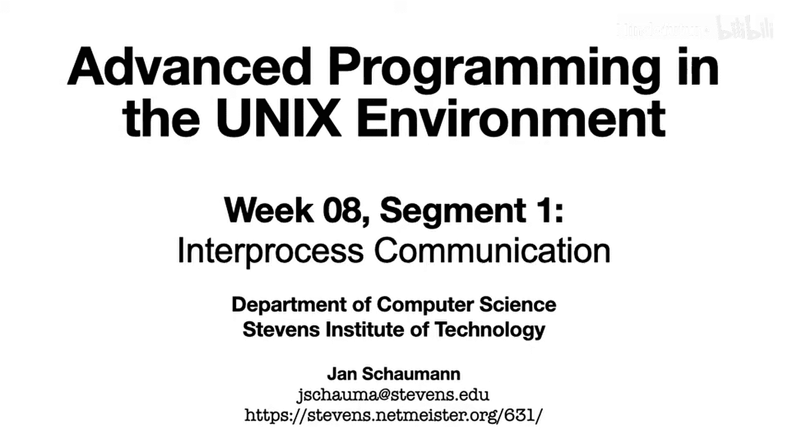
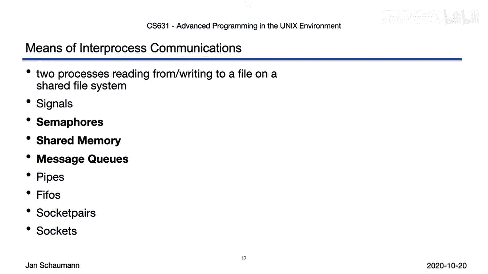

# 049：进程间通信简介 🚀

在本节课中，我们将要学习进程间通信的基本概念、分类以及UNIX系统中可用的主要IPC机制。我们将探讨不同IPC方法的特点和适用场景。

---

在之前的视频中，我们讨论了信号，它是一种进程间通信的方式。本节中，我们来看看进程间通信的更多形式和分类。

进程间通信是我们经常使用而不多加思考的功能，例如当我们运行一个命令并将其输出通过管道传递给第二个命令时。这种数据从一个进程流向另一个进程的形式就是一种IPC。信号则是另一种类型的IPC，用于通知另一个进程某个事件已发生。这两种形式——管道和信号——差异巨大，体现了IPC的不同方面。

## IPC的分类 📊

以下是IPC机制的几个关键分类维度：

*   **异步 vs 同步**：异步IPC中，通信无需协调即可发生，如信号。发送方发送消息后，接收方可以在稍后时间点接收。同步IPC则需要发送方和接收方协调操作，消息被立即接收。
*   **单向 vs 双向**：单向通信只允许一个进程向另一个进程发送消息，接收方无法通过同一通道回复。双向通信则允许双方互相发送消息。
*   **相关进程 vs 无关进程**：某些IPC机制要求通信的进程具有亲缘关系（共享同一个祖先进程），例如典型的Shell管道。而其他机制（如信号）允许无关进程间通信，前提是它们具有相同的有效用户ID。
*   **本地 vs 网络**：大多数IPC机制仅限于同一主机上的进程。网络通信则需要专门的API，允许不同主机上的进程进行通信。

## 常见的IPC机制对比 ⚖️

以下是UNIX系统中几种主要IPC机制的简要对比：

*   **文件系统**：进程A写入文件，进程B读取文件。这是一种异步、双向的机制，允许相关或无关的本地进程通信，并能传递任意数据，但无法有效通知对方新数据可用。
*   **信号**：异步、单向。允许相关或无关的本地进程通信，但传递的信息量和类型非常有限，通常只能表明“条件X发生”。
*   **信号量**：异步、单向。允许相关或无关的本地进程通信，但主要用于进程同步（如锁定机制），传递的信息有限。
*   **共享内存与消息队列**：异步、双向。允许相关或无关的本地进程通信，并且可以交换任意数据。
*   **管道**：同步、单向。要求通信进程具有亲缘关系，仅限于本地，但可以传递任意数据。
*   **命名管道**：同步、单向。与管道类似，但允许无关的本地进程通信。
*   **套接字对**：同步、双向。允许相关的本地进程通信。
*   **套接字API**：同步、双向。功能最全面，不仅支持本地相关或无关进程通信，更重要的是支持网络通信，是构建互联网各种服务（如基于TCP/IP的消息队列服务）的基础。

---

本节课中我们一起学习了进程间通信的基本概念和UNIX系统中的主要IPC机制。我们了解了IPC可以根据通信的协调性、方向性、进程关系以及网络支持进行分类。从简单的文件、信号，到管道、共享内存，再到强大的套接字，每种机制都有其特定的用途和限制。在接下来的视频中，我们将首先深入探讨System V IPC，包括信号量、共享内存和消息队列。