# 050：System V IPC 🧩

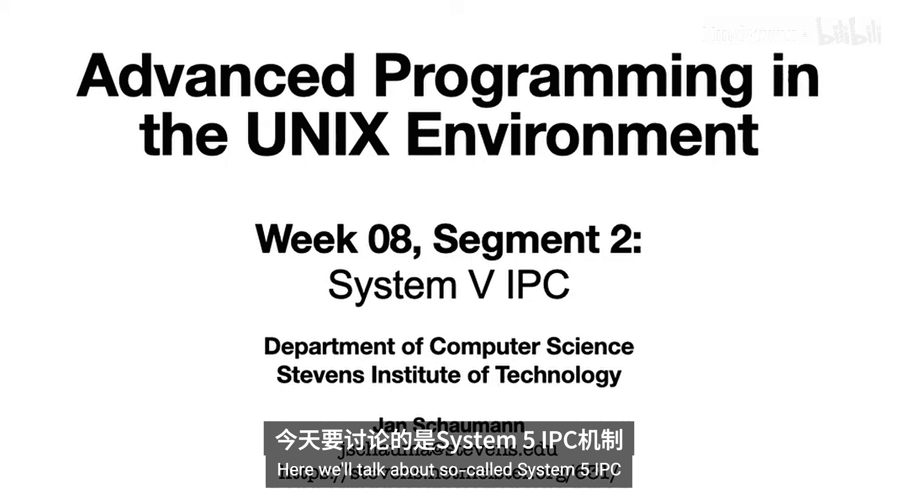

在本节课中，我们将深入学习System V IPC（进程间通信）的三种核心机制：信号量、共享内存和消息队列。这些机制是早期UNIX系统实现进程间通信的基础，至今仍被广泛支持。

上一节我们介绍了IPC的基本概念，本节中我们将详细探讨System V IPC的具体实现。

## System V IPC概述

System V IPC之所以得名，是因为这三种进程间通信机制最早于20世纪80年代在AT&T的UNIX System V中引入。与此同时，BSD系统则专注于套接字API。

这三种机制包括：
*   信号量
*   共享内存
*   消息队列

如今，大多数UNIX系统都支持这些机制。有趣的是，消息队列的概念甚至被移植到了跨网络系统中，并被一些大型云计算提供商作为服务提供（当然，这些服务是构建在套接字API之上的）。

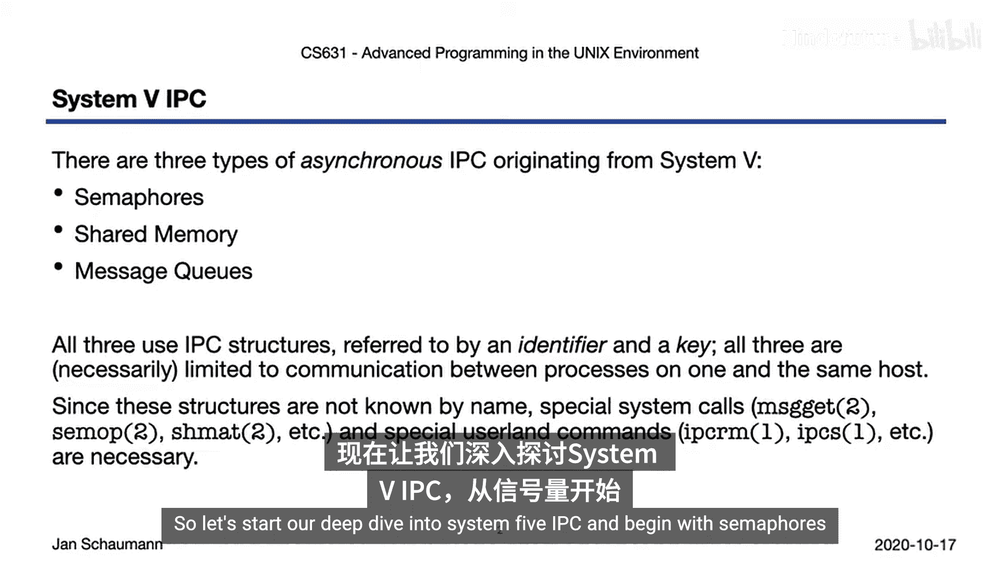

System V IPC机制使用特定的内核结构，通过标识符和键来引用这些内部资源。因此，它们显然仅限于同一系统上的进程间通信。

一个可能令人惊讶的特点是，这些资源是持久化的。这意味着即使创建或访问它们的进程已经终止，这些内核结构仍然存在。我们稍后会通过示例看到这一点。

由于这些结构只存在于内核空间，通常不在文件系统中体现，因此我们不能使用常规的文件描述符API来访问它们。相反，我们需要特殊的系统调用和命令行工具来操作它们。

## 信号量 🔒

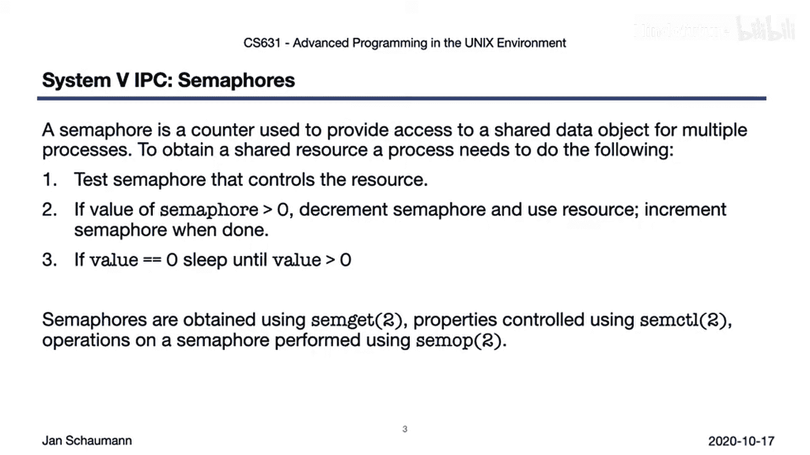

信号量本质上是一种用于访问临界区的锁或协调机制。在操作系统课程中讨论并发和哲学家就餐问题时，你应该已经熟悉它了。

在System V的实现中，信号量是一个简单的计数器，内核为其提供特定的原子操作和保证。例如，为了获取共享资源（如拿起第二根筷子），你需要测试控制该资源的信号量，检查计数器是否大于0。如果是，则递减计数器，使用资源（拿起筷子吃面），然后在使用完毕后递增计数器。如果信号量的值为0，则进程进入睡眠状态。测试、递增、递减或阻塞直到某个值等操作序列都是原子性的，这正是信号量的意义所在。

以下是用于操作信号量的函数：
*   `semget`： 获取信号量集标识符。
*   `semop`： 对信号量执行操作（如P/V操作）。
*   `semctl`： 控制信号量（如初始化、删除）。

让我们看一个示例程序 `sem_demo`。

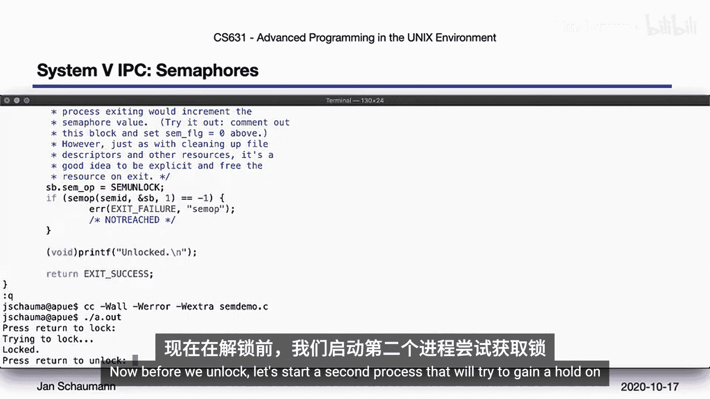

我们首先调用 `ftok` 库函数来创建一个用于标识信号量的键。该函数结合给定路径名的inode和设备ID以及传入的ID，生成一个适合System V IPC系统调用的标识符，从而避免了硬编码键值。

接下来，我们调用 `init_sem` 来初始化信号量，这是一个处理边缘情况的自定义函数。代码中的注释应该足以帮助你理解。

然后，程序请求用户获取锁，之后调用 `semop`。这个调用执行信号量的测试和后续递减操作，并在获取信号量之前阻塞。之后，用户可以再次解锁。为了避免死锁，内核会在进程终止时释放锁。但作为良好的编程习惯，我们在完成后也会主动解锁信号量。

运行这个程序，我们会立即获得信号量，因为当前没有其他进程尝试获取它。在解锁之前，我们启动第二个进程尝试获取锁。

第二个进程现在会阻塞，因为信号量当前被第一个进程持有。当我们解锁第一个进程后，第二个进程获得锁并可以进入其临界区。

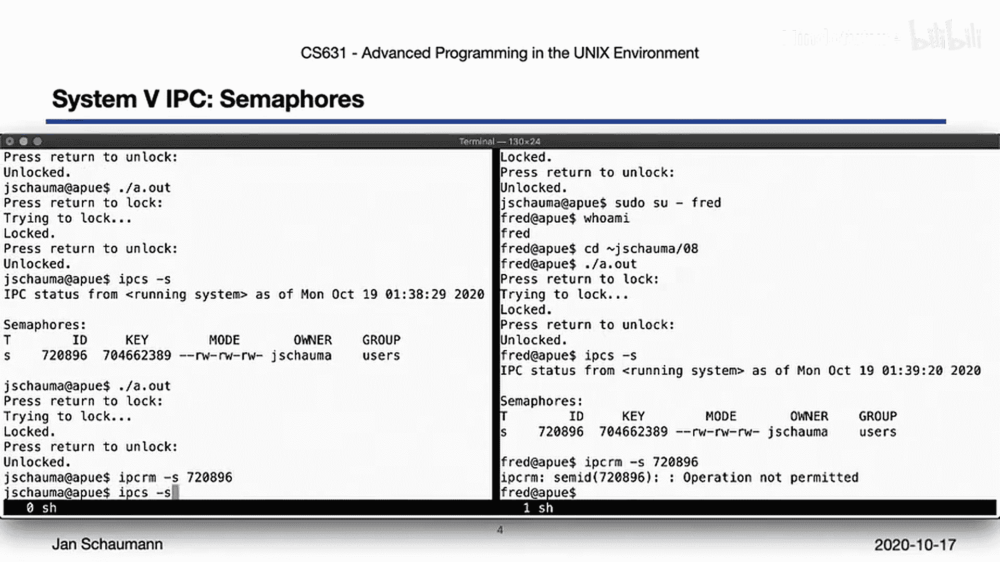

同样，在左侧再次运行程序显示，该进程现在被阻塞，直到第二个进程释放其锁。

我们之前提到System V IPC结构是持久化的。内核已经根据我们的键创建了信号量集，我们应该能够通过运行 `ipcs` 命令来检查它。这里我们看到信号量集具有关联的权限和所有权，就像文件一样，从而允许根据需要控制用户访问。

让我们通过切换到另一个用户 `fred` 来说明这一点。注意，`fred` 可以运行程序并获取信号量，因为信号量集的权限（如左侧所示）允许。两个进程竞争锁的行为与之前完全相同。

内核分配的信号量集对所有用户可见。但是，非信号量集所有者的用户不能删除它。`fred` 可以看到信号量集和权限，但不能通过标识符删除它。然而，所有者可以。

## 共享内存 💾

现在让我们考虑数据在常规IPC中的流动方式。

这里有一个简单的Shell管道示例，一个进程从文件读取数据，通过管道传递给另一个进程，后者再将数据写入另一个文件。在这个过程中，数据需要在用户空间和内核空间之间多次穿越边界。

当我们调用 `cat input` 时，进程必须从磁盘获取数据，这意味着穿越用户空间和内核空间的边界。但IPC本身也发生在内核空间。在将所有数据从内核空间“铲”到用户空间后，又需要将其传输回内核空间，然后在接收端再次传回用户空间，我们的第二个 `cat` 命令将数据写入磁盘，再次从用户空间进入内核空间。

因此，我们穿越用户空间-内核空间边界四次，这样做通常开销很大。也许我们可以想出一种更高效的方法。

这就是共享内存。在这种模型中，两个进程都访问内存中的某个区域，这意味着我们可以减少数据必须从用户空间进入内核空间的次数。考虑到这种改进，共享内存是进程间通信最快的形式也就不足为奇了。

由于我们共享一个内存区域，保护对该区域的访问以避免两个进程相互覆盖数据可能是有意义的。而使用信号量是实现这一点的好方法。请注意，如果你通过某种其他约定的访问方式进行严格的顺序访问，这可能不是必需的，但对于可能的并发写入，你需要某种锁定机制，信号量很适合于此。

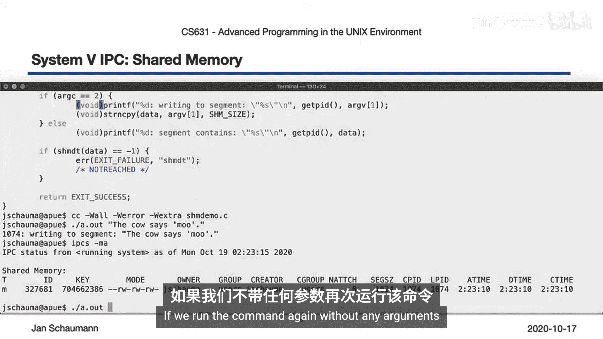

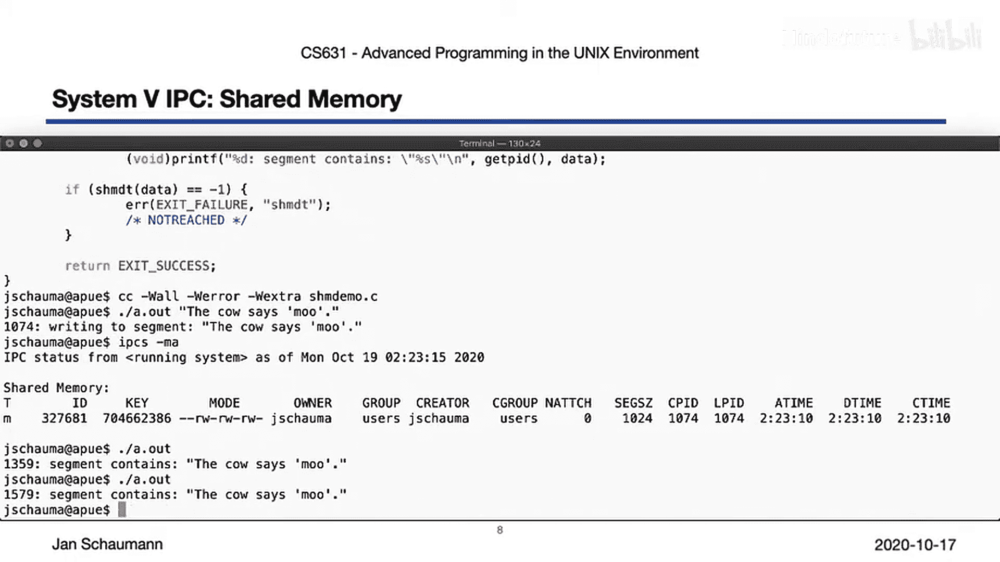

要获取共享内存段，你需要使用 `shmget`。然后使用 `shmat` 将段附加到进程地址空间，使用 `shmdt` 分离，使用 `shmctl` 进行其他操作。

让我们再看一个实际例子。与信号量示例类似，我们首先使用 `ftok` 确定一个合适的标识符，然后获取一个新的共享内存段（如果不存在则创建，类似于用 `O_CREAT` 标志调用 `open` 创建新文件）。我们附加内存段，然后从该内存区域读取或写入数据。和往常一样，我们在退出前进行清理，这次是分离内存段。

运行程序时，我们首先将一些数据写入共享内存段。注意，现在我们的进程终止了，但数据仍然存储在内存段中。`ipcs -m` 可以显示有关此内存段的信息，特别是我们可以像检查信号量一样检查权限和所有权。我们看到创建段的进程ID、最后访问它的进程ID，以及通过 `shmctl` 最后附加、分离和更改段的时间戳。

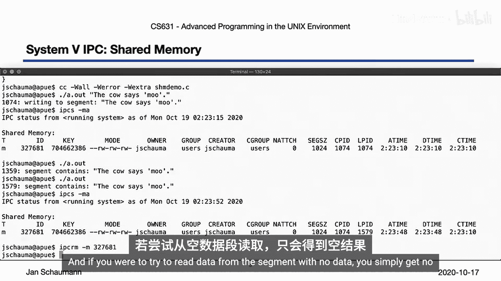

如果我们在没有参数的情况下再次运行该命令，它将简单地从内存段中检索数据。但请注意，数据是持久化的，因此第二次调用将再次显示相同的结果。也就是说，共享内存确实就像一个常规文件，附加和分离时间的时间戳是确定最后访问时间的一种方式。

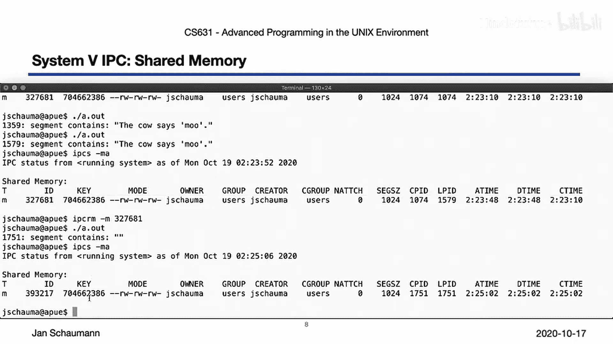

同样，我们可以允许其他用户访问数据。`fred` 当然可以从共享段中检索信息，也可以向段中写入数据，因为我们创建它时授予了其他用户写入权限。输出字段显示最后访问共享内存段的进程ID。

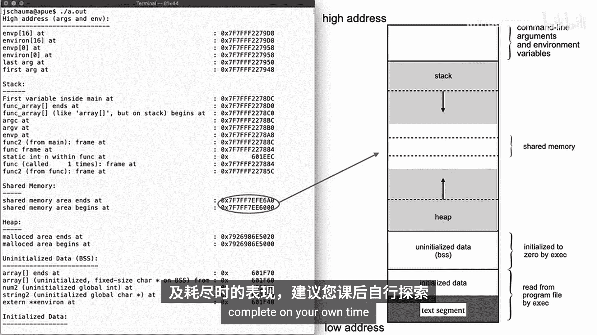

与信号量一样，由于段是持久化的，用户有责任删除任何未使用的映射。如果你尝试从没有数据的段中读取数据，由于我们的程序创建了一个全新的段，你只会得不到任何数据。

由于我们讨论的是存储在内存中的数据，我们应该能够观察到内存段的地址。因此，如果我们更新第6周的内存布局程序，可以观察到共享内存段空间似乎出现在栈下方和堆上方的某个位置。共享内存的大小限制是什么，以及当你试图耗尽它们时会发生什么，这是一个留给你在课后完成的练习。

## 消息队列 📨

现在让我们继续讨论消息队列。顾名思义，消息队列是消息的链表。更具体地说，该列表是一个FIFO（先进先出）队列，即消息按顺序排列，并且只能按指定顺序消费。

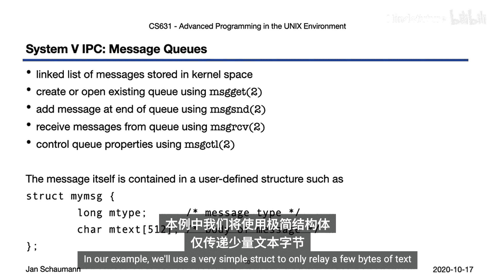

正如我们在本视频中讨论的其他形式的System V IPC一样，它们也存储在内核空间中，并遵循一些相同的语义。

你通过 `msgget` 创建新的消息队列，通过 `msgrcv` 从队列中消费消息，并通过 `msgctl` 控制其他属性。

那么，消息到底是什么？这实际上取决于用户。你可以自己定义消息的结构，唯一的规定是第一个元素必须是定义消息类型的 `long`，这有助于确定消息的传递。更多细节请参阅手册页。在我们的示例中，我们将使用一个非常简单的结构，仅传递几个字节的文本。

因此，对于我们的示例，我们需要两个程序：一个发送消息，一个接收消息。最终消息是一个简单的文本消息。我们要求用户提供键标识符，而不是像之前那样使用 `ftok`。这只是为了说明我们可以使用任何整数作为标识符，并允许用户通过命令行指定不同的消息队列。

消息队列的创建与其他System V IPC示例的语义基本相同。然后我们构建要传递的消息，并以非阻塞方式将其提交到队列中。我们编译它，然后查看接收程序。

接收程序看起来没有太大不同。我们在这里所做的就是从队列中获取消息，打印文本，然后退出。让我们创建一个新队列并提交一条消息，比如“hello”。`ipcs -q` 向我们显示所有详细信息，包括队列中的字节数、消息数、最后访问它的进程ID、最后从中读取的进程ID，以及队列创建、数据提交和最后读取数据的时间。

由于这是一个异步队列，我们可以发送多条消息，而不会覆盖先前的数据（这与共享内存示例不同）。我们可以观察到队列状态反映了这一点。

当我们运行接收程序时，它将获取队列中的第一条消息（本例中为“hello”）。`ipcs -q` 显示更新后的信息。

和之前一样，我们也允许多个用户访问此队列。让 `fred` 也这样做。`fred` 运行接收程序并获取队列中的下一条消息，这是可行的，因为创建队列时为其他用户设置了读取权限。

现在我们的队列已清空。当我们尝试运行接收程序时，调用将阻塞，因为没有消息存在。看看 `fred` 是否能解除我们的阻塞。但不幸的是，`fred` 救不了我们，他没有写入队列的权限，只能读取。所以让 `fred` 读取。现在我们有两个进程从队列中读取。

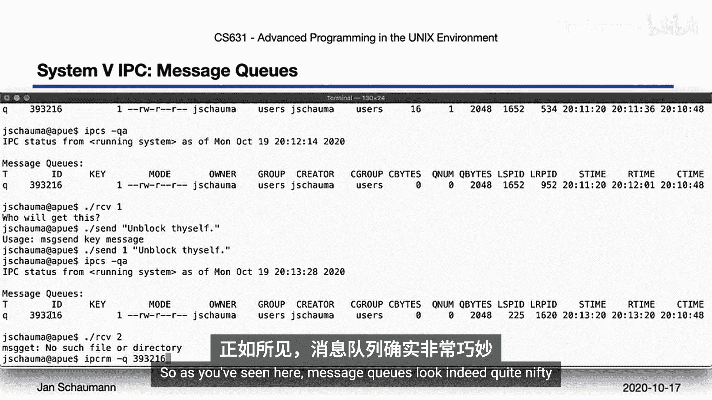

让我们创建另一个Shell，从那里我们可以向队列发送消息。当前被阻塞的两个进程中，哪一个会收到这条消息，是 `fred` 还是另一个进程？`fred` 仍然被阻塞，但另一个进程现在解除了阻塞。这表明队列的消费者即使在阻塞时也按顺序等待。

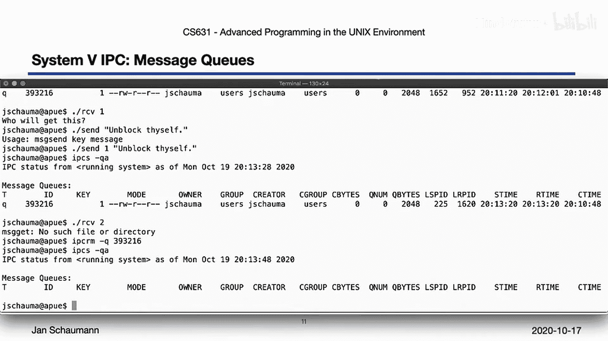

我们现在可以通过向队列发送新消息来解除可怜的 `fred` 的阻塞。现在我们的队列又空了。

如果我们尝试从不同的队列读取会发生什么？毫不奇怪，这不会阻塞，它会直接失败，因为具有该键的队列不存在。再次清理我们的IPC资源与之前相同。

正如你在这里看到的，消息队列看起来确实很巧妙。请记住，它们最初是为了克服当时唯一可用的其他IPC机制（半双工管道，我们将在下一个视频中介绍）的局限性而创建的。

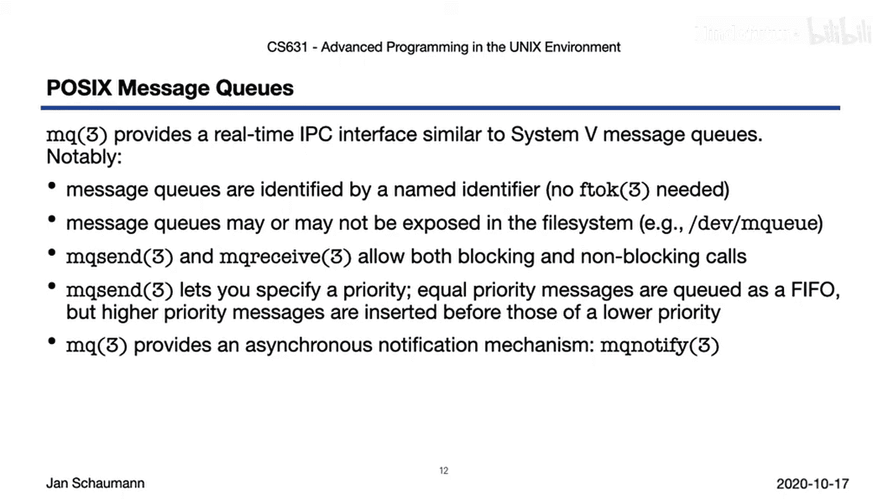

然而，在现代系统中，UNIX管道和套接字API缩小了性能差距。但如果你想实现真正的应用程序，你需要一些额外的功能，包括表达消息优先级的方式。

因此，POSIX消息队列诞生了。它们在语法和语义上与System V消息队列相似，但现在已标准化，并提供了一些额外的功能。首先，我们不再需要使用 `ftok` 或类似的键，因为我们现在可以通过名称来标识消息队列。这些命名的消息队列现在可以暴露在文件系统中，这很方便。我们允许阻塞和非阻塞通信。我们允许通过分配更高的优先级来跳过队列并将消息放在头部。最后，我们提供了一种方式，让你的进程可以收到新消息的通知，而不是坐在那里等待。这特别有用，也许最好用另一个例子来说明。

好的，这里我们有我们的 `posix_mq_sender` 示例。我们将指定一个名称而不是键，该名称遵循路径名的语义，即使它不一定在文件系统中表示。我们打开消息队列进行写入，然后发送所有具有相同默认优先级的给定消息。之后，我们还发送了一条更高优先级的消息。它应该排在其他消息之后，但可能被另一个进程在其他消息之前接收。然后我们关闭队列并退出。

接收程序看起来像这样。在 `main` 函数中，我们注册一个信号处理程序来设置一个标志，表示有新消息到达。我们打开消息队列，然后通过调用 `mq_notify` 将其配置为在空队列中有新消息到达时向我们发送信号。我们暂停，每当收到信号时，我们清空消息队列，迭代队列中的所有消息并打印它们。

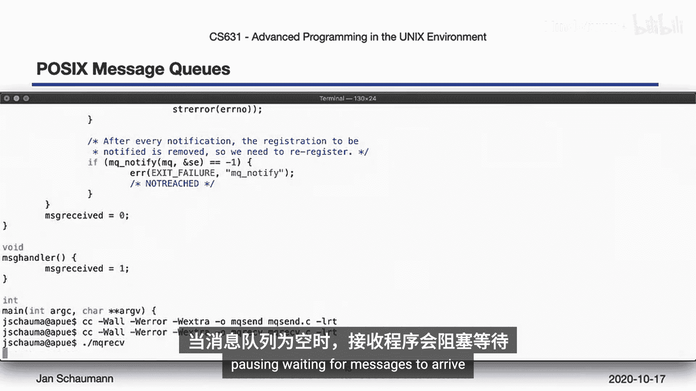

编译我们的发送者和接收者时，我们必须将它们链接到实时库，因为这是提供POSIX消息队列接口的库。接收者在没有消息存在时会阻塞，因为我们正在暂停等待消息到达。

如果我们现在发送几条消息，我们将观察到接收者在被通知后唤醒。但即使我们的消息是按顺序传递的，接收者也会将最后发送的更高优先级的消息视为要从队列中获取的第一条消息。如果我们在消息提交之间等待一秒钟，我们会看到接收者在消息到达时一条一条地获取它们，因为它为每个传入消息接收一个新信号。如果我们再次运行该命令，我们可能会观察到传入消息的通知发生得足够快，以至于接收者处理它们时，更高优先级的消息只最后到达。如果你使用等待标志运行接收者，它将允许所有消息到达，然后再获取它们，再次将更高优先级的消息显示为第一条消息（如果队列之前没有被清空的话）。

## 总结 📝

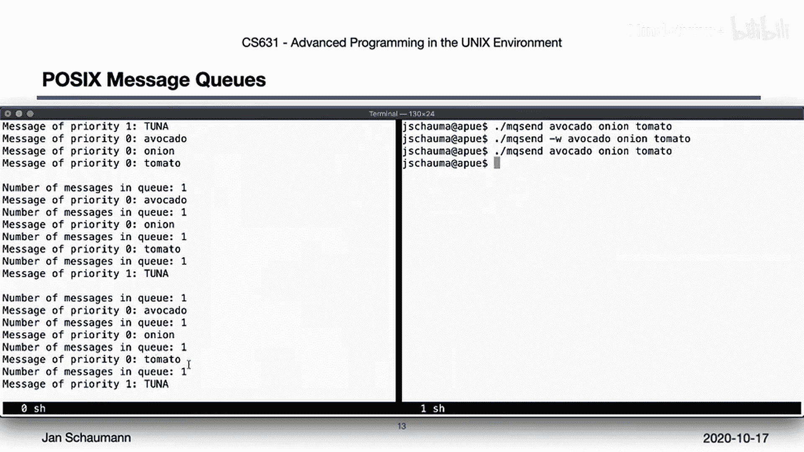

我们快速浏览了System V IPC。让我们在这里回顾一下。

我们在这里看到的所有IPC形式都是异步的，并且只适用于同一系统上的进程。System V IPC是最古老的IPC形式之一，但绝非过时。

信号量的使用主要是为了保护临界区和协调对共享资源的访问。共享内存允许非常快速的IPC。消息队列，虽然在System V incarnation中可能不常见，但作为一个概念，在过去十年左右变得相当流行，因为它们实现了生产者和消费者交换消息的常见生产者-消费者模型。

构建在其他形式的IPC之上（我们将在未来的视频中看到），它们可以作为服务由各种提供商提供，并在不同的软件栈中实现，包括开源和专有。因此，它们绝对是值得理解的有用技术。

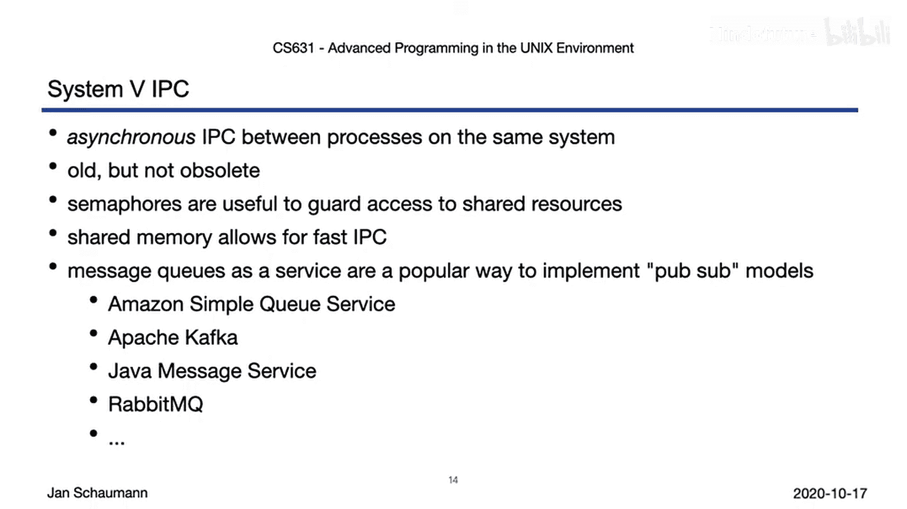

本节课中我们一起学习了System V IPC的三种核心机制：信号量、共享内存和消息队列。我们了解了它们的基本概念、使用方法和特点。在下一个视频中，我们将讨论另一种最古老且仍然最普遍的IPC形式：UNIX管道。