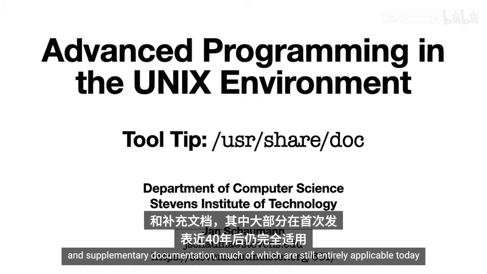
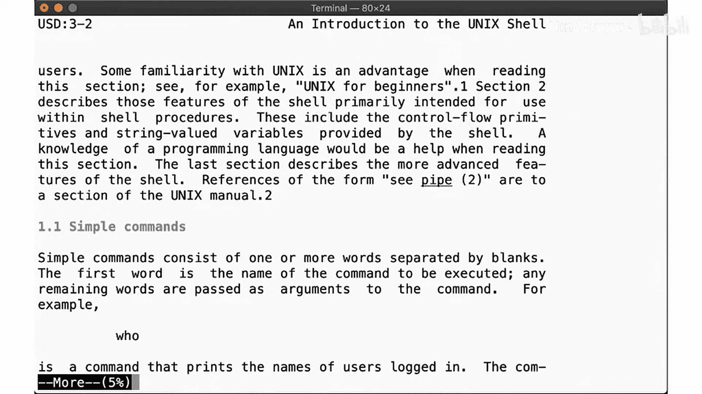
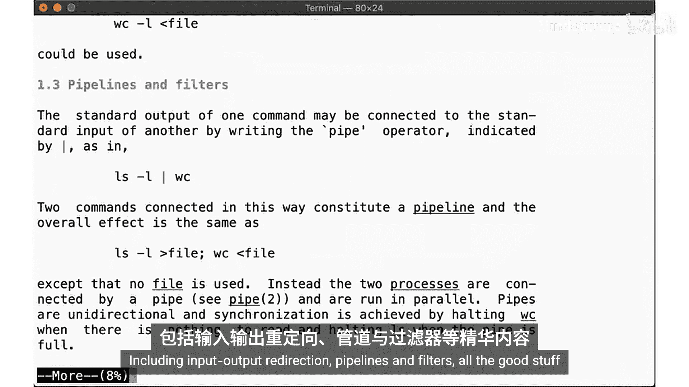
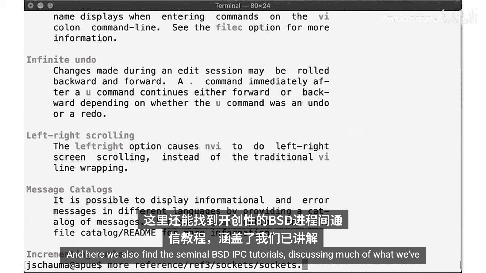
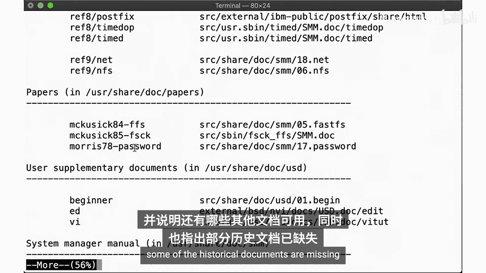
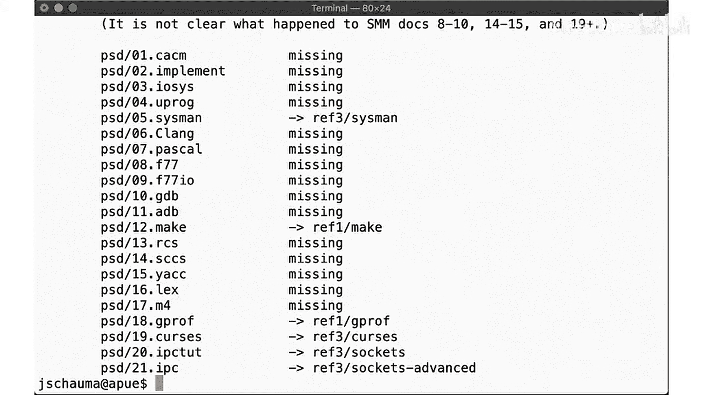
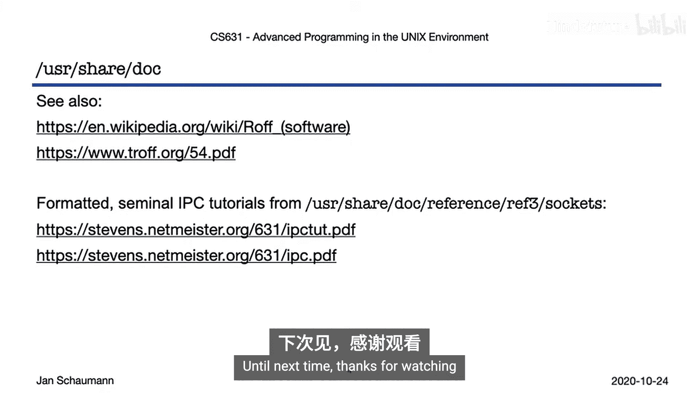

UNIX高级编程：P52：探索 `/usr/share/doc` 文档目录 📚

在本节课中，我们将一起探索 NetBSD 操作系统 `/usr/share/doc` 目录下的历史文档资源。这些文档包含了大量经典的 Unix 研究论文和补充资料，尽管年代久远，但其核心概念至今依然适用。



---

上一节我们介绍了 Unix 系统的历史背景，本节中我们来看看系统自带的宝贵文档资源。NetBSD 作为一个类 Unix 操作系统，附带了许多历史性的 Unix 研究论文和补充文档。这些文档大多在近 40 年后的今天仍然完全适用。

文档被安装在 `/usr/share/doc` 目录下。以下是该目录下的主要结构：

*   **`papers/`**：存放已发表的研究论文。
*   **`psd/`**：存放程序员补充文档。
*   **`ref/`**：存放参考文档。
*   **`smm/`**：存放系统管理员手册。
*   **`usd/`**：存放用户补充文档。

---

让我们具体看看其中一些有代表性的文档。首先是一篇由 Marshall Kirk McKusick 在 1984 年撰写的关于快速文件系统的论文。这些文档使用了系统排版工具进行格式化，因此需要使用合适的阅读器来查看。我们可以使用 `more` 命令来正确显示：

```bash
more /usr/share/doc/papers/ffs.ascii
```

这篇论文详细阐述了 FFS，即我们一直在讨论的默认文件系统。这些论文格式精良，在 NetBSD 系统上无需图形界面或借助谷歌等外部工具即可轻松阅读。

你会发现许多作者的名字都非常熟悉。例如，这里有一篇关于密码安全的论文，作者是 Ken Thompson 和 Robert Morris Sr.。后者后来成为了美国国家安全局的首席科学家，而他的儿子 Robert Tappan Morris 则发布了互联网上第一个计算机蠕虫病毒——莫里斯蠕虫。



---



在文档目录中，我们还能找到 Stephen Bourne 撰写的《Unix Shell 介绍》。Stephen Bourne 正是 **Bourne Shell** 的作者。这份文档涵盖了 Shell 的所有实用功能，包括输入输出重定向、管道和过滤器等核心概念。

例如，管道的基本形式是：
`command1 | command2`
这表示将 `command1` 的输出作为 `command2` 的输入。



此外，目录中还有 VI 编辑器的参考手册，以及经典的 **BSD IPC 教程**。这些教程详细讨论了我们已覆盖和即将在后续视频中讲解的进程间通信内容。这两份文档也可以从我们的课程网站以 PDF 格式获取。

管道现在对你来说应该很熟悉了。在高级 IPC 教程中，涵盖了套接字对和套接字，这将是我们下一个视频的主题。

接着是《伯克利软件架构手册》，它描述了所有的系统调用和内核的整体架构。

---

在用户补充文档目录中，我们可以找到 Brian Kernighan 编写的《Unix 初学者指南》，以及一份《VI 快速参考》。这份参考回答了“如何退出 VI”这个看似棘手的问题，并介绍了如何移动光标、进行操作以及更高效地使用 VI。

同时，还有一份由 VI 的创作者 Bill Joy 编写的更详细的教程。所有这些文档都位于 `/usr/share/doc` 目录中。由于我们拥有操作系统的源代码，因此也能查找到这些文档的来源。`README` 文件列出了所有文档的位置，并让你了解还有哪些其他文档可用，但同时也指出部分历史文档可能缺失。



---



那么，为何不亲自花点时间探索一下这个目录呢？里面包含了大量有用的信息，你会发现其中很多内容特别适用于我们的课程。

正如我们在介绍课中讨论过的，Unix 最初的主要用途之一就是排版软件手册。因此，这些文档使用了 Unix 系统上所有现成的工具也就不足为奇了。特别是 **`roff`** 工具集，它是原始 `runoff` 文本格式化工具的 Unix 版本。

你可以查看 `troff` 格式的源文件，然后使用如下命令将其转换为格式化文档：
```bash
troff -Tascii document.tr | less
```

---

本节课中我们一起学习了如何定位和利用 `/usr/share/doc` 目录下的历史 Unix 文档。这些文档是理解 Unix 系统设计哲学和核心技术的宝贵第一手资料。希望你能花时间浏览这些文档，你会发现我们在后续视频中讨论的许多内容，都能在这些 IPC 教程中找到熟悉的影子。



下次见，感谢观看。