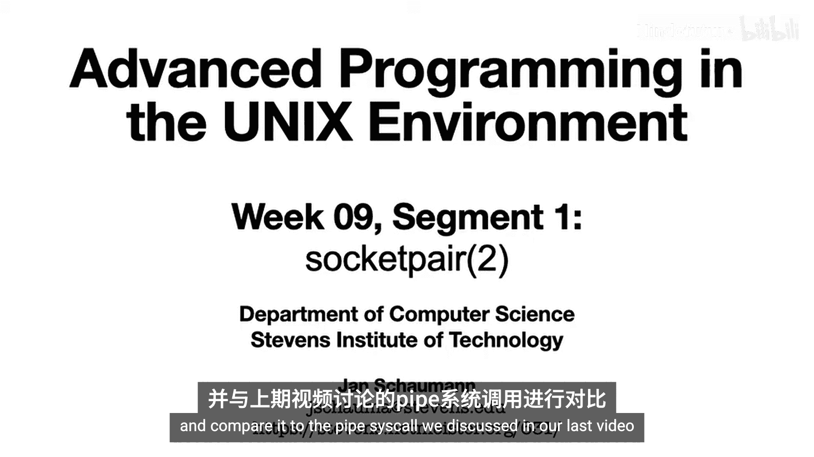
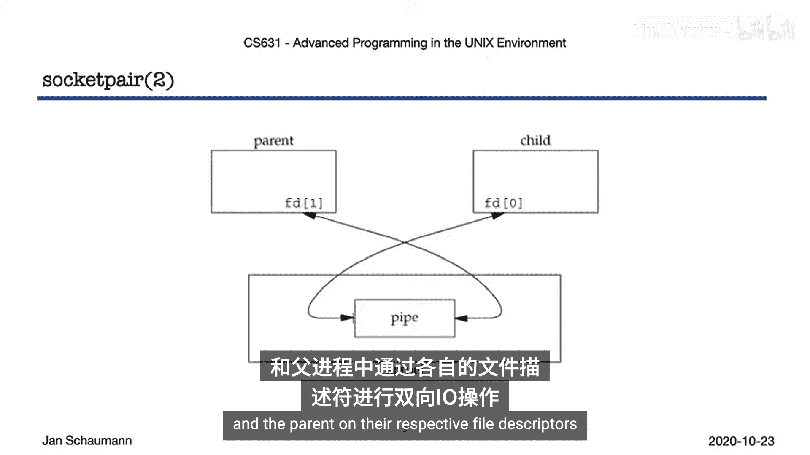
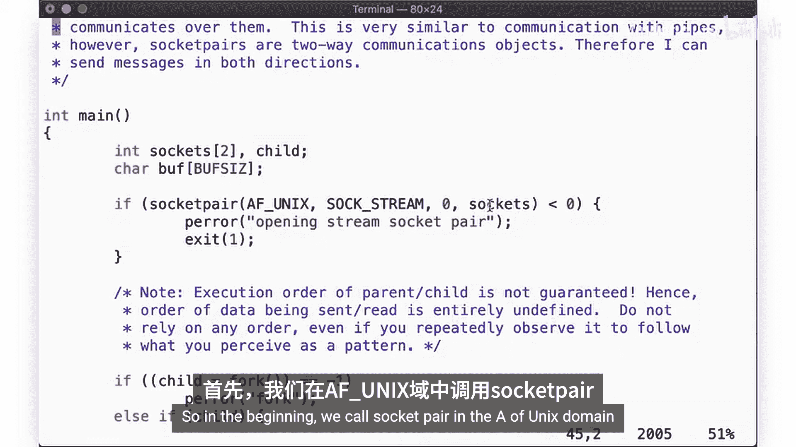
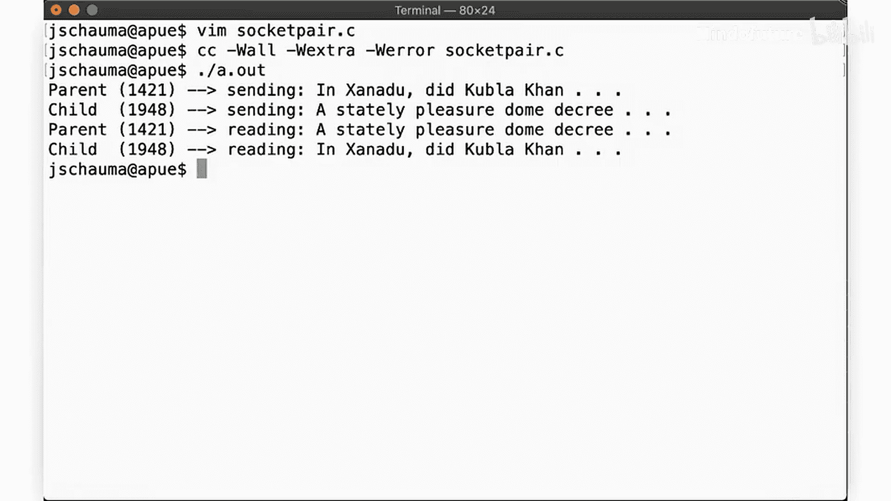
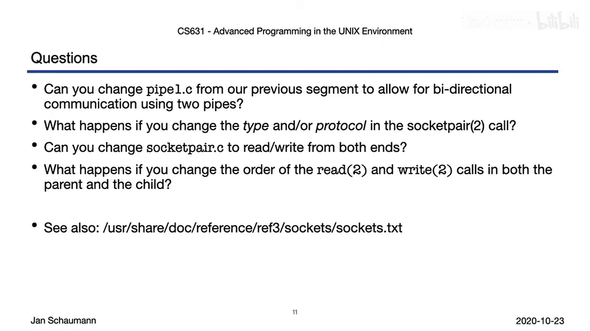

# 053：socketpair系统调用 🧩

在本节课中，我们将学习`socketpair`系统调用，并将其与上一节讨论的`pipe`系统调用进行比较。我们将探讨如何使用`socketpair`创建一对已连接的套接字，以实现进程间的双向通信。



## 概述

上一节我们介绍了使用`pipe`进行单向进程间通信。本节中，我们来看看`socketpair`系统调用，它提供了一种创建双向通信通道的便捷方法。

`socketpair`系统调用创建一对已连接的套接字，允许在两个方向上进行数据流通信。其使用方式与管道类似，但天生支持双向通信。实际上，现代Unix系统中的管道通常就是使用`socketpair`实现的。

## socketpair与pipe的对比

以下是`socketpair`与`pipe`的核心区别：

*   **`pipe`**：创建一个单向通信通道。需要两个文件描述符（一个用于读，一个用于写）。要实现双向通信，必须创建两个管道。
*   **`socketpair`**：创建一对已连接的套接字，**两个文件描述符都可以用于读取和写入**，天生支持双向通信。

`socketpair`的函数原型如下：
```c
int socketpair(int domain, int type, int protocol, int sv[2]);
```
其中：
*   `domain`：指定通信域。对于`socketpair`，通常使用`AF_UNIX`（或`PF_LOCAL`）表示Unix域（本地）套接字。
*   `type`：指定套接字类型，如`SOCK_STREAM`（流式）或`SOCK_DGRAM`（数据报式）。
*   `protocol`：通常指定为`0`，让系统为给定的域和类型选择默认协议。
*   `sv`：一个包含两个整数的数组，用于接收新创建的两个套接字文件描述符。

调用成功后，`sv[0]`和`sv[1]`就是一对可以双向通信的套接字描述符。

## 使用流程

`socketpair`的典型使用流程与`pipe`相似，但更简洁：

1.  调用`socketpair`创建一对套接字。
2.  调用`fork`创建子进程。
3.  父进程和子进程分别关闭自己不需要的那个文件描述符（虽然每个描述符都可读可写，但通常每个进程只保留一个用于通信）。
4.  现在，父进程和子进程可以通过各自保留的文件描述符进行读写操作，实现双向通信。



## 代码示例

以下是一个使用`socketpair`的简单示例程序，改编自BSD IPC教程：



```c
#include <sys/types.h>
#include <sys/socket.h>
#include <stdio.h>
#include <unistd.h>
#include <string.h>

int main() {
    int sockets[2];
    char buf[1024];
    pid_t pid;

    // 1. 创建一对Unix域流式套接字
    if (socketpair(AF_UNIX, SOCK_STREAM, 0, sockets) < 0) {
        perror("socketpair");
        return 1;
    }

    // 2. 创建子进程
    if ((pid = fork()) < 0) {
        perror("fork");
        return 1;
    }

    if (pid != 0) { // 父进程
        close(sockets[1]); // 关闭子进程将使用的描述符

        const char *msg = "Hello from parent!";
        write(sockets[0], msg, strlen(msg)); // 向子进程发送数据

        ssize_t n = read(sockets[0], buf, sizeof(buf) - 1); // 从子进程读取数据
        if (n > 0) {
            buf[n] = '\0';
            printf("Parent received: %s\n", buf);
        }
        close(sockets[0]);

    } else { // 子进程
        close(sockets[0]); // 关闭父进程将使用的描述符

        const char *msg = "Hello from child!";
        write(sockets[1], msg, strlen(msg)); // 向父进程发送数据

        ssize_t n = read(sockets[1], buf, sizeof(buf) - 1); // 从父进程读取数据
        if (n > 0) {
            buf[n] = '\0';
            printf("Child received: %s\n", buf);
        }
        close(sockets[1]);
    }
    return 0;
}
```

程序执行流程如下：
1.  调用`socketpair`创建一对套接字。
2.  调用`fork`创建子进程。
3.  父进程关闭`sockets[1]`，向`sockets[0]`写入数据，然后从`sockets[0]`读取数据并打印。
4.  子进程关闭`sockets[0]`，向`sockets[1]`写入数据，然后从`sockets[1]`读取数据并打印。



**注意**：父进程和子进程几乎同时开始发送数据，执行顺序没有保证，这属于典型的并发编程场景。

## 练习与思考

在继续学习通用套接字之前，可以尝试用以下问题巩固理解：

*   如果只有`pipe`而没有`socketpair`，如何修改上一节的管道示例程序，以实现本节`socketpair`示例相同的双向通信功能？（提示：需要在`fork`前创建两个管道）。
*   尝试修改`socketpair`调用中的`type`参数（如尝试`SOCK_DGRAM`），观察程序行为有何变化。
*   修改示例程序，让父进程和子进程使用第二个连接（即各自保留的那个描述符）也交换一次数据。
*   如果改变两个进程中`read`和`write`的调用顺序，会发生什么？

## 总结



本节课中我们一起学习了`socketpair`系统调用。我们了解到，`socketpair`是创建进程间双向通信通道的一种高效方法，它创建一对已连接的套接字，简化了双向通信的设置。我们将其与`pipe`进行了对比，并通过一个代码示例演示了其基本用法。下一节，我们将探讨更通用的套接字概念，特别是本地域（Unix域）套接字。