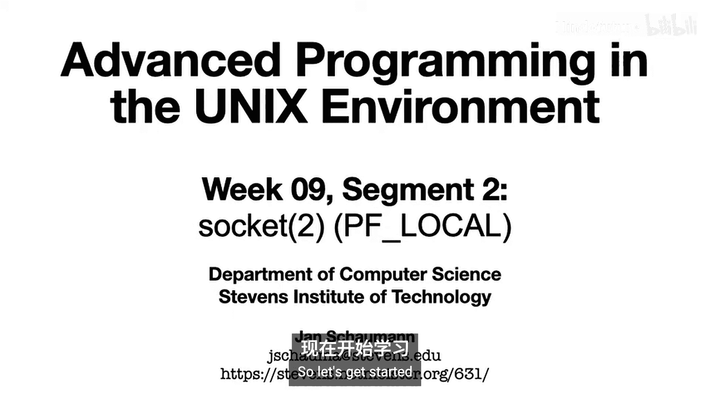
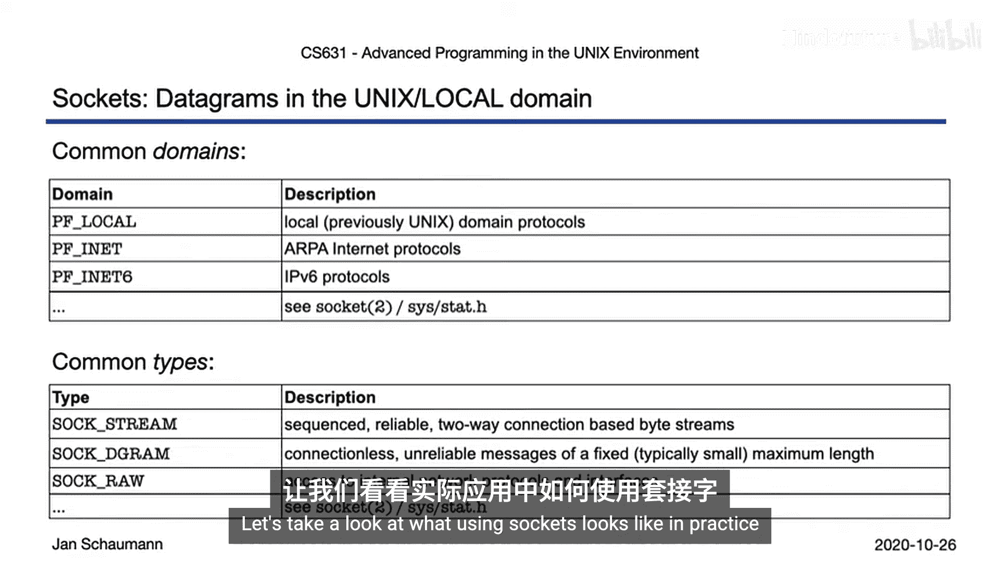
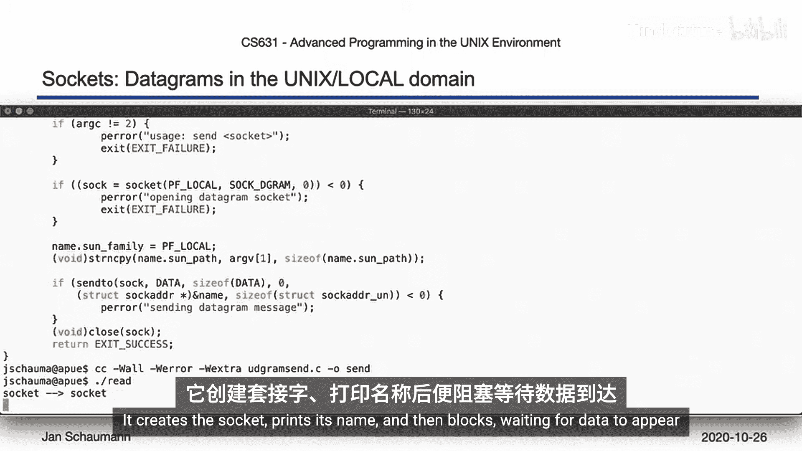
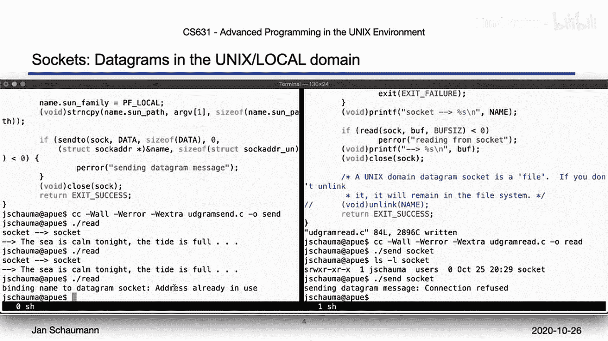
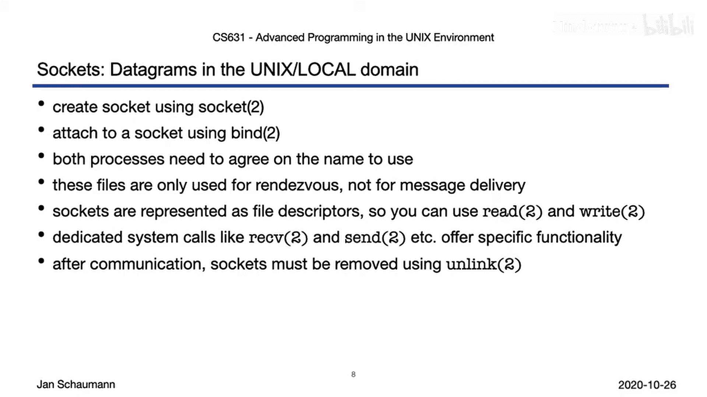
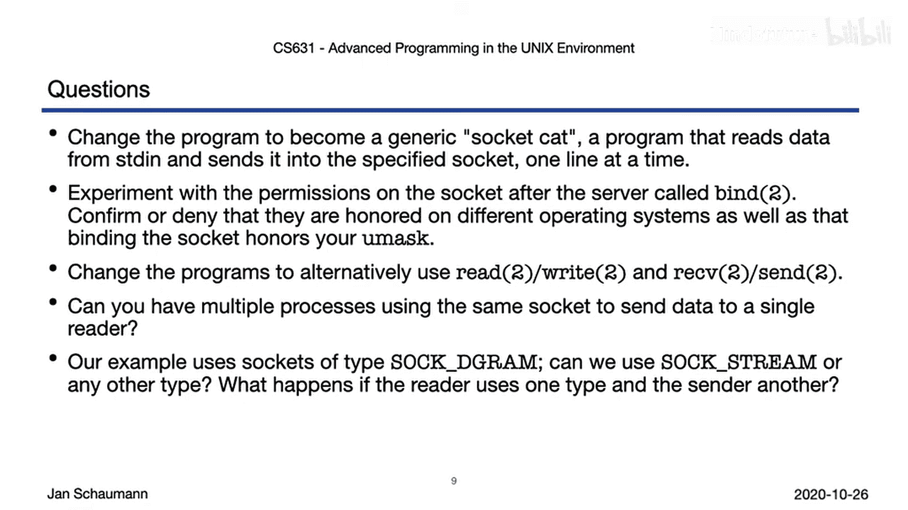

# 054：本地域套接字(socket) 🖥️

## 概述
在本节课中，我们将学习UNIX/Linux系统中的本地域套接字。我们将了解如何创建和使用套接字进行同一系统内的进程间通信，并探索其核心概念和API。



---

## 套接字创建与基本概念

上一节我们介绍了管道，本节中我们来看看常规的套接字，特别是在UNIX或本地域中的套接字。

再次依赖系统提供的BSD IPC教程，将有助于深入理解套接字API。

要创建一个套接字，我们使用名为`socket`的系统调用。这将创建一个通信端点，并以文件描述符的形式返回一个标识符。

套接字可以在不同的域中创建，域是一个地址或命名空间，从中可以获取合适的套接字名称。这个域定义了某些通信属性，并对通信内部的具体实现提供了一个有用的抽象层。

套接字API的一个重要特性是，它允许你实现进程间通信逻辑，这些逻辑对于在同一系统上通信的进程和跨网络通信的进程来说基本相同。在这两种情况下，你都可以通过调用`socket`系统调用来开始。

此外，套接字根据用户进程在给定域中与套接字的交互方式进行类型化。

最后，用户可以选择特定的协议，即进一步管理通信细节的一组规则。通常每种套接字类型对应一个协议，在大多数情况下，用户只需让内核为选定的套接字域和类型选择适当的默认协议即可。这可以通过为协议参数指定`0`来实现。

以下是可选的域，具体取决于操作系统和版本，但至少应支持以下域：

*   **PF_LOCAL**：本地域。这以前被称为UNIX域。不同的域过去使用`AF`前缀表示地址格式。现在使用的`PF`前缀代表协议族。此域用于同一系统内的通信，套接字使用标准路径名命名。我们稍后会看到，这种类型的套接字确实会以`socket`类型的文件形式出现在文件系统中，并被通信进程用作会合点。
*   **PF_INET**：如果我们希望通过网络进行通信，可以在此域中创建套接字。
*   **PF_INET6**：用于通过IPv6通信。

你的系统可能还支持其他几个域。请查阅手册页以及`socket.h`头文件以获取详细信息。

---

## 套接字类型

就像有多个域一样，也有多种套接字类型。

以下是主要的套接字类型：



*   **流式套接字**：提供有序、可靠、基于连接的双向字节流。对于网络通信，典型的例子是**TCP**。
*   **数据报套接字**：支持双向、无连接、不可靠的消息。对于网络通信，明显的例子是**UDP**。
*   **原始套接字**：允许调用进程访问底层通信协议。例如，如果你想发送ICMP数据包，就需要使用原始套接字。原始套接字仅对超级用户可用。

系统可能定义其他套接字类型，例如用于顺序数据包流或面向连接的数据报的类型。和之前一样，请查阅你的手册页和系统头文件以了解支持哪些类型。

---

## 实践：本地域数据报套接字示例

理论讲得够多了，让我们看看在实践中使用套接字是什么样子。

我们将再次遵循系统提供的BSD IPC教程。类似于我们在第08周处理消息队列的方式，我们现在有独立的发送方和接收方程序，从而说明我们可以在不相关的进程之间进行通信。



以下是我们的接收方程序（reader）：
```c
// 创建本地域的数据报套接字
int sockfd = socket(PF_LOCAL, SOCK_DGRAM, 0);

// 填充结构体 sockaddr_un，包含族和路径
struct sockaddr_un addr;
addr.sun_family = PF_LOCAL;
strcpy(addr.sun_path, "/tmp/mysocket");

// 调用 bind，将名称分配给给定的套接字
bind(sockfd, (struct sockaddr *)&addr, sizeof(addr));

// 使用 read 系统调用操作套接字的文件描述符，读取客户端发送给我们的任何数据
char buffer[256];
read(sockfd, buffer, sizeof(buffer)-1);

// 之后，我们再次关闭套接字，就像关闭文件描述符一样。但在退出之前，我们还需要取消链接我们创建的套接字文件。
close(sockfd);
unlink("/tmp/mysocket");
```
我们将此程序编译成名为`reader`的可执行文件。

发送方程序（sender）的设置与接收方非常相似：
```c
// 在本地域中创建一个数据报套接字
int sockfd = socket(PF_LOCAL, SOCK_DGRAM, 0);



// 再次填充结构体 sockaddr_un
struct sockaddr_un addr;
addr.sun_family = PF_LOCAL;
strcpy(addr.sun_path, "/tmp/mysocket");

// 然后使用 sendto 系统调用将数据发送给我们的接收方
char *message = "Hello from sender!";
sendto(sockfd, message, strlen(message), 0, (struct sockaddr *)&addr, sizeof(addr));

// 完成后，关闭套接字并退出
close(sockfd);
```
我们将此程序编译成名为`sender`的可执行文件。

现在，我们启动接收方。它创建套接字，打印其名称，然后阻塞，等待数据出现。

我们创建第二个shell，列出套接字文件，正如预期的那样，我们发现它是一个类型为`s`（套接字）且大小为0的文件。这看起来类似于我们之前使用的管道，所以也许我们可以尝试直接向套接字写入数据。让我们试试看。不行，这不起作用。Shell没有使用`strerror`，所以我们只得到错误号。让我们查一下错误45是什么。是的，`Operation not supported for the type of object`。所以我们不能直接写入套接字。

但是让我们使用我们的`sender`程序。我们看到数据被我们的程序发送，并立即被左边的接收方读取。

如果我们尝试再次发送数据会发生什么？我们得到一个错误，说我们的套接字不再存在；请记住，接收方在读取数据后已经取消了文件的链接。

让我们尝试保留套接字文件，看看会发生什么。好的，我们再次运行接收方读取。然后再次发送数据。现在套接字文件保留在文件系统中，大小仍为0字节。让我们尝试再次发送。现在我们得到一个不同的错误：`Connection refused`，我们的接收方不再监听我们的套接字，所以我们无法连接到它。

让我们尝试再次运行接收方。哦，另一个错误：`Address already in use`。这是因为接收方正试图创建一个新的套接字，但文件已经存在。也就是说，我们得到了与尝试监听网络套接字而另一个应用程序已经在监听时相同的错误。这就是为什么我们需要在程序完成后删除套接字文件。

如果我们删除套接字文件，然后再次运行接收方，它将能够再次创建套接字并使用它。我们的发送方也将能够再次发送数据。

---

## 关键API与行为分析

好的，我们已经看到了通过套接字进行通信是如何工作的。具体来说，我们注意到在创建套接字之后，我们必须绑定它。

当你第一次调用`socket`时，新的套接字将存在于给定的命名空间中，但它还没有名称。通过调用`bind`，我们为其分配一个名称。当套接字在UNIX或本地域中时，调用`bind`会导致套接字在文件系统中显现为一个文件。

由于这会创建一个新文件，并且套接字用于允许另一个进程与我们通信，我们必须考虑该文件的权限。虽然考虑到`umask`创建类型为`socket`的新文件这一事实不应令人惊讶，但需要注意的是，这并不可移植，我们应该确保提供一个路径名，并且该路径位于权限受适当限制的目录中。

在我们调用`bind`之后，我们的套接字以文件形式存在于文件系统中，在内部由一个文件描述符表示，我们可以用它来读取，就像我们的接收方所做的那样。但我们看到，我们的发送方没有调用`write`，而是使用了另一个系统调用来发送数据：`sendto`系统调用。

`send`和`sendto`系统调用可用于将消息传输到另一个套接字。与`write`相比，它们的优势在于它们是专为套接字使用而设计的，因此允许设置额外的标志（我们将在未来的讲座中看到其中一些）。此外，为了能够可靠地传输数据（即使用流式套接字），套接字必须处于已连接状态。由于在我们的示例中使用的是数据报，我们可以使用`sendto`提交数据而无需调用`connect`。

现在，在我们的接收方程序中，我们确实使用了`read`，但那里也有特定的套接字API调用来接收数据：`recv`和`recvfrom`，它们是`send`和`sendto`的等效调用，在成功时返回发送/接收的字节数，失败时返回-1。我们将在下一个视频片段中进行网络通信时再次更详细地看到其用法。

---



## 总结与练习

一个在本地域中使用数据报的简短示例，很好地介绍了套接字API。我们已经看到，首先必须通过调用`socket`系统调用来创建套接字，指定域、类型和协议。然后我们必须绑定套接字以为其分配名称。为了使通信成为可能，双方必须就使用的名称达成一致（使用相同的路径名），并拥有该文件的访问权限。当我们调用`bind`时创建的套接字类型的文件，就像一个FIFO，仅用于两个程序之间的会合。然而，由于我们得到了一个文件描述符，我们能够使用标准的I/O系统调用（如`read`和`write`）对其进行操作。但存在专用的系统调用，如`recv`和`send`等，它们提供了套接字API特定的附加功能。我们还看到，在完成通信后，需要由我们来删除文件。

在下一个片段中，我们将看到如何使用套接字进行网络通信，并讨论其与本地域进程间通信的相似之处。

在结束之前，这里有一些问题和练习供你思考：

1.  **修改发送方程序**：当前的发送方程序总是发送固定消息，这对于说明基本功能是可以的，但不太有用。你能修改程序，改为将从标准输入读取的数据（一次一行）写入套接字吗？
2.  **探索套接字权限**：在服务器调用`bind`之后，尝试修改套接字文件的权限。如果你限制权限，会发生什么？其他哪些进程可以使用它？
3.  **更换I/O系统调用**：更改两个程序，使用各自的另一个系统调用来执行I/O：将接收方改为使用`recvfrom`，发送方改为使用`write`。哪个更好用？哪个更容易？
4.  **多发送方对单接收方**：你能让多个进程使用同一个套接字向单个接收方发送数据吗？为此，你必须更改接收方以循环重复读取。可以参考我们之前的一些IPC示例，而不仅仅是这里的代码。
5.  **混合协议和类型**：如果你更改协议或套接字类型会发生什么？我们可以混合匹配吗？



我认为这些足以让你忙到下一个视频了。祝你好运，感谢观看。