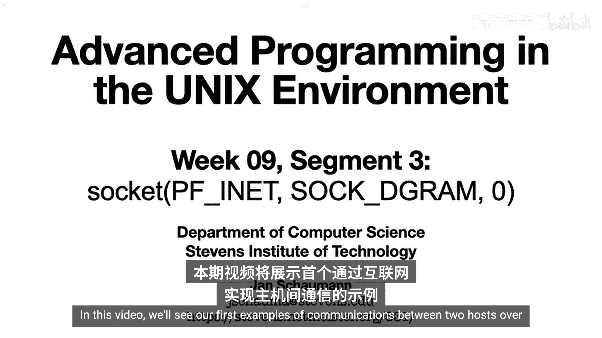
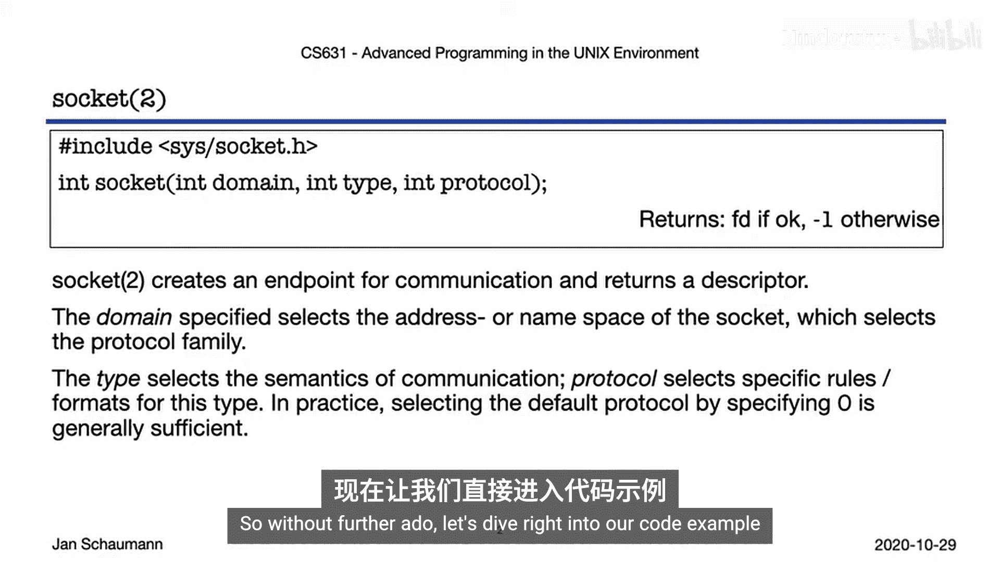
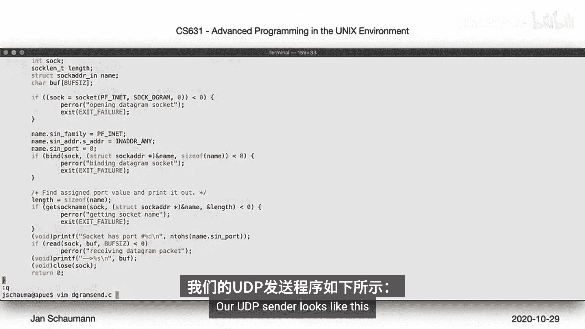
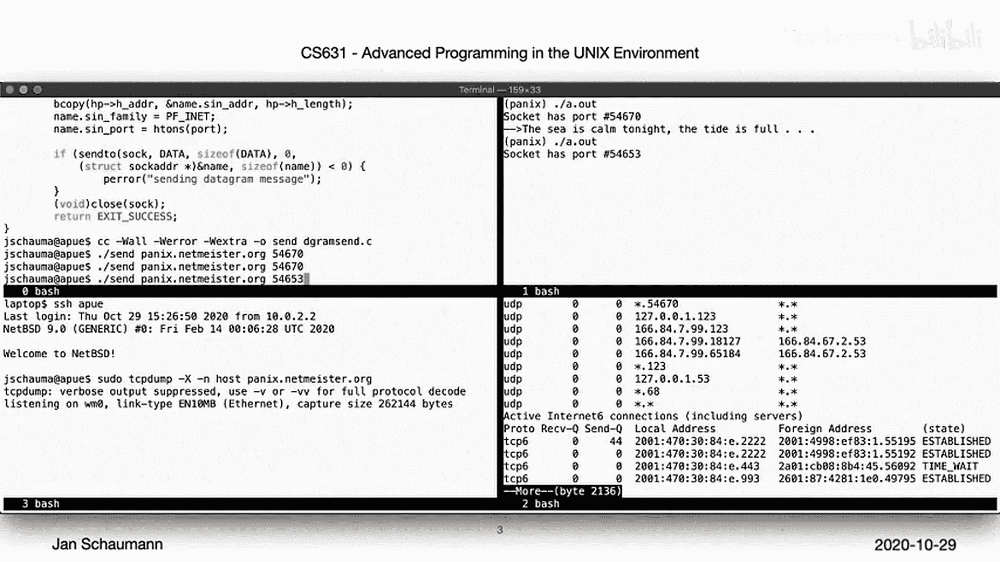
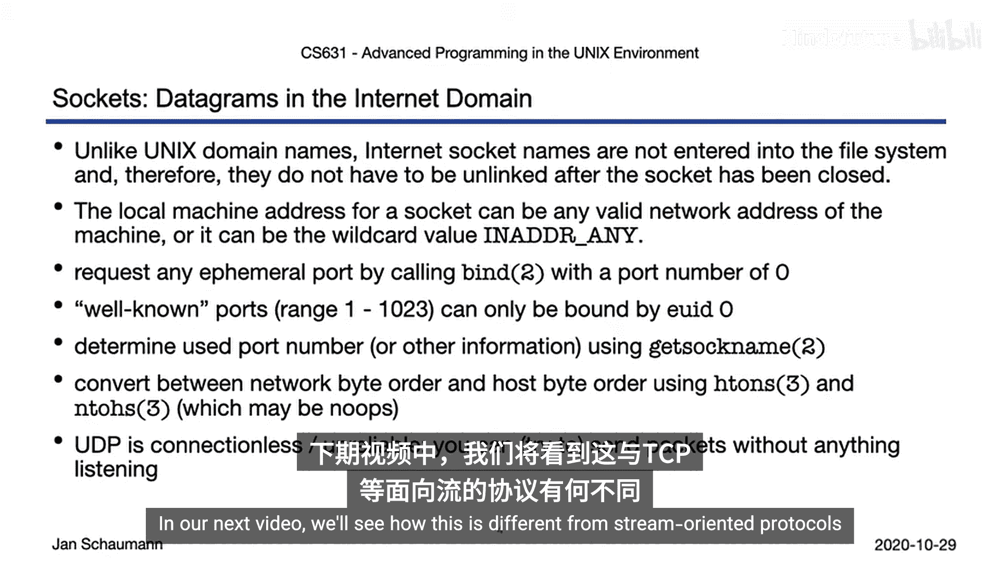
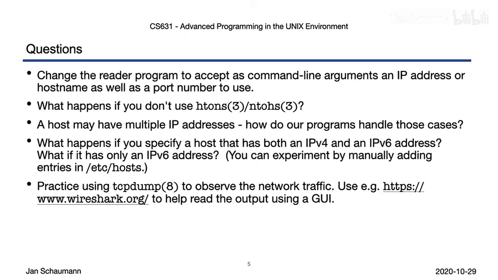

# 055：Week 09, Segment 3 - INET域中的数据报套接字 🔌



在本节课中，我们将学习如何在互联网域中使用数据报套接字进行进程间通信。我们将通过一个具体的代码示例，演示如何创建UDP套接字，实现两个不同主机之间的通信，并分析网络数据包的传输过程。



---

上一节我们介绍了在UNIX本地域中使用数据报套接字进行通信。本节中，我们来看看如何将通信扩展到互联网上，实现不同主机间的数据交换。

`socket`系统调用的原型如下。我们指定一个域、一个类型和一个协议，从而创建一个适合这些属性相关约定的套接字。
```c
int socket(int domain, int type, int protocol);
```

我们的示例基于BSD IPC教程，分为两个程序：一个读取器和一个发送器。读取器程序 `dgrecv.c` 如下所示。

首先，我们调用`socket`，指定域为`PF_INET`，类型为`SOCK_DGRAM`，这意味着我们将在互联网域中使用UDP数据报。
```c
int sockfd = socket(PF_INET, SOCK_DGRAM, 0);
```

接着，我们填充`sockaddr_in`结构体。与本地域不同，这里我们需要指定一个IP地址。我们可以提供主机上的任何IP地址，或者像本例一样，通过`INADDR_ANY`允许来自任何地址的连接。同样，如果我们不关心监听哪个端口，可以通过传递`0`让内核为我们选择一个。
```c
struct sockaddr_in servaddr;
memset(&servaddr, 0, sizeof(servaddr));
servaddr.sin_family = AF_INET;
servaddr.sin_addr.s_addr = htonl(INADDR_ANY);
servaddr.sin_port = htons(0);
```

之后，我们像之前一样调用`bind`。由于我们让内核选择端口，我们不知道具体是哪个端口。为了找出端口号，我们调用`getsockname`。根据手册页的说明，此函数的常见用例是检索内核分配的端口号。
```c
bind(sockfd, (struct sockaddr *) &servaddr, sizeof(servaddr));
getsockname(sockfd, (struct sockaddr *) &servaddr, &len);
```



接下来，我们想打印这个端口号。但我们必须小心，首先需要将其从网络字节序转换为主机字节序。TCP/IP网络规定使用大端字节序。为了方便，我们使用`ntohs`和`htons`等函数来处理转换，这些函数在大端系统上可能只是空操作。
```c
printf("Listening on port: %d\n", ntohs(servaddr.sin_port));
```

最后，我们从套接字读取数据，打印接收到的内容，然后退出。
```c
recvfrom(sockfd, buf, MAXLINE, 0, NULL, NULL);
printf("Received: %s\n", buf);
```

UDP发送器程序 `dgsend.c` 如下所示。

我们要求用户提供一个端口号，并检查其有效性。然后，我们模仿读取器进行`socket`调用，并尝试将用户提供的主机名转换为IP地址。
```c
struct hostent *hp = gethostbyname(argv[1]);
```

接着，我们填充`sockaddr_in`结构体，使用`htons`转换端口号，然后发送我们的消息。
```c
struct sockaddr_in servaddr;
memset(&servaddr, 0, sizeof(servaddr));
servaddr.sin_family = AF_INET;
memcpy(&servaddr.sin_addr, hp->h_addr, hp->h_length);
servaddr.sin_port = htons(port);
sendto(sockfd, msg, strlen(msg), 0, (struct sockaddr *) &servaddr, sizeof(servaddr));
```

为了演示互联网通信，我们在一个远程系统上运行读取器。运行后，它告诉我们正在监听某个端口（例如54670）。我们可以在本地虚拟机上运行发送器，指定远程主机名和该端口。消息成功地从本地虚拟机发送到了远程系统。

但是，如果我们再次尝试发送，而远程端没有读取器在监听，会发生什么？发送器会安静地发送消息，但我们不会收到任何错误。这是因为UDP是无连接且不可靠的。你可以发送一个数据包，但无法知道它是否会到达。

为了观察数据包的发送，我们使用`tcpdump`工具捕获并显示本机与远程主机之间的所有数据包。当我们发送消息时，可以看到UDP数据包被成功发送。如果我们重复发送，而读取器已终止，我们不仅会看到UDP数据包被发出，还会从远程端收到一个ICMP数据包，通知我们目标端口不可达。这个错误发生在UDP上下文之外。



---

现在，让我们总结一下刚刚观察到的现象，并与本地域中套接字的使用进行对比。

由于INET类型的套接字完全存在于内核空间，并由IP地址和端口号对标识，我们不需要进行任何清理工作，内核会在进程终止后自动清理。

我们可以指定一个特定的IP地址，也可以通过传递`INADDR_ANY`来监听所有可用的IP地址。同样，我们可以通过传递`0`来请求内核为我们选择一个临时端口。如果我们想要一个特定的端口，可以提供它，但所谓的“知名端口”（1024以下的端口）只有有效用户ID为0时才能绑定。

我们可能需要将数字转换为网络字节序，但幸运的是，我们有`htons`和`ntohs`等便利函数来为我们处理。

最后，正如我们所见，我们可以发送消息，而无需关心或知道远程端当前是否在监听或是否会接收它们。这是UDP的设计使然。

在下一个视频中，我们将看到这与面向流的协议（如TCP）有何不同。

---

在本节课结束前，以下是一些问题或建议，供您练习以更好地理解INET域中的UDP套接字。

首先，尝试让读取器工具更用户友好，允许用户指定IP地址和端口号。



其次，尝试使用`ntohs`和`htons`函数，看看如果不使用这些函数会发生什么。

思考一下，当主机有多个IP地址时，您可能希望如何处理。

考虑当您的系统处于双栈环境或仅支持IPv6时会发生什么。您能修改示例程序使其在那里工作吗？

最后，如果您以前没有做过，请练习捕获和分析网络数据包。除了`tcpdump`，还有许多其他工具，例如出色的图形用户界面工具Wireshark，它可以帮助您深入分析数据包的细节，但通过`tcpdump`在命令行下分析数据包也是一个很好的起点。



祝您在这些练习中好运并玩得开心。下次，我们将讨论互联网域中的流套接字。届时再见，谢谢观看。