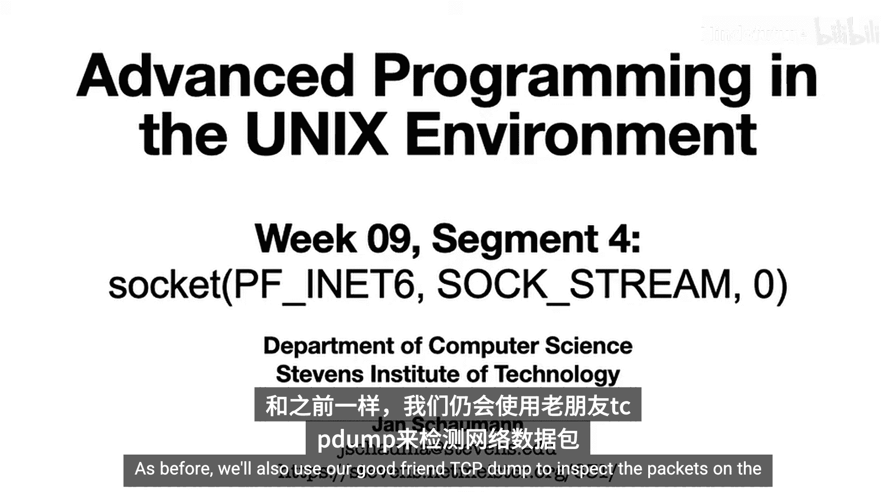
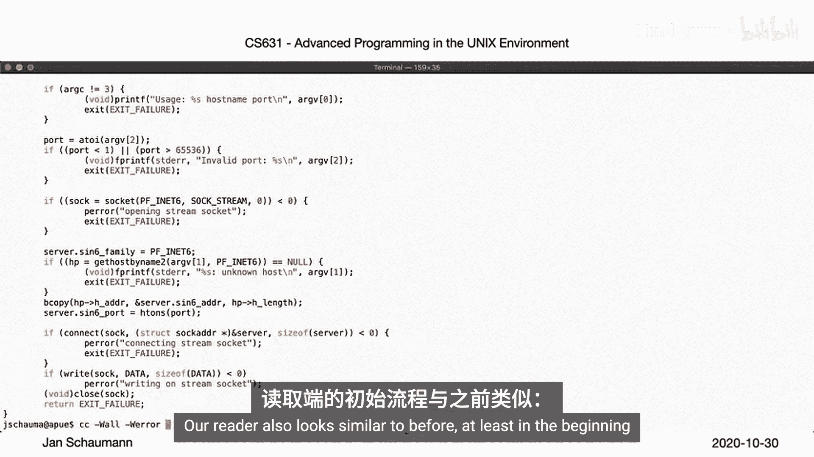
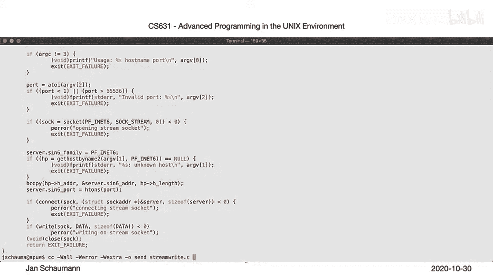
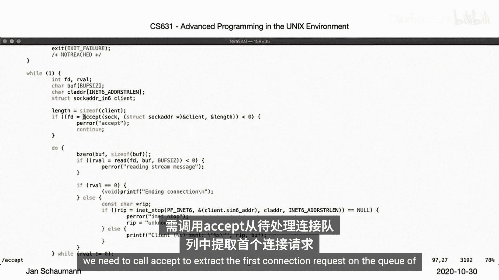
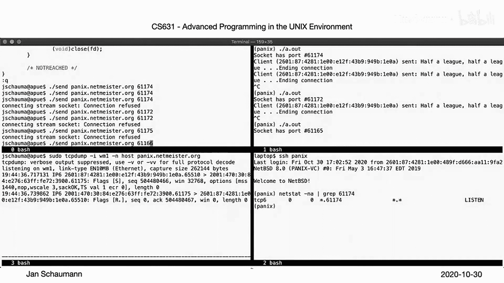
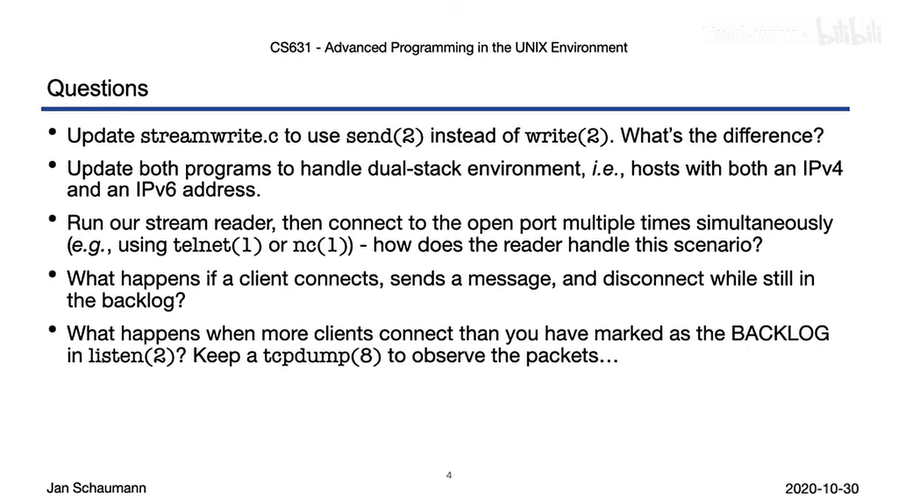

# 056：Week 9, Segment 4 - INET6域中的流式套接字 🔌

## 概述
在本节课中，我们将学习如何在INET6域中使用流式套接字进行网络通信。我们将对比之前学习的UDP数据报，重点理解基于TCP协议的、可靠的、双向字节流通信模型，并使用`tcpdump`工具观察网络数据包。



上一节我们介绍了在IPV4域中使用数据报套接字进行通信。本节中我们来看看如何使用IPV6域中的流式套接字。

## 发送端程序分析
首先，我们分析发送端程序。与UDP版本类似，程序首先接受端口号并创建套接字。关键区别在于创建套接字时使用的参数和后续的连接建立过程。

以下是创建套接字的关键代码：
```c
socket(PF_INET6, SOCK_STREAM, 0);
```
此调用指定了协议族为`PF_INET6`，套接字类型为`SOCK_STREAM`，即流式套接字。





接下来，程序查询给定主机名的IPV6地址，并填充`sockaddr_in6`结构体。端口号需要使用`htons`函数从主机字节序转换为网络字节序。

与UDP发送端的主要区别在于，流式套接字需要调用`connect`函数来发起与远程主机的连接。
```c
connect(sockfd, (struct sockaddr *)&server_addr, sizeof(server_addr));
```
如果连接成功，程序便可以使用`write`函数将消息写入套接字描述符，然后关闭套接字并退出。

## 接收端程序分析
接收端程序在初始阶段与UDP版本相似。它创建套接字，填充`sockaddr_in6`结构体（让内核选择IP地址和端口），并绑定套接字。



程序通过`getsockname`获取内核选择的端口号，并将其从网络字节序转换为主机字节序后打印。

流式接收端与UDP接收端的不同之处从调用`listen`函数开始。
```c
listen(sockfd, backlog);
```
`listen`函数表明套接字愿意接受传入连接，并指定一个待处理连接队列的长度限制（`backlog`）。

设置好`backlog`后，程序进入一个无限循环以等待连接。对于流式连接，需要使用`accept`函数从待处理连接队列中提取第一个连接请求。
```c
int connfd = accept(sockfd, (struct sockaddr *)&client_addr, &addr_len);
```
`accept`调用会创建一个新的套接字（`connfd`），用于读取数据。在此程序中，我们不是只读取单条消息，而是持续读取套接字上的数据，直到遇到文件结束符（EOF），并将每条消息连同客户端IP地址一起打印到标准输出。

## 程序演示与数据包分析
我们登录到远程系统运行TCP接收端程序，并在另一个终端中监控网络连接。运行接收端后，可以看到程序正在监听某个端口（例如61174），`netstat`命令确认该套接字仅对IPV6开放。

当接收端处于监听状态时，我们可以发送数据。接收端会打印出发送的消息，并前缀以客户端IP地址。值得注意的是，接收端在打印消息后不会终止，而是继续等待新的连接。

如果我们中断接收端程序，然后再次尝试发送消息，将会收到“Connection refused”错误。这是因为TCP是面向连接的协议，当远程端没有监听时，`connect`调用会失败。

我们使用`tcpdump`工具来捕获和分析网络数据包。以下是观察到的关键交互过程：

*   **成功连接与通信**：首次发送消息时，可以看到TCP三次握手（SYN, SYN-ACK, ACK），然后是携带数据的PSH包，最后是连接拆除的四次挥手（FIN, ACK, FIN, ACK）。
*   **连接失败**：当接收端未运行时，客户端发送SYN包尝试建立连接，但服务器会回复RST包，表示连接被拒绝。



## 在单一连接中发送多条消息
TCP连接的建立和拆除有一定开销。为了更高效地通信，我们可以尝试在同一个连接中发送多条消息。

我们再次启动接收端和`tcpdump`。首先用我们的发送程序发送一条消息，这会建立连接、发送数据然后断开。接着，我们使用`telnet`命令手动建立一条TCP连接到接收端。

运行`netstat`可以看到，此时有一个已建立的连接（来自`telnet`），同时原始的监听套接字仍然可用。这说明了`listen`调用所建立的连接`backlog`概念。

通过`telnet`连接，我们可以发送多条消息，而无需每次都建立新连接。只有当我们退出`telnet`时，该连接才会终止。观察`tcpdump`的输出，可以清晰地看到`telnet`会话期间的所有数据都在同一个TCP连接中传输。

## 核心概念与总结
本节课中我们一起学习了如何在INET6域中建立和使用TCP流式套接字连接。

与数据报套接字相比，流式套接字的连接是不对称的。对于流式套接字，我们需要为每个接入的请求创建一个独立的通信套接字。初始的套接字必须通过调用`listen`来标记为愿意接受连接，该调用同时设定了愿意接受的待处理连接队列长度（`backlog`）。之后，我们可以使用`accept`调用来获取传入的连接，如果没有客户端连接，该调用可能会阻塞。

我们还观察到，每个TCP连接都需要完整的三次握手来建立，以及四次挥手来断开。

## 扩展练习与思考
本程序帮助我们更好地理解了流式套接字，但也留下了许多可以增强和探索的空间。

以下是几个可以尝试的练习方向：
*   修改程序，使用`send`或`sendto`函数代替`write`，观察程序行为有何变化。
*   我们目前看到的程序要么只使用IPV4，要么只使用IPV6。但在实际中，系统往往同时拥有IPV4和IPV6地址。尝试更新UDP和TCP示例程序，使其能同时处理两者。
*   我们的流式接收端允许多个客户端连接，但它如何处理多个客户端同时发送来的消息？
*   如果一个客户端在连接进入`backlog`队列后，但在我们处理其消息之前就断开了连接，会发生什么？
*   最后，最多可以连接多少个客户端？我们知道这与传递给`listen`的`backlog`参数有关，但如果客户端数量超过这个值会发生什么？

在下一个视频中，我们将探讨其中一些问题。建议你尝试修改代码并进行实验。



感谢观看。