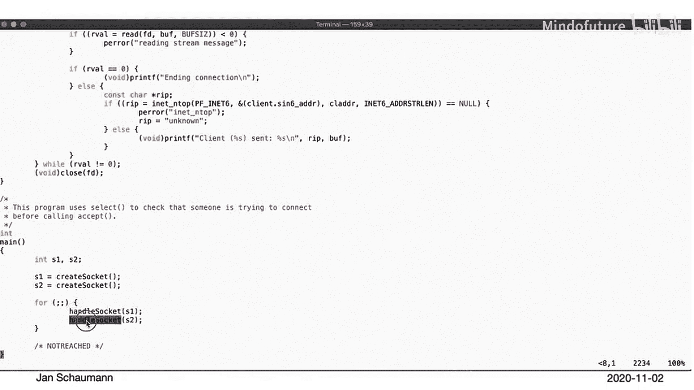
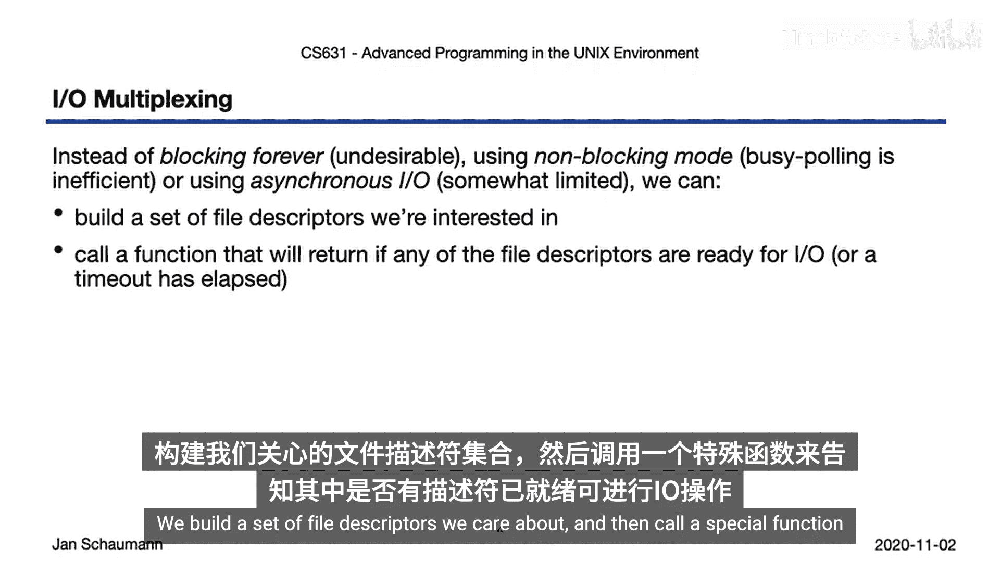
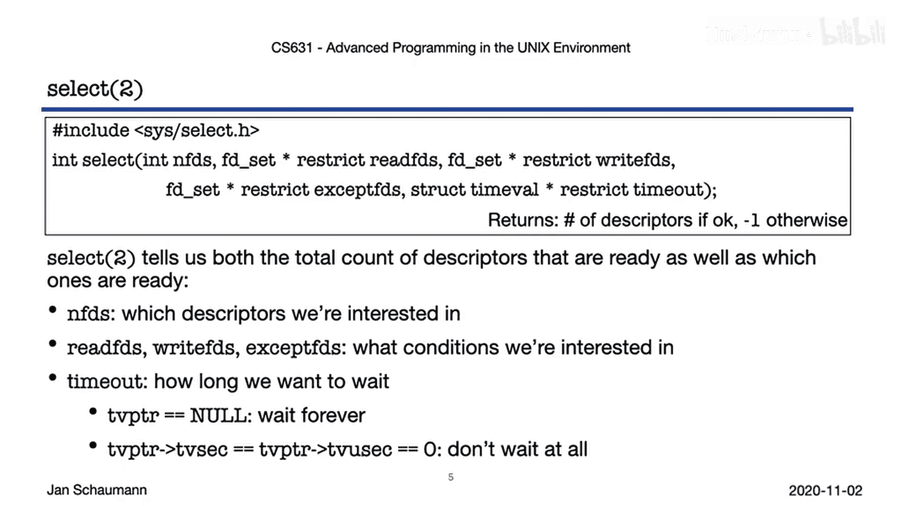
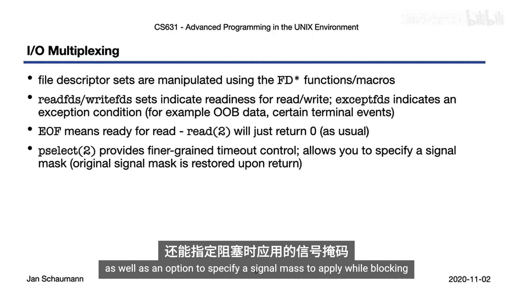
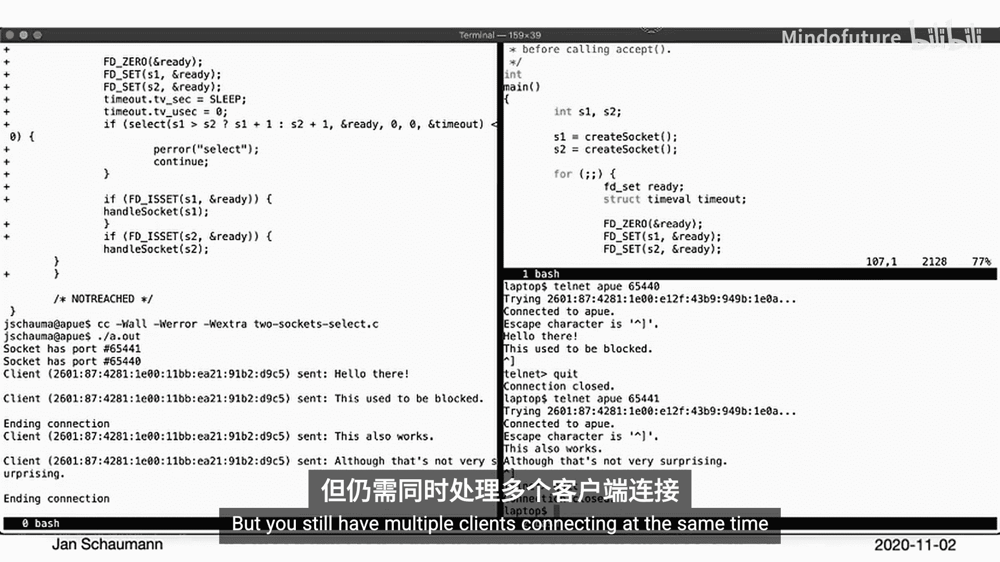
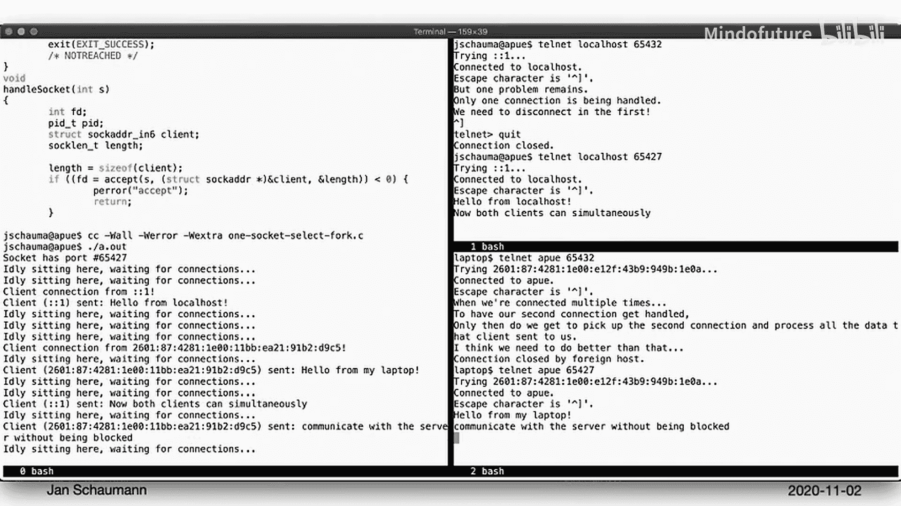
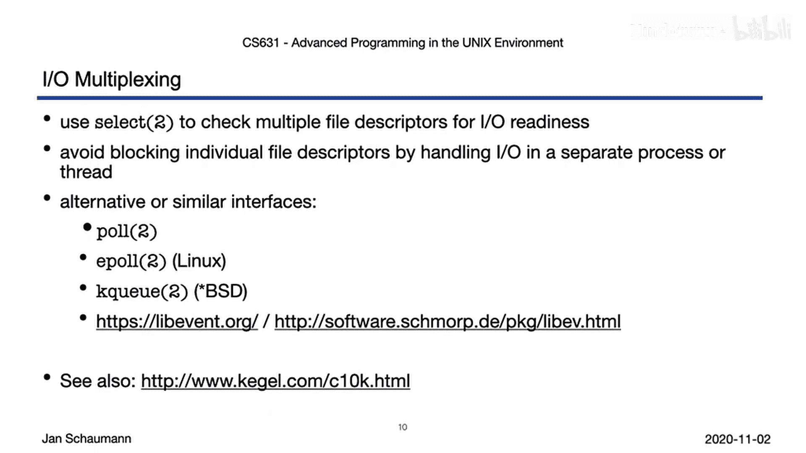

# 057：I/O多路复用 🚀

在本节课中，我们将学习如何使用I/O多路复用来处理多个客户端连接，这是构建高性能服务器（如Web服务器）的关键技术。我们将从回顾上一节的问题开始，逐步介绍`select`系统调用的工作原理，并最终实现一个能同时处理多个客户端连接的服务器模型。

## 概述

在之前的课程中，我们学习了进程间通信（IPC）和基本的客户端-服务器模型。然而，之前的模型仅限于一对一通信，即服务器一次只能处理一个客户端连接。在真实的互联网环境中，服务器需要能够同时处理多个客户端的请求。本节将探讨如何通过I/O多路复用来实现这一目标。


## 回顾问题：顺序处理的局限性

上一节我们介绍了基本的套接字编程。让我们快速回顾一下上一个例子，看看在处理多个连接时会遇到什么问题。

以下是我们的流读取器代码，它创建套接字、绑定、监听并接受连接。假设我们希望允许多个连接，可能会考虑打开额外的套接字，并将创建套接字和处理连接的功能分离。

我们的新主函数可能如下所示：我们创建两个套接字，然后依次处理它们，希望允许多个连接到我们的服务器。

```c
// 伪代码示例
int main() {
    int sock1 = create_and_bind_socket(port1);
    int sock2 = create_and_bind_socket(port2);
    handle_socket(sock1); // 这里会阻塞
    handle_socket(sock2);
    return 0;
}
```

运行此程序时，我们将打开两个套接字。它们分别在端口65446和65445上。现在，我们应该能够连接到任一端口并向服务器发送消息。



然而，当我们尝试连接到一个端口并发送消息时，服务器可能没有接收到。这是因为我们的程序在第一个`handle_socket`函数调用中被阻塞了。即使第二个套接字已经有连接在等待，程序也无法继续处理。只有当第一个连接终止后，程序才能继续并处理第二个套接字。

因此，创建两个套接字然后尝试顺序处理它们的模型效果不佳。第一个套接字上的`accept`调用会阻塞，即使第二个套接字上已经有连接在等待。

## I/O多路复用的解决方案

当我们有多个需要执行I/O操作的文件描述符时，可以怎么做？以下是几种选项：

*   **阻塞等待**：我们刚刚看到的方法。简单地打开文件描述符，阻塞等待I/O，然后处理下一个。这显然不是一个好选项。
*   **为每个描述符创建新进程**：这似乎合理，但如果需要在不同通道之间传递信息，则需要额外的IPC机制，这显得有些繁琐。
*   **非阻塞模式**：如果我们将文件描述符标记为非阻塞，那么任何调用都会立即返回，如果它没有准备好进行I/O，我们就可以继续处理其他任务。
*   **异步I/O**：这种方法要求内核在我们感兴趣的文件描述符准备好进行I/O时通知我们。

但每种选项都有其缺点。永远阻塞显然是不可取的。使用非阻塞模式意味着如果没有连接，我们最终会陷入忙等待（busy polling），即不断循环测试，浪费CPU周期。异步I/O虽然听起来很有希望，但通常有诸多限制。

让我们考虑另一种选择：我们构建一个我们关心的文件描述符集合，然后调用一个特殊的函数，它会告诉我们其中是否有任何描述符已准备好进行I/O。



## 核心工具：select系统调用

这正是`select`系统调用的作用。

```c
int select(int nfds, fd_set *readfds, fd_set *writefds,
           fd_set *exceptfds, struct timeval *timeout);
```

我们向它传递我们想要检查的文件描述符的最大编号（`nfds`）。系统会检查从0到`nfds-1`的描述符，这就是为什么你总是看到参数被设置为`max_fd + 1`。



然后，我们为每个集合（`readfds`、`writefds`、`exceptfds`）传入一个文件描述符集合，`select`将分别检查这些集合中的任何文件描述符是否准备好进行读取、写入，或者是否发生了异常条件。异常条件包括，例如，套接字上到达的带外消息。

最后，我们可以控制`select`在等待这些条件时应阻塞多长时间。我们可以通过传递`NULL`让它永远阻塞。我们可以指定等待的秒和微秒粒度，或者通过将`struct timeval`值的秒和微秒都设置为0来让它完全不阻塞。

## 操作文件描述符集合



使用`select`进行这种形式的同步I/O多路复用时，我们将操作文件描述符集合，并使用提供的FD宏来操作它们：`FD_SET`、`FD_CLR`、`FD_ISSET`和`FD_ZERO`。

如前所述，`readfds`、`writefds`和`exceptfds`集合用于检查读、写和异常条件。关于从文件描述符读取，需要记住的一点是，EOF（文件结束符）也是一种I/O形式。也就是说，文件描述符集合可能被标记为已准备好进行I/O，但随后你只得到0字节返回，但这并不奇怪。

如果你需要更精细的阻塞控制，可以使用`pselect`变体，它提供纳秒级粒度，并允许指定在阻塞时应用的信号掩码。

## 实践：使用select处理多个套接字

让我们看看是否可以在实践中使用它来解决我们之前的问题：拥有多个套接字，我们希望能够在第一个套接字上等待时，不阻塞第二个套接字的通信。

以下是我们更新后的示例程序，添加了对`select`的调用：

```c
// 伪代码示例
fd_set readfds;
FD_ZERO(&readfds);
FD_SET(sock1, &readfds);
FD_SET(sock2, &readfds);



int max_fd = (sock1 > sock2) ? sock1 : sock2;

while (1) {
    fd_set tmp_fds = readfds; // select会修改集合，所以使用副本
    if (select(max_fd + 1, &tmp_fds, NULL, NULL, NULL) > 0) {
        if (FD_ISSET(sock1, &tmp_fds)) {
            // 处理 sock1 上的连接
        }
        if (FD_ISSET(sock2, &tmp_fds)) {
            // 处理 sock2 上的连接
        }
    }
}
```

`select`返回后，我们可以使用`FD_ISSET`单独测试每个套接字，看是否有套接字准备好进行读取。这允许我们的程序拾取任何准备好进行I/O的套接字，这对于需要同时处理多个文件描述符的I/O操作非常有用。

## 进阶：处理单个套接字上的多个客户端

但更常见的情况是，如果你正在编写一个服务器（例如Web服务器），你可能不希望打开多个套接字。Web服务器监听端口80或端口443（用于TLS连接），但仍然有多个客户端同时连接。

如果我们在这个例子中使用`select`，我们只有一个套接字。但我们不会阻塞等待连接，这意味着如果没有客户端连接，我们可以做其他事情。以下是这个例子的运行情况：当没有客户端连接时，服务器可以打印其等待消息。当客户端连接时，它会处理连接，而不会进入阻塞状态去打印等待消息。只有在客户端断开连接后，服务器才有机会再次做其他事情。

然而，当我们有两个同时的客户端连接时，问题出现了。第一个连接被立即处理。但如果此时发起第二个连接，该连接会被阻塞，因为第一个连接仍然处于活动状态。为了让第二个连接得到处理，我们需要完成并终止第一个连接。此时，来自第二个客户端的消息才会被传递。这对于编写Web服务器来说并不理想。

## 最终方案：使用进程处理并发连接

让我们思考如何改进这一点。假设我们重写程序，使得每当套接字上有连接就绪时，我们就派生一个新的子进程。让子进程处理请求并执行服务应该做的任何事情，而父进程则返回等待新连接。

为此，我们首先需要建立一个信号处理程序，让父进程等待任何终止的子进程。否则，每当客户端断开连接时，我们就会留下一个僵尸进程。

然后我们创建套接字并进行`select`调用。由于当客户端断开连接时我们可能会被中断，我们只需忽略这些条件并循环调用`select`。

我们的`handle_socket`函数现在在客户端连接时被调用。它可以接受新连接，但不再直接处理，而是派生一个新进程，让该进程处理它。父进程返回，然后可以在新连接到来时继续处理。

`handle_connection`函数执行我们熟悉的任务，与之前的不同之处在于，在我们完成并断开连接后，我们退出。

让我们看看这是否有帮助。服务器现在监听端口65427。当没有客户端连接就绪时，服务器可以去做其他事情。当第一个客户端连接时，它当然会按预期被处理。但现在请注意，当我们与第一个客户端通信时，服务器仍然可以继续做其他事情。也就是说，它不会被阻塞，因为客户端连接现在由专用的子进程处理。当我们仍然连接到服务器时，我们现在可以在第二个终端发起第二个连接。这一次，服务器立即拾取它。因此，现在两个客户端可以同时与服务器通信而不会被阻塞，并且服务器仍然准备好接受新连接。



## 总结与扩展

本节课中我们一起学习了如何处理I/O多路复用。我们可以使用`select`来检查一组文件描述符的特定条件，这使我们能够同时处理多个文件描述符或套接字，或者避免在单个套接字上阻塞，并在等待客户端连接时做其他事情。

我们还看到了如何通过生成子进程或单独的线程来处理单个套接字上的多个同时客户端。如果每个子进程不需要与其他任何客户端通信，这种方法效果很好，并且是标准服务器设计中的常见模式。有时你可能会遇到一些预派生一堆进程来处理连接的程序，这可能会改进这种方法。

还有其他一些用于在I/O准备就绪（或更一般地说，事件发生）时获得通知的替代接口和选项。以下是几个主要的替代方案：

*   **poll**： 一个比`select`更可扩展的替代方案。
*   **epoll**： Linux上的高性能I/O事件通知机制。
*   **kqueue**： 各种BSD系统（包括macOS）上可用的内核事件通知机制。
*   **libevent / libev**： 可能封装了其中一些接口，以允许跨平台的I/O多路复用机制。

这些接口都试图克服其他接口的一些缺点，以提高处理大量同时连接时的效率，这是一个需要解决的重要问题。

至此，我们完成了对进程间通信的讨论。通过本视频的讲解，你现在已经为开始进行最终小组项目——编写一个HTTP服务器——做好了充分准备。我们将在课堂上讨论该项目，然后继续我们的视频讲座系列，探讨守护进程和共享库。

---



**本节课中我们一起学习了：**
1.  顺序处理多个套接字连接的局限性。
2.  I/O多路复用的概念及其必要性。
3.  如何使用`select`系统调用监控多个文件描述符的状态。
4.  如何结合`fork`创建子进程，实现单个服务端口同时处理多个客户端连接。
5.  了解除了`select`之外的其他高性能I/O多路复用机制（如`poll`、`epoll`、`kqueue`）。