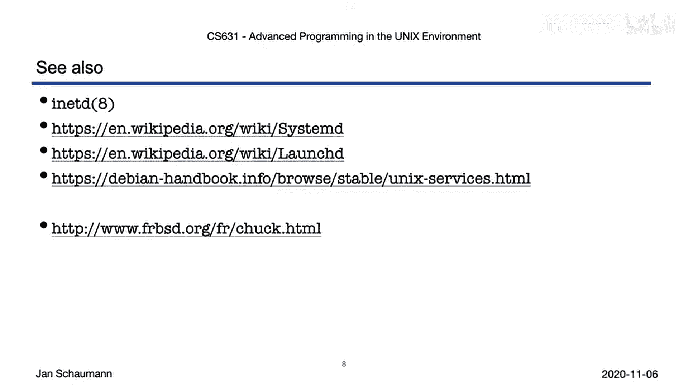

# 058：守护进程 👹

在本节课中，我们将要学习守护进程。守护进程是长期在后台运行、提供特定服务的进程，是构建服务器（如HTTP服务器）的基础。理解守护进程的特性与创建方法，对于编写可靠的服务至关重要。

在上一节我们介绍了进程间通信，本节中我们来看看如何创建一个能持续在后台运行的服务进程，即守护进程。

## 守护进程概述

守护进程是一种特殊的后台进程。它通常随系统启动而自动运行，并在系统关闭时终止。它没有控制终端，因此无法与用户直接交互。这类进程的命名源于物理学思想实验“麦克斯韦妖”，寓意一个在后台持续运行并执行任务的代理。

在早期的BSD软件发行版中，守护进程的图示成为了BSD的官方吉祥物。值得一提的是，最初的BSD恶魔是由前皮克斯动画师约翰·拉塞特绘制的。

## 守护进程的特性与影响

守护进程具有几个特定属性，这些属性带来了重要的编程影响。

*   **长期运行**：守护进程可能运行数小时、数天甚至数月。这意味着必须谨慎管理资源，避免内存或文件描述符泄漏。每次请求处理中的微小泄漏，在长期运行后都会导致资源耗尽。
*   **专注单一服务**：它遵循UNIX哲学，只做好一件事。这有助于保持代码简单，降低复杂性。
*   **无控制终端**：它无法进行交互式输入，也无法将错误信息打印到标准错误输出。必须通过其他机制（如系统日志）来报告信息。
*   **工作目录**：进程的当前工作目录是一个打开的句柄。如果守护进程持有一个目录的句柄，就无法卸载该目录所在的文件系统。因此，守护进程通常会将工作目录更改为文件系统根目录 `/`。

## 如何编写一个守护进程

了解了上述影响后，我们可以按照一系列标准步骤来创建一个守护进程。

以下是创建守护进程的关键步骤：

1.  **清理环境**：清除环境变量，确保服务不受不可控因素影响。
2.  **创建子进程**：调用 `fork()`，并让父进程退出。这使得子进程成为“孤儿进程”，并被 `init` 进程接管，从而在后台运行。
3.  **设置文件掩码**：调用 `umask(0)` 设置合适的文件创建掩码，确保后续创建的文件具有正确的权限。
4.  **创建新会话**：调用 `setsid()` 成为新会话的首进程。这会断开与控制终端的关联，并让该进程组的所有进程保持在同一个会话中。
5.  **更改工作目录**：将当前工作目录更改为一个安全的位置，通常是根目录 `/`。
6.  **关闭文件描述符**：关闭或重定向标准输入、标准输出和标准错误描述符（通常是文件描述符0、1、2），防止后续创建的进程错误地使用它们。通常将它们重定向到 `/dev/null`。
7.  **打开日志文件**：如果需要记录日志（如系统日志或访问日志），则在此步骤打开相应的文件描述符。
8.  **进入服务主循环**：完成上述设置后，程序进入提供实际服务功能的主循环。

## 守护进程的管理惯例

由于系统上运行着许多守护进程，因此形成了一些管理它们的惯例。

以下是常见的守护进程管理惯例：

*   **使用PID文件**：许多守护进程会将自己的进程ID写入一个文件（通常位于 `/var/run/` 目录下）。这有助于系统管理员识别主进程，也用于防止启动多个服务实例。
*   **使用锁文件**：通过检查或创建特定的锁文件，可以防止同一个守护进程的多个实例同时运行。
*   **提供启动脚本**：为了让服务能随系统启动，需要提供启动脚本。脚本风格因系统而异（如BSD `rc`、System V `init` 或现代的 `systemd`）。
*   **使用配置文件**：守护进程通常从 `/etc/` 目录下的配置文件中读取设置，因为无法与用户交互。配置文件通常以服务名命名。
*   **响应SIGHUP信号**：约定是当守护进程收到 `SIGHUP`（挂起）信号时，重新启动并重读配置文件。由于守护进程没有控制终端，正常情况下不会收到此信号，因此可以将其“挪用”为重启指令。
*   **使用系统日志**：通过 `syslog` 机制来记录调试信息、警告和错误，这是无终端后台服务的标准日志方式。

## 实例分析：`syslogd` 守护进程

让我们通过 `syslogd`（系统日志守护进程）来观察一个典型的守护进程。

在 `/etc/rc.d/` 目录下可以找到各种服务的启动脚本。通过 `ps` 命令可以看到当前运行的守护进程，如 `httpd`、`sshd`、`syslogd` 等。

查看 `syslogd` 的源代码（`syslogd.c`），可以看到它进行了典型的守护进程初始化：更改根目录、设置组ID和用户ID，然后调用了 `daemon()` 库函数。这个函数封装了创建守护进程的繁琐步骤。

`daemon()` 函数内部完成了我们之前描述的步骤：`fork()` 让父进程退出，子进程调用 `setsid()`，并重定向标准文件描述符。调用后，进程就变成了一个合格的守护进程。

`syslogd` 的启动脚本定义了命令名、PID文件和配置文件。它的PID文件（如 `/var/run/syslogd.pid`）记录了当前进程ID。配置文件（如 `/etc/syslog.conf`）决定了日志的存储规则。

如果修改了配置文件，需要让 `syslogd` 重启以生效。有两种方式：
1.  直接向进程发送 `SIGHUP` 信号：`kill -HUP <PID>`。
2.  使用启动脚本重启：`/etc/rc.d/syslogd restart`。脚本会检查PID文件，终止旧进程并启动新进程。

通过向系统发送一条日志消息，可以验证新的配置是否已生效。

## 总结与下一步

本节课中我们一起学习了守护进程的核心概念、创建步骤和管理惯例。守护进程是构建稳定后台服务的基础，其关键在于**资源管理**、**脱离终端**和**遵循系统惯例**。

接下来，你可以尝试修改一个守护进程的配置文件，并向其发送 `SIGHUP` 信号，观察它如何重启并应用新配置。也可以深入研究启动脚本是如何实现重启逻辑的。

为了进一步探索，建议查阅以下手册页和相关链接：
*   `man daemon`
*   `man syslog`
*   `man setsid`

在接下来的视频中，我们将深入探讨共享库以及可执行文件与链接器的工作原理。

