# 060：链接器与加载器详解 🔗

在本节课中，我们将深入探讨可执行文件是如何从可重定位目标文件生成的，以及执行时所需的工具和过程。我们将回顾编译链和链接器的工作，并理解共享库的加载机制。

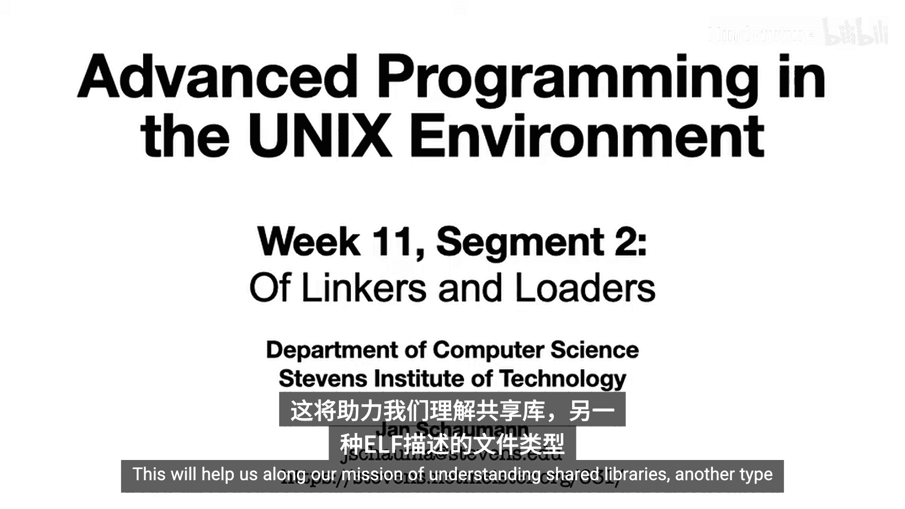

## 概述

上一节我们开始研究可执行与可链接格式（ELF）。我们区分了可重定位目标文件和可执行文件。本节中，我们将更仔细地观察前者如何转变为后者，需要哪些工具，以及可执行文件是如何被执行的。在这个过程中，我们将再次回顾之前的几节课，特别是第五周讨论的编译链和链接器工作。这将帮助我们理解共享库，这是另一种使用ELF描述的文件类型。

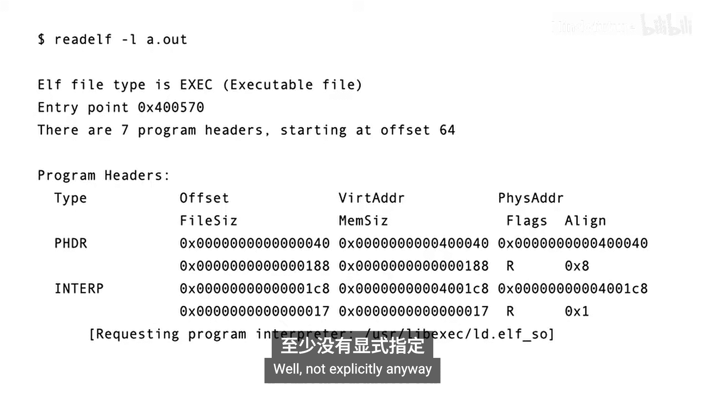

## 从源文件到可执行文件

让我们从上次结束的地方开始。当我们对ELF可执行文件运行`readelf`命令时，我们注意到了不同的程序头，包括`PT_INTERP`头，它指向一个文件，例如`/usr/lib/ld-linux-x86-64.so.2`。

那么，这个路径从何而来？它有什么作用？我们为什么需要它？我们在构建可执行文件时并没有明确指定这个路径，不是吗？

实际上，我们并没有明确指定。但让我们退一步，回顾一下如何从源文件构建可执行文件。我们在第5周的课程中更详细地介绍了这个过程，但让我们回忆一下，编译过程是一系列独立的步骤，每个步骤由编译链执行，可能调用不同的工具。

具体来说，我们知道在编译的第一阶段，我们调用C预处理器（CPP）来引入所有包含文件、展开宏等。然后执行从C语言到机器相关汇编代码的编译。接着使用汇编器将输入转换为目标文件（可重定位的`.o`文件）。只有在编译过程的最后阶段，我们才调用链接器来创建可执行文件，通过组合多个目标文件，包括指定动态链接器选项以引入运行时链接编辑器（`ld-linux.so`）、C运行时启动例程所需的各种目标文件，以及我们创建的目标文件（例如`crypt.o`）。

或者，如果我们调用`cc`并让编译链执行所有步骤，则会创建一个临时文件，如下所示。接下来，我们指定要链接`libc`和`libcrypto`。然而，我们并没有告诉链接器在哪里找到这些文件。我们稍后会看到它是如何做到的。最后，链接器需要C运行时收尾例程来“钩住”启动例程对象。

现在，获取所有这些文件，重新排列一些位，添加一些关于在哪里找到未定义符号等信息，链接器就生成了ELF可执行文件。

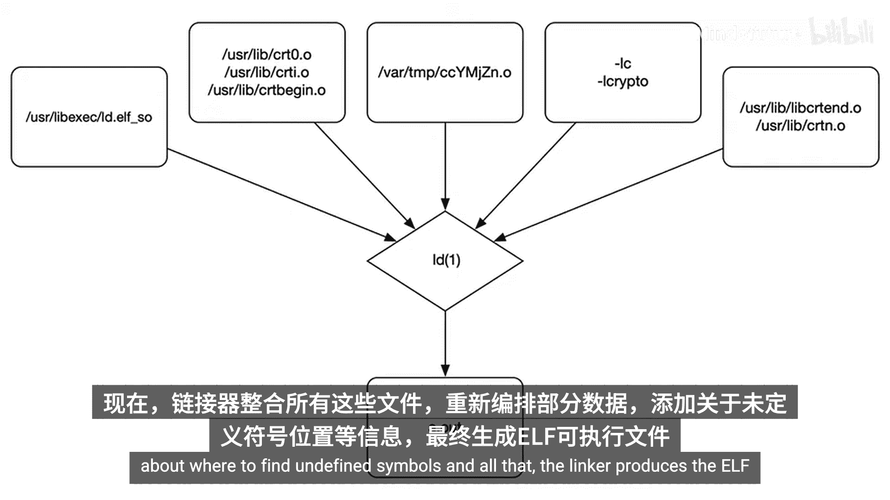

## 实践示例

让我们看一个实际的例子。这里有一个非常简单的程序，它使用了`crypt`库函数。我们将调用它来说明除了标准C库`libc`之外，共享库的使用。

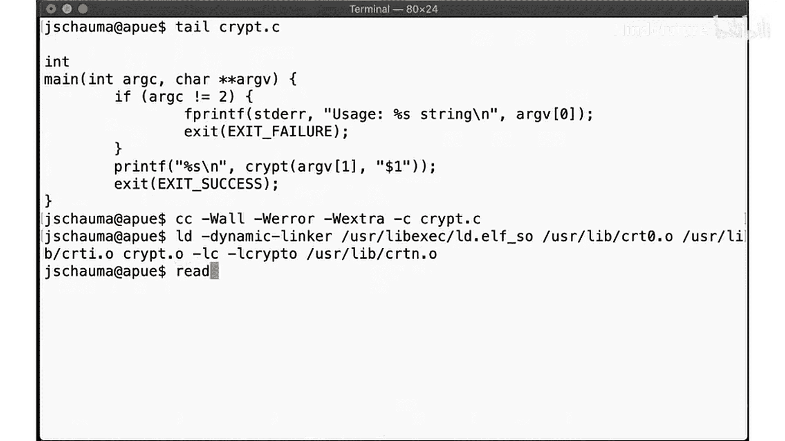

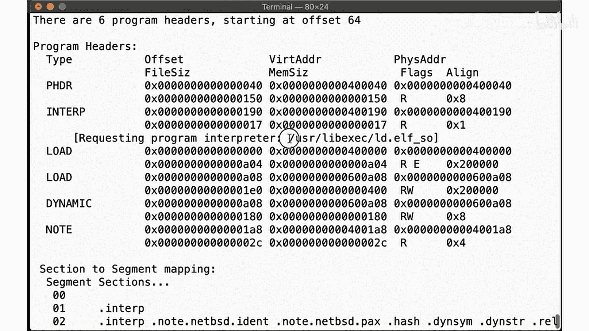

首先，我们编译目标文件，然后运行我们刚刚解释的`ld`命令。我们需要指定动态链接器`ld-linux.so`、C运行时启动例程对象、我们的目标文件、要链接的库以及C运行时收尾例程。

当我们运行`readelf`时，我们看到`PT_INTERP`头（程序解释器）被设置为我们指定的动态链接器。

## 动态链接器的作用

那么，这个`ld-linux.so`到底是什么？手册页告诉我们，`ld-linux.so`是运行时链接编辑器，一个用于查找和加载程序执行所需的各种共享对象的程序。也就是说，当我们调用程序时，内核将控制权传递给这个运行时链接编辑器，然后它使用ELF不同节中的信息来查找要加载的其他对象。

手册页还告诉我们链接器如何找到正确的库。记住，当我们调用`ld`时，我们只告诉它“我们需要`libcrypto`”，但我们没有告诉它这个库在哪里。因此，链接器和链接编辑器必须有一种方法来找到实际的文件。

让我们看看可执行文件的动态节。在这里，我们看到有三个共享对象被标记为“需要”：`libc.so.6`、`libcrypto.so.1.1`和`libcrypt.so.1`。因此，当我们运行可执行文件时，我们知道这将调用运行时链接编辑器，它将确定在哪里找到我们没有存入可执行文件的符号，然后允许我们的程序执行。

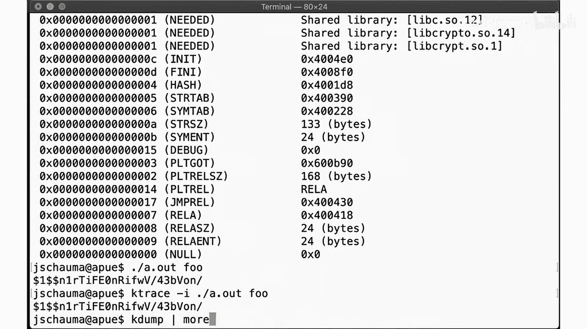

但我们如何验证`ld-linux.so`真的被执行了呢？让我们使用`ktrace`工具。`ktrace`是一个用于检查程序进行了哪些系统调用等信息的工具。跟踪信息以二进制格式存储在一个文件中，你可以使用`kdump`工具来检查。

我们调用`execve`来执行`a.out`二进制文件，然后我们注意到紧接着，我们看到一个对`ld-linux.so`的调用，它继续打开`ld.so.cache`，然后引入`libc.so.6`，接着是`libcrypto.so.1.1`和`libcrypt.so.1`，然后才继续执行我们指示程序要做的操作。

## 不指定动态链接器的情况

到目前为止一切顺利。但如果我们不指定动态链接器呢？`ld`仍然会成功，生成的文件仍然是ELF可执行文件。但请注意，现在请求的解释器是一个不同的程序解释器`/lib64/ld-linux-x86-64.so.1`。让我们看看执行该命令时会发生什么。

我们得到一个失败信息，说“没有那个文件或目录”。让我们检查这个文件`/lib64/ld-linux-x86-64.so.1`在哪里。它不存在。因此，`ktrace`准确地显示程序试图调用程序解释器，但该文件不存在，因此程序执行失败。

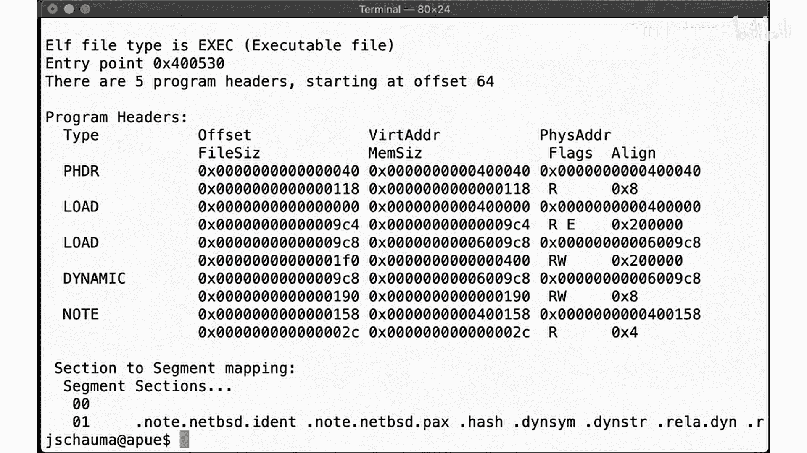

但也许我们可以避免使用任何程序解释器。让我们向`ld`传递`-no-dynamic-linker`选项。就像之前一样，我们仍然得到一个可执行文件，类型仍然是ELF。但这一次，没有解释器。那么，当我们执行这个二进制文件时会发生什么？

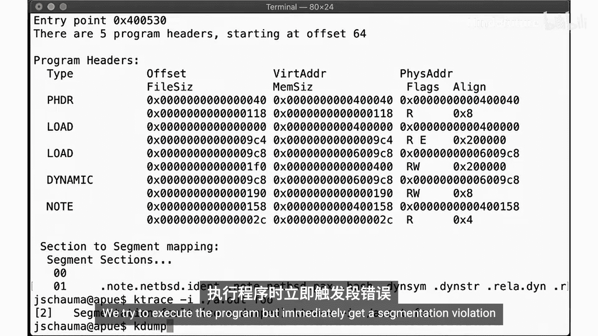

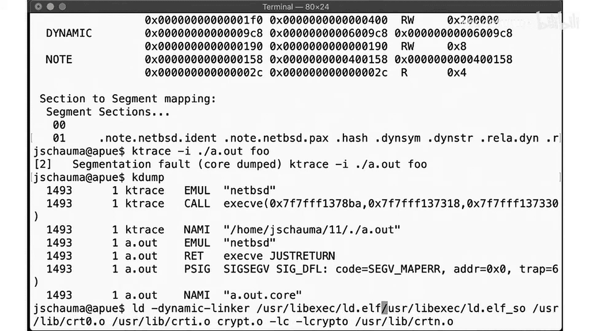

哦，段错误。它出现了。我们尝试执行程序，但立即遇到分段违规，因为我们的进程在内存中的设置方式无法执行，它缺少了链接编辑器本应为我们提供的来自共享对象的各种符号。

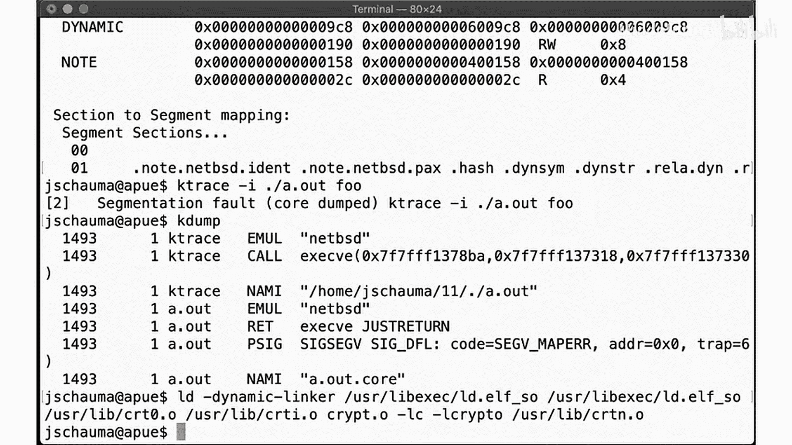

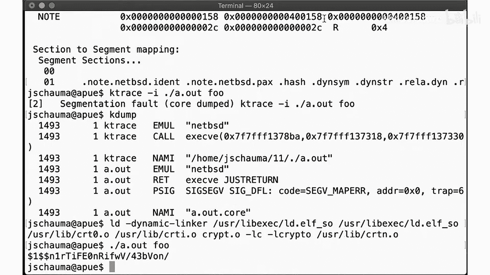

如果我们回到指定正确的动态链接器，那么一切又恢复正常了。

## 链接器与加载器的关系

因此，运行时链接编辑器`ld-linux.so`在某种程度上执行了与链接器相反的步骤。链接器获取各种目标文件并创建可执行文件，而运行时链接编辑器现在获取可执行文件，检查环境、其自身的配置信息（这些信息可以在可执行文件的`DT_RPATH`节中找到，我们将在下一个视频中更详细地查看），以及库的默认位置。最终，它找到要使用的正确共享库，然后最终生成要加载到内存中的正确进程映像。

## 总结

在本节课中，我们一起学习了链接器如何组合目标文件、C运行时序言和收尾对象以及任何共享库来生成可执行文件。正如我们刚刚看到的，加载器通过在运行时执行某些查找来处理这些符号的解析，然后生成允许执行的进程映像。

在一些系统上（最著名的是Linux），运行时链接器本身就是一个可执行文件，你可以传递程序文件来调用它。尝试构建一个没有程序解释器的可执行文件，它应该会执行失败，正如我们在这里观察到的那样。但是，如果你直接调用加载器并将没有指定解释器的可执行文件传递给它，它仍然应该执行。你甚至不需要相关程序的执行权限，这让一些人感到惊讶。

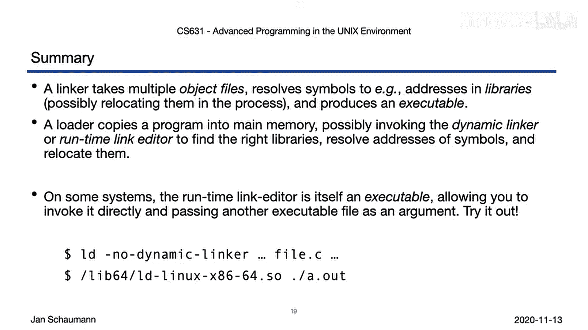

在下一个视频中，我们将更仔细地研究共享库到底是什么，以及加载和链接过程的一些特性。