# 061：共享库 📚

在本节课中，我们将要学习共享库。我们将详细探讨什么是共享库、如何创建共享库，以及动态链接可执行文件的行为如何受到链接器工作方式的影响。

## 概述


在上一个视频中，我们详细讨论了创建和执行可执行文件所涉及的进程。我们探讨了链接过程中将多个目标文件组合在一起的步骤，并看到在可执行文件中，`PT_INTERP`程序头包含了程序解释器（或运行时链接编辑器）的路径名。它的职责是在运行时通过共享库解析任何未定义的符号。

在本视频中，我们将重点介绍共享库本身。

## 什么是共享库？🔍

让我们再次回顾链接器如何创建可执行文件。我们记得，它插入了程序解释器 `/usr/lib/ld-linux.so`，然后将目标文件与指定的共享库结合，创建出名为 `a.out` 的 ELF 二进制文件。

但我们实际上只指定了共享库的名称，没有其他信息。那么链接器是如何使用它们的呢？共享库到底是什么？

当我们讨论第5周的编译链时，我们描述了C预处理器如何引入各种C头文件。我们也看到，这些头文件只提供宏、常量和前向声明（或函数原型），而不是函数的实际实现。例如，当你包含 `stdio.h` 时，你只提供了 `fprintf` 等函数的前向声明，而不是它们的实现。实现 `fprintf` 的完整代码必须来自其他地方，在这个例子中就是C标准库。

换句话说，**库包含可以被你的程序使用的实际代码**。事实上，任何不是你亲自编写的代码都必须来自某个库。

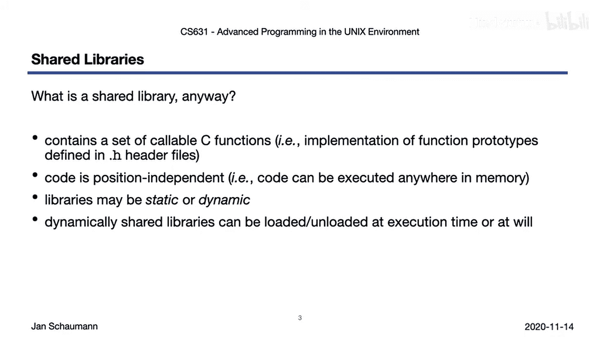

为了能够将这些代码加载到内存中供任何执行中的程序使用，它需要使用**位置无关代码**。你的编译器可能默认已经生成了这种位置无关代码，或者你可能需要指定一个特殊标志，我们稍后会看到。

库可以是**静态的**或**动态的**，我们将在本视频中看看两者之间的区别。动态共享库可以在执行时由加载器加载，或者作为程序的一部分按需加载。

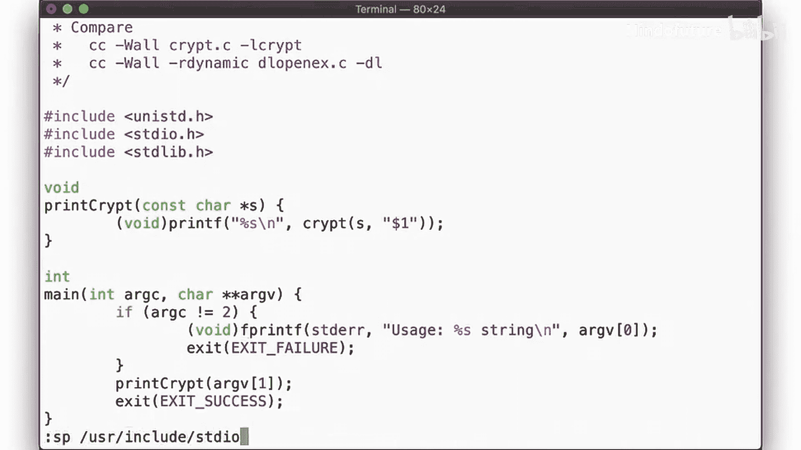

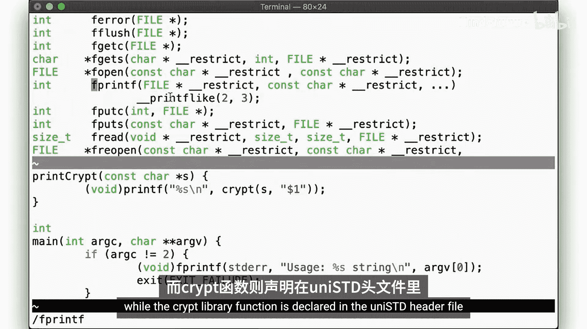

## 通过示例说明 📝

也许通过示例来说明这一切是最好的方法。

这是我们在上一个视频中的程序 `crypt.c`，尽管我们添加了另一个函数来说明我们代码中的定义是如何在 `.o` 文件中被识别的。

无论如何，我们使用了一些标准库函数，例如 `fprintf`，我们知道它是定义在 `stdio.h` 中的函数原型。

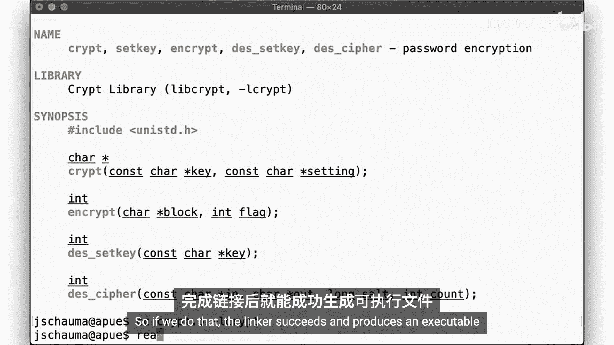

```c
#include <stdio.h>
```

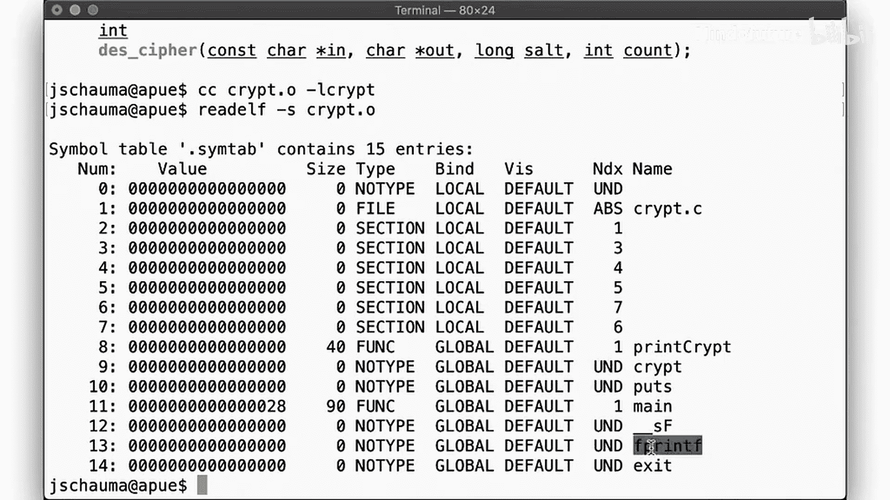

而 `crypt` 库函数则声明在 `unistd.h` 头文件中。

```c
#include <unistd.h>
```

`fprintf` 的实现由标准C库 `libc.so` 提供。而 `crypt` 则在 `libcrypt` 库中实现。

如果我们将代码编译成目标文件，一切正常，因为编译器找到了前向声明并生成了相应的 `.o` 文件。

但是，如果我们尝试将 `.o` 文件链接成可执行文件，就会得到一个错误。链接器找不到 `crypt` 函数的实现，然后抛出关于“未定义引用”的错误。

幸运的是，手册页告诉我们需要链接哪个库来获取 `crypt` 函数的实现：我们需要链接 `-lcrypt`。如果我们这样做，链接器就会成功并生成一个可执行文件。

## 符号表与动态链接 🔗

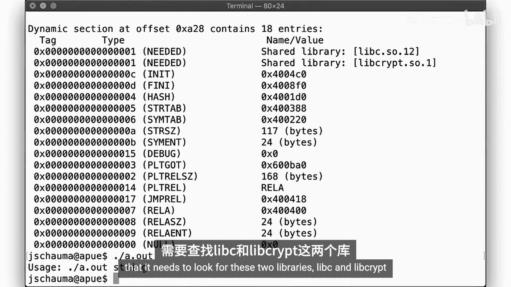

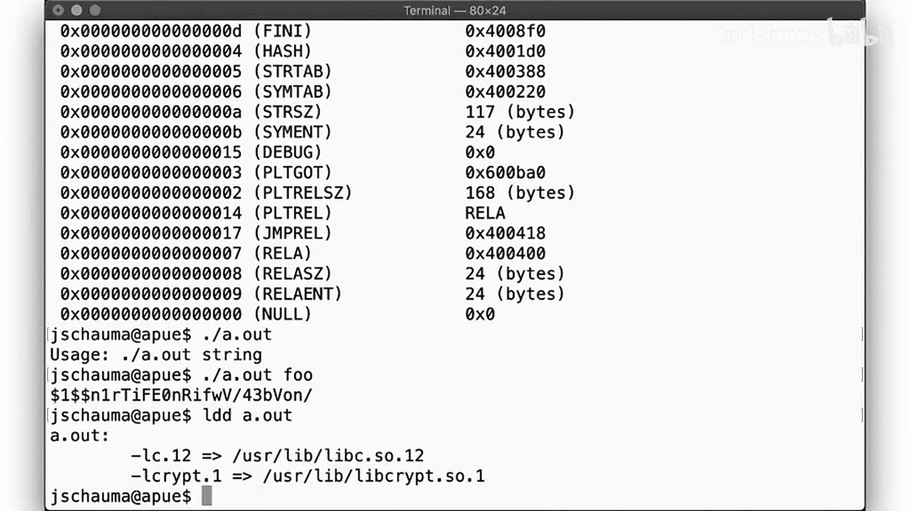

通过 `readelf` 查看符号表，我们可以看到哪些符号在可执行文件中被定义。`main` 是函数类型且已定义，`print` 函数也已定义。但 `crypt` 本身，以及 `fprintf` 和 `exit` 仍然是未定义的。

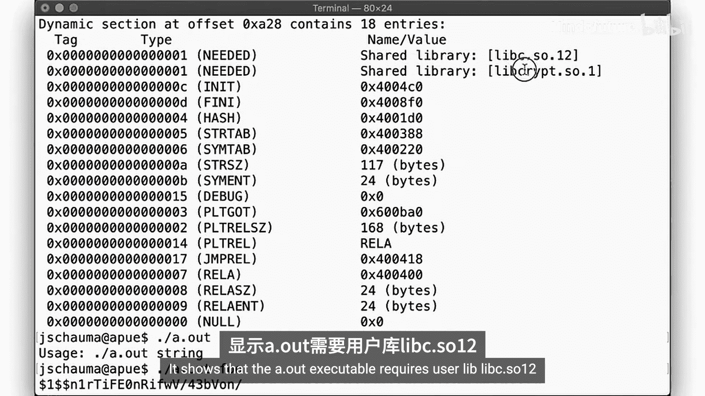

并且所有这些函数的地址都是 `0`。我们如何能创建一个带有未定义符号的可执行文件呢？

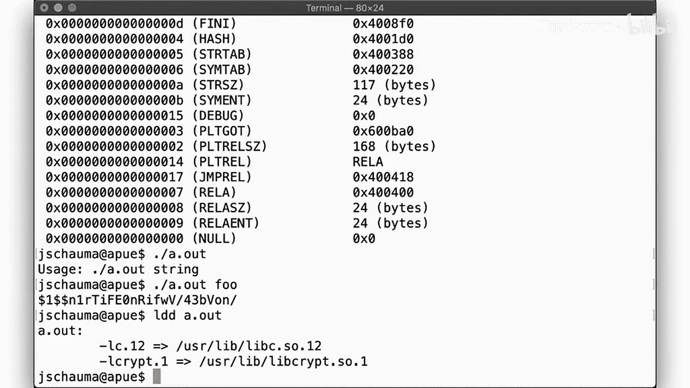

让我们尝试自己运行链接器。如果我们只用目标文件调用 `ld`，会得到一大堆关于未解析符号的错误，比之前多得多，包括来自标准C库的函数。

所以，我们尝试告诉链接器使用 `-lc`。现在好多了，我们只得到关于 `crypt` 未定义的错误，就像之前一样。这意味着我们的编译链默认会自动链接 `libc.so`，这似乎是合理的做法。

现在，让我们在命令中添加 `-lcrypt`。现在一切都成功了，没有未定义的引用了。

`crypt.o` 目标文件的符号表包含未定义的引用。但是可执行文件呢？`readelf -a` 显示这里也有大量未定义的引用。但现在我们有一堆已定义的东西。例如，我们有 `_start` 例程，我们知道它是可执行文件的入口点，位于十六进制地址 `0x400550`。然后 `main` 也被发现是一个已定义的函数。但同样，`crypt`、`exit` 和 `fprintf` 仍然未定义。

让我们看看可执行文件的动态节。这很有趣。这里我们看到可执行文件包含了它需要哪些库的信息：`libc.so.12` 和 `libcrypt.so.1`。当我们执行程序时，一切正常。

因此，可执行文件中包含的这些信息会通知加载器，它需要查找这两个库：`libc` 和 `libcrypt`。

`ldd` 命令可以用来显示加载器在共享库方面会做什么。它显示 `a.out` 可执行文件需要 `/usr/lib/libc.so.12` 和 `/usr/lib/libcrypt.so.1`。

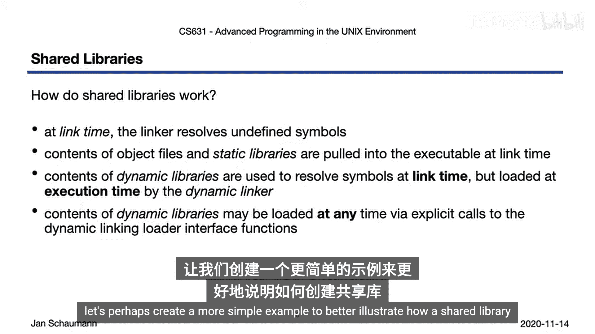

在找到库的绝对路径（其名称包含在可执行文件的要求中）之后，加载器就会加载它们。

正如我们在上一个视频中描述的那样，我们看到 `ld-linux.so` 必须从可执行文件中找到关于共享库的信息，然后使用一些逻辑将其映射到实际路径名，再加载这些库以在运行时解析未定义的引用。

换句话说，链接器和加载器必须再次协同工作。在链接时，链接器解析各种未定义的符号，并记录需要哪些库。它在可执行文件中提供此信息，但不会将所有实际代码拉入可执行文件。然而，我们编写的实际代码，我们编译的所有目标文件中的内容，都被放入了可执行文件。

如果我们使用了静态库，我们的代码也会被拉入可执行文件。我们稍后会看到一个例子。但是动态库（如我们示例中的 `libc` 或 `libcrypt`）的内容不会被拉入可执行文件。相反，我们只在链接时的可执行文件中包含需要哪些库的信息，然后在程序执行时，动态链接器执行反向操作，加载程序可执行文件中指定的共享库。

然而，运行时链接编辑器并不是你加载共享库的唯一方式。你也可以自己显式调用实现此功能的 `dlopen` 系列函数。我们将在本视频末尾看到一个这样的例子。

## 创建一个简单的共享库示例 🛠️

首先，让我们创建一个更简单的例子来更好地说明如何创建共享库。

让我们考虑这个简单的程序。`main` 只调用了三个函数：`ldtest0`、`ldtest1` 和 `ldtest2`。仅此而已。`main.c` 文件不包含这些函数的实现，但提供了让编译器创建目标文件所需的函数原型。这相当于有一个自定义的 `include` 语句，引入一个提供这些前向声明的文件。

`ldtest1.c` 文件包含 `ldtest0` 和 `ldtest1` 函数的实现。这些函数本身并不令人兴奋，但它们将服务于我们的目的。`ldtest2.c` 则包含同样无聊的 `ldtest2` 函数的实现。

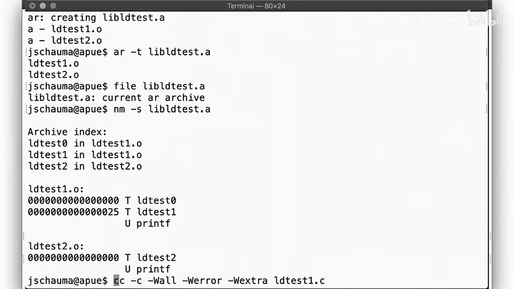

现在，如果我们编译 `main.c` 程序，当然会失败，因为我们没有提供任何实现 `ldtest` 函数的代码。但请注意，如果我们只是将程序编译成目标文件，那是可行的，因为我们确实提供了函数原型。

所以，如果我们现在将 `ldtest.c` 文件编译成目标文件，然后将 `main.o` 与这些目标文件链接，我们就会得到一个功能正常的可执行文件。

让我们看看符号表。这次，我们将使用 `nm` 工具。我们再次看到程序文本段中定义的一些符号，一些来自共享库 `libc` 的未定义符号，以及一些在 `.bss` 段中定义的东西。但这都是我们整个学期一直在构建可执行文件的常规无聊内容。

让我们改变一下。让我们创建一个提供 `ldtest` 函数的库。为此，我们使用 `ar` 工具创建一个包含两个 `ldtest` 目标文件的归档文件。归档文件非常简单，就是一个包含其他几个文件以及目录表的文件，以便你可以更轻松地访问归档内的单个文件。

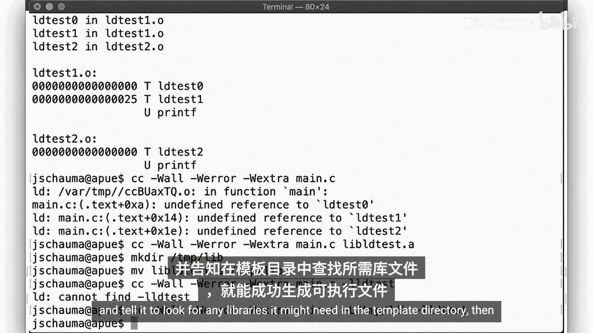

如果我们查看这个归档的目录表，是的，它现在包含两个目标文件。现在，让我们看看这个归档的符号表。索引告诉我们哪些符号在哪个文件中定义，我们也发现这些文件本身仍然包含一些未解析的引用。

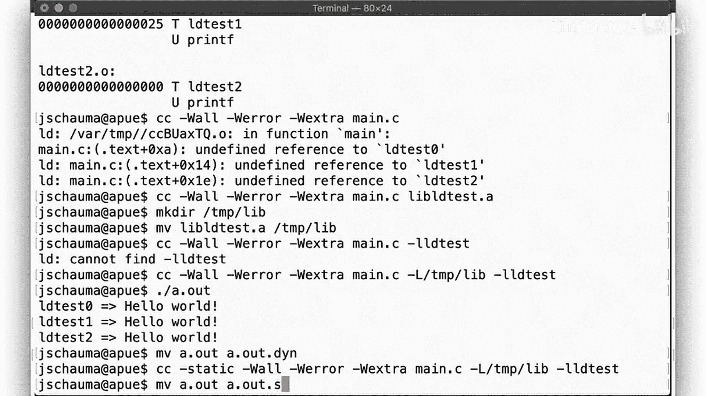

那么我们现在可以用这个归档做什么呢？如果我们单独编译 `main.c` 文件，我们知道它会失败。但是，如果我们随后将归档作为另一个参数添加，编译和链接就成功了。也就是说，链接器能够从归档中提取文件。换句话说，归档已经成为一个库，只是碰好在当前目录中。

但我们可以把它存放在其他地方。让我们把它移到 `/tmp/lib`。如果我们现在可以使用 `-lldtest` 标志，而不是提供归档的固定路径，那就太好了。不幸的是，链接器当然会告诉我们它不知道在哪里找到这样的库。

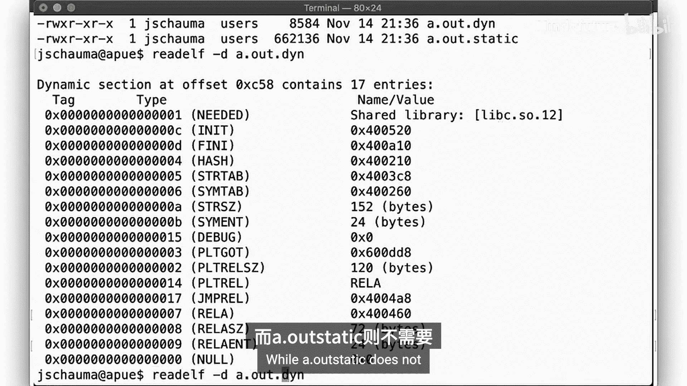

但是，如果我们通过指定 `-L` 标志给链接器一个提示，告诉它在 `/tmp/lib` 目录中查找它可能需要的任何库，那么它就成功了，并且可执行文件像以前一样工作。

## 静态链接与动态链接对比 ⚖️

现在让我们说明静态链接可执行文件和动态链接可执行文件之间的区别。我们重命名这个可执行文件，然后创建一个新的、静态链接的。

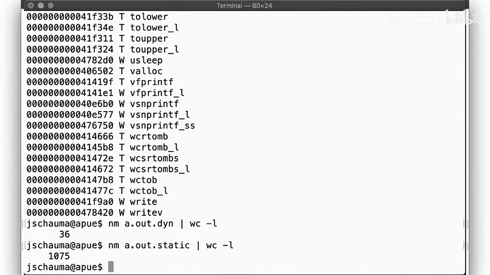

`a.out.static` 现在是一个静态链接的 ELF 可执行文件。`a.out.dyn` 是一个动态链接的 ELF 可执行文件。动态链接的可执行文件需要一个程序解释器，静态链接的则不需要。它们的行为方式相同。

但这两个可执行文件显然非常不同。动态的那个要小得多。

`readelf` 告诉我们，这个可执行文件需要 `libc.so.12` 才能运行。而 `a.out.static` 则不需要。

`a.out.dyn` 的符号表如前所述，包含各种已定义的东西，包括我们放入归档的 `ldtest` 函数，而来自 `libc` 的东西仍然是未定义的，因此需要加载 `libc`。

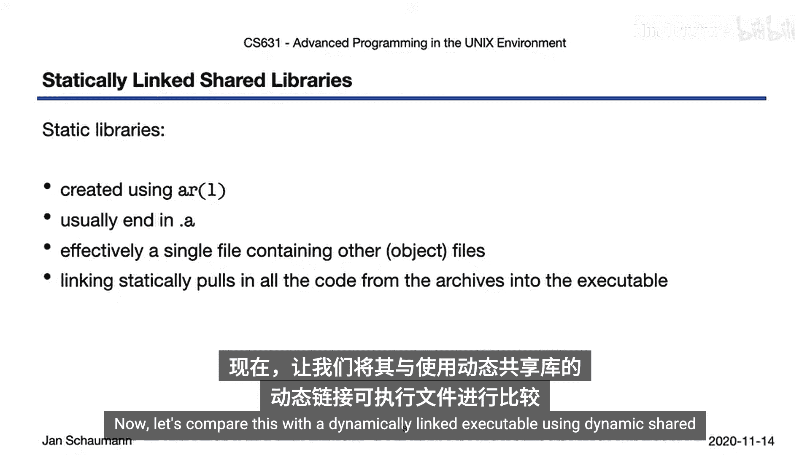

然而，`a.out.static` 的符号表看起来有点不同。它包含更多的符号，包括所有 I/O 函数的符号。我们来比较一下：`a.out.dyn` 包含 36 个符号，`a.out.static` 包含 1075 个。这解释了为什么静态链接的可执行文件要大得多，并且实际上包含了来自 `libc` 库的所有内容，这就是为什么它不需要程序解释器或链接加载器。它需要的一切都“烘焙”进了可执行文件中。

因此，我们在这里创建的 `libldtest.a` 归档是一个**静态库**。正如我们所见，这些库（归档）是使用 `ar` 工具创建的，通常以 `.a` 结尾。当然，这是在 Unix 系统上，这绝不是硬性要求。归档实际上只是一个包含其他文件的单个文件，如果你愿意，可以看作是一个带有目录表的文件串联。这当然解释了为什么链接这样的归档会产生一个包含归档所有内容的大二进制文件，因此不需要程序解释器或加载器在程序执行时去寻找任何其他库。

## 创建动态共享库 🧩

现在，让我们将其与使用动态共享库的动态链接可执行文件进行比较。

如前所述，为了让库在执行时甚至执行期间按需加载，它需要使用**位置无关代码**。因此，我们需要使用编译器的 `-fPIC` 标志。位置无关代码通过全局偏移表来解析其地址。

让我们使用这个标志来编译我们的库文件。请注意，我们的目标文件现在在 ELF 符号表中包含一个全局偏移表引用。

让我们创建一个共享库。为此，我们使用编译器的 `-shared` 标志，并向链接器传递 `-soname` 标志，以指定我们正在创建的共享对象的名称。按照惯例，共享库根据应用程序二进制接口承诺以主版本号和次版本号命名，并创建符号链接以允许用户、链接器和加载器找到正确的库。

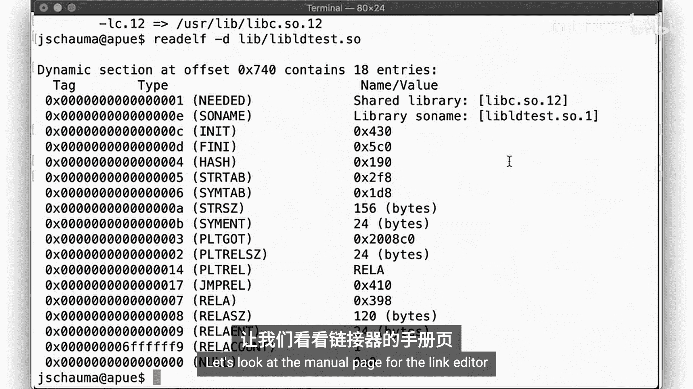

所以 `libldtest.so.1.0` 现在是一个动态链接的共享对象。和以前一样，不指定库编译 `main.c` 会失败。仅指定库名是不够的，因为链接器不知道库可能在哪里。但是，如果我们用正确的目录指定 `-L` 标志，那么就可以继续了。

`a.out` 是一个动态链接的可执行文件，以 `/usr/lib/ld-linux.so` 作为程序解释器。

所以现在我们可以运行程序了。哎呀，现在怎么了？我以为我们创建了一个带有正确库的可执行文件。它现在执行失败在哪里？

`ldd` 也告诉我们找不到库。让我们看看库。在动态节中，它告诉我们它需要 `libc`，这并不奇怪，并且在 `soname` 中，它被命名为 `libldtest.so.1`，正如我们指定的那样。

让我们看看链接编辑器的手册页。这里告诉我们它如何在链接时尝试查找库：它会查看一些用户定义的查找路径、配置文件、可执行文件中明确指定的路径，如果这些都失败了，则查看 `/usr/lib`。

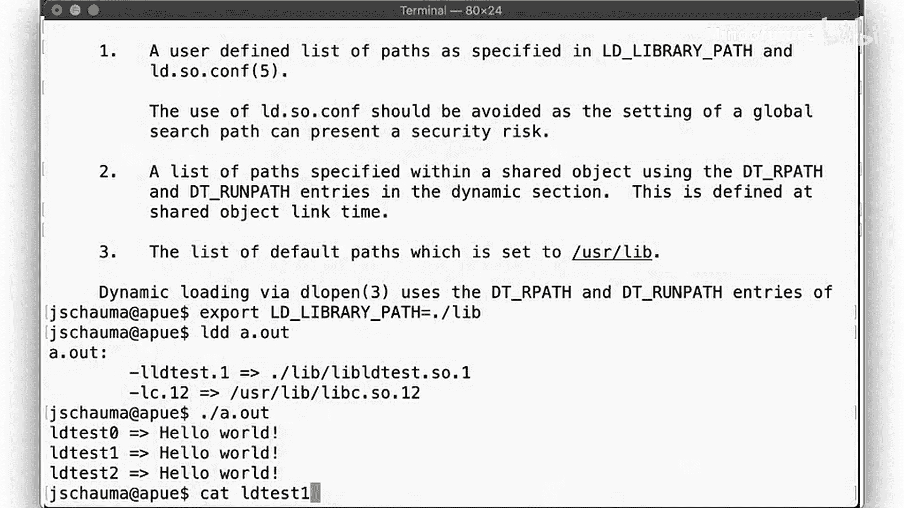

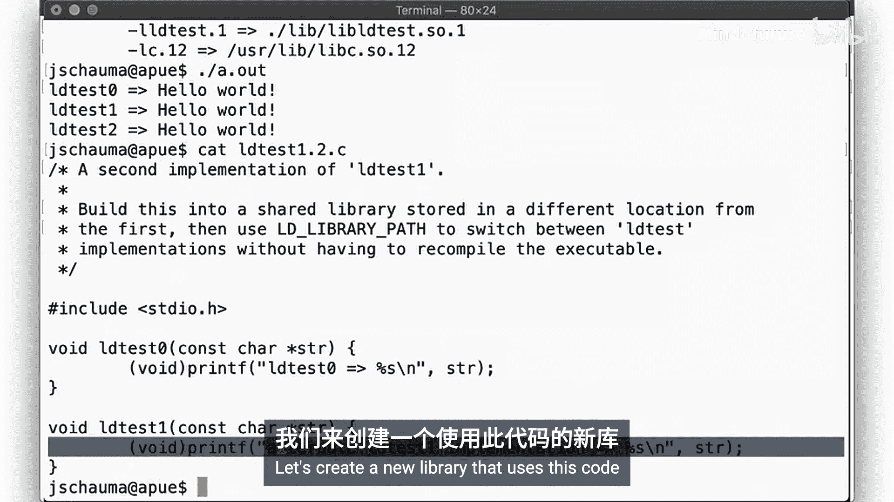

我们没有在执行时指定任何查找位置，所以它在 `/usr/lib` 中找不到并失败了。让我们设置 `LD_LIBRARY_PATH` 环境变量，因为它在位置列表中似乎具有优先权。`ld-linux.so` 会查看它。

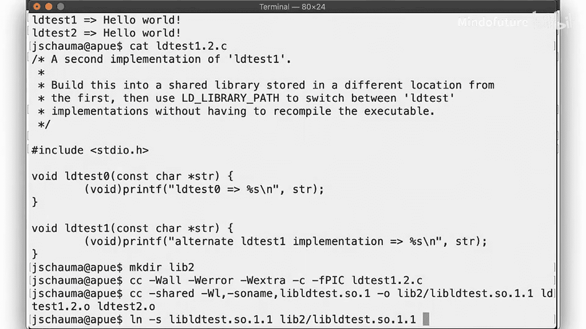

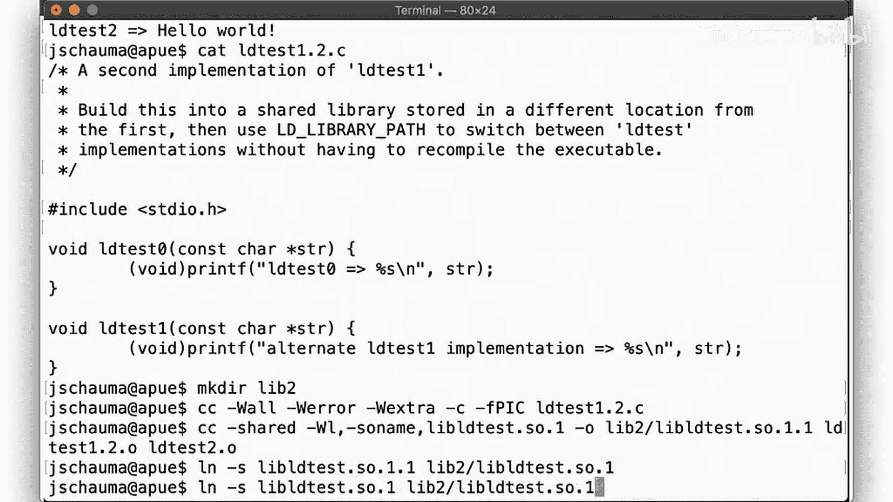

你知道吗？`ldd` 现在找到了库，执行时的链接编辑器也找到了，程序可以运行了。

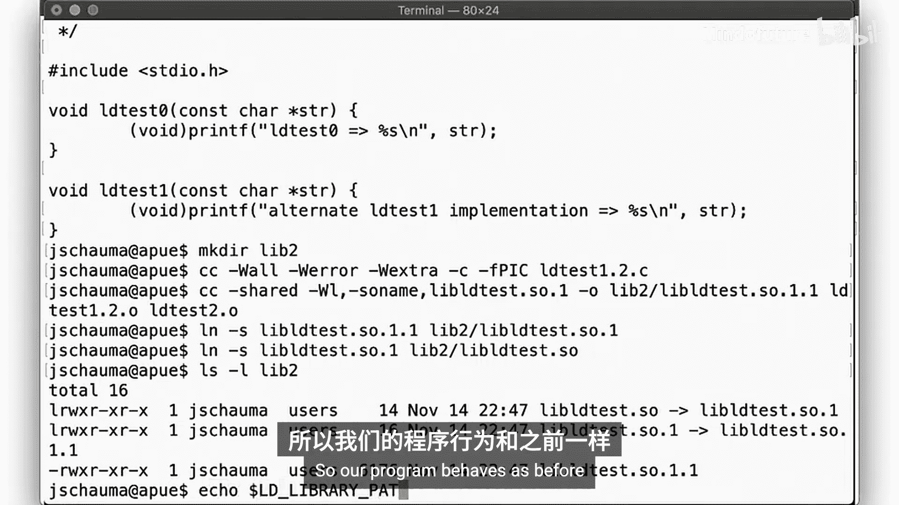

这很好。我们现在可以指定要使用的共享库的查找目录。但这也就意味着，如果我们在其他地方有一个共享库，我们可以让程序使用那个库。如果那个共享库的行为不同，那么我们的程序行为也会不同。

让我们在这里说明这一点。这是 `ldtest` 函数的另一个实现。让我们创建一个使用此代码的新库。我们像以前一样编译文件并创建相同的符号链接集。但这次，我们假装这是库版本的一个次版本增量。

我们的 `LD_LIBRARY_PATH` 仍然指向 `./slib/lib`，所以我们的程序行为如常。但是，如果我们将 `LD_LIBRARY_PATH` 环境变量更改为指向新目录 `./lib2`，我们的程序在执行时会立即采用新的行为。

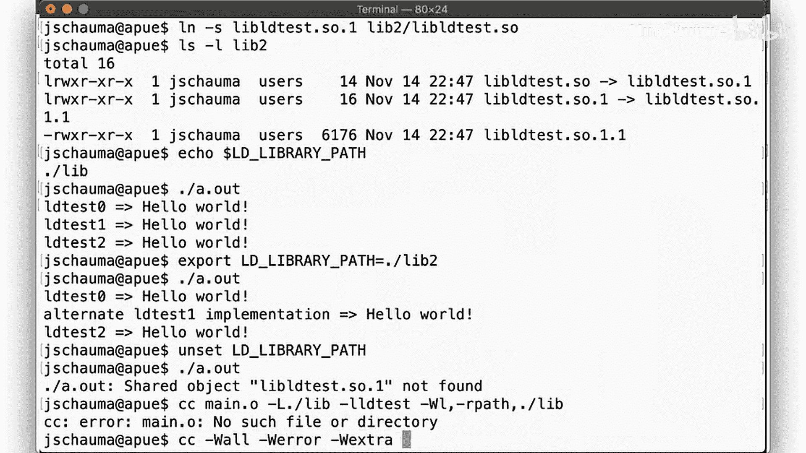

这里真正值得注意的是，我们**无需重新编译可执行文件就改变了它的行为**，仅仅通过将 `LD_LIBRARY_PATH` 变量指向不同的目录。

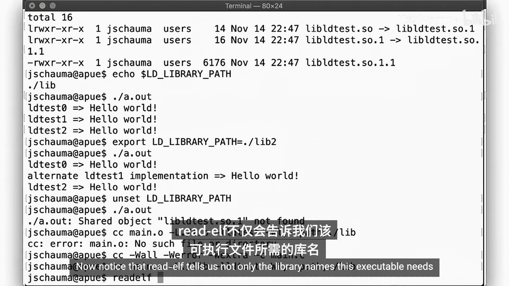

但这似乎意味着我们确实需要设置这个变量，这有点烦人和麻烦。难道没有办法在不设置环境变量的情况下执行二进制文件吗，即使库不在默认库路径中？幸运的是，有办法。

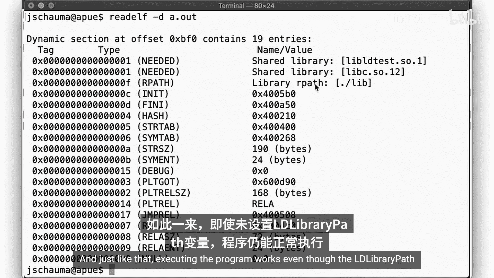

我们可以向链接器传递一个特殊标志 `-rpath`，指示它在特定位置查找库。现在请注意，`readelf` 不仅告诉我们可执行文件需要的库名，还告诉我们要查找库的路径（`rpath`）。就这样，即使 `LD_LIBRARY_PATH` 变量没有设置，执行程序也能工作。

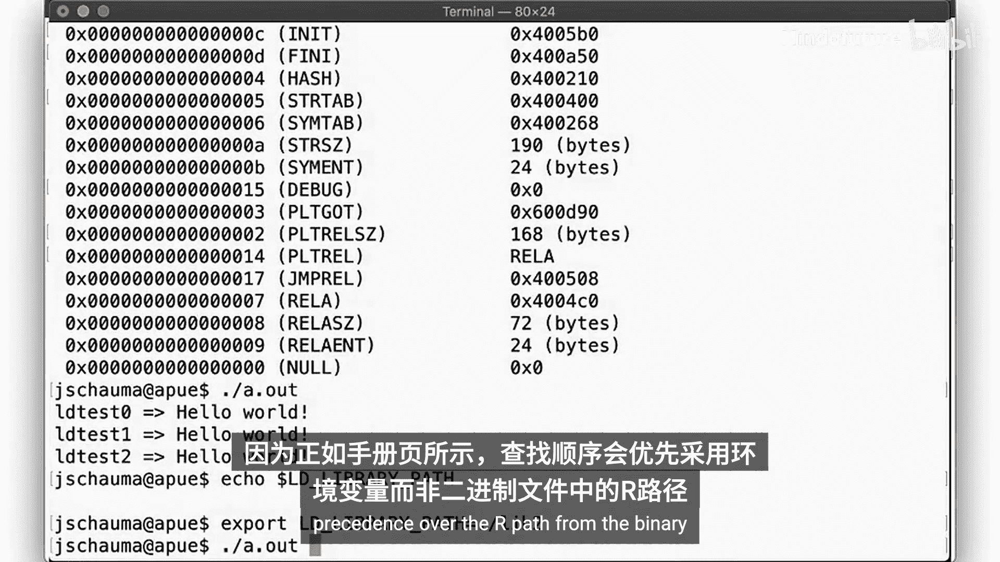

然而，即使在可执行文件中指定了 `rpath`，我们仍然可以设置 `LD_LIBRARY_PATH` 变量并触发可执行文件的不同行为，因为查找顺序（正如我们在手册页中看到的）赋予环境变量优先于二进制文件中的 `rpath`。

但这实际上可能带来一些相当严重的后果。假设我创建一个库，实现一些标准C库函数，例如 `printf`。这里的 `evil.c` 正是这样做的。如果我们能构建这样一个库，然后设置 `LD_LIBRARY_PATH` 变量导致我的库被加载，那会使用我的 `printf` 函数而不是标准C库函数吗？让我们试试看。

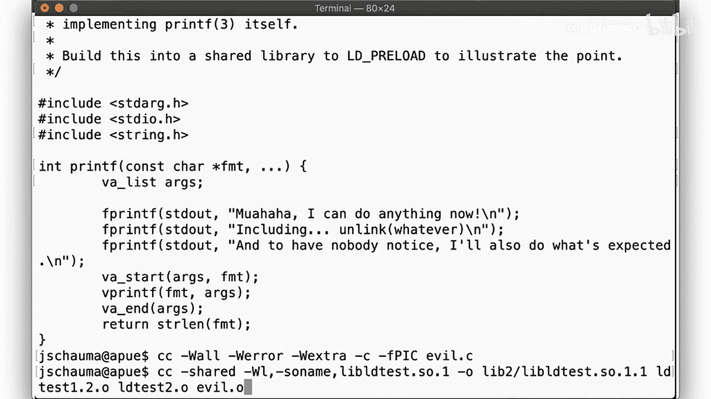

这里，我们的 `ldtest` 库现在包含了我们的 `evil` 目标文件。是的，看起来当我们运行 `a.out` 时，它确实调用了我们邪恶版本的 `printf`。

现在考虑这意味着什么。如果你有一个 `setuid root` 可执行文件，并且你可以用它来调用你控制下的库函数，你将立即获得完整的 root 访问权限。

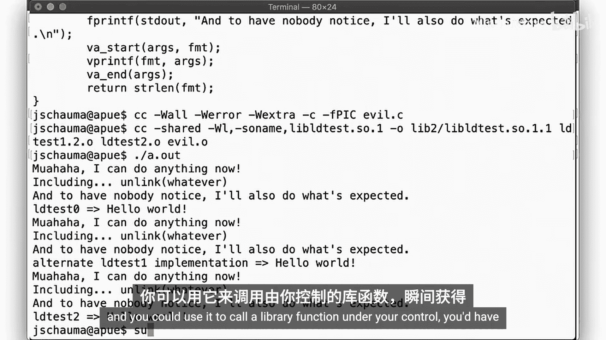

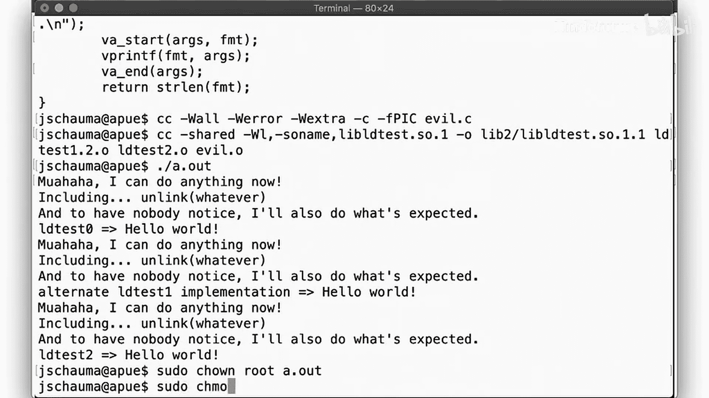

让我们试试看。`a.out` 现在是 `setuid root`。但当我们运行它时，它没有调用我们邪恶的 `printf`，即使我们的 `LD_LIBRARY_PATH` 变量已设置。但如果它不是 `setuid`，那么它就会调用。

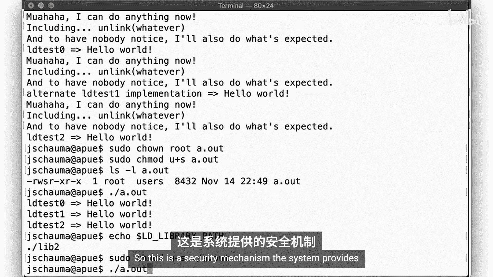

所以这是系统提供的一种安全机制：**只有当程序不是 `setuid` 时，`LD_LIBRARY_PATH` 变量才会被遵守**。这是有道理的：如果程序不是 `setuid`，那么它已经以你的所有权限运行，你可以诱骗它做任何你已经可以做的事情。但如果你有一个与真实 UID 不同的 EUID，那么我们需要更加小心，`ld-linux.so` 将不会遵循我们的 `LD_LIBRARY_PATH`。

## 动态加载库 🧠

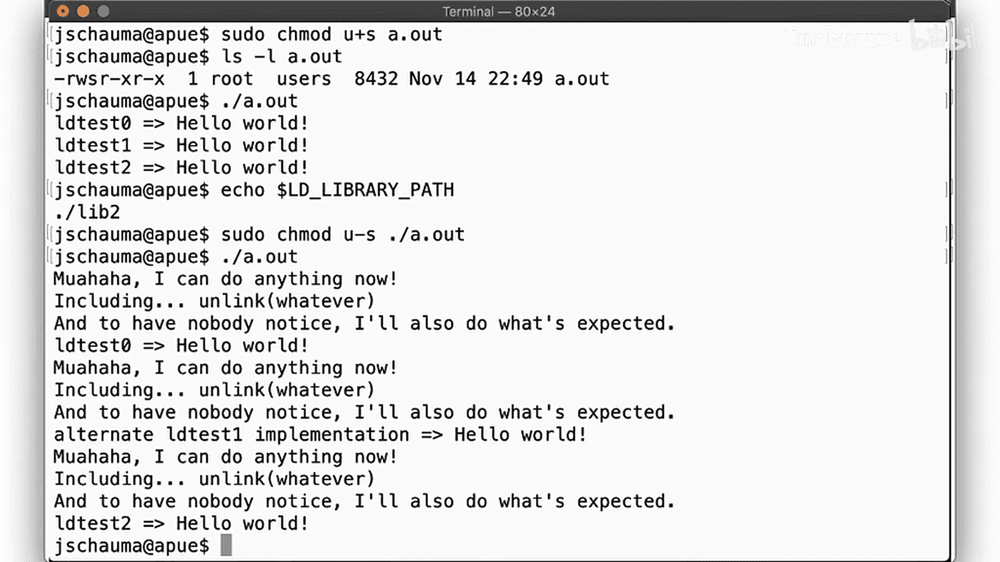

好了，与静态库相比，动态库要求目标文件是位置无关代码。我们使用编译器的 `-fPIC` 标志来使其生成这种位置无关代码。

动态库通常以 `.so`（共享对象）结尾，并且通常有许多符号链接，以促进应用程序二进制接口的向后兼容性。

动态库中的符号在链接时被查找，但直到执行时才被解析。这要求加载器知道在哪里找到库。正如我们所见，用户和系统管理员可以通过不同的设置来影响加载器的行为。

但我们之前提到，库不仅可以在执行时加载，还可以在程序执行期间的任何时刻按需加载。那是什么样子的呢？

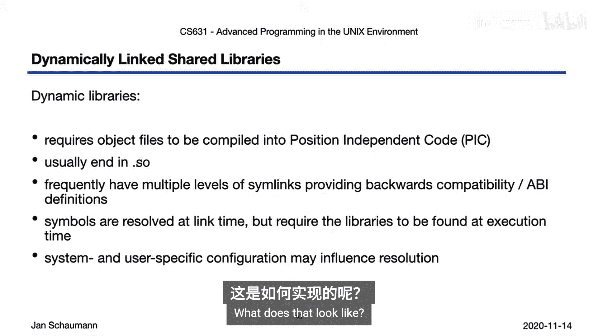

再次，如前几次所见，我们的 `crypt.c` 程序需要链接 `libcrypt`。这个信息随后被存储在可执行文件中。

但是，这种库在执行时的加载是如何完成的呢？让我们看看 `dlopen` 函数的手册页，它自动包含在每个动态链接的程序中。这个函数允许加载位置无关的共享对象。

让我们看看 `dlopenex.c` 程序，它将说明使用 `dlopen` 调用来从给定的动态库加载符号并调用函数，而无需链接它。

在 `print_crypt` 中，我们现在声明一个变量 `_crypt` 作为函数指针，匹配我们知道真正的 `crypt` 函数所符合的原型。我们调用 `dlopen`，要求它加载 `libcrypt.so`，然后尝试解析该库中 `crypt` 函数的符号，并将其分配给我们的函数指针。如果成功，那么我们现在可以通过我们自己的 `_crypt` 名称调用来自 `libcrypt` 库的系统 `crypt` 函数。

让我们编译它。注意，我们没有像以前那样链接 `-lcrypt`。`ldd` 确认我们的程序只需要 `libc`，不需要其他东西。但运行它，仍然有效。

查看我们的符号表，我们也看不到任何对 `crypt` 函数的引用。然而，我们仍然能够调用该函数。这表明，我们可以在程序执行期间按需加载动态库，而无需链接它。

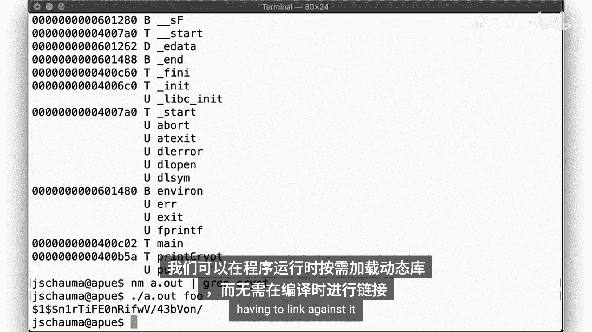

## 总结

好了，这把我们带到了本视频的结尾。我们涵盖了很多内容，并学习了相当多关于共享库的知识。

我们已经看到，静态库实际上只不过是目标文件的归档，代码在链接时被放入可执行文件。另一方面，动态库向加载器提供提示，说明应该加载哪些库来执行未解析符号的查找。

正如我们所看到的，`LD_LIBRARY_PATH` 环境变量或编译器的 `-rpath` 标志可以在运行时改变可执行文件的行为。

在本节课中，我们一起学习了：
1.  共享库的基本概念及其与静态库的区别。
2.  如何创建和使用静态库（`.a` 文件）。
3.  如何创建和使用动态共享库（`.so` 文件），包括编译位置无关代码（`-fPIC`）。
4.  链接器和加载器在解析符号时的协同工作方式。
5.  影响库查找路径的机制：`LD_LIBRARY_PATH` 环境变量和可执行文件中的 `rpath`。
6.  与 `setuid` 程序相关的安全考虑。
7.  如何使用 `dlopen` 系列函数在运行时动态加载库。

在结束之前，请考虑花一些时间查看可用的环境变量，并确保理解它们的用例，无论是有效的还是那些滥用该功能用于恶意目的的。在 Linux 系统（或使用 `glibc` 的系统）或 FreeBSD 系统上，如果库已编译了调试支持，你可以设置一个额外的环境变量 `LD_DEBUG` 并产生不同的结果。尝试一下，看看你能从动态链接程序的执行中引出什么有趣的信息。

关于这里涉及的二进制格式，还有更多需要学习。不同的工具允许你查看不同的部分。确保比较我们在本系列中使用的不同工具，包括 `readelf`、`objdump` 和 `nm`。课程网站上还列出了另一个练习，帮助你练习自己编写共享库。试一试吧。

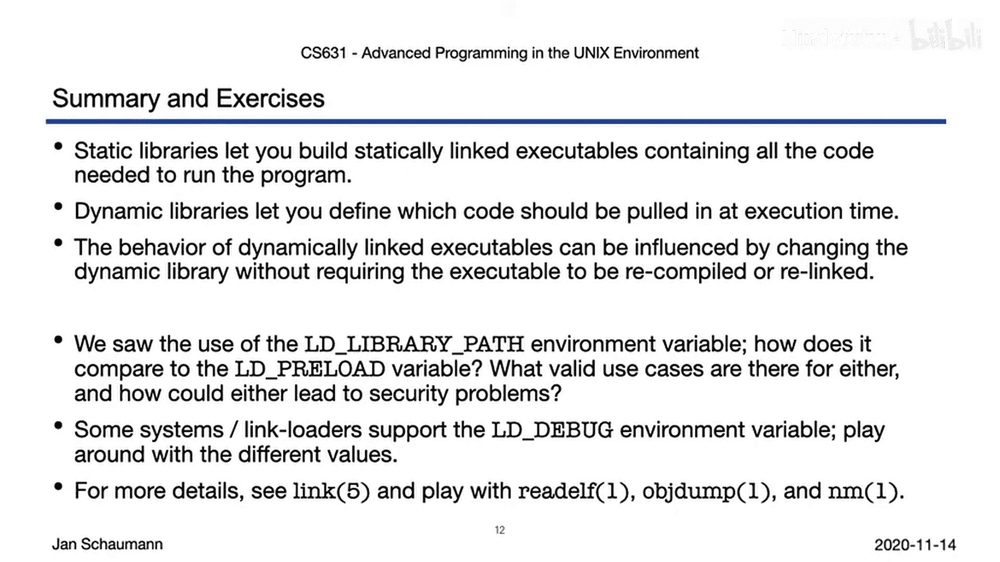

在这之后，我们将继续讨论一些关于高级 I/O 的混合主题。在那之前，感谢观看。