# 062：第1节 - syslog(3) 🗂️

在本节课中，我们将学习UNIX环境下的系统日志服务 `syslog`。我们将了解为什么需要集中式的日志记录机制，以及如何使用相关的库函数和工具来记录和管理系统消息。


---

## 为什么需要syslog？🤔

在之前关于守护进程的视频中，我们提到没有控制终端的进程需要一种方式向系统管理员或用户报告事件，`syslog` 正是为此目的而设计。

那么，为什么需要一个专门的守护进程来为我们记录日志呢？让进程在启动时以追加模式打开一个日志文件，需要时写入数据，退出时关闭，这样不是更简单吗？

问题在于，一个守护进程可能希望将不同的消息发送到不同的地方。或者，管理员可能希望调试信息写入一个文件，而关于关键事件的重要消息写入另一个文件。

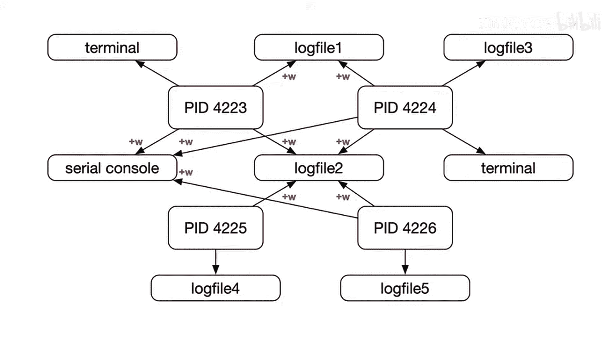

这可以通过让进程打开两个文件来解决。但有时，如果进程有控制终端，它可能还想写入终端。某些极其重要的事件甚至可能需要写入串行控制台。这些虽然都能实现，但这是一个非常普遍的模式，系统上的所有守护进程都有类似的需求。

不仅每个进程都想写入自己的文件，有时管理员还希望将所有守护进程的错误或警告收集到同一个文件中。这就产生了多个进程对共享资源的协调访问问题。进程与文件之间的映射关系变得更加复杂。此外，每个进程都必须拥有对相关日志文件的写入权限。大多数守护进程以专用用户身份运行，因此需要精细的权限控制，或者让守护进程以更高权限运行来写入所有不同的文件和资源。正如你所见，这会很快变得混乱。

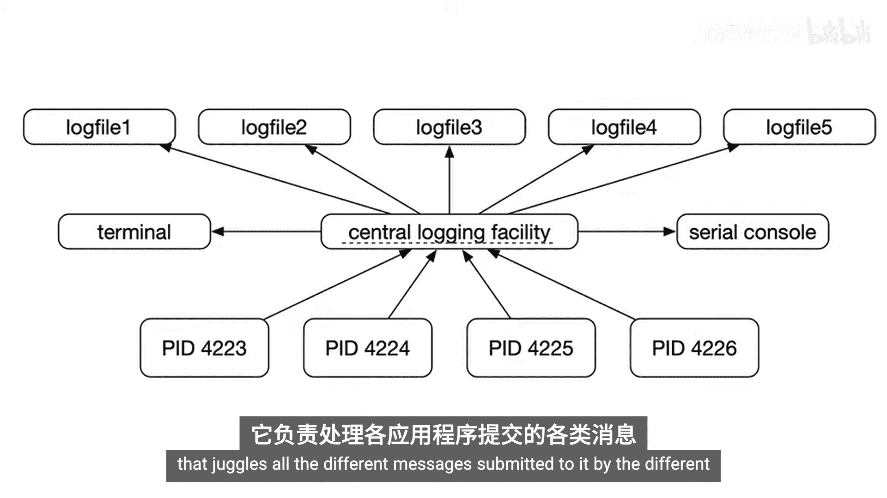

## 集中式日志记录的优势 🏛️

如果我们有一个集中的日志记录设施，就可以将所有处理文件等繁琐工作从进程中抽象出来。这遵循了“做好一件事”的UNIX哲学。守护进程只需进行几次库调用即可。

这个集中式设施本身仍然需要权限，但各个单独的进程不再需要，这也有利于我们以非常有限的权限运行它们。因此，我们可以将这个集中式日志记录设施本身视为一个守护进程，它负责处理不同应用程序提交的各种消息。

## syslogd 守护进程 📥

`syslogd` 就是一个这样的守护进程。消息传入后，会被迅速归档到正确的文件中。

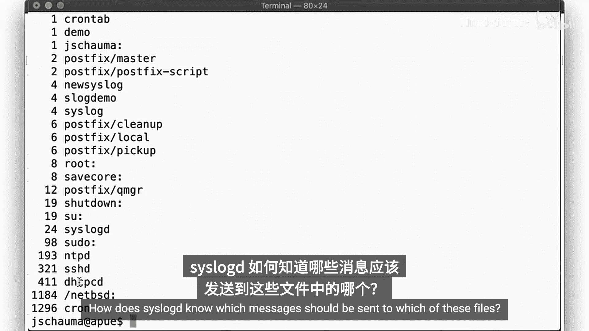

在 `/var/log` 目录下，我们可以看到一些定期且频繁更新的文件。文件名具有自解释性，例如 `maillog`、`auth.log`、`cron.log` 和 `messages`。根据消息是否可能包含敏感信息，不同文件具有不同的权限。

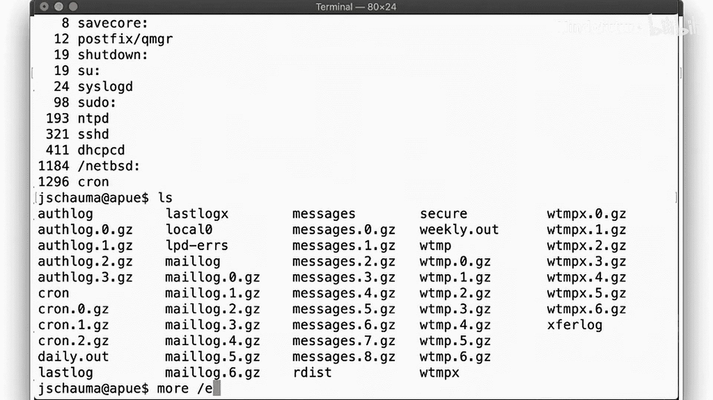

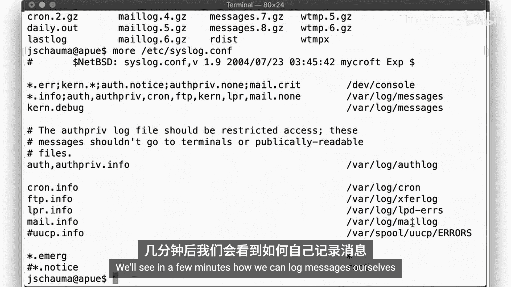

让我们查看 `/var/log/messages` 中的条目。可以看到来自 `sshd` 和 `sudo` 的许多消息。常规消息不敏感，因此普通用户可以查看。我们注意到整个文件的格式是一致的，其中一个字段记录了是哪个进程记录的消息。

## 配置映射：/etc/syslog.conf ⚙️

`syslogd` 如何知道哪些消息应该发送到哪些文件呢？答案在配置文件 `/etc/syslog.conf` 中。该文件展示了特定类型和优先级的消息到日志文件的简单映射。稍后我们将看到如何自己记录消息。

## 消息传递机制 🌐

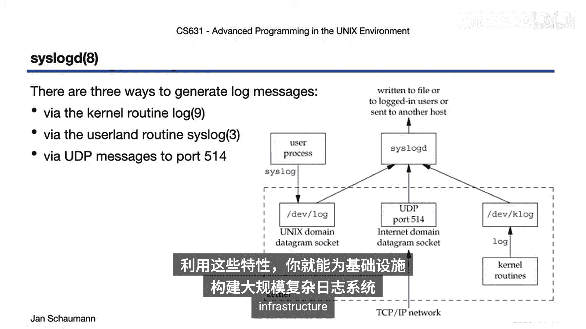

有多种方式可以将消息传递到这个集中式日志设施：
1.  **内核**：可以通过 `klog` 函数提交消息，使其自身无需实现实际的日志记录逻辑。
2.  **进程**：系统上的任何进程都可以调用 `syslog` 库函数。
3.  **网络**：`syslogd` 还可以接受来自网络的消息，通常是UDP 514端口。这对于拥有成百上千台主机的大型环境非常有用，管理员可以在一个中心位置收集和分析所有日志。

因此，`syslog` 的整体架构大致如下：每种消息接收机制都允许 `syslogd` 以统一的方式处理它们，然后根据其配置进行分发，写入文件、发送给用户，或者转发给另一台主机。利用这些，你可以为你的基础设施构建大规模、复杂的消息记录系统。

## 编程接口：openlog 和 syslog 👨‍💻

作为程序员，我们主要使用两个调用来与 `syslog` 交互：`openlog` 和 `syslog`。

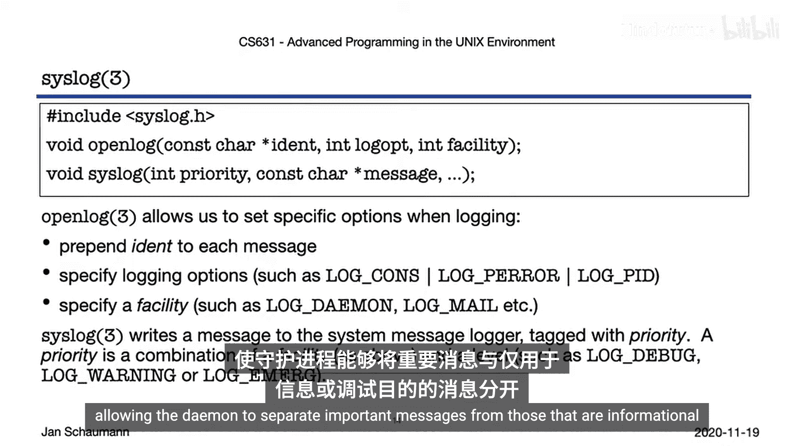

*   **`openlog`**：用于影响后续 `syslog` 调用的行为。为了将你的消息与其他进程记录的消息区分开，你可以为每条消息指定一个前缀字符串（通常使用程序名）。你还可以指定一些日志选项，例如将消息记录到控制台，或在记录到文件的同时也记录进程ID等。最后，你需要指定所谓的 **facility**（设施），`syslog` 用它来决定将你的消息路由到哪里。
*   **`syslog`**：每当你想记录一条消息时调用此函数。它将带有给定 **priority**（优先级）标签的消息发送给 `syslogd` 守护进程，允许守护进程将重要消息与仅用于信息提示或调试的消息分开。

以下是使用这些库函数的一个示例：

```c
#include <syslog.h>
#include <signal.h>
#include <stdlib.h>

void signal_handler(int sig) {
    if (sig == SIGQUIT)
        syslog(LOG_NOTICE, "Received SIGQUIT signal.");
    else if (sig == SIGUSR1)
        syslog(LOG_INFO, "Received SIGUSR1 signal.");
    // ... 其他信号处理
}

int main() {
    // 打开日志连接
    openlog("my_program", LOG_PID | LOG_CONS, LOG_USER);

    // 安装信号处理器
    signal(SIGQUIT, signal_handler);
    signal(SIGUSR1, signal_handler);

    // ... 程序主循环

    closelog(); // 正常退出时关闭日志
    return 0;
}
```

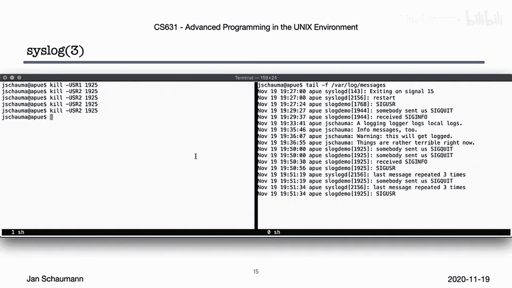

在这个例子中，`openlog` 指定了前缀为 “my_program”，要求将消息打印到终端并包含进程ID，并选择 `LOG_USER` 设施来标识我们的进程。信号处理器根据接收到的不同信号，使用不同的优先级调用 `syslog` 记录消息。

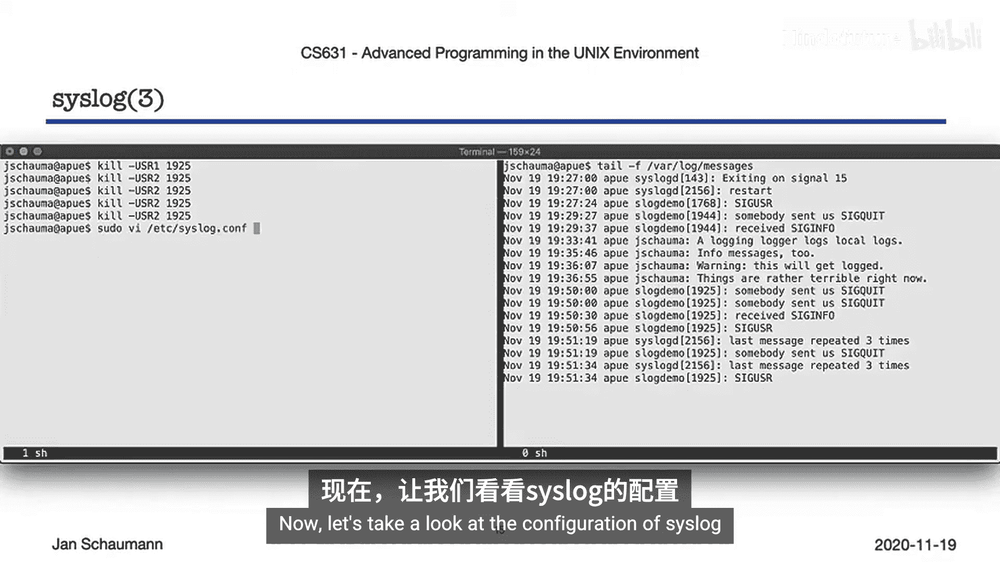

## 实践与配置 🛠️

运行上述程序并发送信号（如 `SIGQUIT`），消息不仅会打印到终端，也会出现在 `/var/log/messages` 中。`syslogd` 足够智能，能够检测重复消息并合并报告。

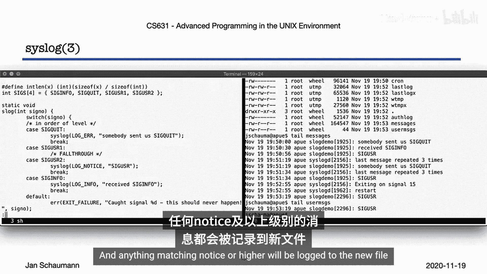

我们可以通过修改 `/etc/syslog.conf` 来将特定设施和优先级的消息分离到不同的文件。例如，添加以下行可以将 `user` 设施中 `notice` 及以上优先级的消息记录到 `/var/log/user_messages`：
```
user.notice /var/log/user_messages
```
创建文件并重启 `syslogd` 后，相关消息就会同时记录到新文件和默认文件中。

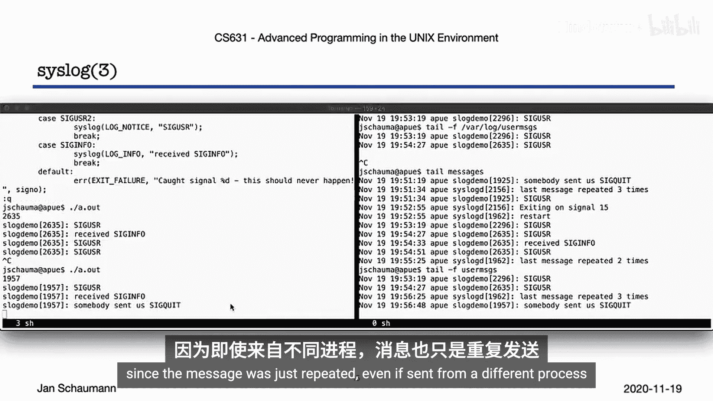

## 命令行工具：logger 💻

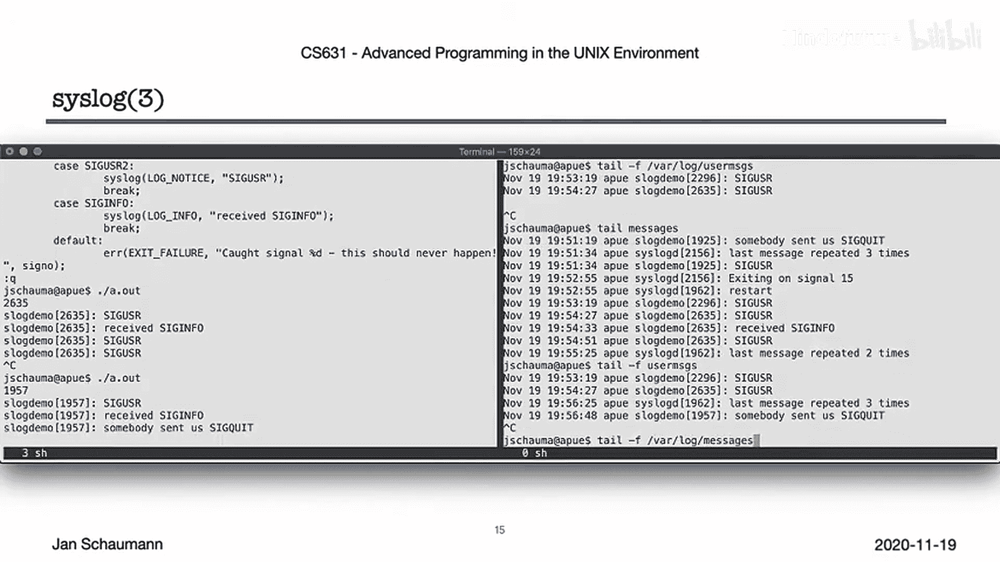

除了库函数，我们还可以通过命令行工具 `logger` 来使用这个集中式日志设施。它提供了对这些库函数的简单接口。

例如：
*   `logger -p local0.info "This is an info message from local0."`
*   `logger -p user.emerg "System is down!"`

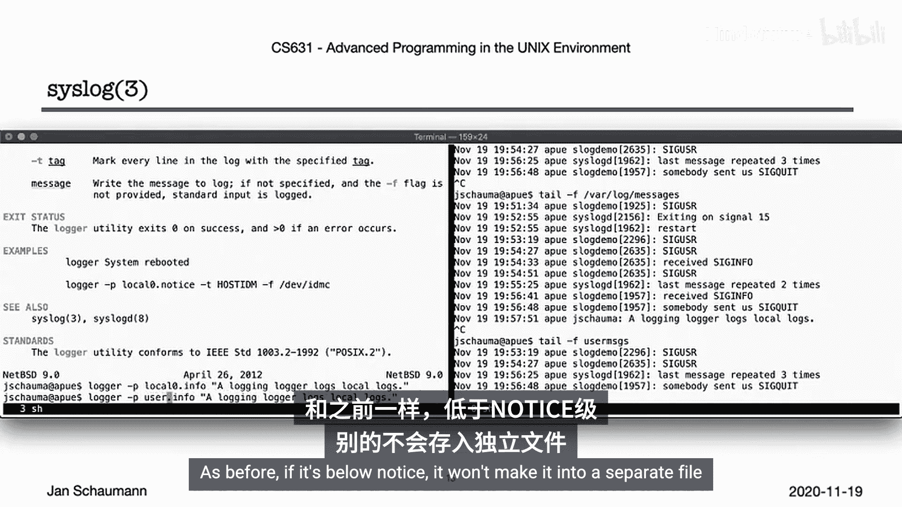

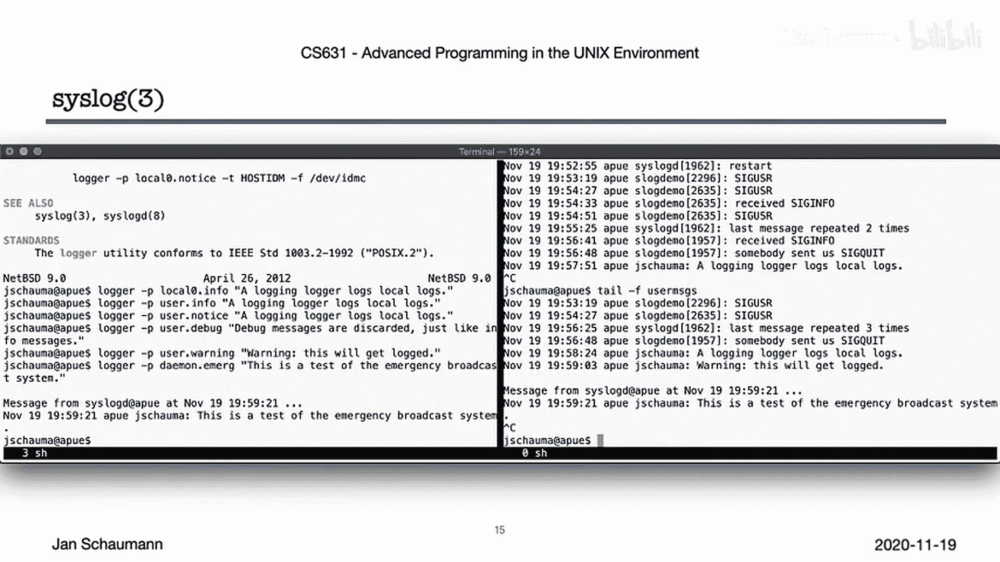

紧急消息（`emerg` 级别）会被发送给所有已登录用户的终端。

## 总结 📝

`syslog` 已经存在很长时间，自80年代以来一直是UNIX系统上系统日志记录的事实标准。它已被标准化在 RFC 5424 中，该标准定义了网络数据包格式。默认情况下，它使用 UDP 514 端口进行网络通信，不过现在也可能看到通过 TCP 或 TLS 传输的 `syslog` 流量。

一些新版本的 `syslog`，如 `syslog-ng` 或 `rsyslog`，增加了更多增强功能。然而，在许多大型组织中，如今流行使用不同的消息中继服务，例如 Elasticsearch 或 Splunk。但值得注意的是，仍有大量设备（尤其是网络设备）只能使用标准的 RFC 5424 格式和 UDP 514 端口来报告消息。

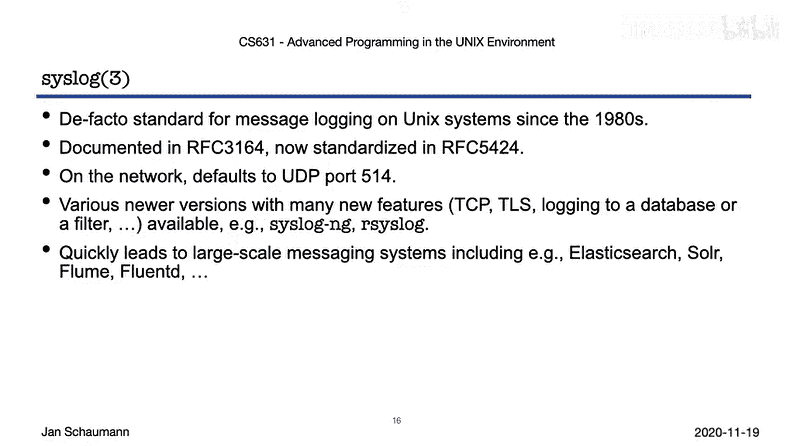

无论如何，`syslog` 是一个非常方便的服务，体现了 UNIX 哲学的许多特性，并且正如我们在代码示例中看到的，它相当易于使用。