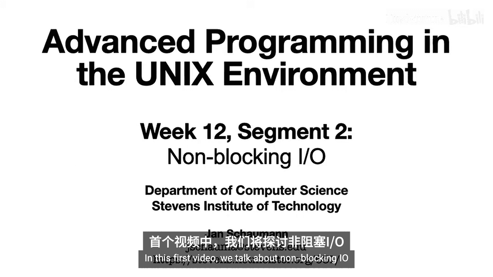
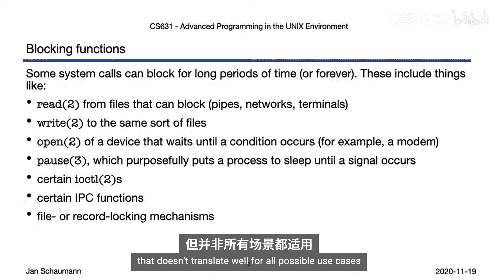
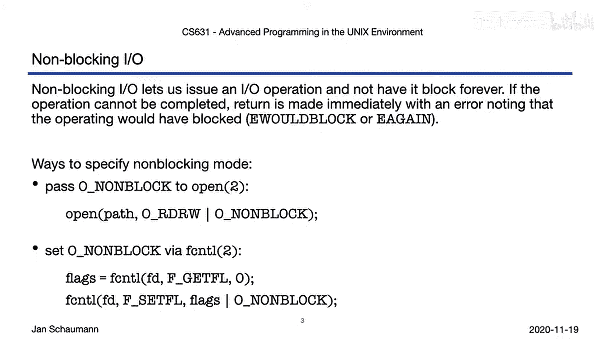
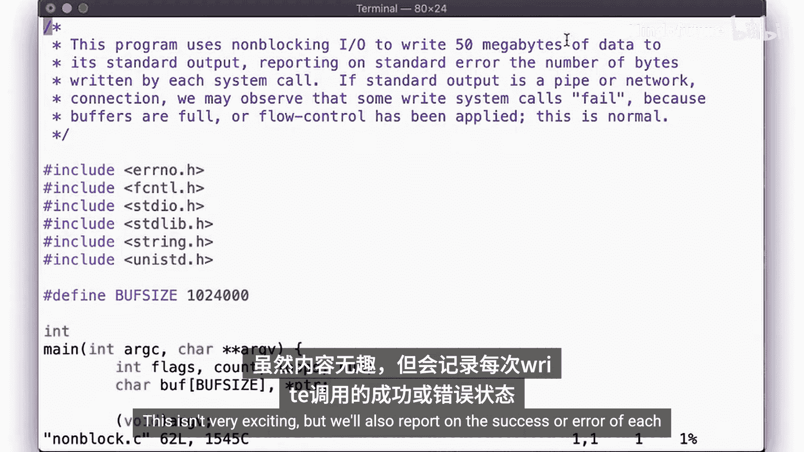
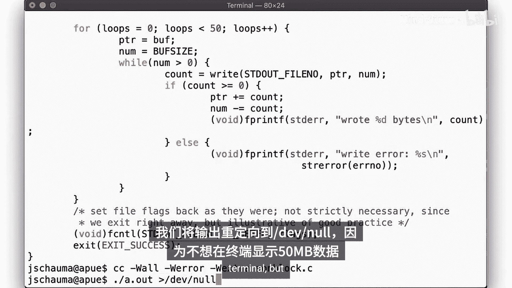
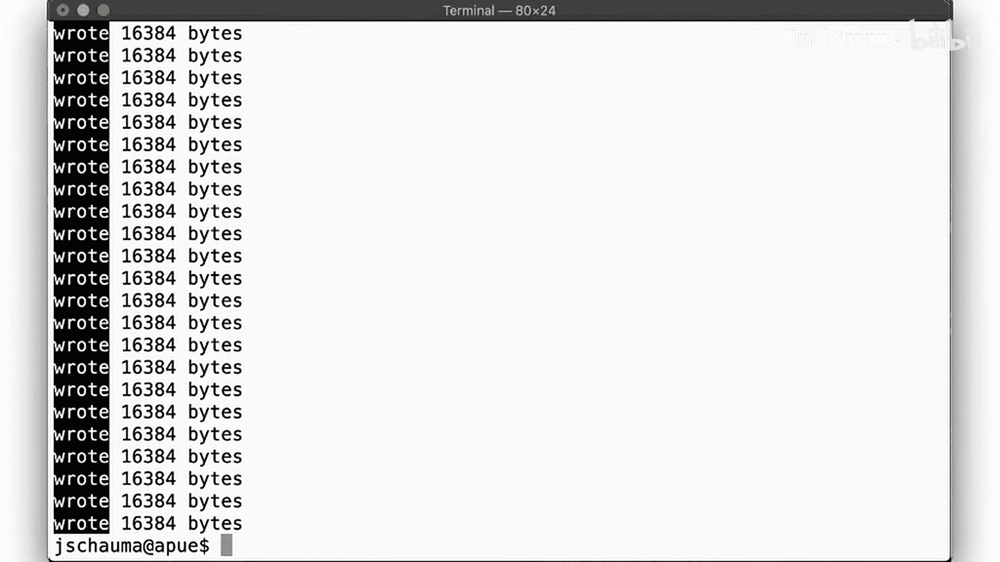
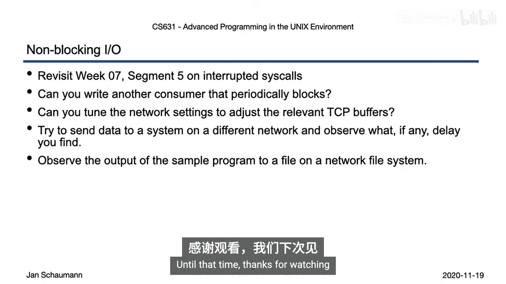

# 063：非阻塞I/O 🚫⏳



在本节课中，我们将学习非阻塞I/O的概念、应用场景以及如何启用它。我们将通过具体的例子来理解阻塞与非阻塞操作的区别。

## 概述

在之前的课程中，我们讨论过可能被中断的系统调用，以及使用`select`进行I/O多路复用。然而，这些方法并不能解决所有场景下不希望进程被阻塞的问题。本节将介绍非阻塞I/O模式，它允许系统调用在无法立即完成操作时立即返回，而不是让进程无限期等待。



## 阻塞I/O的挑战

在第七周第五小节，我们讨论了被中断的系统调用。我们知道，如果一个系统调用长时间未能完成，它更有可能被中断。特别是那些执行I/O操作、可能长时间甚至永久阻塞的系统调用。我们注意到，对于这些调用，中断可能导致返回`EINTR`错误，或者系统调用可能被自动重启。但这两种方式都没有解决最初的问题：有时你确实不希望被阻塞，你希望执行操作，并且如果它能完成，你希望知道这一点。

当我们讨论使用`select`进行多路复用时，也暗示了处理多个可能阻塞在I/O上的文件描述符的方法，但这并非适用于所有用例。

## 启用非阻塞模式



为了避免成为阻塞I/O的受害者，我们希望进入非阻塞I/O模式。通过使用非阻塞模式，如果操作无法立即完成，我们的系统调用将立即返回，并将`errno`设置为`EAGAIN`或`EWOULDBLOCK`。这两个值本质相同，源于标准化前早期UNIX版本的差异。它们大体上代表相同的错误条件：`EAGAIN`基本表示你应该重试此操作，而`EWOULDBLOCK`更字面地表示此操作将会阻塞。在大多数UNIX系统上，两者是等效的。

那么，如何启用非阻塞模式呢？早在第二周，我们已经遇到了最直接的方法：在打开文件时，向`open`系统调用传递`O_NONBLOCK`标志。但我们也记得，我们并不总是有机会打开文件，有时可能是在操作一个已经为我们打开的文件描述符。



在这种情况下，我们可以使用`fcntl`来设置相同的标志。

以下是如何使用`fcntl`设置非阻塞标志的示例代码：



```c
int flags = fcntl(fd, F_GETFL, 0);
fcntl(fd, F_SETFL, flags | O_NONBLOCK);
```

## 非阻塞I/O示例

让我们通过一个例子来看看设置这个标志的效果。在这个程序中，我们向标准输出写入50兆字节的数据。根据调用方式，我们会启用或禁用非阻塞模式，并报告每次`write`调用的成功或错误。

由于我们操作的是标准输出，必须使用`fcntl`来设置非阻塞模式。之后，我们循环50次，每次尝试写入1兆字节数据。我们知道，`write`可能返回比请求更少的字节数，也可能失败。我们会在标准错误中记录这些情况。

在常规（阻塞）模式下，程序会顺利运行，每次迭代写入1兆字节数据。然而，当写入目标（如管道或网络套接字）的缓冲区已满时，情况就不同了。

例如，当向一个管道写入数据，且管道的读取端没有及时消费数据时，在阻塞模式下，`write`调用会一直等待，直到有空间写入。而在非阻塞模式下，`write`会立即返回`EAGAIN`或`EWOULDBLOCK`错误，程序可以继续执行其他任务，稍后重试。

网络I/O是另一个常见场景。当通过TCP套接字发送数据时，TCP的发送缓冲区可能已满（例如，由于网络拥塞或接收方处理缓慢）。在阻塞模式下，发送数据的进程会被挂起。在非阻塞模式下，`send`或`write`调用会立即返回错误，允许程序处理其他连接或执行逻辑。

## 实践与探索

为了更好地理解非阻塞模式，建议你运行我们展示的示例代码。同时，回顾我们引用的早期课程内容。



尝试找出其他可能引入延迟或阻塞I/O的方式。也许可以尝试更改系统设置来调整TCP缓冲区大小，观察这在非阻塞模式下如何导致不同的吞吐量。

你还可以尝试通过网络向另一台主机发送数据，而不仅仅是在本地系统内。或者尝试在使用网络文件系统的系统上执行I/O操作。在这些情况下，你也应该能看到一些阻塞调用。

## 总结



本节课我们一起学习了非阻塞I/O。我们了解到，通过设置`O_NONBLOCK`标志（在打开文件时或通过`fcntl`），可以将文件描述符置于非阻塞模式。在此模式下，如果I/O操作（如`read`、`write`）无法立即完成，系统调用会立即返回一个错误（`EAGAIN`或`EWOULDBLOCK`），而不是阻塞进程。这为构建高性能、响应式的应用程序（如服务器）提供了基础，使其能够在等待某个I/O操作时处理其他任务。下一节视频，我们将学习记录锁。