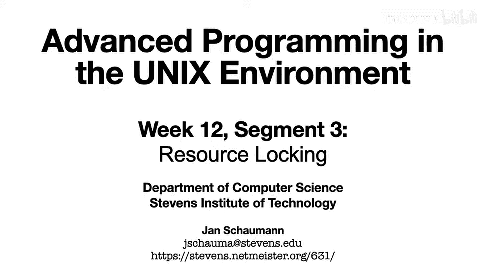
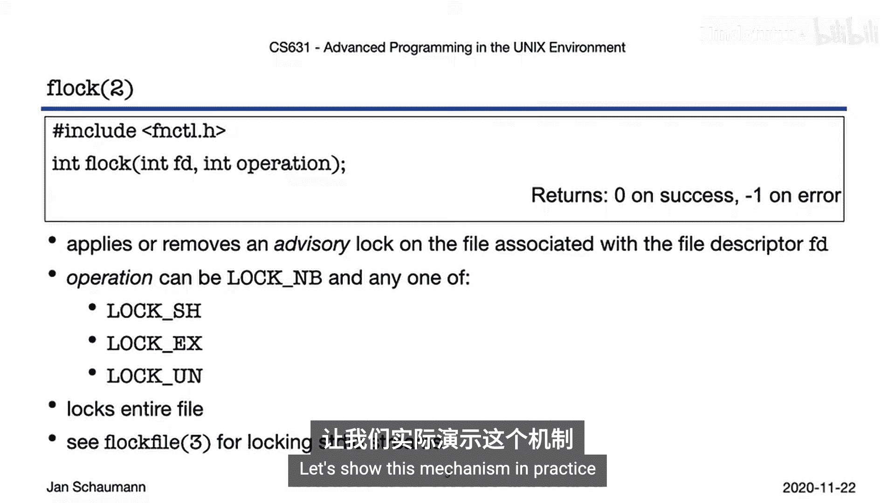
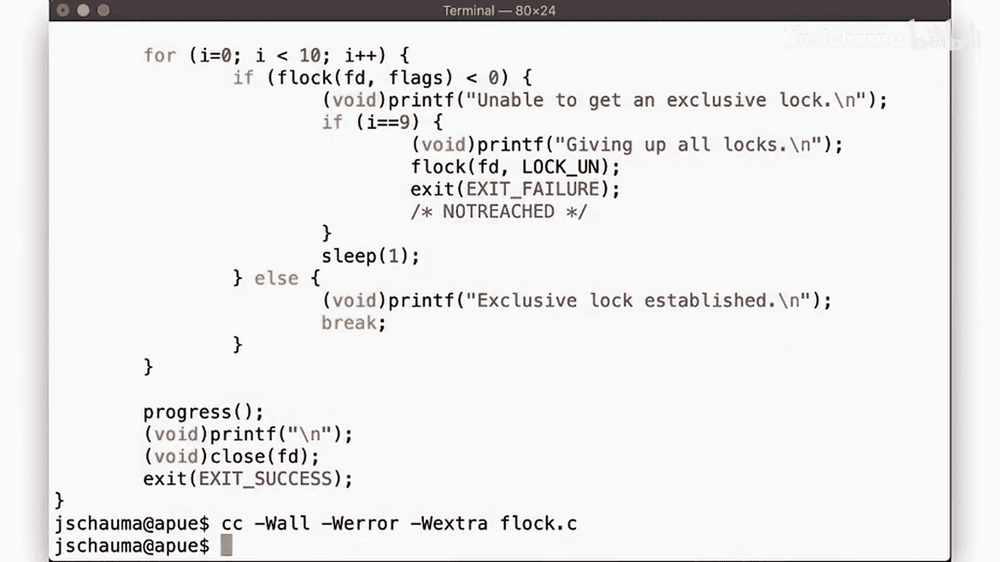
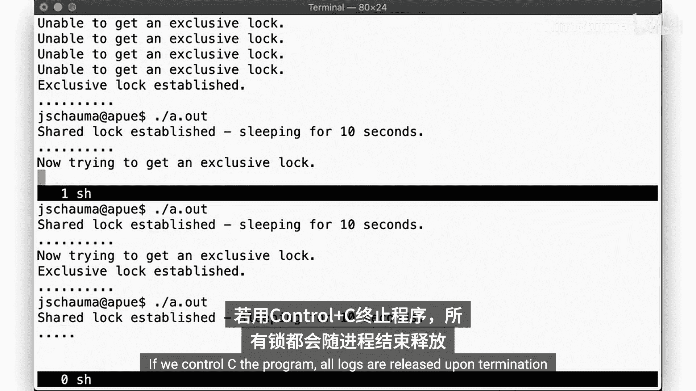
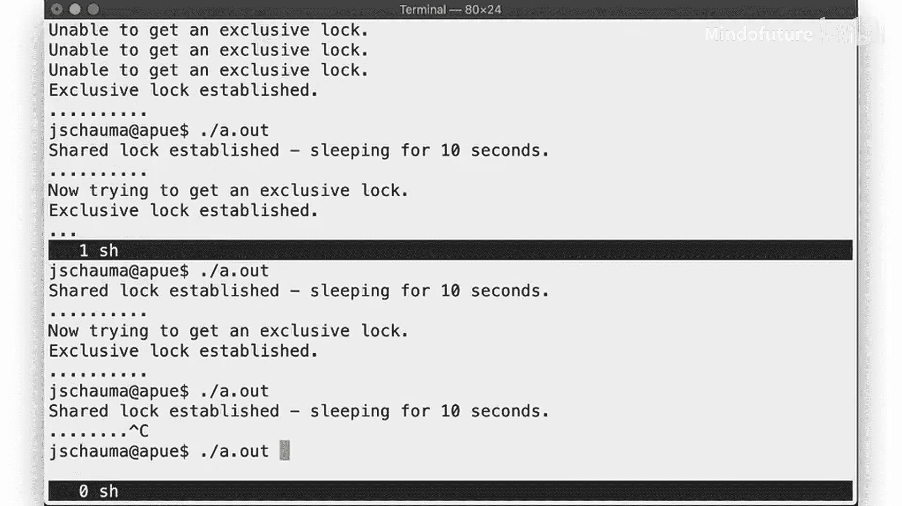
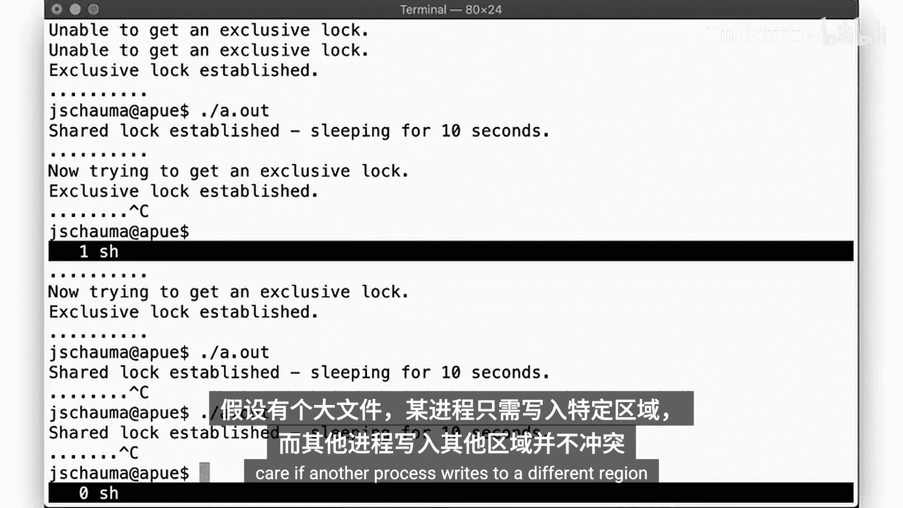
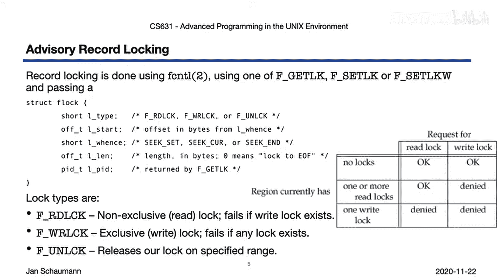
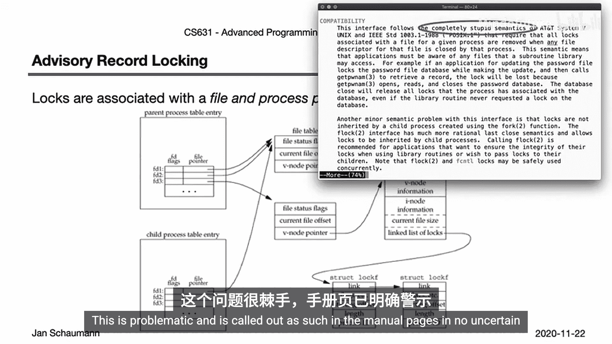
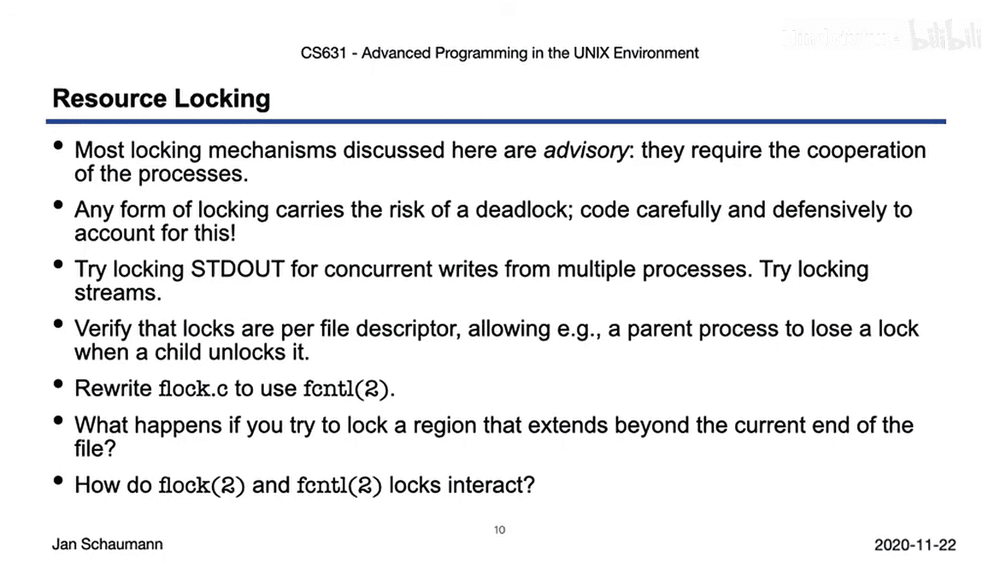

# 064：资源与记录锁定 🔒

## 概述
在本节课中，我们将学习如何在UNIX环境中使用资源与记录锁定。我们将探讨如何确保多个进程能够安全地访问共享资源，避免竞态条件。我们将重点介绍文件描述符的锁定机制，包括`flock`系统调用和`fcntl`记录锁定，并讨论它们的特性、限制以及在实际编程中需要注意的问题。

---

## 从独占访问到文件锁定

上一节我们介绍了非阻塞I/O，本节中我们来看看资源与记录锁定。我们的目标是找到方法，确保多个进程可以安全地访问共享资源，而不会遇到竞态条件。

我们将再次聚焦于文件相关的语义，更具体地说，是管理文件描述符。

首先，我们识别一些可以保证对资源独占访问的方法。需要明确并记住，我们讨论的是防止具有相同有效用户ID的进程同时访问，这意味着访问控制和权限在此不适用。

假设你有一个文件，并希望确保当前进程对其拥有独占访问权。你可以怎么做？

以下是几种可能的方法：
*   **创建并立即取消链接文件**：创建一个新文件（使用`O_EXCL`标志确保独占创建），然后立即`unlink`它。只要文件描述符保持打开，文件数据块就不会被释放。其他进程无法打开这个文件，因此我们获得了独占访问权。
*   **使用日志文件**：测试一个特定文件是否存在。如果存在，则表明其他进程正在访问我们感兴趣的资源，我们便放弃操作。
*   **使用信号量**：如第8周所示，在代码中保护临界区。

然而，这些方法都有一些缺点。例如，一个被取消链接的文件在文件系统中不存在；使用信号量或日志文件需要管理目标文件之外的额外资源，增加了复杂性。

因此，我们可以使用专门为文件描述符锁定设计的系统调用：`flock`。

---

## `flock` 系统调用

`flock`系统调用对与文件描述符`fd`关联的文件应用或移除一个**建议性锁**。这些锁允许协作进程对文件执行一致的操作，但请注意，它们并不能阻止不检查锁的进程访问文件。也就是说，锁定的保证类似于信号量，依赖于相关进程的协作。

你可以以阻塞或非阻塞的方式应用锁，其语义与我们之前视频中讨论的相同。我们区分两种类型的锁：
*   **共享锁**：多个进程可以同时持有共享锁。
*   **独占锁**：为了持有独占锁，不能存在任何其他锁（包括共享锁）。

可以将共享锁视为**读锁**，多个进程可以同时从给定文件读取而不会出现问题；将独占锁视为**写锁**，即使是一个读操作，也可能被另一个同时写入数据的进程破坏。

如果你有一个共享锁并尝试升级为独占锁，你的共享锁会暂时释放，然后另一个进程可能在你之前获得锁。

要解锁文件，你可以指定`LOCK_UN`。

由`flock`控制的锁应用于整个文件。我们稍后会看到另一种只锁定文件特定区域的方法。由于这些锁应用于文件描述符，我们也可以通过`flockfile`函数来锁定文件流。

---

## `flock` 实践演示

让我们通过代码`flock.c`来演示这个机制。我们有一个`progress`函数，它在等待时打印一些点。

在`main`函数中，我们打开一个文件，然后请求对结果文件描述符的共享锁。在建立共享锁后，我们等待10秒，让另一个进程尝试同样的操作，然后尝试将共享锁升级为独占锁。当使用非阻塞模式时，我们会在失败时打印消息，然后重试，但最终为了避免死锁而放弃。

运行这个程序，我们观察到：
1.  第一个进程以非阻塞模式启动，立即获得文件描述符的共享锁。
2.  在第二个shell中运行相同的程序（阻塞模式），也能获得共享锁，这证明两个进程可以同时持有共享锁。
3.  第一个进程尝试升级为独占锁，但由于第二个进程仍持有共享锁而失败（非阻塞模式，反复尝试并失败）。
4.  第二个进程尝试升级其共享锁为独占锁，但为此它必须释放共享锁。此时，第一个进程立即获得了独占锁。
5.  结果，第二个进程在升级锁时被阻塞。
6.  一旦第一个进程完成并释放独占锁，第二个进程便获得其独占锁。
7.  再次启动程序，它会阻塞在获取共享锁上，因为第二个进程仍持有独占锁。
8.  当第二个进程终止，所有锁被释放，新进程获得共享锁。

这个演示展示了如何对整个文件描述符标识的文件进行锁定。

---

## 记录锁定：`fcntl`

对整个文件加锁有时可能不够优化。考虑一个大型文件，一个进程想写入一个部分，但不关心另一个进程是否写入另一个不同的区域。

为此，我们引入了所谓的**记录锁定**，它使用`fcntl`来应用或移除类似的建议性锁。这些记录锁可以应用于文件的一个区域，通过指定一个`struct flock`结构体来实现，该结构体使用了我们从`lseek`调用讨论中熟悉的`offset`和`whence`语义。

与之前类似，锁类型可以是读锁、写锁，当然也可以是解锁。共享锁和独占锁的组合规则与之前相同。

此外，我们还有`lockf`库函数（不要与之前讨论的`flock`系统调用混淆）。`lockf`锁定从文件描述符当前偏移量开始、指定大小的文件区域。其选项不言自明，并且有明确的非阻塞测试选项。

---

## 锁的继承与释放

有了锁和文件描述符的概念，值得思考当我们`fork`另一个进程时，这些锁的行为如何。

首先，如果我们调用`fork`，锁**不会**被子进程继承。这似乎是合理且直观的，因为如果继承锁，我们就会有两个可能都持有独占锁的进程，这与独占锁的概念相矛盾。

当我们调用`exec`时，锁**保持**在原位。这看起来也合乎逻辑，但我们有一个选项可以防止这种情况：如果文件描述符设置了`close-on-exec`标志，那么在`exec`时它会被关闭，锁也就不会保留。

同样，当进程终止时，文件描述符上的所有锁都会被释放。这再次显得合理且可取，我们不希望一个文件在应用锁的进程终止后还保持锁定状态。

然而，有一个情况既不显而易见，实际上也不理想：锁与给定进程的**文件**关联，而不是与文件的特定**文件描述符**关联，并且如果文件的**任何**文件描述符被关闭，锁就会被释放。

记住这个图示，它提醒我们同一个文件可以被多个进程或在同一进程内同时打开。我们之前讨论异步信号安全函数时，已经看到过同一文件被多次访问导致问题的例子，例如调用密码文件函数（如`getpwnam`）时，它会打开密码数据库，执行查找，然后关闭数据库。如果你在密码数据库上获得了锁，然后调用`getpwnam`，那么在该调用返回后，你的锁就消失了。换句话说，你的进程需要知道你调用的任何库函数是否可能操作你持有锁的文件描述符所引用的任何文件。这是有问题的。

---

## 建议性锁与强制性锁

需要记住，我们讨论的所有锁定机制都是**建议性**的。也就是说，它们要求进程协作，并不能阻止不检查现有锁的另一个进程访问被锁定的资源。

那么，为什么不实现强制性记录锁呢？在某种程度上，一些UNIX版本通过重载组权限来实现强制性锁定。如果你将一个文件设置为`setgid`，但没有组执行权限，并且如果你的操作系统和文件系统支持强制性文件锁定，那么这会向内核发出信号，拒绝任何进程在另一个进程已锁定的文件上进行读取或写入。

然而，这种实现存在一些微妙的竞态条件，因此即使此功能可用，通常也建议不要依赖它。更重要的是，通常可以绕过强制性锁定，不是通过操作文件本身，而是通过操作与文件相关的目录条目。如果你锁定了文件A，你仍然可以创建一个全新的文件B，进行任何更改，然后取消链接文件A并将文件B移动到其位置。回想一下，删除文件是目录的操作，而不是文件本身的操作。因此，文件上的锁无法阻止它被从目录中删除或重命名。这样，严格来说，你违反了锁，但你获得锁的那个文件描述符从未被操作过，尽管最终结果是相同的。换句话说，强制性锁基本上不起作用，或者实现起来极其困难。

总之，不要依赖强制性锁。我们将在下周更仔细地研究如何限制进程相互干扰。

---

## 总结与练习

本节课中我们一起学习了UNIX环境中的资源与记录锁定。我们讨论的锁定机制大多是建议性的，需要进程协作。由于我们讨论的是协调协作进程，因此很容易在这里犯下可能导致死锁的错误。在编写处理锁的代码时，请确保考虑到这种可能性。

为了更好地理解文件和记录锁，请尝试以下练习：
*   我们看到了锁定引用文件的文件描述符的例子。如果你尝试锁定标准输出`stdout`会怎样？文件流呢？
*   编写一些代码来说明我们刚刚讨论的关于文件被关闭导致锁被释放的问题。
*   尝试使用`fcntl`而不是`flock`来重写`flock.c`的代码。
*   考虑到在文件中寻址，我们讨论了稀疏文件的概念。你可以寻址超过文件当前末尾的位置。我们能锁定超过文件当前末尾的区域吗？编写一些代码尝试一下。
*   当你尝试对已拥有整个文件锁的文件部分应用记录锁时，会发生什么？尝试锁定重叠区域呢？

如你所见，可能会出现许多可能令人困惑的情况，通过编写代码来验证你的理解始终是最好的方法。

在下一个视频中，我们将通过介绍异步I/O和内存映射I/O来结束对高级I/O主题的讨论。