# 066：POSIX ACLs 🔐

在本节课中，我们将学习POSIX访问控制列表（ACLs）。这是一种比传统UNIX文件权限（用户、组、其他）更精细的访问控制机制，允许你为特定用户或组设置独立的权限。

## 概述

UNIX操作系统自诞生之初就是多任务、多用户的系统。这自然需要一系列概念，如独立的账户、用户权限、文件权限和进程所有权等。此外，系统上的所有资源都是有限的，因此进程之间存在着对CPU时间、内存、磁盘空间和文件描述符等资源的固有竞争。

系统会管理部分资源。例如，调度器使用算法将不同进程分配到可用的CPU上，确保没有进程因资源过度使用而“饿死”。磁盘空间是有限的，但系统可以通过实施用户配额来确保没有单个用户能占用所有可用空间。文件系统本身会为超级用户或系统使用保留一定数量的inode，这样即使系统磁盘完全写满，管理员仍能进行清理操作。

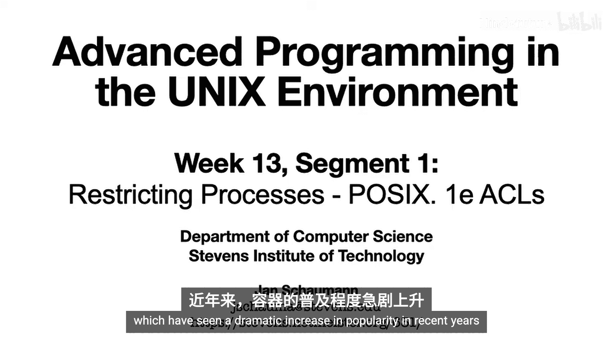

这些方法有些是操作系统特定的，有些则利用通用的系统调用来实现目标。此外，标准化的方法和事实标准也发挥着作用。

## 回顾已知知识

在开始新内容前，回顾我们已经学过的知识很有帮助。你会发现本学期的许多内容都与本主题直接相关。

例如，在第二周第一段的视频中，我们探讨了系统如何限制一个进程可以打开的文件描述符数量。`open_max.c` 程序展示了可以使用 `getrlimit` 检索**每个进程的资源限制**。系统范围的限制值可能硬编码在内核中，也可能来自固定头文件（如 `sys/limits.h` 中的 `OPEN_MAX`），或者是可在运行时调整的系统配置选项。

在讨论UNIX文件系统时，我们了解了文件访问的基本UNIX语义：用户、组和其他。结合第三周第三段中概述的目录访问逻辑，这个简单的模型允许我们限制进程可以访问文件系统中的哪些资源。

我们看到，访问权限是按照从最特定到最不特定的顺序确定的。通过组合组成员身份并仔细选择正确的权限，我们可以根据需要广泛地提供访问。然而，这种机制的粒度有些有限，因为它只允许在这三组用户（所有者、组和其他所有人）之间进行区分。即使用户可能是多个组的成员，在使用NFS的系统上，你可能被限制为只能属于16个组。

更重要的是，通过组成员身份进行访问控制特别繁琐。首先，与用户不同，一个文件只能属于一个组。因此，如果你想与A组和B组的成员共享文件，但不与其他人共享，你就无能为力了。此外，对组成员身份的任何更改都需要系统管理员的操作。用户无法自行控制其组成员身份或在shell中创建新组。

## 引入POSIX ACLs

一些UNIX文件系统通过使用所谓的访问控制列表（ACLs）来克服这些限制，最著名的是POSIX 1e扩展。这些ACL允许用户指定他们希望授予的更细粒度的访问权限。

这些访问控制列表作为所谓的**扩展属性**在文件系统中实现。这意味着除了内核支持外，还需要文件系统的支持。在默认的 `ls` 输出中，扩展文件属性的存在通常由常规权限字符串后的加号（`+`）表示。

从用户的角度来看，与之交互的工具是 `setfacl` 和 `getfacl`。

由于POSIX ACLs的实现在不同UNIX版本中并不完全统一，让我们看看几个不同系统上的实际例子。

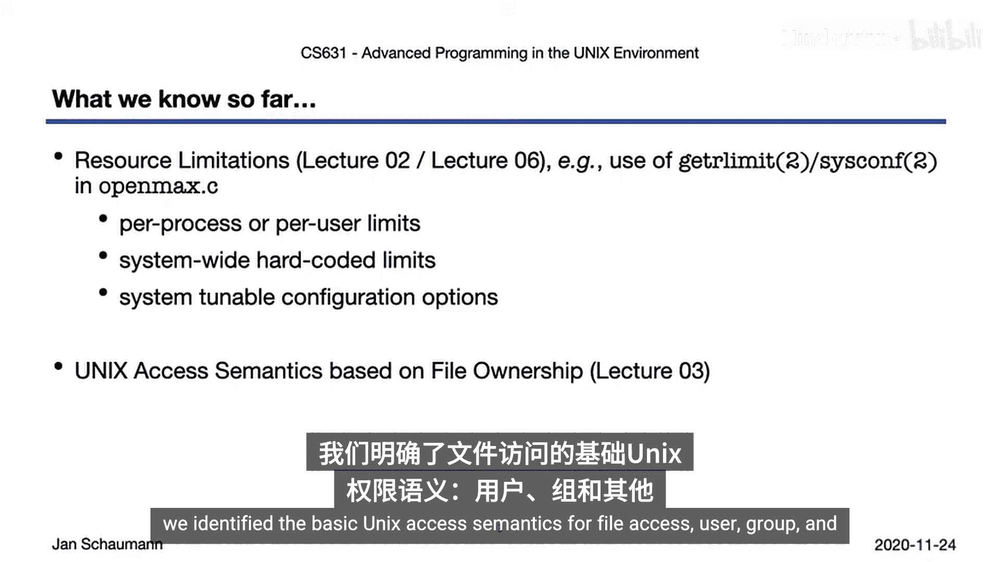

## 在Linux上使用ACLs

在这个终端中，我们将在Linux系统（特别是Ubuntu 16.04）上演示ACLs的使用。我的用户是几个组的成员，这意味着我可以轻松地一次与属于这些组之一的所有用户共享文件。

考虑这个文件 `simple_cat.c`。目前它只有所有者（即我自己）的读写权限。如果我想允许“professor”组的其他成员访问，我可以更改组权限。如果我想允许“6XV”组的成员访问，我可以将文件所属组改为该组。但这意味着现在“professor”组的成员不再有读取权限。那么，我如何让两个组都有访问权呢？

查看 `setfacl` 的手册页，我可以找到授予组访问权限的语法。让我们试试。

```bash
setfacl -m g:professor:r simple_cat.c
```

嗯，没成功。让我们看看我们在什么类型的文件系统上。哦，原来是NFS。NFS不支持POSIX ACLs，或者说NFS有自己的ACL实现，仅在NFSv4中受支持，并且使用不同的工具，而我们的系统上没有这些工具。所以让我们把文件移到本地文件系统。

好的，这是一个EXT3文件系统，应该支持POSIX ACLs，让我们再试一次。很好，没有错误。让我们再看看这个文件。

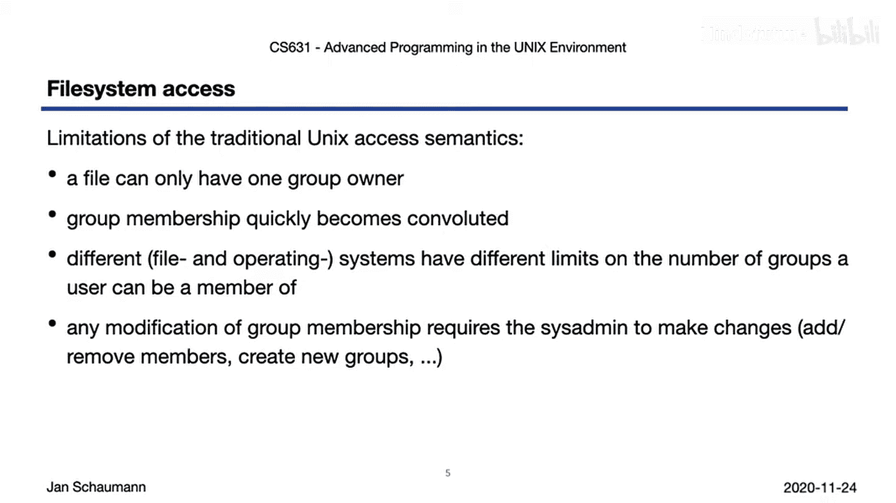

```bash
ls -l simple_cat.c
```

注意，现在 `ls` 输出在权限字符串后显示了加号，表示文件上有扩展属性。

让我们用 `getfacl` 来检查一下ACL。

```bash
getfacl simple_cat.c
```

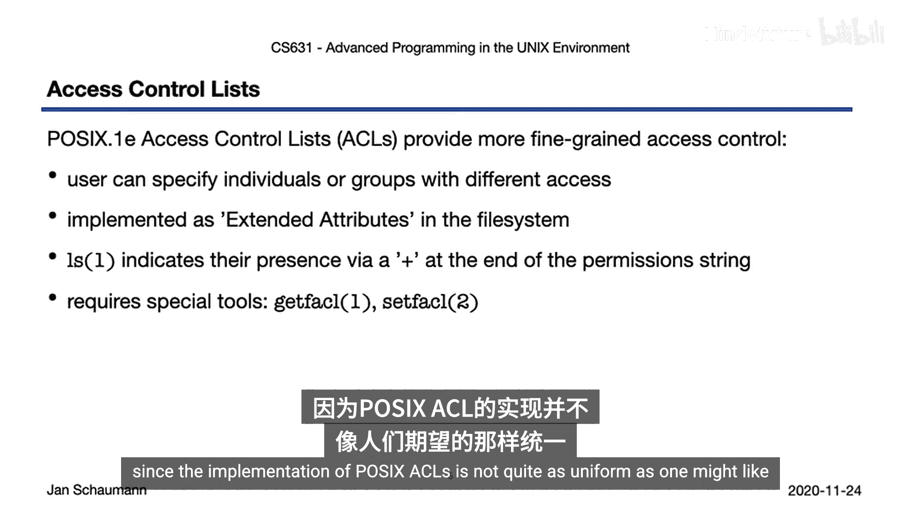

在这里，我们看到我们为“6XV”组设置了组权限。等等，我们已经有了“6XV”组的组权限，但我们希望“professor”组保留读取权限。让我们给那个组读取权限。

```bash
setfacl -m g:professor:r simple_cat.c
```

现在看看 `getfacl` 和 `ls` 告诉我们什么。文件的组所有权是“professor”，UNIX组权限允许读取访问。但扩展属性也显示，“6AC”组保留了我们之前授予的读取权限。

好的，现在假设我们想把这个文件的访问权限授予班上的某些学生，比如Edward和Mingo。他们都只是“student”组的成员，而我不想让所有学生都能访问我的文件，所以我不想使用这个组。但是有了POSIX ACLs，我也可以指定单个用户，让我们试试。

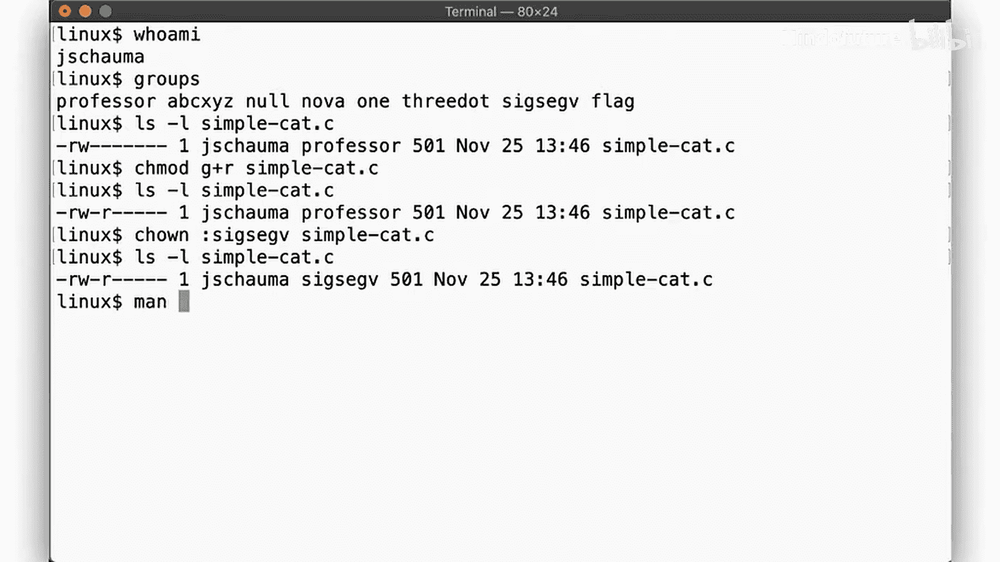

```bash
setfacl -m u:edward:r,u:mingo:r simple_cat.c
getfacl simple_cat.c
```

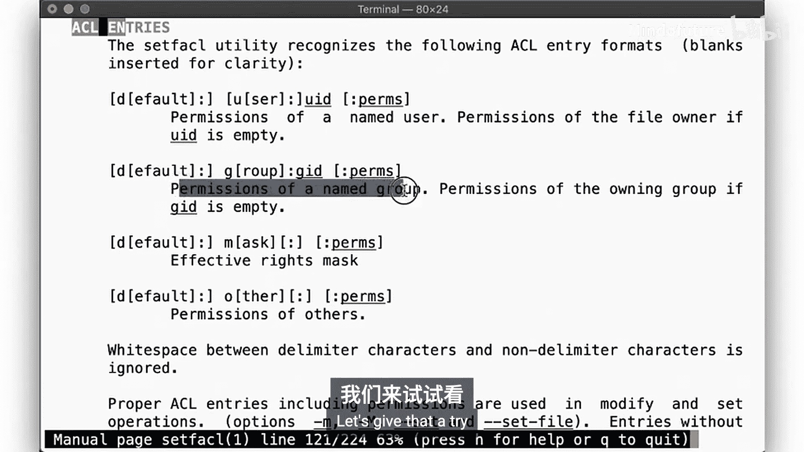

这似乎成功了。以表格格式查看，可能更容易阅读权限，它清楚地表明我们现在能够提供细粒度的访问控制。

如果我们复制这个文件会发生什么？嗯，看起来我们必须重新应用所有的ACL，这很麻烦。也许有一种方法可以将ACL从一个文件复制到另一个文件。有了，`setfacl` 可以从标准输入读取ACL描述并应用它。

```bash
getfacl simple_cat.c | setfacl --set-file=- simple_cat_copy.c
```

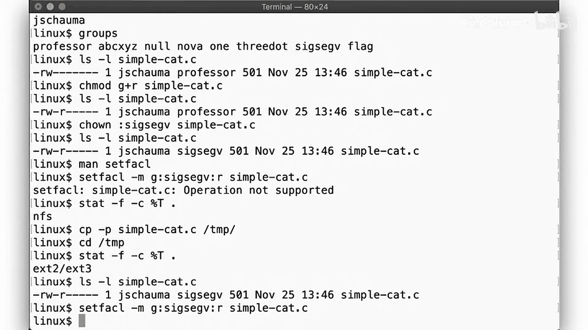

很好。但更好的是，像 `mv` 或 `cp` 这样的工具能够直接复制ACL。

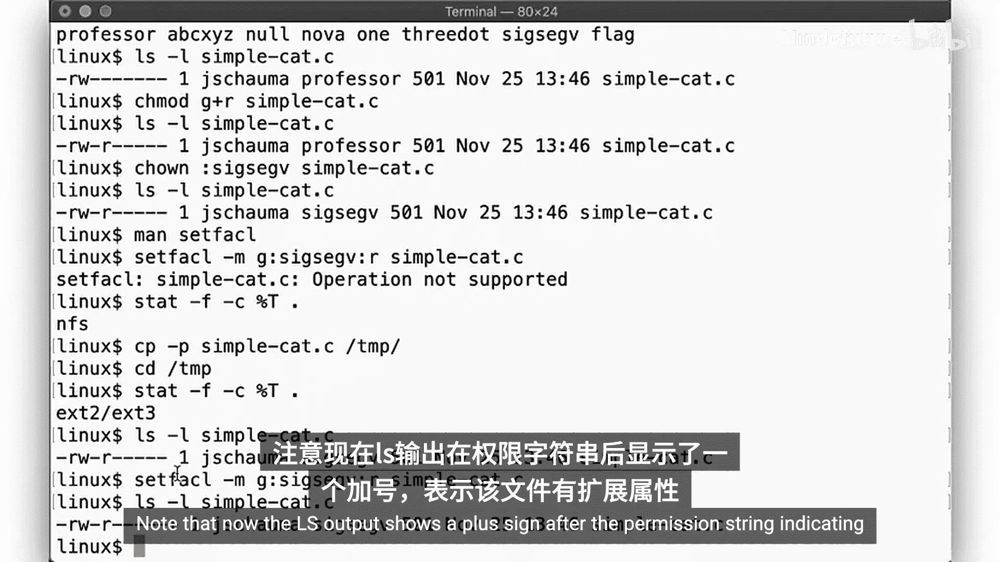

```bash
cp -p simple_cat.c simple_cat_copy2.c
getfacl simple_cat_copy2.c
```

看，所有三个文件都有扩展属性，`getfacl` 显示了正确的权限。

如果我想清除所有的ACL，我可以使用 `setfacl -b`，文件将不再有任何扩展属性。

```bash
setfacl -b simple_cat.c
ls -l simple_cat.c
```

## 在macOS上使用ACLs

现在我们再次看到我们的 `simple_cat.c` 文件。但这次我们想授予“wheel”组访问权限，而不改变文件的组所有权。

为此，我们使用 `chmod` 并带上 `+a` 标志。

```bash
chmod +a "group:wheel allow read" simple_cat.c
```

和之前一样，如果我们运行 `ls -l`，会得到一个加号，表示文件有关联的扩展属性。

但在macOS系统上，我们不使用 `getfacl`。相反，我们使用带 `-e` 标志的 `ls`。

```bash
ls -le simple_cat.c
```

`ls -le` 的输出告诉我们，扩展ACL规则0是授予“wheel”组读取权限。

如果我们想确保用户“daemon”无论其组成员身份如何都无法访问，那么我可以使用这个命令。

```bash
chmod +a "user:daemon deny read" simple_cat.c
ls -le simple_cat.c
```

现在，我们的规则集看起来是这样的。`chmod` 的手册页包含大量关于如何操作ACL以及哪些授权是可能的信息。注意，我们区分了对文件元数据的操作、对目录的操作、对常规文件的操作等等。手册页还包含许多示例，你可以自己尝试。

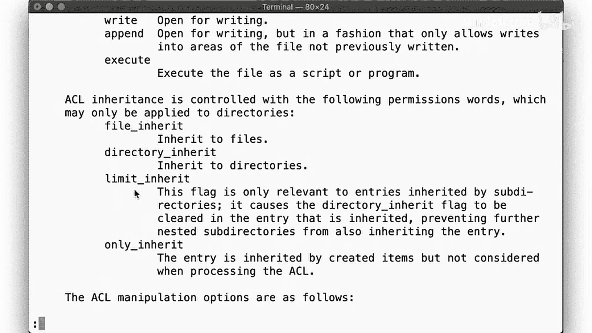

如果你想删除一个特定的ACL规则，你需要使用 `#` 号指定其编号。例如，这里我们删除第一条规则（规则0），那么逻辑上下一条规则就变成了第一条规则（新的规则0）。

```bash
chmod -a# 0 simple_cat.c
ls -le simple_cat.c
```

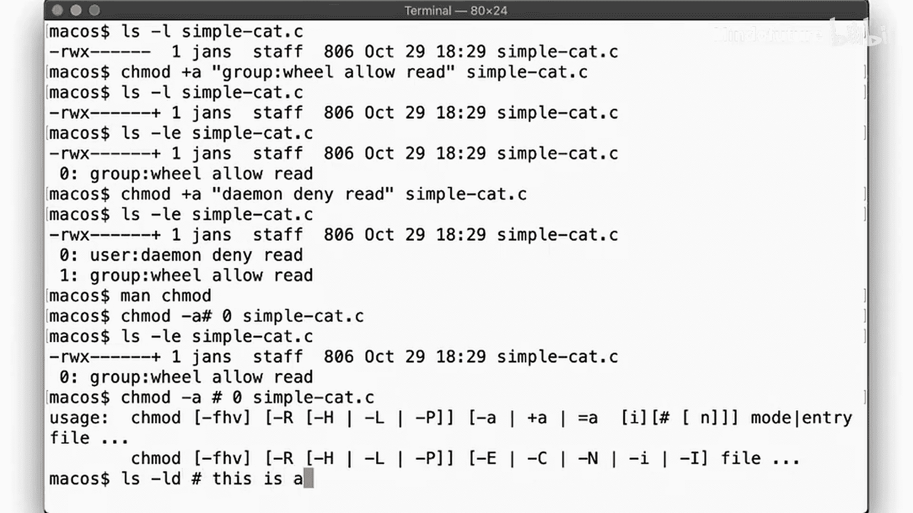

注意，在 `-a` 和 `#` 号之间不能有空格。记住，在shell中，`#` 标记注释的开始，你也可以在命令行上使用注释。也就是说，`-a# 0` 和 `-a # 0` 是有区别的。无论如何，要在macOS上删除所有ACL，你可以使用 `chmod -N`，和之前一样，文件将不再显示任何扩展属性。

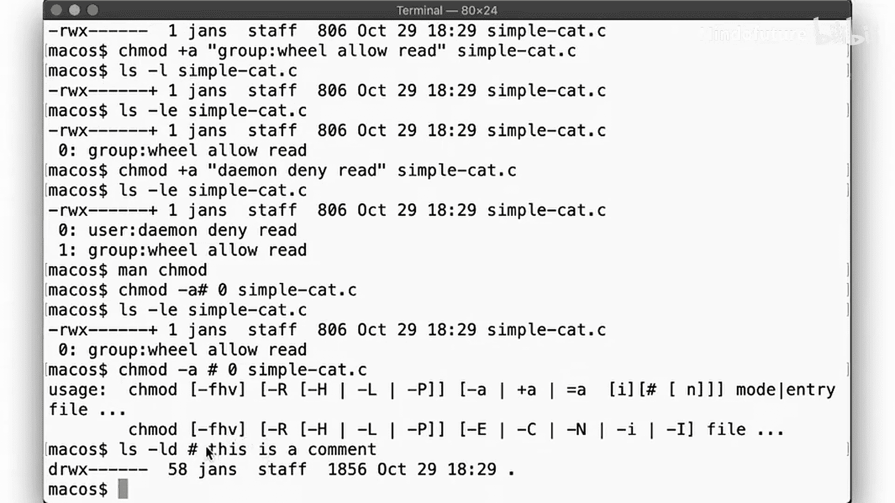

```bash
chmod -N simple_cat.c
ls -l simple_cat.c
```

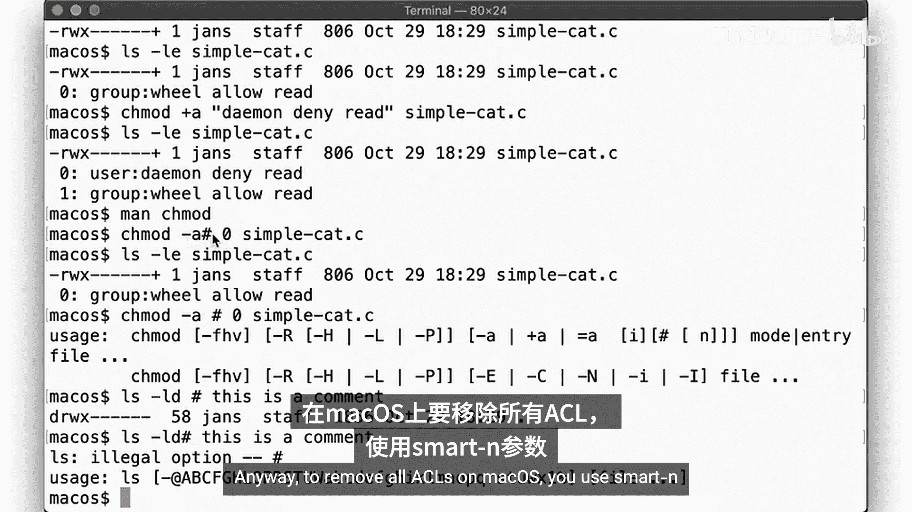

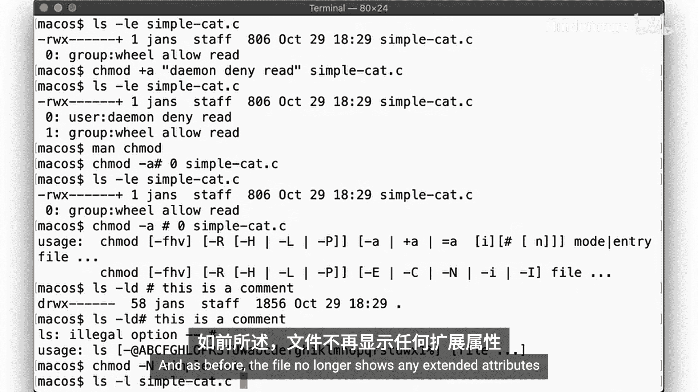

## 在NetBSD上使用ACLs

最后，让我们看看NetBSD。尽管这是我们最后看的参考平台，这是因为对POSIX ACLs的支持尚未包含在NetBSD的最新稳定版本中，但它将成为NetBSD 10.0的一部分。这里我们创建了一个运行NetBSD-current的独立虚拟机。

好的，这是我们的文件。它归我自己所有，组权限属于“wheel”组。“staff”组包含一些我想共享访问权限的用户，但由于我不是这个组的成员，我无法将文件所属组改为这个组。所以让我们试试 `setfacl`。

```bash
setfacl -m g:staff:r simple_cat.c
```

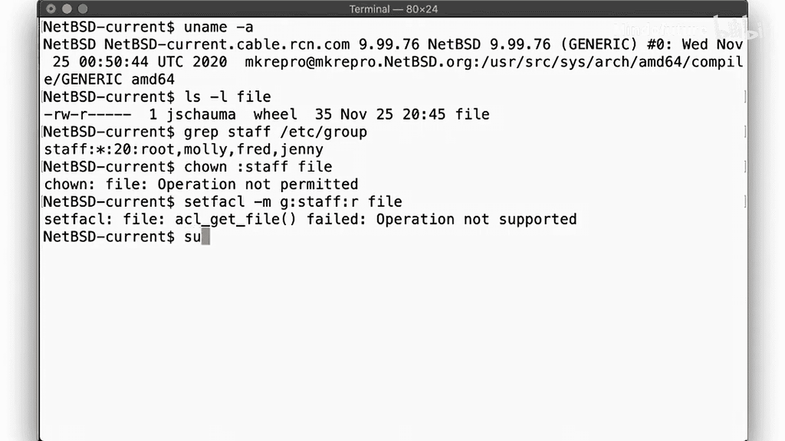

不行。这里的根文件系统不支持ACL。正如前面解释的，文件系统需要支持POSIX ACLs。让我们像以前一样，在第二个磁盘上使用一个单独的文件系统。

我们在第二个磁盘 `wd1` 上创建一个新的文件系统。然后，使用 `tunefs` 在文件系统超级块中启用POSIX ACLs。我们挂载这个文件系统，并将其所有权授予一个普通用户。现在我们可以把文件复制到 `/mnt`。然后，调用 `setfacl` 来与“staff”组共享访问权限，使用与在Linux上相同的语法。

和之前一样，`ls -l` 通过加号显示了扩展属性的存在，`getfacl` 显示了结果。

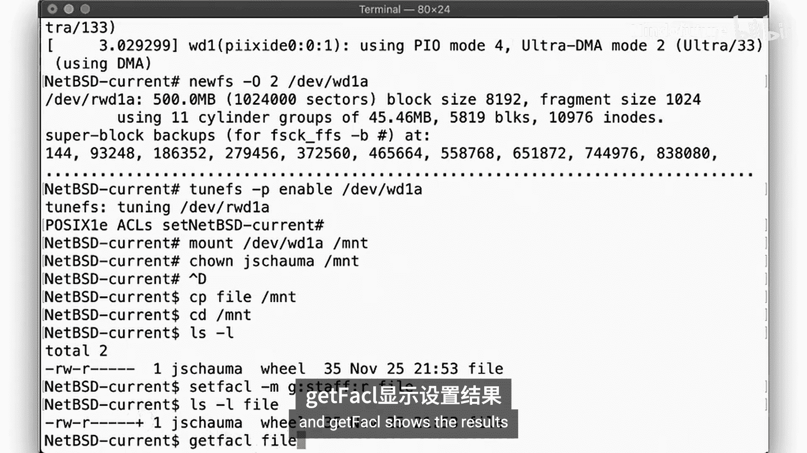

现在，作为“staff”组成员的用户“fred”可以显示这个文件了。当然，“fred”仍然不能写入它。好的，现在让我们尝试给“molly”写入权限。

```bash
setfacl -m u:molly:w simple_cat.c
```

哦，看，“molly”是“staff”组的成员，但她不能读取文件，这是因为她的每用户ACL拒绝了读取权限，即使她的组成员身份允许她读取。这反映了我们常规的UNIX权限也是按顺序应用的。但她的写入权限按预期工作。

现在，假设你想给“staff”组中除“jenny”外的所有人访问权限。为此，我们像这样使用 `setfacl`。

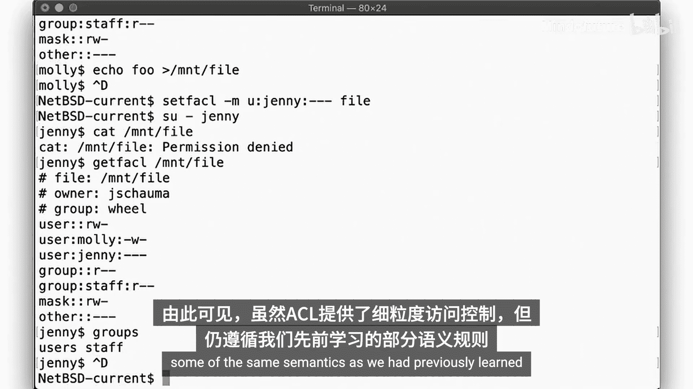

```bash
setfacl -m u:jenny:--- simple_cat.c
```

正如预期的那样，“jenny”尽管在“staff”组中，但不能读取文件，同样因为每用户权限优先于每组权限。

我们看到，虽然ACL允许细粒度的访问控制，但它们仍然遵循我们之前学到的一些相同语义。

## 总结

在本节课中，我们一起学习了POSIX访问控制列表（ACLs）。

访问控制列表作为扩展属性存储在文件系统中，因此需要文件系统对此提供支持。并非所有文件系统都必然支持它们，或者它们可能被作为挂载选项禁用。

如果你开始尝试使用ACL，很快就会遇到冲突的描述。如果你想授予一个组中除一人外的所有成员访问权限怎么办？用户ACL是否优先于组ACL？应用它们的顺序在这里也可能起作用，尝试一下并验证不同的结果。

POSIX ACL的实现可能因操作系统而异。我们看到了Linux上的例子，我们使用 `setfacl` 和 `getfacl` 工具，你可以查看该平台的 `acl` 手册页以获取更多细节。还有macOS上的例子，其中ACL使用 `chmod` 工具应用和操作，并通过 `ls -le` 检查。不同的BSD系统也实现了ACL，尽管我们的参考平台NetBSD仅在即将发布的NetBSD 10.0中才拥有POSIX ACL，并且它将使用从FreeBSD导入的 `getfacl`/`setfacl` 语义。

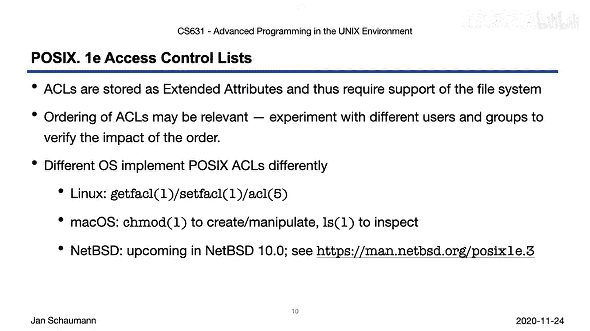

在下一个视频中，我们将重新审视有效用户ID和真实用户ID，以及如何使用 `sudo` 和 `su` 命令提升权限，但我们也将看看如何以同样的方式限制你的权限。