# 068：受限Shell、Chroot与Jail 🔒

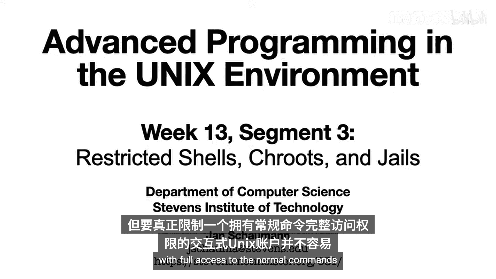

在本节课中，我们将学习如何通过受限Shell、Chroot和Jail等技术来限制进程的权限和访问范围。这些方法有助于增强系统安全性，特别是在运行需要特权的服务时。

上一节我们探讨了通过文件标志和挂载选项来锁定文件系统的方法。本节中，我们将转向更侧重于进程本身的限制技术。

## 受限Shell 🐚

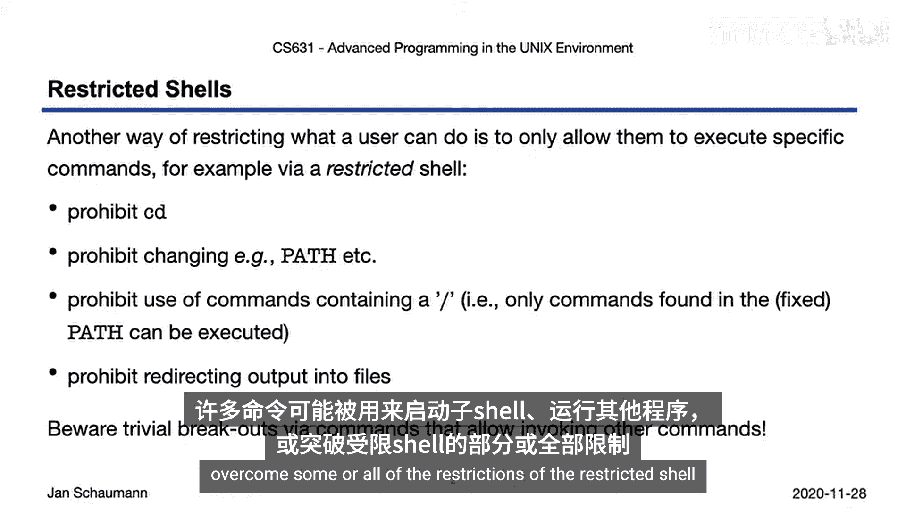

受限Shell是一种限制用户执行命令能力的Shell。许多流行的Shell，如Bash或Korn Shell，都支持这种模式。在受限模式下，Shell通常会禁止以下操作：
*   更改当前工作目录（即无法运行 `cd` 命令）。
*   修改 `PATH` 和Shell环境变量。
*   指定包含斜杠（`/`）的命令（旨在只允许在 `PATH` 默认目录中找到的命令）。
*   将输出重定向到文件。

通过这些限制，管理员可以通过将允许用户运行的可执行文件放在特定位置，并在调用受限Shell前相应地设置 `PATH` 环境变量，来合理控制用户可调用的命令。

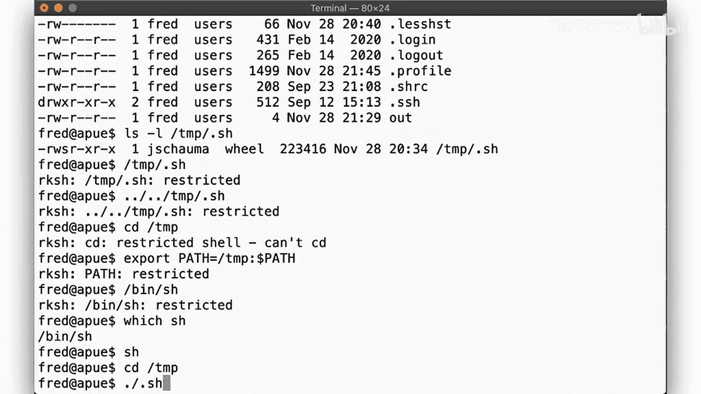

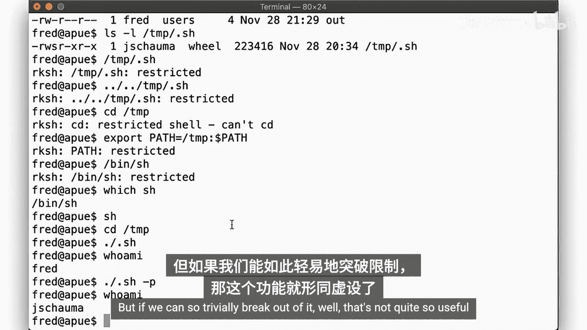

然而，正如我们之前配置 `sudo` 时所见，管理员需要充分了解并理解允许用户在受限环境中执行的命令。许多命令可以用来“逃逸”到其他程序，或者用来克服受限Shell的部分或全部限制。

以下是使用受限Korn Shell（`rksh`）的一个示例。首先，我们创建一个受限Shell，并将用户`fred`的登录Shell更改为它：

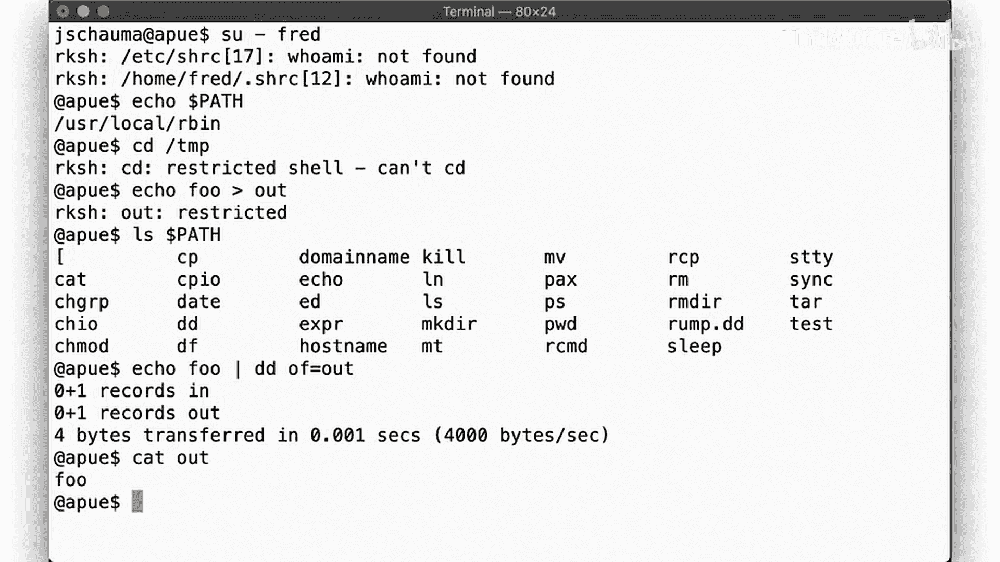

```bash
# 创建指向受限ksh的链接
ln -s /bin/ksh /usr/local/bin/rksh
# 更改用户fred的登录shell
usermod -s /usr/local/bin/rksh fred
```

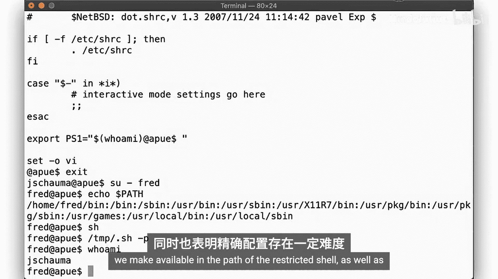

当用户`fred`登录后，他只能运行`PATH`中的命令。尝试使用相对路径（如`./sudo`）或更改目录（`cd`）都会失败。但是，如果`PATH`中包含了像`ed`（标准Unix编辑器）这样的程序，用户就有可能通过编辑启动文件（如`.profile`）来修改`PATH`，从而绕过限制。例如，用户可以使用`ed`编辑器移除限制`PATH`的代码行。

这个例子说明，在使用受限Shell时，必须非常小心地选择放入`PATH`的命令，并确保这些命令本身不能被用来突破限制或执行另一个Shell。通常的做法是：
1.  创建一个新目录作为新的`PATH`。
2.  仔细选择允许的命令，并将它们链接到该目录。
3.  确保这些命令都不能用于逃逸Shell、绕过限制或执行另一个Shell。
4.  设置`PATH`。
5.  防止用户修改他们的启动文件（例如，使用之前视频中讨论的文件标志）。

## Chroot：改变根目录 🏠

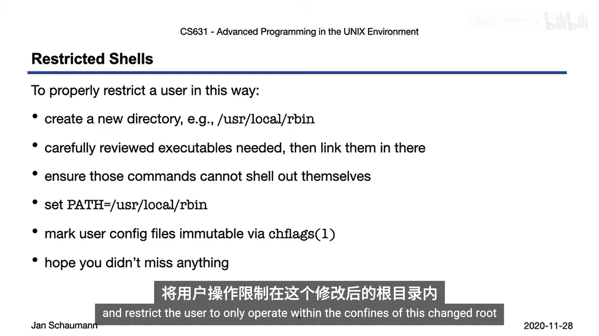

虽然受限Shell可以限制用户执行命令的能力，但有时用户可能需要与文件系统的特定部分交互，而不暴露整个文件系统。`chroot` 系统调用（1979年加入Unix）解决了这个问题。

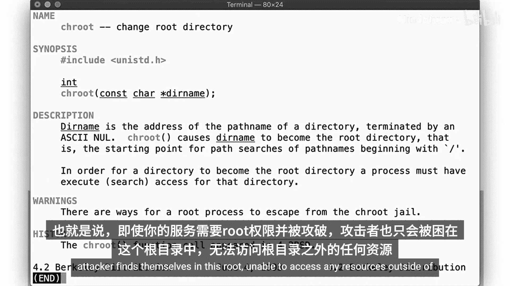

`chroot` 将传递给它的目录名设置为进程的根目录。这意味着所有路径名都将在这个新目录下进行解析。通过这种方式，可以向进程暴露一个受限的文件系统副本或视图。

要使用`chroot`，你需要确保所有必需的库和可执行文件都存在于这个新的根目录中。一旦设置完成，你就可以限制一个需要以超级用户权限运行的进程。即使该服务被攻破，攻击者也会发现自己被困在`chroot`环境中，无法访问`chroot`之外的任何资源。

让我们看一个创建最小化`chroot`环境的脚本示例。该脚本会确定运行特定命令（如`sh`， `ps`， `id`）所需的共享库，并将它们复制到`chroot`目录中。

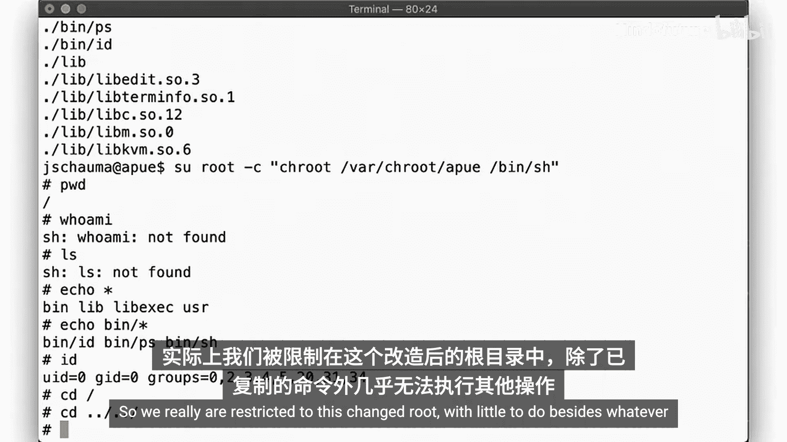

```bash
#!/bin/sh
# 这是一个简化的示例脚本框架
JAIL=/home/jail
mkdir -p $JAIL
# 复制必要的二进制文件和库
cp /bin/sh $JAIL/bin/
cp /usr/bin/id $JAIL/usr/bin/
cp /bin/ps $JAIL/bin/
# 使用ldd等工具查找并复制依赖的库
# ...
```

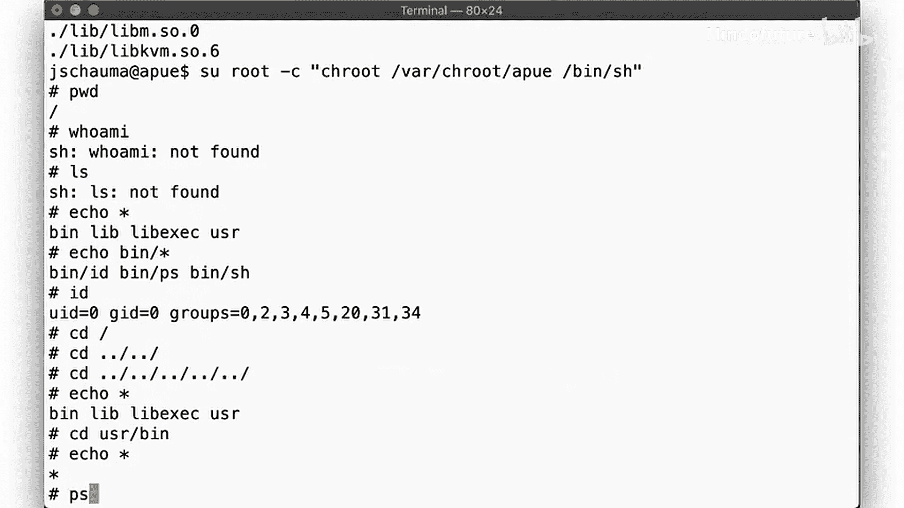

创建好`chroot`后，可以使用以下命令进入：
```bash
chroot /home/jail /bin/sh
```
进入后，进程的根目录就是`/home/jail`。它只能看到和访问`chroot`环境内的文件。例如，运行 `id` 命令可能只显示数字用户ID，因为 `/etc/passwd` 文件不在`chroot`内。

然而，`chroot`有两个重要的方面可能导致逃逸：
1.  进程在进入`chroot`时，可能仍然持有在`chroot`外打开的文件描述符，这可能导致风险。
2.  从`chroot`内部，你仍然可以看到系统上其他进程的信息（例如通过`ps`命令），这意味着进程空间并未完全隔离。

## FreeBSD Jail：操作系统级虚拟化 🚀

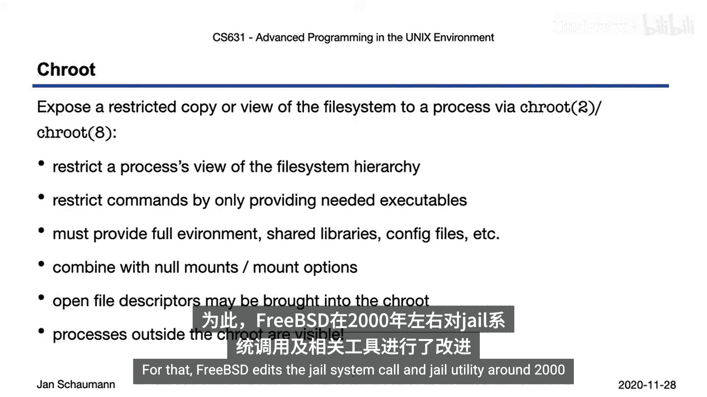

为了进一步限制进程，使其甚至无法感知到系统上其他进程的存在，FreeBSD在2000年左右引入了`jail`系统调用和工具。

除了`chroot`的限制外，Jail还：
*   强制每个Jail有独立的进程视图（看不到Jail外的进程）。
*   禁止更改系统时间或安全级别。
*   禁止挂载和卸载文件系统。
*   可以绑定到特定的IP地址，并将网络功能限制在该地址。
*   禁止修改网络配置。
*   禁用原始套接字。

通过这种方式，Jail有效地实现了一个进程沙箱或虚拟环境。你甚至可以为不同的操作系统版本创建Jail（只要宿主内核能够运行或模拟该环境）。Jail是操作系统级虚拟化的早期方法之一，为后来的容器技术（如Docker）铺平了道路。

## 总结 📝

本节课我们一起学习了三种限制进程的技术：
1.  **受限Shell**：在Shell内部限制用户，但限制完全由Shell自身强制执行，而非操作系统内核。
2.  **Chroot**：通过改变进程的根目录来限制其对文件系统的视图，是一种更强大的限制方式，即使对于UID为0的进程也有效。但它可能存在通过文件描述符逃逸的风险，并且不隔离进程视图。
3.  **Jail**：在`chroot`的基础上，增加了进程、网络和系统资源的全面隔离，是早期操作系统级虚拟化的实现，为现代容器技术奠定了基础。

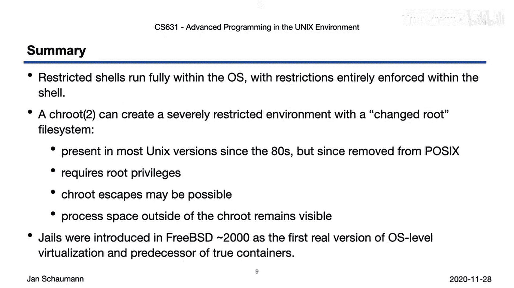

这些技术都体现了限制进程、最小化攻击面的安全思想。在接下来的视频中，我们将探讨允许我们构建现代容器的其他特性和机制。