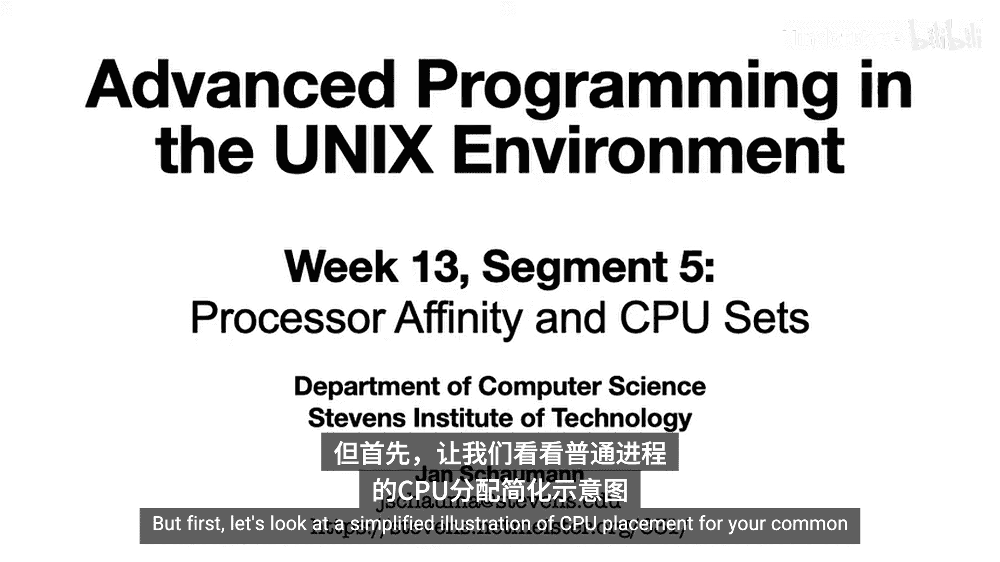
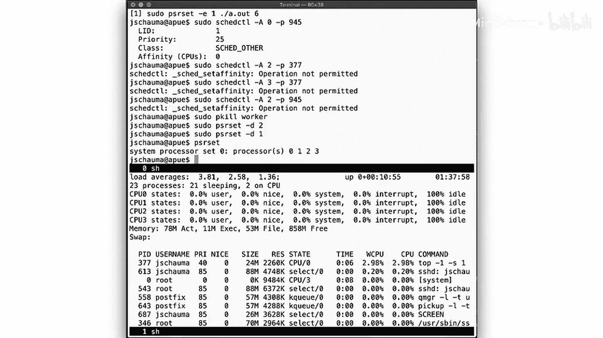
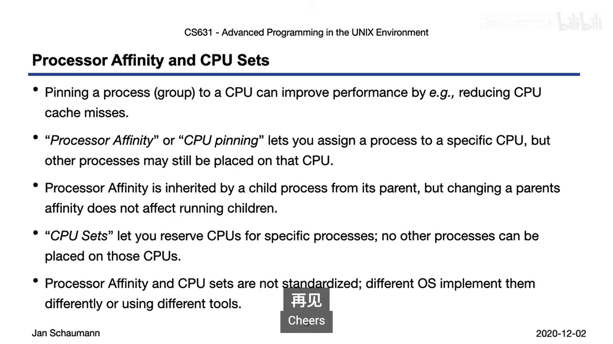

# 070：处理器亲和性与CPU集 🎯

## 概述

在本节课中，我们将学习如何将进程限制在特定的CPU上运行。上一节我们讨论了进程的CPU时间限制，本节中我们来看看如何控制进程在哪个CPU核心上执行，即处理器亲和性与CPU集。



## CPU调度与进程放置

假设我们有一个包含四个CPU的系统，上面运行着许多进程。这些进程包括从shell交互运行的命令、一些系统守护进程，以及一些执行CPU密集型工作的通用作业。

在通常的基于时间片和优先级的调度算法下，这些进程可以被放置在任何可用的CPU上。随着工作的完成、作业被抢占和重新调度，它们可能会从一个CPU移动到另一个CPU，或者根据调度器的判断，新作业被放置到CPU上。

## 处理器亲和性（CPU Pinning）

现在假设我们的工作作业都是CPU密集型的。如果它们被放置在任何CPU上，可能会导致系统负载过高。根据它们的优先级，一些系统守护进程可能无法像你希望的那样快速完成。

因此，我们尝试选择这些工作作业，并确保它们不被放置在任何CPU上，而只放置在CPU 1和CPU 2上。这种做法称为CPU固定或分配处理器亲和性。

当我们这样做时，工作进程被正确地放置到这些CPU上。但请注意，我们仍然有其他作业在CPU 1和CPU 2上运行，shell和`find`命令并没有从CPU上被驱逐。实际上，新的进程仍然可以根据需要被放置到CPU 1和CPU 2上。只有那些被绑定到指定CPU的工作进程受到限制，其他所有进程仍然可以按照调度器认为合适的方式放置。

## 实践演示

以下是一个让CPU保持忙碌的简单程序：

```c
// 示例CPU密集型程序
int main() {
    while(1) {
        // 空循环，消耗CPU周期
    }
    return 0;
}
```

在运行它之前，我们在屏幕下半部分运行`top`命令。在这个系统上，我们有四个可用的CPU，可以看到一些系统进程。

当我们启动工作进程时，我们注意到它最初在CPU 0上启动，然后被放置到CPU 2上，并在那里持续运行和消耗周期。

我们将其放入后台运行，注意到它现在被移动到了CPU 3。然后我们启动第二个工作进程到后台，它最终在CPU 2上运行。我们再启动一个，又启动一个。现在我们有了四个工作进程，调度器将它们分布到所有四个CPU上。

如果我们再运行另一个作业，例如`dd`，它必须与其他进程共享CPU，并最终在CPU 2上运行。我们的工作作业完全在用户空间执行，但`dd`作业在执行I/O时也会在内核空间执行，这可以在`top`的显示更新中看到。

我们再运行另一个作业，例如`wc`程序，我们观察到`wc`程序在后续调用中被放置在不同的CPU上，而我们的工作进程仍然占用着所有四个CPU。

## 使用`taskset`命令分配处理器亲和性

我们可以使用`taskset`控制命令来分配处理器亲和性。除了亲和性，我们还可以调整调度算法和优先级。

首先，让我们查看当前shell的处理器亲和性：

```bash
taskset -p $$
```

现在，我们没有任何亲和性设置，这意味着调度器可以自由地将这个shell放置在任何它喜欢的CPU上。

现在运行一个工作作业，它最终在CPU 2上。我们尝试将其移动到CPU 3：

```bash
sudo taskset -pc 3 <PID>
```

更改CPU亲和性需要超级用户权限，这是合理的。我们不希望允许普通用户随意移动他们的作业，从而可能干扰其他进程。

现在我们已经移动了进程，我们的工作进程对CPU 3有了亲和性。我们可以在下面的`top`显示中看到它从CPU 2移动到了CPU 3。我们可以将其移回CPU 2、CPU 1或CPU 0，并在`top`显示中看到更新。

我们可以选择允许用户更改CPU亲和性。为此，我们必须更改用户的`set CPU affinity`能力。现在我们可以将当前shell从没有亲和性移动到CPU 2。

由于CPU亲和性是由子进程从其父进程继承的，当我们在这里启动一个新的工作进程时，它也会在CPU 2上运行。因此，即使我们运行多个工作作业，它们都将保持绑定到CPU 2，而其他CPU保持空闲。

请注意，虽然我们将工作作业绑定到了CPU 2，我们仍然可以将其他作业移动到该CPU上。例如，移动`top`进程本身。

同样，即使子进程继承了其父进程的亲和性，`dd`作为我们shell的子进程，对CPU 2有亲和性，也会被放置在该CPU上。我们仍然可以显式地将其移开，同样也可以将工作作业移动到不同的CPU。

## CPU集（CPU Sets）

我们已经看到了如何通过分配处理器亲和性将单个作业移动到特定的CPU上。但正如我们也看到的，这仍然允许其他进程被放置到这些CPU上，可能与我们的作业竞争。我们能否为一个或多个CPU保留特定的任务，使得没有其他作业可以在它们上面运行？

假设我们想使用我们的四个CPU，并保留其中两个给我们的工作作业，一个给我们的shell。我们可以使用CPU集来实现这一点。当你创建CPU集时，你总是会保留一个默认集，用于任何剩余的进程。

在我们的示例中，所有的系统进程将最终在CPU 0上。我们可以显式地将我们的shell绑定到CPU 3，这意味着随后由shell启动的任何进程也将被绑定到该CPU集。如果我们然后将我们的工作作业绑定到CPU 1和CPU 2，那么我们将看到这样的分布。

请注意，我们可以从shell启动其他守护进程，它们将继续仅被放置在CPU 3上。而任何未显式绑定到CPU集的作业的调度将最终在CPU 0上，但除了我们的工作作业外，没有其他作业会被分配到CPU 1和CPU 2。

## 实践示例

我们稍微扩展了我们的小忙碌程序，以便更容易区分工作作业。现在，我们的程序接受一个参数，指定要启动多少个作业，然后使用易于区分的`argv[0]`运行它们。

像之前一样，我们在屏幕下半部分运行`top`。我们启动六个工作作业，它们按预期分布在所有四个CPU上。

但正如我们所说，我们想使用CPU集。`cpuset`命令显示当前的CPU集：一个默认集，包含所有四个CPU。

现在，让我们从我们的图示中复制一个设置。像之前一样，创建CPU集不是普通用户允许的操作，所以我们需要`sudo`权限。



现在我们有了三个CPU集：默认CPU集（仅包含CPU 0）、CPU集1（包含CPU 1和CPU 2）以及CPU集2（包含CPU 3）。

现在，我们运行我们的六个工作作业，它们都最终在默认CPU集的CPU 0上。这是因为任何未显式绑定到CPU集的作业只能被放置在默认CPU集中。这不是我们想要的，所以我们将它们放置在CPU集1上。

现在，我们看到它们仅按计划分布在CPU 1和CPU 2上。但请注意，尽管将工作进程绑定到给定的CPU集，我们仍然可以显式地将其移动到默认CPU集中的CPU上。但是，如果我们尝试将`top`进程从默认CPU集（CPU 0）移动到CPU 2，我们会失败。CPU 2是非默认CPU集的一部分，因此不允许任何未通过其他`cpuset`命令显式绑定到它的作业。对于CPU 3也是如此，它是非默认CPU集2的一部分。

我们甚至无法将我们从CPU集中移除的进程移回。为了使CPU和CPU集可用于任何其他作业，我们必须再次删除CPU集，此时所有作业可以再次被调度到任何CPU上。

## 总结

本节课中我们一起学习了如何将作业限制在特定的CPU上。我们注意到，出于性能原因，限制作业到特定的CPU是有益的：在同一CPU上调度进程和线程可以减少CPU缓存未命中的次数，或者确保资源被公平使用，或者防止一组进程干扰其他作业。

有两种方法可以实现这一点。第一种是CPU固定，我们为进程或进程组分配CPU亲和性。虽然指定的进程将被绑定到指定的CPU，但其他作业仍然可以被放置到同一个CPU上。正如我们所看到的，子进程将从其父进程继承CPU亲和性，但更改父进程的CPU亲和性不会同时更改其所有子进程的亲和性。

与处理器亲和性相比，CPU集允许你真正为一个或多个CPU保留特定的作业。调度器将无法将任何作业移动到这些CPU上，除了那些显式绑定到它们的作业。像之前一样，子进程从其父进程继承CPU放置，你可以通过更改其亲和性显式地将进程从CPU集中移除。但要将其移回CPU集，你需要显式调用`cpuset`命令。

最后，这些都不是标准化的。不同的操作系统以不同的方式实现CPU固定和CPU集，并使用不同的命令行工具和库函数，因此请务必检查你特定操作系统的参考手册。



回顾所有我们可以限制进程的不同方式，我们现在应该能够将它们结合起来构建非常特定的环境。但在我们这样做之前，我们还需要涵盖最后一个主题：控制组、命名空间和能力。我们将在下一个视频中讨论这些内容。